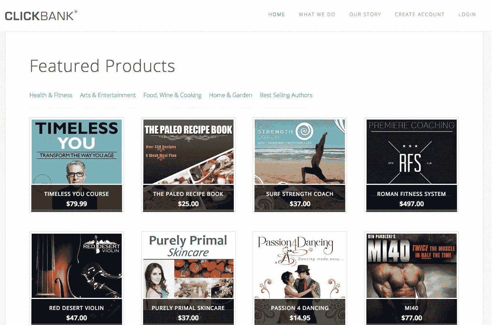
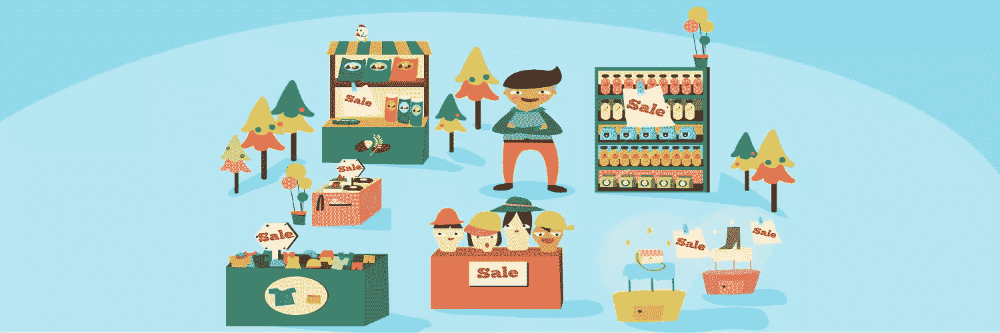
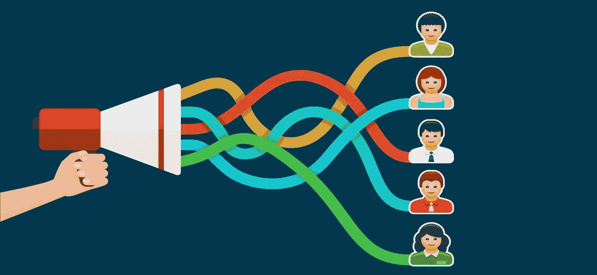

# 利用 ClickBank 2015 联盟指南赚钱

> 原文：<https://www.sitepoint.com/clickbank/>

在网上只有少数几个地方你可以找到在线小提琴课、长高指南和果汁教程。ClickBank 就是其中之一。

ClickBank 是一个连接数字内容创作者和联盟营销者的在线市场。ClickBank 成立于 1998 年，现已发展成为美国最大的联盟网络，也是全球访问量最大的网站之一。

任何对联盟营销感兴趣的人都应该从点击银行开始。它很容易上手，与竞争平台不同，ClickBank 消除了繁琐的文书工作和合同。它还提供了一个可靠的支付系统。

虽然盈利前景可观，但用 ClickBank 赚钱并不像在你的博客上贴上一堆附属链接，然后看着钱滚滚而来那么容易。为了最大限度地利用 ClickBank，您应该知道一些事情，并遵循一些策略。

## 点击银行如何运作

数字内容创作者或供应商将他们的产品上传到 ClickBank 的市场，并设定佣金比例。代销商，也就是你，选择要推广的产品，并创建一个到该产品销售页面的唯一链接。你可以在博客或网站中嵌入你独特的链接，在社交媒体上发布或者包含在电子邮件中。当客户点击你的链接并购买产品时，你将获得佣金奖励。其余的归卖主。这很简单。

不那么简单的是确定推广哪些产品，以及如何推广。

## 如何选择产品

如果你正在阅读这份指南，很有可能你已经运营了一个网站或者正计划创建一个。希望你的网站针对一个特定的利基市场。如果没有，在这里阅读关于创建一个利基网站的重要性。

要找到适合你的产品，首先使用类似于 [Keywordtool.io](http://keywordtool.io/) 的工具搜索相关关键词。也许你的网站都是关于榨汁。搜索“榨汁”会出现大量关键词，如“榨汁饮食”和“榨汁食谱”

现在在 ClickBank 上搜索那些关键词，找到[相关产品](https://accounts.clickbank.com/mkplSearchResult.htm?dores=true&includeKeywords=juicing+recipes)。

一旦你找到了适合你的产品，你需要评估一些点击量指标。每个产品下都有一系列统计数据，理解它们的含义在决策过程中至关重要。

**初始美元/销售额**是指代销商每笔销售额的平均收入。

**Avg %/sale** 是卖方产品所有销售所得的平均佣金率。

Grav 是 Gravity 的缩写，它包含了在过去 12 周内通过推广产品获得佣金的不同分支机构的数量。

**平均再账单总额**是指分支机构通过再账单获得的平均佣金金额。重新计费是像会员或订阅一样的重复产品。

**Avg %/rebills**是仅在 re bills 上赚取的平均佣金率。​

一般的经验法则是选择 Grav 分数至少为 20 的产品。如果能找到五十分之一，就更好了。但是进入三位数的时候要小心。这意味着该产品正在面临激烈的竞争，所以请确保你做好了准备。

你也想阅读产品评论来衡量公众意见。投诉多吗？退款多吗？确保答案是否定的。

在选择产品之前，先看看产品的销售页面。你会读这本书吗？写的好，设计的好吗？有很多垃圾销售网页，所以拿出你的大剪刀，因为你可能要在找到值得推广的东西之前把杂草剪掉。

当然，要确保产品看到重复的佣金。

## 如何推广产品

现在是对你的联盟营销精神的真正考验:营销。营销你的产品是迄今为止最重要的，也是最耗时的，是你走向成功的一步，正因为如此，许多人试图走捷径。他们关注的是自己的想法，而不是顾客的需求。他们认为响度比智力更重要。他们认为把一件商品推到某人面前会说服他们购买。但这就是现在的工作方式。

这里有一些推销你产品的技巧。

**不要过度使用横幅和直接链接**

诸如此类的广告犯了一个太常见的罪行:它们不预售。预售是培养客户信任和融洽关系的艺术。这有助于建立关系，并为最终的销售预热。未能预售是“哎呀，先请我喝一杯”的营销失误。

**关注上下文文本链接**

上下文文本链接是嵌入在文本中的链接，它们非常有利于预售。如果做得好，它们一点也不像升职。感觉像是推荐信。

举个例子，向上滚动几段，找到 keywordtool.io 的链接。那是一个上下文文本链接。太糟糕了，如果你点击它，我就拿不到钱。我真的需要新的浴帘。

**写评论**

产品评论就像联盟营销的雷朋:它们永远不会过时。如果客户对某个产品感兴趣，他们很可能会去搜索产品评论，所以不妨一举两得。

但是因为评论在联盟营销中非常受欢迎，所以竞争很激烈，关键字的流量很低。高度有针对性的利基有助于避免这个问题，但要准备好努力工作，并在你看到显著的流量，点击和转换之前产生大量的评论。

**建立媒体漏斗**

就联盟营销策略而言，媒体漏斗是最重要的，也是最有效的。它是这样工作的:

首先，你创建一个内容来补充你要销售的产品。例如，如果产品是一本名为《奶酪串的历史》的电子书，你可以写一本关于如何制作自己的奶酪串的迷你指南，并免费提供。

然后你使用所有可用的资源来驱动迷你指南的流量。为了让人们访问指南，请向他们索取电子邮件地址。

迷你指南的最后是关于奶酪串电子书历史的推销。如果你的迷你指南成功地吊起了人们的胃口，你应该会看到大量的购买。

此外，你有他们的电子邮件，可以用它们提醒客户其他优惠。

媒体渠道也是可以共享的。没有人(希望)会在脸书上发布一个销售页面的链接，但他们可能会发布一篇关于最终导致销售页面的迷你指南的博客文章。为了能够共享，你需要在你的内容和产品之间保持一定程度的分离。

**比较产品**

人们越是缩小购买范围，就越需要更多的帮助来做出最终决定。这就是为什么人们喜欢产品比较。

像产品评论一样，产品比较帮助人们评估相似的产品并决定购买哪一种。但与评论不同，产品比较将多个附属产品放在客户面前。这增加了你的销售机会。

**跟踪您的产品**

在 ClickBank 上，您可以为每个产品链接创建一个唯一的跟踪 ID。这使你能够识别每笔销售的来源(产品评论、媒体渠道、横幅等)。)并分析你的推广策略的有效性。

例如，如果你发现你通过产品评论获得了很多销售，但是通过媒体渠道却没有，你需要重新评估你的媒体渠道策略。很明显有东西坏了。

要创建跟踪 ID，只需在创建链接时将其添加到“跟踪 ID”字段中。但是请记住，您必须为每个链接创建一个新的 ID。

## 结论

ClickBank 简化了联盟营销流程，并为您提供数千种产品供您选择。选择合适的产品，明智的推广，就看你自己了。通过提供有用的内容和避免强行推销，专注于与客户建立关系。

## 分享这篇文章