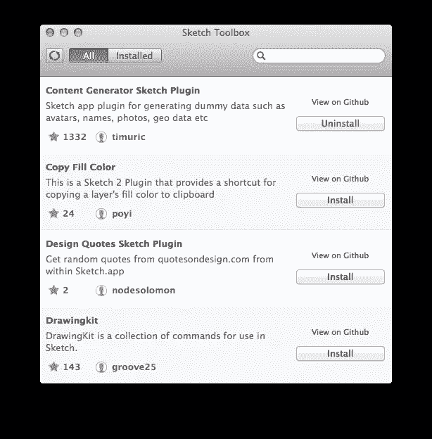
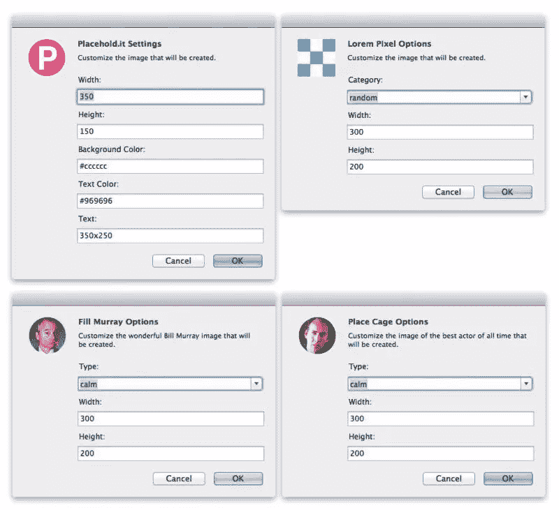
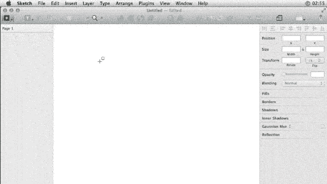
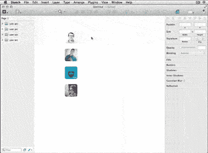
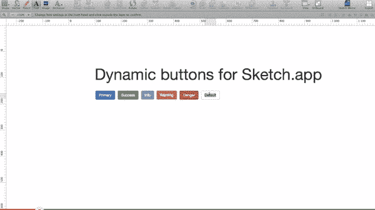
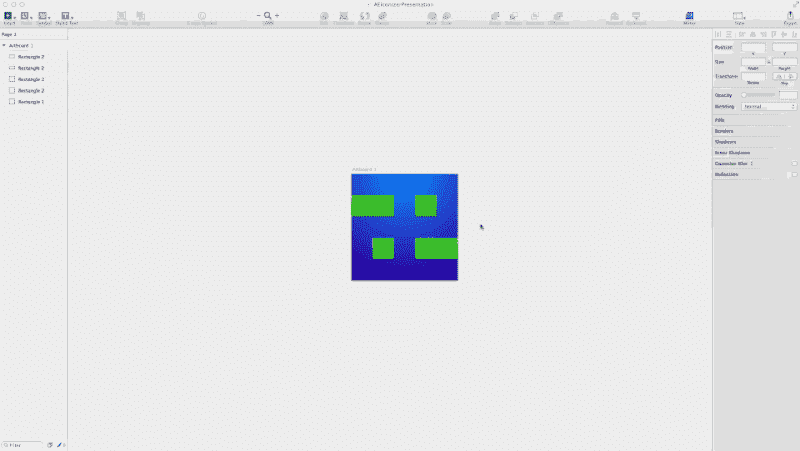
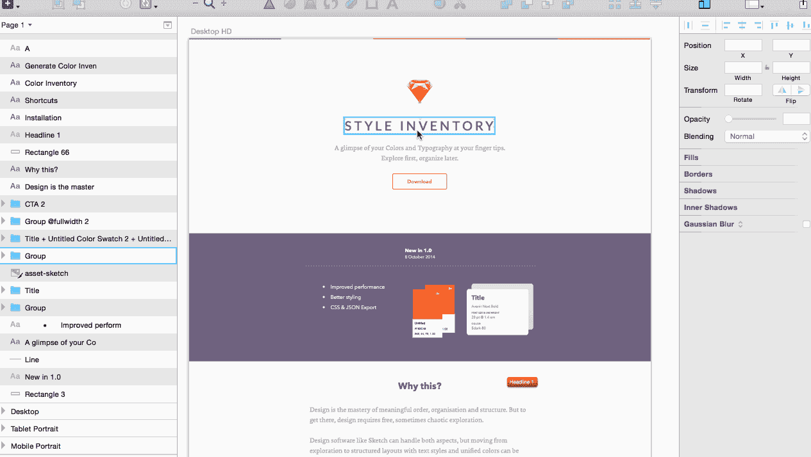
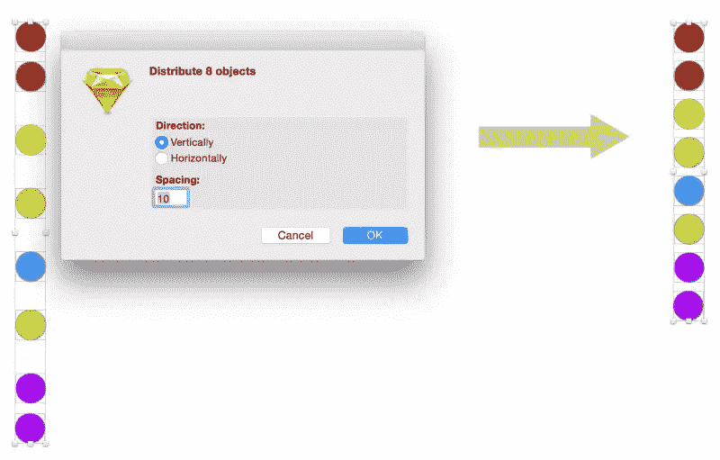

# 草图应用程序的 10 个最佳生产力插件

> 原文：<https://www.sitepoint.com/best-plugins-for-sketch-app/>

在 2015 年期间， [Sketch App](http://bohemiancoding.com/sketch/ "Sketch App - from Bohemian coding") 凭借其易于使用的功能和简单明了的界面，继续赢得设计界的关注。但是即使它是一个开箱即用的强大工具，过一会儿你*可能*会发现自己想要根据自己的喜好做一些调整。令人欣慰的是，现在有一系列优秀的插件可以让你自定义和扩展 Sketch 的工作方式。在这篇文章中，我为 Sketch 选择了十大生产力插件。

如果你对 Sketch App 还不那么有信心，后退一步，从基础开始。我们的视频，*Sketch 的检查工具指南*(如下)，概述了如何设置图层样式，这是一个开始学习 Sketch 的好方法。它实际上组成了我们 **4.5/5 星**(不是吹牛或什么)[设计一个带有素描课程的用户界面](https://www.sitepoint.com/premium/courses/user-interface-design-with-sketch-4-2927)的一个视频。

## 草图工具箱

在我们深入研究 Sketch 之前，我建议你下载并安装 Sketch Toolbox。这是一个简单的插件管理器，不像我们习惯在代码编辑器中看到的那些，比如 [Sublime Text](http://www.sublimetext.com/) 或者 [Atom](https://atom.io/) 。

工具箱可以让你很容易地浏览最流行的插件，只需点击一下，它就会自动下载和安装新的插件，同时也保持最新的先前下载的插件。它是超级省时和可靠的，即使它在技术上仍处于测试阶段。你可以在这里下载素描工具箱[。](http://sketchtoolbox.com/)

链接:[http://sketchtoolbox.com/](http://sketchtoolbox.com/)

## 1.日玩家–添加占位符图像

将占位符图像手动添加到您的设计中会变得非常麻烦。寻找库存照片、裁剪它们等等是很费时间的，尤其是当你时间很紧、接近截稿日期的时候。

[Day Player](https://github.com/tylergaw/day-player "Day Player") 提供了一种捷径，让你从一堆不同的占位符图像服务提供商(就像 web 开发人员通常使用的那些)中进行选择，并将它们添加到你的设计中。可用选项包括 placehold.it、lorempixel.com 和 fillmurray.com 等。

最棒的是，基于您选择的服务，您可以调整参数，如宽度、高度、图像类别文本或您可能希望在占位符上看到的其他设置。

链接:[https://github.com/tylergaw/day-player](https://github.com/tylergaw/day-player "Day Player")

## 2.内容生成器

到目前为止，Sketch 的内容生成器是我在原型和虚拟数据生成方面发现的最有用的插件。它为你节省了大量的时间，而且非常容易使用。

它可以从头像、姓名和纯文本内容中生成几乎任何类型的虚拟数据。只需选择你想要填充虚拟数据的层，从插件下拉菜单中选择你想要的数据类型，然后“瞧”！这就是了。

链接:[https://github.com/timuric/Content-generator-sketch-plugin](https://github.com/timuric/Content-generator-sketch-plugin "Sketch app plugin for generating dummy data such as avatars, names, photos, geo data etc")

## 3.动态按钮

当前设计应用程序的一个大缺点是它们没有天生的响应能力——它们不能适应。

让我们以 CSS 为例。当您在 CSS 中开发一个按钮时，标签文本的形状会自动适应，因此它会保持您在属性中定义的填充，而无需任何额外的工作。

“动态按钮”插件做同样的事情。它允许按钮根据其包含的带有预设填充的文本自动展开。当你在构建大型复杂的 UI 设计时，动态按钮是你最好的朋友，因为它可以节省大量的时间，避免你的挫败感。

链接:[https://github.com/ddwht/sketch-dynamic-button](https://github.com/ddwht/sketch-dynamic-button "Dynamic button plug-in for Sketch.app allows to create buttons with fixed paddings no matter what text you add.")

## 4.AEIconizer

AEIconzier 插件是我个人最喜欢的。它消除了设计或调整单个 iOS 应用程序图标的不同版本的不便。在任何正方形大小的画板中创建图标后，运行此插件为 iOS 图标生成所有需要的大小。

每次执行 AEIconizer 时，它都会重新生成并替换之前生成的所有画板，但它永远不会删除您开始时使用的原始画板。它非常适合测试和导出你的 iOS 应用图标，而不需要另一个导出插件。

链接:[https://github.com/tadija/aeiconizer](https://github.com/tadija/aeiconizer "AEIconizer")

## 5.草图测量

草图测量插件是目前为止最好的测量和设计规范工具。相对于您正在使用的测量类型，您可以轻松地单独测量并获取任何给定图层的大小、边距或填充以及坐标，也可以一次测量两个或更多图层。

这个插件非常简单易用。您可以通过界面或键盘快捷键与它进行交互。当你和其他设计师合作设计大型的 UX 项目时，这真的很方便。

链接:[https://github.com/utom/sketch-measure](https://github.com/utom/sketch-measure "Sketch Measure")

## 6.草图页面开关

对于一个插件来说，这似乎是一个非常愚蠢的想法，但是不要太快做出判断。它很有可能会让你惊讶，因为它可以让你通过键盘快捷键快速切换页面，从而节省你的时间。奇怪的是，Sketch 并不支持这个开箱即用的特性，但是，这就是插件的作用，对吧。

链接:[https://github.com/mauehara/sketch-page-switch](https://github.com/mauehara/sketch-page-switch "Sketch Page Switch")

## 7.草图的样式清单

风格清单有助于将混乱的设计变得有条理。它可能是拥有最多子功能的草图插件。

使用风格清单，您可以轻松地选择颜色，名称和风格层。它还具有一个令人印象深刻的功能，可以通过在任何给定的草图设计中生成所有引用的文本样式和颜色的画板来轻松创建样式指南。

关于风格目录的更多细节可以在[这里](https://github.com/getflourish/Sketch-Style-Inventory)找到

链接:[https://github.com/getflourish/Sketch-Style-Inventory](https://github.com/getflourish/Sketch-Style-Inventory)

## 8.更好的粘贴插件

Sketch 有一些非常棒的特性，但是，老实说，经典的复制/粘贴不是其中之一。通常 Ctrl+V 会将剪贴板内容粘贴到画板上某个意想不到的随机位置

“更好的粘贴”将自动确定画板的哪个区域当前在视口中居中，并将其粘贴在那里，这通常是一个更有用的结果。

链接:[https://github.com/kenmoore/sketch-better-paste](https://github.com/kenmoore/sketch-better-paste "Paste like it was meant to be--into the artboard you're viewing.")

## 9.草图分配器

[SketchDistributor](https://github.com/pez/sketchdistributor "Sketch Distributor") 是一个“定位”插件，可以帮助你完美地对齐各层。它是创建水平或垂直导航栏时的理想工具。

链接:[https://github.com/pez/sketchdistributor](https://github.com/pez/sketchdistributor "Download SketchDistributor")

## 10.草图导出资产

Sketch Export Assets 旨在为在 Sketch 中设计的 iOS、Android 和 Windows Phone 导出图形资产。它可以调整图像的大小，并向图像添加元数据，同时使它们为应用程序的使用和分发做好准备。

这个插件假设你在“mdpi”中设计你的布局，这意味着 1px = 1dp。它为您节省了大量时间，因为它开箱即可完美运行，并且通过键盘快捷键可以快速操作。

链接:[https://github.com/geertwille/sketch-export-assets](https://github.com/geertwille/sketch-export-assets "Export assets for Android, iOS, Windows Phone in Sketch")

## 结论

归根结底，这一切都是为了激发我们每个人的创造力。我发现素描是一种令人愉快的工具，可以用来激发创造力。

但是有时候我们的工具——包括草图——并不像我们希望的那样开箱即用，我们需要用插件来填补这些空白。我希望你会发现上面的一些选项很方便。

当然，如果你遇到其他应该在列表中的插件，请在下面的评论中告诉我们。

## 分享这篇文章