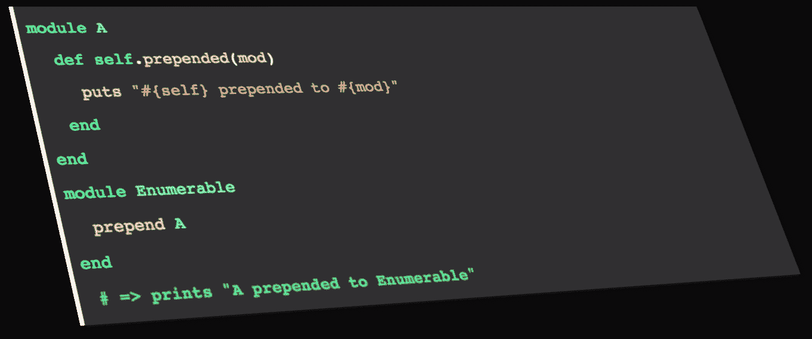

# Ruby 的重要钩子方法

> 原文：<https://www.sitepoint.com/rubys-important-hook-methods/>



Ruby 的哲学基于一个强大的原始概念，即程序员的快乐。Ruby 坚信程序员快乐，并提供了许多不同的方法来实现它。它的元编程能力允许程序员在运行时编写动态代码。它的线程能力为程序员提供了一种编写多线程代码的优雅方式。它的钩子方法帮助程序员在运行时扩展程序的行为。

上述特性，以及其他一些很酷的语言特性，使得 Ruby 成为编写代码的首选之一。这篇文章将探讨 Ruby 中一些重要的钩子方法。我们将讨论关于钩子方法的不同方面，比如它们是什么，它们是用来做什么的，以及我们如何使用它们来解决不同的问题。我们还将看看流行的 Ruby 框架/gem/库如何使用它们来提供非常酷的特性。

让我们开始吧。

## 什么是钩子法？

钩子方法提供了一种在运行时扩展程序行为的方法。想象一下，当一个子类从某个特定的父类继承时，能够得到通知，或者优雅地处理对象上的不可调用方法，而不允许编译器引发异常。这些是钩子方法的一些用例，但是它们的用法并不局限于此。不同的框架/库使用不同的钩子方法来实现它们想要的功能。

我们将在本帖中讨论以下钩子方法:

*   `included`
*   `extended`
*   `prepended`
*   `inherited`
*   `method_missing`

### `included`

Ruby 为我们提供了一种使用`modules`(在其他语言中称为`mixins`)编写模块化代码的方法，这些代码可以在以后的其他`modules` / `classes`中使用。`module`背后的想法很简单；它是一段独立的代码，可以在其他地方使用。

例如，如果我们想写一些代码，每当调用一个特定的方法时返回一个静态字符串。让我们称这个方法为`name`。您可能还想在其他地方使用这段代码。在这里创建一个`module`非常有意义。让我们创建一个:

```
module Person
  def name
    puts "My name is Person"
  end
end
```

这是一个非常简单的模块，只有一个方法`name`返回一个静态字符串。让我们在程序中使用它:

```
class User
  include Person
end
```

Ruby 提供了一些使用`modules`的不同方法。其中一个就是`include`。`include`所做的是让底层`module`中定义的方法在`class`的实例上可用。在我们的例子中，`Person`模块中定义的方法可以作为`User`类对象的实例方法。这就好像我们已经在`User`类本身中编写了`name`方法，但是在`module`中定义它的好处是可重用性。为了调用`name`，我们需要创建一个`User`的实例，然后在新创建的对象上调用`name`。例如:

```
User.new.name 
=> My name is Person
```

我们来看看基于`include`的挂钩方法。`included`是 Ruby 提供的一个钩子方法，每当你在某个`module`或`class`中`include`一个`module`时，这个方法就会被调用。用以下代码更新`Person`模块:

```
module Person
  def self.included(base)
    puts "#{base} included #{self}"
  end

  def name
    "My name is Person"
  end
end
```

您可以在`Person`模块上看到一个被定义为`class`方法的新方法`included`。每当你在其他模块或类中`includePerson`时，这个`included`方法就会被调用。此方法接收一个参数，该参数是对包含该模块的类的引用。尝试运行`User.new.name`，您将看到以下输出:

```
User included Person
My name is Person
```

如您所见，`base`正在返回包含的类名。现在我们有了对包含`Person`的类的引用，我们可以做一些元编程来实现我们想要的功能。让我们看看**如何设计**使用`included`钩子。

##### `included`在设计中

Devise 是 Ruby 中使用最广泛的认证宝石之一。它主要由我最喜欢的程序员 José Valim 编写，现在由一些优秀的贡献者维护。Devise 为我们提供了从注册到登录，从忘记密码到恢复密码等完整的功能。它允许我们在用户模型中使用简单的语法配置各种模块:

```
devise :database_authenticatable, :registerable, :validatable
```

我们在`models`中使用的`devise`方法在这里被定义为。为了方便起见，我粘贴了下面的代码:

```
def devise(*modules)
  options = modules.extract_options!.dup

  selected_modules = modules.map(&:to_sym).uniq.sort_by do |s|
    Devise::ALL.index(s) || -1  # follow Devise::ALL order
  end

  devise_modules_hook! do
    include Devise::Models::Authenticatable

    selected_modules.each do |m|
      mod = Devise::Models.const_get(m.to_s.classify)

      if mod.const_defined?("ClassMethods")
        class_mod = mod.const_get("ClassMethods")
        extend class_mod

        if class_mod.respond_to?(:available_configs)
          available_configs = class_mod.available_configs
          available_configs.each do |config|
            next unless options.key?(config)
            send(:"#{config}=", options.delete(config))
          end
        end
      end

      include mod
    end

    self.devise_modules |= selected_modules
    options.each { |key, value| send(:"#{key}=", value) }
  end
end
```

在我们的模型中，传递给`devise`方法的命名模块将作为数组传递给`*modules`。在传递的模块上调用`extract_options!`来提取用户可能已经传递的任何选项。第 11 行有一个`each`，每个模块在代码块中被表示为`m`。在第 12 行`m`被转换成一个常量(类名)，所以像`:validatable`这样的符号用`m.to.classify`变成了`Validatable`。`classify`顺便说一下，是一个 ActiveSupport 方法。`Devise::Models.const_get(m.to_classify)`获取对模块的引用，并将其分配给`mod`。在第 27 行，使用`include mod`包含模块引用。在`Validatable`示例中，这里[定义的模块](https://github.com/plataformatec/devise/blob/v3.4.1/lib/devise/models/validatable.rb)是`included`。`Validatable`有以下`included`种挂钩方法:

```
def self.included(base)
  base.extend ClassMethods
  assert_validations_api!(base)

  base.class_eval do
    validates_presence_of   :email, if: :email_required?
    validates_uniqueness_of :email, allow_blank: true, if: :email_changed?
    validates_format_of     :email, with: email_regexp, allow_blank: true, if: :email_changed?

    validates_presence_of     :password, if: :password_required?
    validates_confirmation_of :password, if: :password_required?
    validates_length_of       :password, within: password_length, allow_blank: true
  end
end
```

这个例子中的模型是`base`。在第 5 行，有一个`class_eval`块，它在调用类的上下文中求值。通过`class_eval`编写代码就像通过打开类文件并粘贴代码来编写相同的代码一样。Devise 正在使用`class_eval`在我们的模型中包含验证。

当我们尝试使用 Devise 注册或登录时，我们会看到验证，但我们没有编写这些验证。Devise 通过利用`included`钩子来提供它们。相当整洁。

### 延长

Ruby 还允许开发者`extend`一个模块，这与`include`稍有不同。`extend`将方法应用于类本身，而不是将`module`中定义的方法应用于类的实例。让我们看一个简单的例子:

```
module Person
  def name
    "My name is Person"
  end
end

class User
  extend Person
end

puts User.name # => My name is Person
```

如你所见，我们已经调用了在`Person`模块中定义的`name`方法作为`User`上的类方法。`extend`在`User`类中增加了`Person`模块的方法。`extend`也可用于将模块中定义的方法作为单例方法应用于对象。让我们看另一个简单的例子:

```
# We are using same Person module and User class from previous example.     

u1 = User.new
u2 = User.new

u1.extend Person

puts u1.name # => My name is Person
puts u2.name # => undefined method `name' for #<User:0x007fb8aaa2ab38> (NoMethodError)
```

我们创建了`User`的两个实例，然后在`u1`上调用`extend`，将`Person`作为参数传递。由于这个调用，在`Person`模块中定义的`name`方法只在`u1`上可用，在其他实例上不可用。

就像`included`一样，`extend`也有一个关联的`extended`钩子。当一个模块被另一个模块或类`extend`调用时，它将被调用。让我们看一个例子:

```
# Modified version of Person module

module Person
  def self.extended(base)
    puts "#{base} extended #{self}"
  end

  def name
    "My name is Person"
  end
end

class User
  extend Person
end
```

运行这段代码会产生`User extended Person`作为输出。

完成了对`extended`的介绍，让我们看看`ActiveRecord`是如何使用它的。

#### `extended`在活动记录中

是 Ruby 和 Rails 广泛使用的 ORM。它有许多很酷的特性，这使它成为大多数情况下的首选 ORM。让我们深入到`ActiveRecord`的内部，看看`ActiveRecord`如何获得回调(我们使用的是 Rails 3 . 2 . 21)。

`ActiveRecord`就是这里的`extend`ing`ActiveRecord::Models`T3。

```
extend ActiveModel::Callbacks
```

`ActiveModel`提供一组已知的接口用于模型类。它们允许 ActionPack 辅助对象与非活动记录模型进行交互。在`ActiveModel::Callbacks`中，定义了[这里的](https://github.com/rails/rails/blob/v3.2.21/activemodel/lib/active_model/callbacks.rb#L49-L53)，你会看到下面的代码:

```
def self.extended(base)
  base.class_eval do
    include ActiveSupport::Callbacks
  end
end
```

`ActiveModel::Callbacks`正在调用`base`上的`class_eval`，也就是`ActiveRecord::Callbacks`，包含一个模块`ActiveSupport::Callbacks`。正如我们之前所讨论的，在类引用上调用`class_eval`与在特定的类中手工编写代码是一样的。是`ActiveSupport::Callbacks`为`ActiveRecord::Callbacks`提供了 Rails 著名的回调。

我们已经讨论了`extend`，它的关联钩子`extended`，也看到了`ActiveRecord` / `ActiveModel`如何使用上述方法/钩子为我们提供一些现成的功能。

### 假装

还有另一种方法来使用模块中定义的方法，称为`prepend`。`prepend`是在 Ruby 2.0 中引入的，与`include`和`extend`有很大不同。`include`和`extend`使用的方法可以被目标模块/类中定义的方法覆盖。例如，如果我们在某个模块中定义了一个方法`name`,并且在目标模块/类中定义了相同的方法，那么在我们的类中定义的方法将覆盖模块中的`name`。`prepend`非常不同，因为它用`prepend` ing 模块中定义的方法覆盖了我们的模块/类中定义的方法。让我们看一个简单的例子:

```
module Person
  def name
    "My name belongs to Person"
  end
end

class User
  def name
    "My name belongs to User"
  end
end

puts User.new.name 
=> My name belongs to User
```

现在让我们看看`prepend`的实际情况:

```
module Person
  def name
    "My name belongs to Person"
  end
end

class User
  prepend Person
  def name
    "My name belongs to User"
  end
end

puts User.new.name 
=> My name belongs to Person
```

添加`prepend Person`会覆盖`User`中定义的同名方法，这会导致控制台中出现`My name belongs to Person`。`prepend`实际上**将**方法添加到方法链中。要调用`User`类中定义的`name`方法，请从`Person`模块的`name`中调用`super`。

`prepend`有一个名为(你猜对了)`prepended`的相关回调，当一个模块被**前置**到另一个模块/类时，这个回调被调用。让我们看看实际情况。用以下代码更新`Person`模块的定义:

```
module Person
  def self.prepended(base)
    puts "#{self} prepended to #{base}"
  end

  def name
    "My name belongs to Person"
  end
end
```

一旦运行此代码，您将看到以下内容:

```
Person prepended to User
My name belongs to Person
```

`prepend`的引入是为了摆脱丑陋的`alias_method_chain`黑客，Rails(和其他公司)广泛使用它来实现与`prepend`完全相同的功能。由于`prepend`在 Ruby > = 2.0 中可用，如果你打算使用`prepend`，你应该更新你的 Ruby 版本。

### 遗传的

继承是面向对象编程中最重要的概念之一。Ruby 是一种面向对象的语言，提供了从某个基类/父类继承子类的能力。让我们看一个简单的例子:

```
class Person
  def name
     "My name is Person"
  end
end

class User < Person
end

puts User.new.name # => My name is Person
```

我们创建了一个`Person`类和一个子`User`类。在`Person`中定义的方法成为了`User`的一部分。这是非常简单的继承。您可能想知道，当一个类从另一个类继承时，有什么方法可以得到通知吗？是的，有一个叫做`inherited`的红宝石钩子可以用来做这件事。让我们看看实际情况:

```
class Person
  def self.inherited(child_class)
    puts "#{child_class} inherits #{self}"
  end

  def name
    "My name is Person"
  end
end

class User < Person
end

puts User.new.name
```

如您所见，每当`Person`类被某个子类继承时，就会调用`inherited`类方法。运行上面的代码片段显示:

```
User inherits Person
My name is Person
```

让我们看看`Rails`是如何在其代码库中使用`inherited`的。

#### 在 Rails 中继承

在每个名为`Application`的 Rails 应用中都有一个重要的类，定义在 **config/application.rb** 文件中。这个类执行许多不同的任务，比如执行所有的 Railties、引擎和插件初始化器。关于`Application`类的一个有趣的事情是，它不能有两个实例在同一个进程中运行。如果我们试图覆盖这种行为，Rails 将抛出一个异常。让我们看看 Rails 是如何实现这个特性的。

`Application`类继承自`Rails::Application`，这里定义为。在第 62 行，定义了一个`inherited`钩子，当我们的 Rails app `Application`类从`Rails::Application`继承时，这个钩子将被调用。`inherited`挂钩的代码是:

```
class << self
  def inherited(base)
    raise "You cannot have more than one Rails::Application" if Rails.application
    super
    Rails.application = base.instance
    Rails.application.add_lib_to_load_path!
    ActiveSupport.run_load_hooks(:before_configuration, base.instance)
  end
end
```

`class is another way of defining class methods in Ruby. In` `inherited`，第一行检查`Rails.application`是否存在，如果存在，抛出异常。这段代码第一次运行时，`Rails.application`将返回 false，并调用`super`。本例中的`super`是来自`Rails::Engine`的`inherited`钩子，因为`Rails::Application`本身继承自`Rails::Engine`。

在下一行，你可以看到`Rails.application`被赋予了`base.instance`。该方法的其余部分设置 Rails 应用程序。

这就是 Rails 如何智能地使用`inherited`钩子来确保每个进程只有一个 Rails `Application`类的实例在运行。

### 方法 _ 缺失

`method_missing`可能是使用最广泛的红宝石挂钩。它可以在许多流行的 Ruby 框架/gem/库中找到。当我们的代码试图在一个对象上调用一个不存在的方法时，就会调用它。让我们看一个简单的例子:

```
class Person
  def name
    "My name is Person"
  end
end

p = Person.new

puts p.name     # => My name is Person  
puts p.address  # => undefined method `address' for #<Person:0x007fb730a2b450> (NoMethodError)
```

我们声明了一个简单的`Person`类，只有一个方法`name`。然后，创建一个`Person`的实例，并分别调用两个方法`name`和`address`。由于`name`是在`Person`上定义的，所以它会平稳运行。但是`address`没有在`Person`上定义，并且会引发异常。`method_missing`钩子可以避免这类异常，优雅地捕获那些未定义的方法。让我们写一个新版本的`Person`类:

```
class Person
  def method_missing(sym, *args)
     "#{sym} not defined on #{self}"
  end

  def name
    "My name is Person"
  end
end

p = Person.new

puts p.name     # => My name is Person
puts p.address  # => address not defined on #<Person:0x007fb2bb022fe0>
```

`method_missing`接收两个参数:被调用方法的名称和传递给该方法的参数。首先，Ruby 将寻找我们试图调用的方法，如果没有找到方法，它将寻找`method_missing`。现在我们已经在`Person`上覆盖了`method_missing`，所以 Ruby 会调用它，不会引发任何异常。

让我们看看`Rake`宝石在现实世界中是如何使用`method_missing`的。

#### Rake 中缺少方法

`Rake`是使用最广泛的红宝石之一。`Rake`使用`method_missing`来提供对传递给 Rake 任务的`arguments`的访问。首先创建一个简单的 rake 任务:

```
task :hello do
  puts "Hello"
end
```

如果您通过调用`rake hello`来运行这个 rake 任务，您将会看到`Hello`。让我们扩展这个 rake 任务，以便它接受一个参数(一个人的名字)并问候那个人:

```
task :hello, :name do |t, args|
  puts "Hello #{args.name}"
end
```

`t`是任务的名称，`args`保存传递给该任务的参数。如您所见，我们已经调用了`args.name`来将`name`参数传递给`hello`任务。运行 rake 任务，传递一个名称参数，如下所示:

```
rake hello["Imran Latif"] 
=> Hello Imran Latif
```

让我们看看`Rake`如何使用`method_missing`为我们提供传递给任务的参数。

上述任务中的`args`对象是`Rake::TaskArguments`的一个实例，这里定义为。这个类负责管理传递给 Rake 任务的参数。查看`Rake::TaskArguments`的代码，您会发现没有定义与传递给 task 的参数相对应的方法。那么，`Rake`如何提供传递给任务的参数呢？这个问题的答案是`Rake`正在智能地使用`method_missing`来实现想要的功能。如果你看第 64 行，`method_missing`被定义为:

```
def method_missing(sym, *args)
  lookup(sym.to_sym)
end
```

在类定义中包含`method_missing`确保了未定义的方法会被路由到它，并且 Ruby 不会引发任何异常。在这个`method_missing`中，有一个对`lookup`方法的调用:

```
def lookup(name)
  if @hash.has_key?(name)
   @hash[name]
  elsif @parent
    @parent.lookup(name)
  end
end
```

`method_missing`正在调用`lookup`，以`Symbol`的形式传递给它方法的名称。`lookup`方法将查看在`Rake::TaskArguments`的构造函数中创建的`@hash`。如果`@hash`包含参数，它将被返回，如果它不在`@hash`中，那么`Rake`将调用`@parent`上的`lookup`(如果它存在的话)。如果找不到参数，则不返回任何内容。

这就是`Rake`如何使用`method_missing`智能地提供对传递给 Rake 任务的参数的访问。感谢[吉姆·威里奇](https://twitter.com/jimweirich)撰写 Rake。

## 结束语

我们讨论了五种重要的 Ruby hook 方法，探索了它们是如何工作的，以及流行的框架/gem 如何使用它们来提供一些简洁的功能。我希望你喜欢这篇文章。请在评论中告诉我们你最喜欢的 Ruby hook，以及你用它解决了什么问题。

## 分享这篇文章