# 用检查器检查 PHP 代码质量

> 原文：<https://www.sitepoint.com/inspecting-php-code-quality-scrutinizer/>

 *这篇文章已经根据审查者背后的人的反馈做了轻微的修改。在很大程度上，变化是在“配置”部分，现在明显更简单。

我们已经在 SitePoint 浏览了大量关于代码质量、检查、自动构建系统等等的教程:

*   【Jenkins 的 PHP 质量保证【4 部分系列】
*   [PHP 与 Travis CI 的持续集成](https://www.sitepoint.com/php-continuous-integration-travis-ci/)
*   用 PhpMetrics 可视化你的代码质量
*   [与 PHP-CI 的持续集成](https://www.sitepoint.com/continuous-integration-php-ci/)

在这篇文章中，我们将看一看[检查器 CI](https://scrutinizer-ci.com/)——一个持续集成工具，它非常昂贵并且对私人项目关闭，但是对公共项目非常方便。


## 审查者 vs/+特拉维斯

为了帮助您找到潜在的错误、安全漏洞或违反最佳实践的情况，检查器会执行编译器所做的许多分析。它还允许您将其结果与一些开源工具的结果相结合，如我们在关于 Jenkins 的 4 篇系列文章中讨论的 PHP 代码嗅探器。

Travis 是完全可定制的，各种虚拟环境运行您的代码，并让您知道您的构建状态，它没有真正的内置质量保证支持。审查者有，但它不在公共项目上运行测试，为了给私人项目提供动力，你需要一个付费的计划。

因此，检查器不能为您运行 PHPUnit，也不能提供构建状态或代码覆盖率。然而，我们可以配置 Travis 在每次构建时向审查员发送覆盖报告*。这样，每当 Travis 为您的项目构建新版本时，它都会自动确保检查器报告也是最新的。*

## 外部代码覆盖率

要开始使用审查者，请在那里注册一个帐户。然后，将您的 Github 帐户与它连接并授权访问，这样它就可以访问您的存储库并验证您是所有者。最后，单击 Add Repository 按钮，添加您想要选中的存储库。检查器会自动将一个 webhook 添加到您的 repo 中，以便其上发生的所有事件都会自动触发扫描过程:

[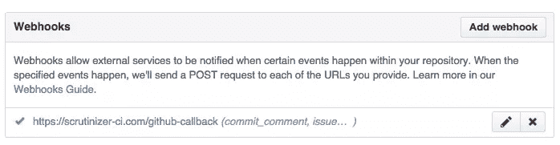](https://www.sitepoint.com/wp-content/uploads/2015/04/1429559175Screenshot-2015-04-20-21.45.53.png)

我假设您已经知道如何配置 Travis。如果没有，请看[这篇帖子](https://www.sitepoint.com/php-continuous-integration-travis-ci/)再回来。在我们的`.travis.yml`文件的末尾，我们需要添加以下内容:

```
script:
  - phpunit --coverage-text --coverage-clover=coverage.clover

after_script:
  - wget https://scrutinizer-ci.com/ocular.phar
  - php ocular.phar code-coverage:upload --format=php-clover coverage.clover
```

这首先指示 Travis 如何触发构建过程:运行 PHPUnit 并生成 clover 覆盖报告。在构建执行之后，Travis 需要从检查器下载`ocular.phar`助手，并使用这个工具发送覆盖报告。这意味着，如果您想完全绕过 Travis，您也可以在自己的机器上使用这个工具——只需在本地运行相同的命令。

## 配置

当您添加您的项目时，检查器将根据您的项目结构自动推断一个配置。它可以识别许多常见的框架和 CMSes，如 Symfony、Zend、Laravel、Drupal、Magento 或 WordPress，并会自动调整其分析以匹配特定的项目。检查器还允许你通过一个配置文件来改变它的行为。[配置](https://scrutinizer-ci.com/docs/configuration/best_practices)过程对于舒适性来说有点太多才多艺了，所以我会尽可能地简化。

### 全球/回购

你可以在审查者网站上保存一些配置，存入你的账户——*global*和 *repo* 。**全球配置**可以在回购协议中共享(但并非必须如此——单词 *global* 意味着它是*全球可用的*，而不是*全球活动的*)。

**回购配置**是保存在回购配置部分的配置:

[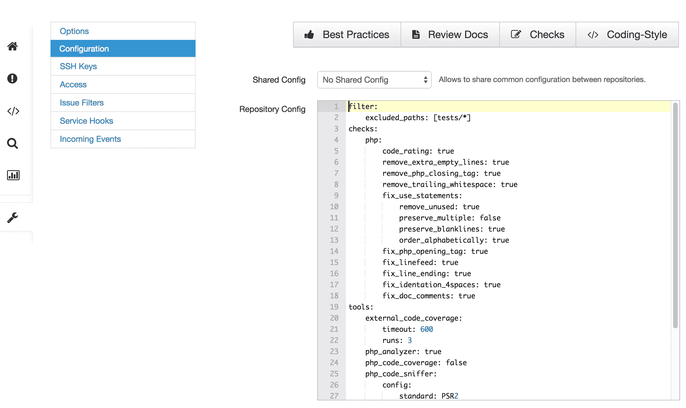](https://www.sitepoint.com/wp-content/uploads/2015/04/1429556953Screenshot-2015-04-20-21.07.38-1024x610.png)

起初，它会是空的，一些默认的值隐含在中。要对其进行微调，可以根据文档输入自定义值，如[。在](https://scrutinizer-ci.com/docs/configuration)[的 HPL league/skeleton](https://github.com/thephpleague/skeleton)的情况下，这已经被很好地定义了，所以你可以撕掉他们的配置并把它直接塞进去:

```
filter:
    excluded_paths: [tests/*]
checks:
    php:
        code_rating: true
        remove_extra_empty_lines: true
        remove_php_closing_tag: true
        remove_trailing_whitespace: true
        fix_use_statements:
            remove_unused: true
            preserve_multiple: false
            preserve_blanklines: true
            order_alphabetically: true
        fix_php_opening_tag: true
        fix_linefeed: true
        fix_line_ending: true
        fix_identation_4spaces: true
        fix_doc_comments: true
tools:
    external_code_coverage:
        timeout: 600
        runs: 3
```

当构建过程被触发时(由于 webhook，这将自动发生)，Travis 将运行 PHPUnit 命令，并在完成时发送覆盖报告。600 秒的超时意味着这是审查员等待代码覆盖率报告的最长时间。

当您将 PHPUnit 测试分成几个套件时,`runs`非常有用，每个套件都生成自己的覆盖报告——指定 runs 为 X 意味着发送给检查器的最后 X 个覆盖报告将被*合并在一起，并被视为一个*。当您在 Travis 上测试几种环境时，这也很有用——例如 PHP 5.5、5.6 和 7.0——指定一个值为 3 的`runs`将合并这些报告。如果省略了`runs`,那么对于代码覆盖率和构建成功状态，只有审查员收到的第一份覆盖率报告才会被考虑。

### 文件配置

基于文件的配置是从项目根文件夹的`.scrutinizer.yml`文件中读取的。它可以包含与所有其他配置完全相同的值，但优先于它们，即文件中的值将覆盖回购配置中的值，回购配置将覆盖全局配置中的值。

[联盟框架](https://github.com/thephpleague/skeleton)有一个这样的文件，因此默认情况下准备好接受审查者测试。请随意使用他们的文件作为如何构建您自己的文件的示例。

### 本地配置

可以通过单击“计划检查”来定义每次运行的本地配置，这将允许用户在运行前立即输入要应用的自定义配置值，并且仅在该次运行中应用:

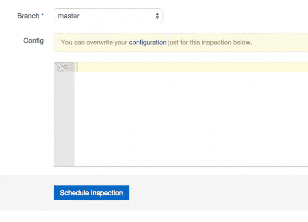

本地配置也是你通过 API 调用参数传递的。

合并时，此配置会覆盖之前的所有配置。

有关这些覆盖和配置层次结构的便利参考，以及何时使用哪种配置类型的有用提示，请参见此[便利图表](https://scrutinizer-ci.com/docs/configuration/cascade)。

## 报告

既然配置已经完成，让我们来检查一个实际的项目。例如，我将使用我的 [Diffbot 客户端](https://github.com/Swader/diffbot-php-client)的过去版本，它是我们在之前的系列中构建的[。在将它添加到 Travis 中，如上所述配置好一切(使用相同的配置设置)之后，检查器构建触发。](https://www.sitepoint.com/series/how-to-build-your-own-php-package/)

### 仪表盘

完成后，项目仪表板会发生变化:

[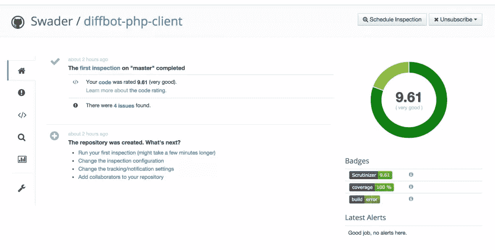](https://www.sitepoint.com/wp-content/uploads/2015/04/1429560674Screenshot-2015-04-20-16.22.54.png)

构建过程被认为是失败的，最初是由于我这边的配置失误，因此出现了错误。

我们可以看到我们在代码质量、100%的测试覆盖率和 4 个检测到的问题方面有一个非常好的评级。让我们看看那些是什么。

### 问题

单击“4 个问题”链接或左侧菜单中的问题图标，我们将进入问题列表:

[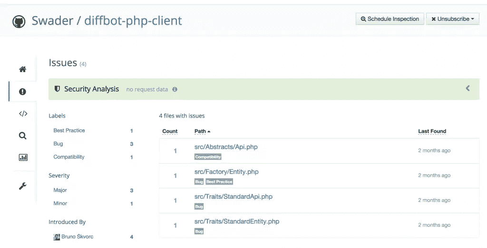](https://www.sitepoint.com/wp-content/uploads/2015/04/1429560871Screenshot-2015-04-20-16.23.13.png)

检查器提供了方便的标签，用于按类型和严重性对问题进行分类。奇怪的是,“最后发现”一栏显示的是“2 个月前”,尽管该项目刚刚被添加到检查器中，并且第一次检查也是在几分钟前进行的。在某些方面，这个界面还有一些需要改进的地方——例如，如果 bug 按照严重性进行颜色编码，如果有一个“扩展”选项可以浏览错误，而不必为一个小问题进入一个全新的屏幕，那就太好了。

好吧，那么，让我们看看有什么问题。我选择检查第二个条目:`Entity.php`:

[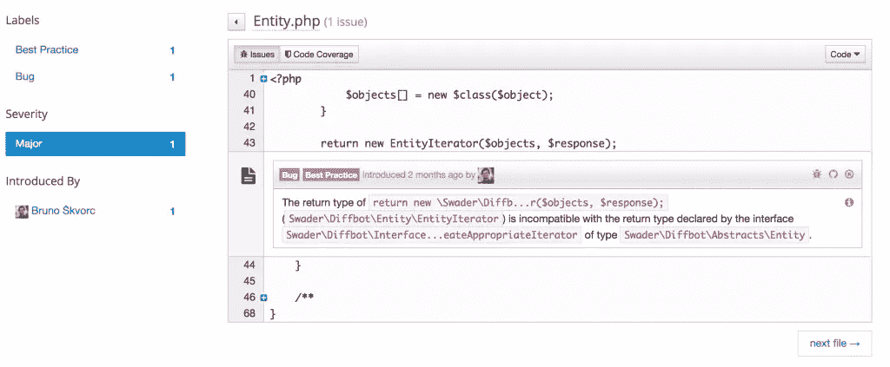](https://www.sitepoint.com/wp-content/uploads/2015/04/1429561341Screenshot-2015-04-20-16.24.36.png)

除了在顶部显示完整的文件路径而不仅仅是文件名会更好之外，这个界面非常干净，可以直接指出错误。在这个特殊的例子中，它实际上检查了一个接口的方法签名的文档块，并警告我不要遵守它。

事实上，一旦我改变了这个:

[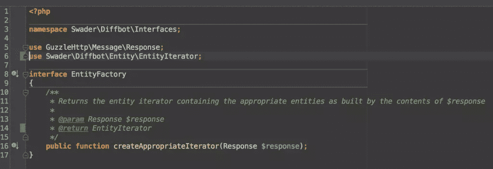](https://www.sitepoint.com/wp-content/uploads/2015/04/1429561768Screenshot-2015-04-20-16.31.01.png)

对此:

[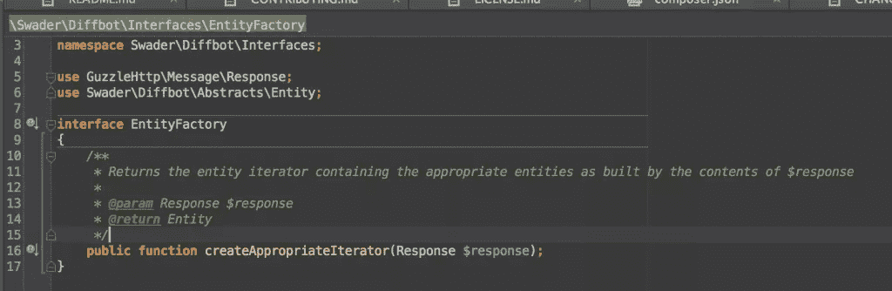](https://www.sitepoint.com/wp-content/uploads/2015/04/1429561776Screenshot-2015-04-20-16.30.22.png)

还修复了一个类似的`Api.php`错误，我提交、推送，分析重新运行，产生了一个肯定的输出:

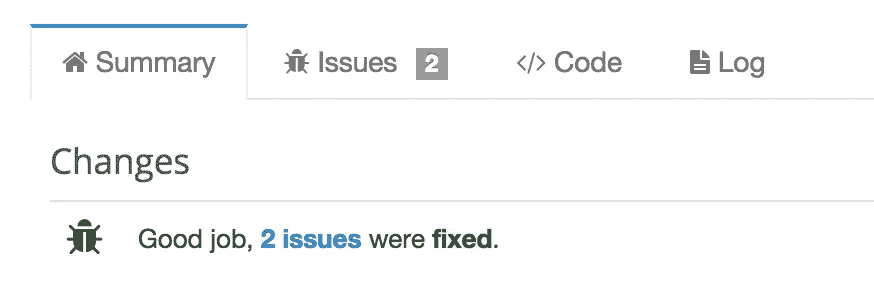

它甚至通过电子邮件让我知道:

[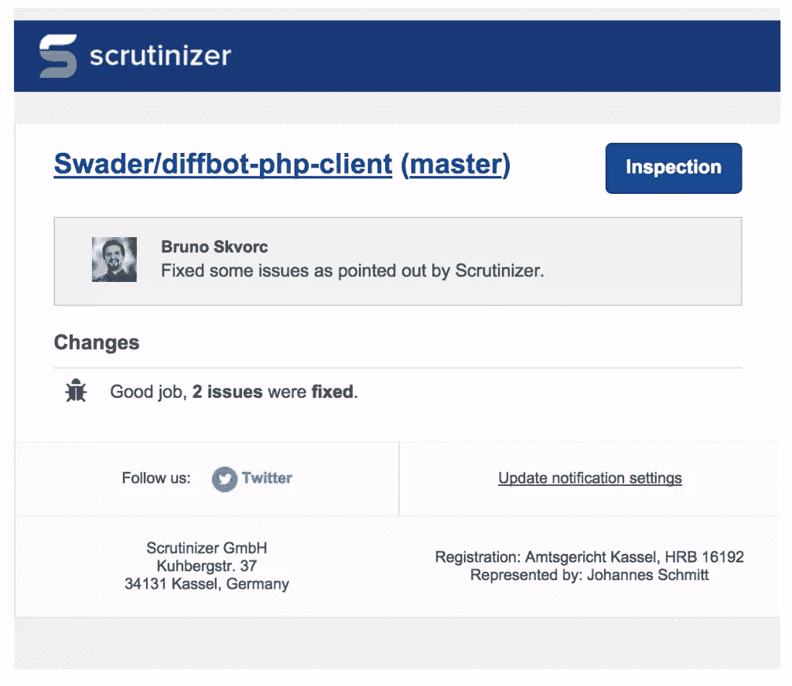](https://www.sitepoint.com/wp-content/uploads/2015/04/1429561914Screenshot-2015-04-20-16.59.54.png)

其余两个问题由于[审查者的分析器](https://github.com/scrutinizer-ci/php-analyzer/issues/17)的问题而无法修复。由于它们的不可修复性，忽略这些问题是合乎逻辑的方法:

[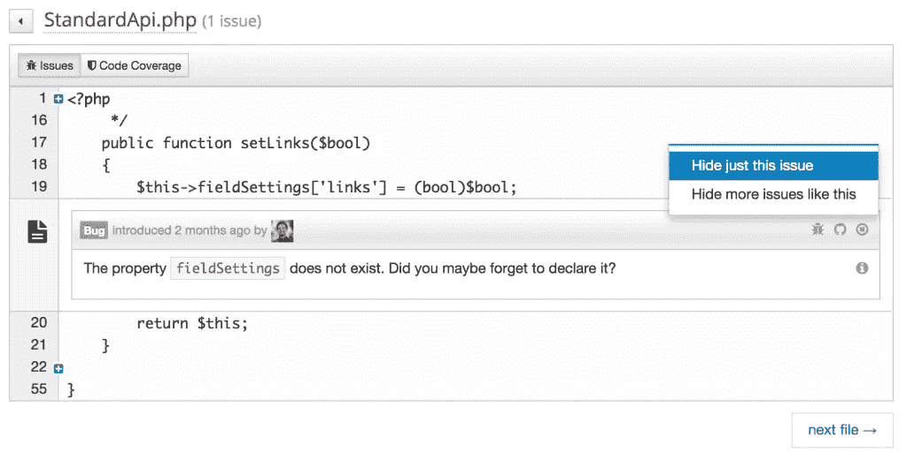](https://www.sitepoint.com/wp-content/uploads/2015/04/1429562740Screenshot-2015-04-20-22.44.23.png)

这并没有真正解决这些问题，但它确实从问题列表中隐藏了它们，因此它们在未来的检查中不会突出。

### 密码

点击“Code”菜单选项，我们将进入代码分析界面，了解我们的类的质量。

[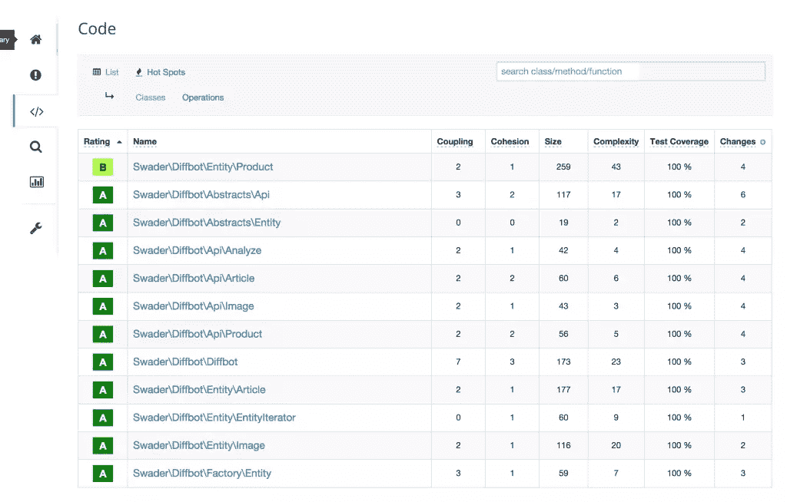](https://www.sitepoint.com/wp-content/uploads/2015/04/1429562170Screenshot-2015-04-20-16.23.27.png)

`Product`类似乎有问题。让我们看看审查者在抱怨什么。

[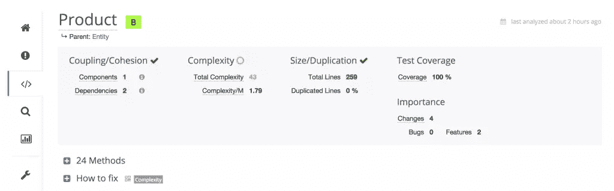](https://www.sitepoint.com/wp-content/uploads/2015/04/1429562268Screenshot-2015-04-20-16.27.12.png)

嗯哼。所以是复杂性导致了这个问题？嗯，看看“怎么修”。

[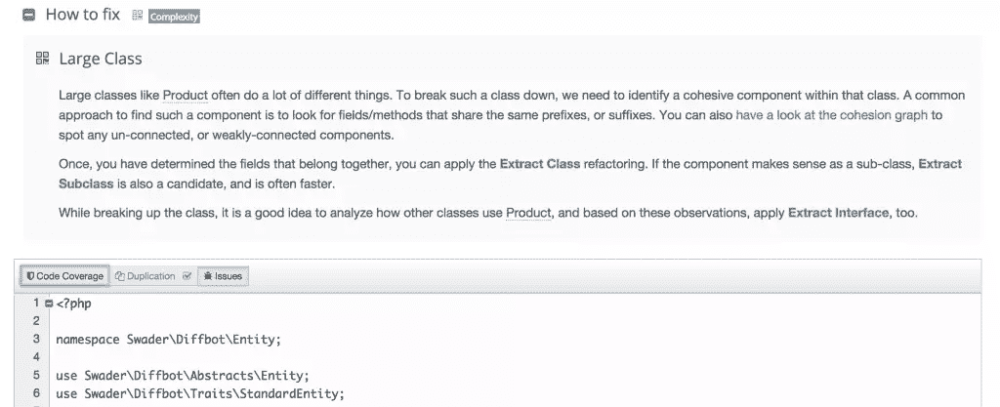](https://www.sitepoint.com/wp-content/uploads/2015/04/1429562377Screenshot-2015-04-20-16.28.10.png)

现在，虽然我非常喜欢这种通过后续链接给出建议的方式，但是对于这门课我无能为力。该文件只是一个大的 getters 集合，没有办法从中提取类、子类或接口。可悲的是，没有办法像对待问题一样忽视这一次检查。

“代码”屏幕上还有另一个链接，一个可能不太明显的链接:“热点”。

热点显示了代码中最“可优化”的区域——那些检查者认为可以用最少的工作量获得最大的质量提升的区域:

[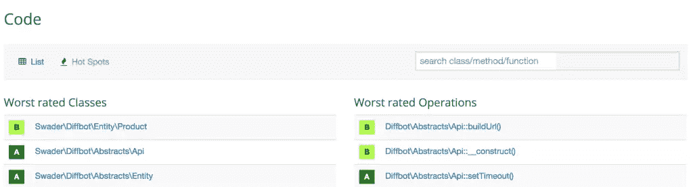](https://www.sitepoint.com/wp-content/uploads/2015/04/1429562924Screenshot-2015-04-20-16.54.11.png)

在我的例子中，这些是前面提到的(不可修复的)`Product`类，以及`Api`抽象类中的两个方法。有意思。让我们来看看`buildUrl`方法的问题。

[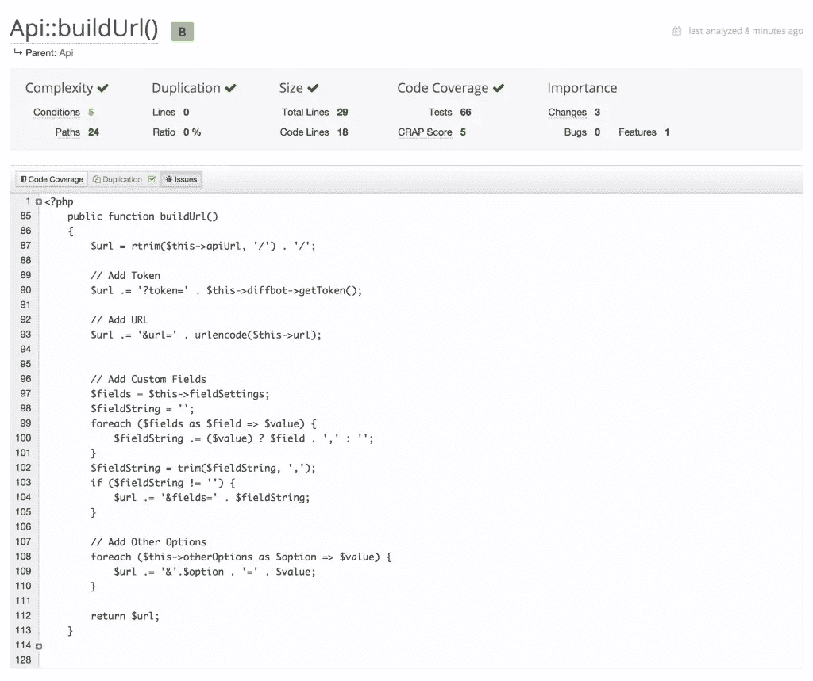](https://www.sitepoint.com/wp-content/uploads/2015/04/1429566880Screenshot-2015-04-20-16.54.45.png)

嗯。条件太多？`buildUrl`方法从调用它的 API 中获取各种选项，并从中构建一个 URL，因此它有“许多”控制结构是很自然的。人们可以将循环提取到像`buildFieldString`和`buildOptionsString`这样的方法中，但是为什么呢？这是唯一需要构建字符串的方法，所以引入额外的不必要的开销来解决这个问题不是我感兴趣的事情。

另一种方法，肯定有不尽人意的地方。让我们对它进行一些改进，并从以下方面进行更改:

```
public function __construct($url)
    {
        if (!is_string($url)) {
            throw new \InvalidArgumentException('URL param must be a string.');
        }
        $url = trim($url);
        if (strlen($url) < 4) {
            throw new \InvalidArgumentException('URL must be at least four characters in length');
        }
        if ($parts = parse_url($url)) {
            if (!isset($parts["scheme"])) {
                $url = "http://$url";
            }
        }
        $filtered_url = filter_var($url, FILTER_VALIDATE_URL);
        if (false === $filtered_url) {
            throw new \InvalidArgumentException('You provided an invalid URL: ' . $url);
        }
        $this->url = $filtered_url;
    }
```

对此:

```
public function __construct($url)
    {
        $url = trim((string)$url);
        if (strlen($url) < 4) {
            throw new \InvalidArgumentException(
                'URL must be a string of at least four characters in length'
            );
        }

        $url = (isset(parse_url($url)['scheme'])) ? $url : "http://$url";

        $filtered_url = filter_var($url, FILTER_VALIDATE_URL);
        if (!$filtered_url) {
            throw new \InvalidArgumentException(
                'You provided an invalid URL: ' . $url
            );
        }

        $this->url = $filtered_url;
    }
```

现在，如果我们通过提交和推送来触发重建，我们会得到这样的结果:

[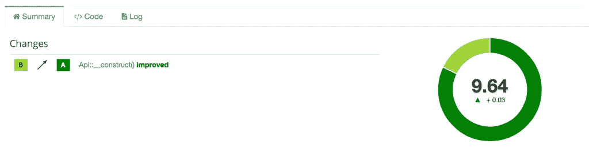](https://www.sitepoint.com/wp-content/uploads/2015/04/1429568857Screenshot-2015-04-21-00.27.02.png)

对于`__construct`方法，质量从 B 级提高到 A 级——成功！

## 检查和统计

剩下的两个屏幕是 Inspections，它列出了到目前为止完成的所有检查及其结果，以及 Statistics 和 Trends，这是一个图形仪表板，显示了代码质量如何随着时间的推移而进步(或退步)的视觉线索——我将把这些留给您去探索。

## 结论

检查器是确保你的 PHP 代码质量一流的强大工具。它非常容易设置，一旦启动并运行，只需最少的交互即可保持活动和最新状态。虽然定价层对个人和私人项目的个人开发者来说不太容易获得(起价为 50 欧元，而不是登录页面上所说的 19 欧元)，但对公司来说非常容易获得，免费层对开源项目来说绰绰有余。

你试过细看吗？你使用哪种代码质量服务？也许他们的竞争，代码气候？让我们知道。

## 分享这篇文章*