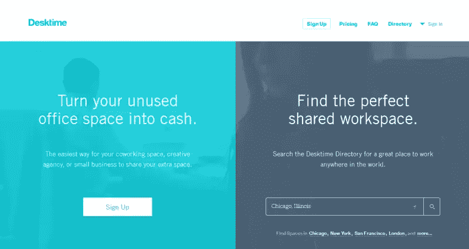
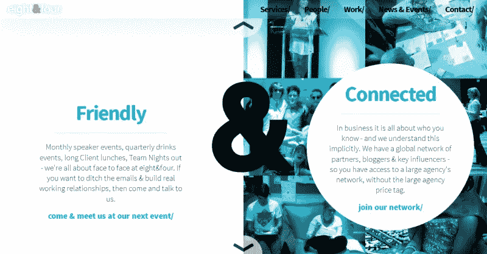
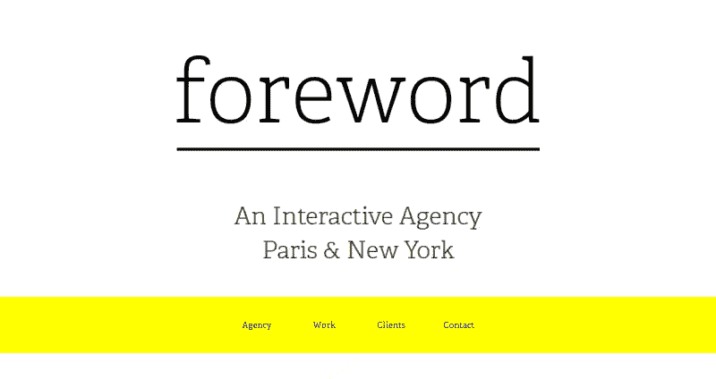
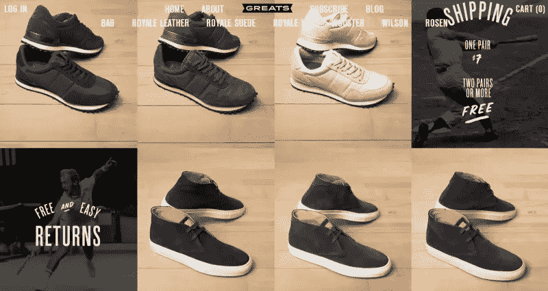
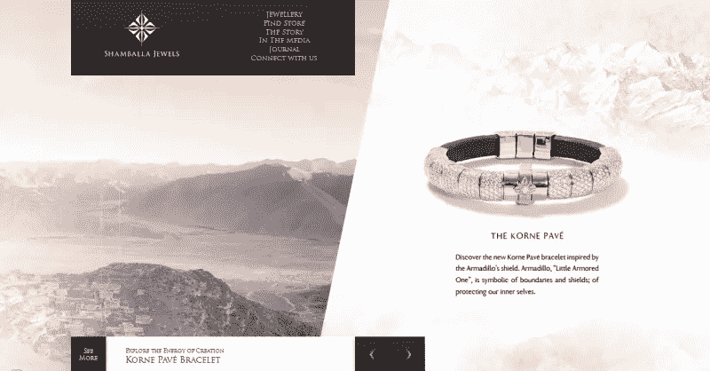

# 2015 年新的网页布局创意

> 原文：<https://www.sitepoint.com/web-layout-ideas-2015/>

随着一些旧趋势的消退，每年都会出现新的网页设计概念。在接下来的几个月里，我们无疑会看到视频背景、瓷砖和动画故事书的流行程度会暂时上升，这只是其中的几个例子。

另一方面，几乎可以肯定的是，响应式网页设计，这个在 2010 年出现的趋势，在可预见的未来仍将是我们设计的核心。

当然，这并不意味着所有的网页都必须走向一个通用的标准化结构。相反，差异化、灵活性和实验性的空间可能会比以往任何时候都大。

我们已经确定了四个趋势，或者说总体方案，我们相信这四个趋势将成为下一年版面设计的特征。你可以从这些模型中获得灵感，但最好的设计往往来自于你将灵感作为你想法的出发点。

这就是趋势。

## 分割屏幕

“分屏”指的是所有那些屏幕被垂直部分分成两部分的网站，通常大小相同。

这样划分页面有两个主要原因:

1.  表现出两个重要特征。
2.  来表达二元性的概念。

第一种情况经常发生在公司必须推销一种具有两种同等重要特征或变体的产品或服务时。因为网站通常按照重要性的顺序显示元素，所以更传统的布局可能不适合这种情况。

另一方面，将屏幕分成两个相等的栏可能是展示同一系统的两个不同方面的最佳方式——例如，对出版商和读者都有利的出版系统。

这样，就没有必要区分主要特征和次要特征，读者会立即关注什么是重要的。

第二个原因源于这样一个事实，有时，设计师需要传达一种二元性的思想。在这种情况下，将屏幕分成两部分可以创造两个空间，在这里可以专注于不同的主题，甚至是两种不同的产品。此外，这种风格使你能够突出某一现实的相反特征。

桌面时间[https://www.desktimeapp.com/](https://www.desktimeapp.com/)

我们要看的第一个例子是 Desktime 的主页，这是一家经营办公室共享业务的公司。他们把这一页一分为二，以便同时满足那些已经拥有办公室的人的需求，以及那些正在寻找办公室的人的需求。

因此，他们使用了“垂直分割”的方法，为他们服务中两个同等重要的功能提供同等的舞台时间。他们采用的风格是有效和实用的，也是非常线性和简单的。干得好！

注意:自从我截屏后，八四已经重新设计了。

八与四[http://eightandfour.com/](http://eightandfour.com/)

第二个例子来自数字营销公司八四。他们的主页也分为两部分，设计基于白色和纯色的对比。此处的划分用于表示公司中存在的一系列不同特征。

“垂直拆分”样式也受到“&”的影响，它减弱了拆分。

## 无容器布局

几乎从设计开始，设计师就一直在使用盒子、形状和线条等元素来划分和包含设计中的内容。例如，考虑一下页眉或页脚是如何被设计成在视觉上与内容的其余部分分开的。

一种新的趋势正在流行，其中心思想是去除任何图形结构，以支持更自由和开放的风格。

这一趋势与极简主义有一些共同的特点，但它也更进一步。事实上，极简主义经常仍然使用简单的线性结构，而这种新的“无容器”完全去除了任何视觉包装。

内容本身是注意力的中心，信息的层次是由颜色的选择、位置和精心设计的排版而不是盒子和结构来决定的。

前言[http://foreword.io/](http://foreword.io/)

正如你在主页上看到的，前言是一个互动机构，总部设在纽约和巴黎。他们的网站去掉了任何包含的元素，用户的注意力在这里集中在颜色和字体上。

特别是，他们聪明地使用排版来给出最重要的公司信息。颜色被用来突出其他可点击的声音。同样显而易见的是，这个网站，除了在各种意义上的响应，是极其微小的。

## 块状网格

我们不需要在这里指出网格结构是创建响应性网站的非常有效的方式。在这种情况下，每个模块将包含一个特定的内容，如标题、图像或文本。

模块通常用于网站的主页，但它们可以在其他页面开发，以满足需要。

每个模块的尺寸设计灵活，可以适应屏幕尺寸。这使得一个强大的“网格布局”是一个非常通用的工具，它可以同样有效地用于网站以及移动应用程序。

然而，这种方法的一个挑战是，如果您创建许多相同大小的模块，那么很难区分最有趣的材料和较旧的、不太重要的项目。

事实上，如果许多块大小一致，用户的注意力可能不会被任何特定的项目吸引。为了避免这个问题，一种新的方法是根据模块所包含的内容创建具有不同维度的模块。

注意:自从我拍下这张截图后，大师们也进行了重新设计。

伟人[http://www.greats.com/](http://www.greats.com/)

Greats 是一家总部位于纽约的公司，主要通过他们的网站销售男鞋。他们的网站是他们的展示窗口，因此每个细节都被仔细研究和考虑。

“伟人”选择了网格布局的效用。他们在主页上堆积了一排排模块，每个模块都包含一双鞋。这些模块都有相似的尺寸，它们的形状是隐含的，而不是严格标出的。事实上，用户被鼓励忽略除了鞋子以外的任何东西。

## 单屏幕网站

在过去的 6 个月里，我们看到的最后一个趋势是网站被背景图片所主导，而背景图片总是与屏幕相适应。通常，这些网站非常简单，并且倾向于简约的设计风格。

然而，这种设计趋势的标志性特征是他们没有滚动条:换句话说，这些网站几乎总是采用“单页应用程序”的方式来实现他们的用户界面。

由于可用的内容空间是有限的，设计者应该记住一个非常清晰的内容层次结构，当涉及到包含不太相关的信息时，他们应该特别有鉴别能力。

在大多数情况下，图像(甚至经常是视频)主导了设计，留给其他设计想法的空间非常有限。它可以展示产品，也可以只是用来唤起一种情绪化的电影般的感觉。

骗徒珠宝[【http://www .骗徒珠宝. com/](http://www.shamballajewels.com/)

“香巴拉珠宝”是一家销售一系列珠宝的公司。该网站有一个主页，由一个独特的页面组成，其中展示了他们的一些作品。没有任何滚动条，网站中的导航由屏幕顶部的菜单提供。

我真正喜欢这个网站的是背景不断变化。事实上，适合整个空间的图像与垂直分割屏幕交替出现。

上面的例子表明，杰出、有效的设计不需要局限于我们在那里看到的 4 或 5 种最常见的布局模式。每个人都抵制住了从一个流行的网格/框架的熟悉性和安全性开始的冲动——并相应地获得了很好的结果。

这是否意味着更常见的网页布局不起作用？

当然不是。但是正如马克·吐温所说的“对一个拿着锤子的人来说，一切看起来都像钉子。”

确保你看到的是钉子。

## 分享这篇文章