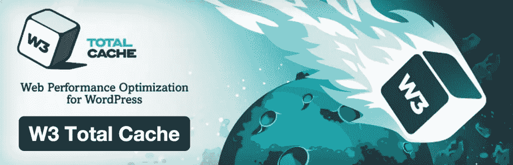
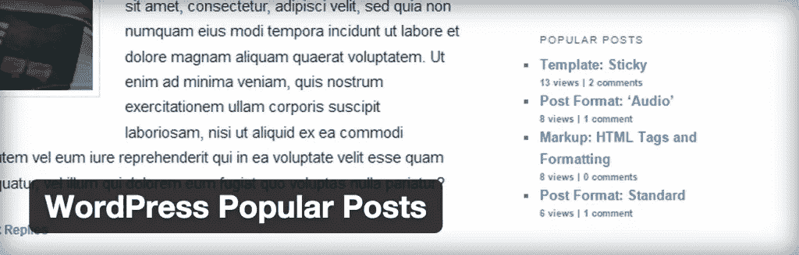

# 用这些顶级插件提升你的 WordPress 功能

> 原文：<https://www.sitepoint.com/boost-wordpress-capabilities-top-plugins/>

WordPress 是网络专业人士和网站开发新手的最爱，因为它易于使用。大量插件确保您能够找到用于常见管理任务的预制工具。

不幸的是， [WordPress 插件目录](https://wordpress.org/plugins/)中列出的许多插件在功能上相互重叠。需要联系方式吗？在该主题上运行查询会产生 775，000 个结果。SEO 怎么样？你会得到 802，000 个结果。

幸运的是，由于 HackerTarget.com 的一篇文章，为你的网站选择合适的插件变得更容易了。这篇文章为读者提供了 Alexa 500k 网站上使用的最流行的 WordPress 插件列表。我们还在 SitePoint 的上一篇文章中讨论了[最受欢迎的 WordPress 插件](https://www.sitepoint.com/wordpress-orgs-most-popular-plugins-for-2014/)，结果与 HackerTarget.com 文章中列出的相似。

以下是按类别细分的顶级插件的汇总，以便您在向网站添加内容时做出明智的决定。

## 网站缓存

缓存是提高 WordPress 速度的重要组成部分，因为它将文章和页面转换成静态内容。如果没有缓存，WordPress 会动态地从数据库中提取内容，然后为访问者组装。

即使在小网站上，由于谷歌将页面速度作为搜索排名的一部分，这一过程导致的延迟也是致命的。大多数用户还会在到达网站的前几秒内对网站进行判断。如果网站不够漂亮，他们就不太可能回来。

### WP 超级缓存

超过一百万的活跃安装， [WP 超级缓存](https://wordpress.org/plugins/wp-super-cache/)是任何希望优化其网站的人的可靠解决方案。然而，这个插件只关注一种类型的缓存——将帖子和页面从动态页面转换为静态页面。

这是一种较老的缓存方法，虽然它仍然有用，但与其他解决方案相比，它有一定的局限性。

### W3 总缓存

如果您需要更高级的缓存功能， [W3 Total Cache](https://wordpress.org/plugins/w3-total-cache/) 是适合您站点的工具。这个插件有超过 900，000 个活跃安装，并被许多大型托管公司推荐，如 Page.ly 和 MediaTemple。Mashable、Yoast 和许多其他网站也使用它。

W3 Total Cache 提供了丰富的功能，例如支持内容交付网络(cdn)、反向缓存集成(例如 Varnish)以及 HTML 和 CSS 的缩小化。

就标准缓存功能而言，W3 Total Cache 支持数据库对象缓存、内存/磁盘缓存、搜索结果缓存(基于查询字符串)以及许多其他设置，以便服务器和最终用户提高速度。

## 搜索引擎优化

### Yoast 的 WordPress SEO

作为 Next Web 和 Mashable 等许多网站的最爱和超过 100 万次的活跃安装， [WordPress SEO by Yoast](https://yoast.com/wordpress/plugins/seo/) 是搜索引擎优化工具的领导者。

最值得注意的是，该工具使得定制内容的关键组件变得更加容易，比如标题和描述标签。Yoast 的 WordPress SEO 也为用户提供了内容分析功能，帮助作者随着时间的推移提高他们的写作能力。

### WordPress 热门帖子

许多内容专业人士经常忽略的一个因素是内容链接的重要性。它有助于推动常青树内容的流量，同时也提高了链接的受欢迎程度。

通过使用 [WordPress 热门帖子](https://wordpress.org/plugins/wordpress-popular-posts/)，你可以将流量导向用户最感兴趣的内容。

## 网站推广和营销

### WordPress 的 MailChimp

尽管市场上有许多电子邮件营销工具，但在这个领域，WordPress 的 MailChimp】处于领先地位，在 WordPress 网站上有超过 200，000 个活跃安装。

他们的免费计划为用户提供每月多达 12，000 封电子邮件，最多 2，000 名订户，无需任何信用卡。这是一个测试电子邮件营销的好方法，不用担心它的技术问题。

### 简单的社交图标

提高文章受欢迎程度的最好方法之一就是让用户尽可能容易地分享你的内容。这就是简单的社交图标可以帮你的地方。

虽然社交分享插件多如牛毛，但这个插件很突出，因为它在超过 100，000 个网站上使用。不像大多数插件只是简单地在你的网站上插入预先制作的图标，简单的社交图标允许你定制图标来满足你的设计需求。

## 通用设施

### 喷气背包

WordPress 的瑞士军刀， [Jetpack](http://jetpack.me) 由 Automattic 创建，用于将 WordPress.com 托管网站的功能集成到自托管的 WordPress 安装中。这个工具安装在超过一百万个网站上，是 WordPress 社区的最爱。

Jetpack 的显著特性包括:反垃圾邮件保护、正常运行时间监控、单点登录和各种改善用户体验和参与度的工具。Jetpack 继续改进和增加新功能，如果你想更详细地了解一下，这里有一个关于 Jetpack 的[便捷指南。](https://www.sitepoint.com/a-guide-to-jetpack/)

### 谷歌分析器

即时访问您的网站统计数据对于保持竞争优势至关重要。 [Google Analyticator](https://wordpress.org/plugins/google-analyticator/) 拥有超过 400，000 个活跃安装，允许您从中央位置添加 Google Analytics 脚本，从而在您的网站上启用 Google Analytics。

除了简化您的分析整合，这个插件还为您提供了一个分析面板，网站速度跟踪，隐藏管理访问从您的网站统计，和先进的可定制的控制。

### 很多选择

仅仅因为一个插件没有出现在这个列表中，并不意味着你应该改变你网站上使用的工具。一般来说，除非您的现有系统遇到了重大问题，或者正在寻找更高级的功能，否则进行转换可能值得一试。

在切换任何插件之前，你应该确保你知道如何正确地配置它们以最小化负面影响。

## 分享这篇文章