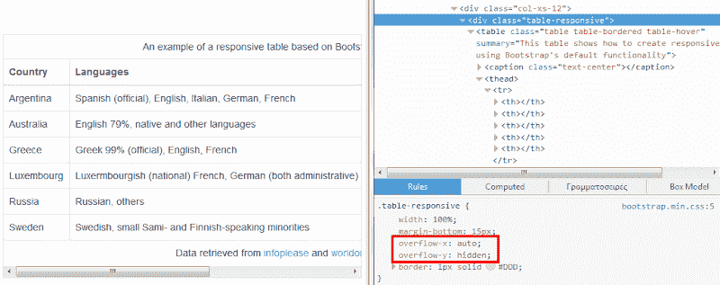
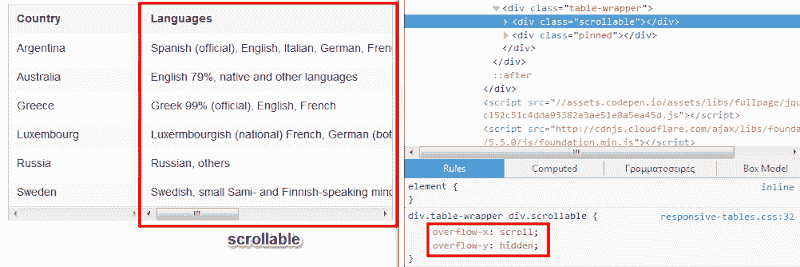
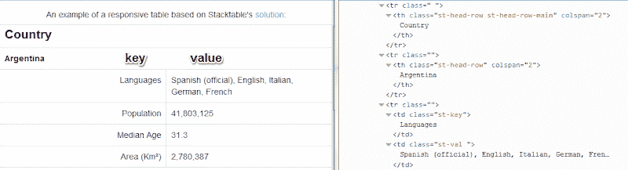
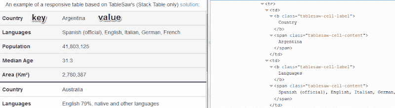
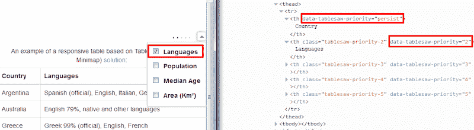
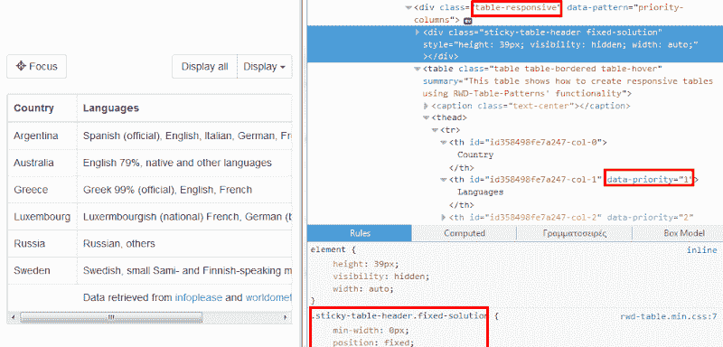
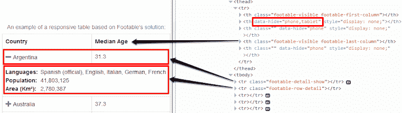
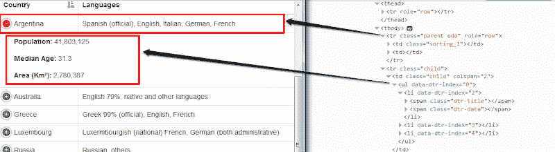

# 响应式数据表:全面的解决方案列表

> 原文：<https://www.sitepoint.com/responsive-data-tables-comprehensive-list-solutions/>

表格是 HTML 的重要组成部分。虽然它们在过去经常被用于布局，但今天它们主要用于标记数据。自从采用响应式 web 设计以来，已经开发了各种方法来建立可以在不同视区大小中很好缩放的表格。

在本文中，我将回顾并分析其中的许多方法。请记住，我将主要关注基于 JavaScript 的解决方案，因为我认为与纯 CSS 解决方案相比，它们提供了更多的选项和功能。为了使事情更简单明了，这篇文章充满了有用的图片和演示。

## 我们表格的基本标记

在深入研究核心方法之前，让我们先看一下本文中使用的示例表，它演示了实现响应式表的不同方法:

```
<table summary="Example table">
  <caption>Example Table Caption</caption>
  <thead>
    <tr>
      <th>Country</th>
      <th>Languages</th>
      <th>Population</th>
      <th>Median Age</th>
      <th>Area (Km²)</th>
    </tr>
  </thead>
  <tbody>
    <tr>
      <td>Argentina</td>
      <td>...</td>
      <td>...</td>
      <td>...</td>
      <td>...</td>
    </tr>
    <!-- more rows here... -->
  </tbody>
  <tfoot>
    <tr>
      <td colspan="5">
      <!-- content here... -->
      </td>
    </tr>
  </tfoot>
</table>
```

请注意，除了基础示例之外，该表的样式将基于 [Bootstrap 的表样式](http://getbootstrap.com/css/#tables)。

现在让我们熟悉一下构建响应式表的不同技术。

## [引导程序的响应表](http://getbootstrap.com/css/#tables-responsive)

为了用[引导](http://getbootstrap.com/)创建一个响应式表格，你必须用一个类`table-responsive`将表格包装在一个`div`元素中。默认情况下，Bootstrap 将`overflow-x: auto`属性应用于这个包装器元素。当浏览器窗口小于 768px 时，应用`overflow-y: hidden`属性。因此，在小型设备上，您可以通过水平滚动来查看表格的内容。

下面的屏幕截图展示了上述内容:



[**使用自举**](http://codepen.io/SitePoint/pen/raXdwZ) 查看 CodePen 演示

## [基金会响应表](http://zurb.com/playground/responsive-tables)

[Foundation](http://foundation.zurb.com/) 为创建响应式表格提供了一种有趣的方式。正如您在下一个截图中看到的，在小型设备(< 767px)上，第一列(即国家)固定在表格的左侧，而其他列可以水平滚动:



这个解决方案不是 Foundation 默认包的一部分，所以如果你想把它包含在你的项目中，你应该从[相应的页面](http://zurb.com/playground/responsive-tables)下载所需的 JavaScript 和 CSS 文件。然后，您所要做的就是将`responsive`类添加到您的表中。

[**查看 CodePen 使用基础演示**](http://codepen.io/SitePoint/pen/LEwdjw)

## [Stacktable.js](http://johnpolacek.github.io/stacktable.js/)

js 是一个 jQuery 插件，可以在小屏幕上改变表格的布局。根据浏览器视口的不同，它会在两个表之间切换，即原始表和它的副本。后者是键/值表，其中键是列名，值是行的相关值。如下面的屏幕截图所示，除了第一列之外，所有列都会出现这种情况:



js 插件需要 jQuery、一个 JavaScript 文件和一个简单的 CSS 文件。将这些文件添加到项目中后，只需在所需的表上调用插件。默认情况下，当视口宽度小于或等于 800 像素时，初始表格是隐藏的。但是，如果你想，你可以很容易地定制。

[**使用 stacktable.js**](http://codepen.io/SitePoint/pen/QwemaO) 查看 CodePen 演示

## [表锯](https://github.com/filamentgroup/tablesaw)

Tablesaw 是一组 jQuery 插件，用于由[灯丝组](http://www.filamentgroup.com/)构建的响应式表。让我们仔细看看其中的一些插件。

与上面描述的 Stacktable.js 插件类似，但不要与它混淆，Tablesaw 提供了自己的实现，通过一个名为 Stacktable 的插件来创建键/值表。它看起来是这样的:



要使用这个插件，您必须获取所需 JavaScript 和 CSS 文件的副本，并将它们包含在您的项目中。然后，将`tablesaw`和`tablesaw-stack`类以及`data-tablesaw-mode="stack"`属性添加到所需的表中。当视窗宽度小于 640 像素时，您的表格将针对响应布局进行优化。

[**使用 Tablesaw**](http://codepen.io/SitePoint/pen/azeYqx) 查看 CodePen 演示

但是 Tablesaw 的插件可以做的更多！首先，[切换插件](https://github.com/filamentgroup/tablesaw#toggle)帮助你选择你想要在不同大小上显示的列。[迷你地图插件](https://github.com/filamentgroup/tablesaw#add-a-mini-map_)让用户清楚地看到可见和隐藏的柱子。

同样，你必须下载必要的文件(如`tablesaw.bare.css`)。下一步，选择显示列的断点。为此，将`data-tablesaw-priority`属性添加到您的表格标题中，并将所需的数字或关键字作为值。这里有一个例子:



最后，通过为表设置相关的类和属性来调用插件的功能:

```
<table data-tablesaw-mode="columntoggle" data-tablesaw-minimap>
    <!--content-->
</table>
```

[**使用带开关的 Tablesaw 和迷你地图**](http://codepen.io/SitePoint/pen/PwMReW) 查看 CodePen 演示

## [RWD 表格模式](http://gergeo.se/RWD-Table-Patterns/)

RWD 表格模式是表格锯方法的另一种实现方式(见上一节)。此外，它被设计为与 Bootstrap 一起使用，但是可以随意地为不同的框架定制它。

在尝试使用该插件之前，请确保您已经成功地将所有必需的依赖项添加到项目中。您可以通过设置 Bootstrap 的结构来初始化它(参见上面的 Bootstrap 部分),然后将`data-pattern="priority-columns"`属性分配给包装器元素。还有一个选项可以指定断点，在断点处你的表将是可见的。为此，将`data-priority`属性添加到带有所需值的表头。插件是这样工作的:



此外，默认情况下，表格标题是固定的。缩小视窗进行测试！

[**使用 RWD 表格模式**](http://codepen.io/SitePoint/pen/OPKvwm) 查看 CodePen 演示

## [脚踏](http://fooplugins.com/plugins/footable-jquery/)

FooTable 是另一个出色的解决方案，可以有效地在不同的屏幕尺寸上缩放表格。它可选地提供有用的附加组件，如过滤、排序和分页。除了 jQuery 版本，还有一个 WordPress 插件版本。

和往常一样，在使用 FooTable 之前，你必须下载所需的文件。你可以通过访问[Footable GitHub 库](https://github.com/fooplugins/FooTable)来实现。

为此，首先将`footable`类分配给所需的表，然后通过 JavaScript 初始化插件。您可以选择自定义隐藏列的断点。这可以通过将`data-hide`属性添加到具有默认值(例如`phone,tablet`)或自定义关键字的相应表头来实现。下面的截图让你知道它是如何工作的。



还要注意，断点是基于表格宽度的。如果你想使用视口宽度，你必须修改[配置对象](https://github.com/fooplugins/FooTable/issues/165)。

[**使用 FooTable**](http://codepen.io/SitePoint/pen/azeYag) 查看 CodePen 演示

## [数据表](https://datatables.net/extensions/responsive/)

DataTables 是一个众所周知的 jQuery 插件，对任何想使用 HTML 表格的人都很有用。除了其核心的强大功能之外，它还提供了一个扩展，允许您构建响应式表。根据您的前端框架，需要不同的样式资产将插件集成到您的项目中。

例如，一个基于 Bootstrap 的项目需要依赖关系，这些依赖关系可以在这个位置找到[。下载完成后，您可以通过将`dt-responsive`类添加到相应的表中并调用其上的扩展来初始化响应行为。](https://datatables.net/extensions/responsive/examples/styling/bootstrap.html)

请记住，插件会执行一个[自动列隐藏](http://datatables.net/extensions/responsive/examples/display-control/auto.html)，但是您也可以应用[您自己的定制](http://datatables.net/extensions/responsive/examples/display-control/classes.html)。下面是基于 DataTable 解决方案的表的外观:



[**使用数据表查看 CodePen 演示**](http://codepen.io/SitePoint/pen/xbvWQv)

## 纯 CSS 解决方案

正如您可能注意到的，上面介绍的所有解决方案(除了 Bootstrap 的方法)都是基于 JavaScript 或 jQuery 的。然而，也有太多有趣的简单 CSS 方法。下面的列表总结了一些最受欢迎的方法:

*   [Chris Coyier 的响应式数据表](https://css-tricks.com/responsive-data-tables/)
*   [David Bushell 的响应式表格](http://dbushell.com/demos/tables/rt_05-01-12.html)
*   Geoffrey Rose 创建响应式表格(使用 Sass Mixin)
*   [RWD 列表由 Geoff Yuen 制作](http://codepen.io/geoffyuen/pen/FCBEg)

值得一提的是，其中一些是开发上述大多数基于 JavaScript 的解决方案的基础。

## 选择正确的方法

此时，您可能想知道应该使用这些技术/插件中的哪一个。这个问题没有正确答案。在决定之前，你必须考虑不同的因素。例如:

*   您的数据类型及其大小/长度。例如，假设您有包含许多列的表。在这种情况下，您可能希望避免水平滚动。
*   您需要简单的还是更复杂的解决方案？您对过滤和/或排序等功能感兴趣吗？
*   您的数据是否来自外部数据源(例如 web 服务)？

## 结论

在本文中，我介绍了针对小型设备优化表的不同方法。我希望这有助于您扩展知识和理解可用的解决方案。如果你曾经使用过我这里没有提到的其他技术，请在下面的评论中告诉我们。此外，我鼓励您看看关于同一主题的其他两个有价值的资源:

*   [关于 CSS-Tricks 的响应数据表综述](https://css-tricks.com/responsive-data-table-roundup/)
*   Exis Web 上的 10 多个响应式数据表解决方案

最后，我们用这篇文章中的所有演示创建了一个代码笔集合 ，所以如果你愿意，你可以查看一下。

## 分享这篇文章