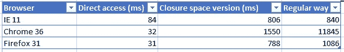
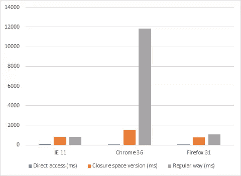
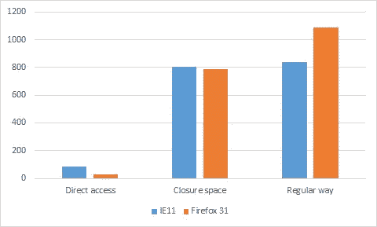
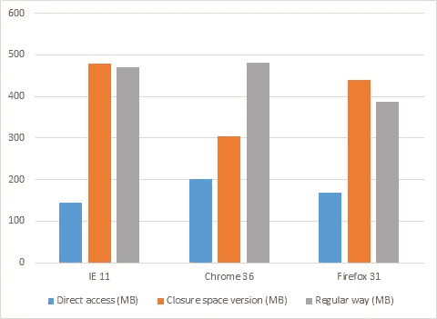

# 使用闭包空间在 JavaScript 中创建真正的私有成员

> 原文：<https://www.sitepoint.com/using-closure-space-create-real-private-members-javascript/>

本文是微软网站开发技术系列的一部分。感谢您对使 SitePoint 成为可能的合作伙伴的支持。

我最近开发了 [Angular 云数据连接器](http://angularclouddataconnector.codeplex.com/?WT.mc_id=13389-DEV-sitepoint-article13)，它使 Angular 开发者能够使用云数据，特别是 [Azure 移动服务](http://channel9.msdn.com/Series/Windows-Azure-Mobile-Services?WT.mc_id=13389-DEV-sitepoint-article13)，使用像 indexed DB 这样的 web 标准。我试图为 JavaScript 开发人员创建一种将私有成员嵌入到对象中的方法。我在这个具体案例中的技巧是使用我称之为“闭包空间”的东西。在本教程中，我想和你分享如何在你自己的项目中使用它，以及主流浏览器对性能和内存的影响。

但是在深入研究之前，让我来分享一下为什么你可能需要私有成员，以及一种替代的“模拟”私有成员的方法。

如果你想讨论这篇文章，请随时在推特上给我发短信。

## 为什么使用私有成员

使用 JavaScript 创建对象时，可以定义值成员。如果您想要控制对它们的读/写访问，您需要可以这样定义的访问器:

```
var entity = {};
entity._property = 'hello world';
Object.defineProperty(entity, 'property', {
  get: function () { return this._property; },
  set: function (value) {
    this._property = value;
  },
  enumerable: true,
  configurable: true
});
```

这样，您可以完全控制读写操作。问题是 *_property* 成员还是可以访问的，可以直接修改。

这就是为什么您需要一种更健壮的方法来定义只能由对象的函数访问的私有成员。

## 使用闭合空间

解决方法是使用闭包空间。每当一个内部函数从一个外部函数的作用域中访问变量时，浏览器就会为您构建这个内存空间。这有时会很棘手，但对于我们的主题来说，这是一个完美的解决方案。

因此，让我们修改前面的代码来使用这个特性:

```
var createProperty = function (obj, prop, currentValue) {
  Object.defineProperty(obj, prop, {
    get: function () { return currentValue; },
    set: function (value) {
      currentValue = value;
    },
    enumerable: true,
    configurable: true
  });
}

var entity = {};
var myVar = 'hello world';
createProperty(entity, 'property', myVar);
```

在这个例子中，`createProperty`函数有一个`currentValue`变量，`get`和`set`函数可以看到。这个变量将被保存在`get`和`set`函数的闭包空间中。现在只有这两个函数可以看到并更新`currentValue`变量！任务完成！

这里我们唯一需要注意的是，源值(`myVar`)仍然是可访问的。因此，我们推出了另一个更加强大的保护版本:

```
var createProperty = function (obj, prop) {
  var currentValue = obj[prop];
  Object.defineProperty(obj, prop, {
    get: function () { return currentValue; },
    set: function (value) {
      currentValue = value;
    },
    enumerable: true,
    configurable: true
  });
}

var entity = {
  property: 'hello world'
};

createProperty(entity, 'property');
```

使用这种方法，甚至源值也会被析构。任务圆满完成！

## 性能考虑因素

现在让我们来看看性能。

显然，闭包空间甚至属性比仅仅一个普通变量更慢更昂贵。这就是为什么本文更关注常规方法和闭包空间技术之间的区别。

为了确认闭包空间方法与标准方法相比并不太昂贵，我编写了这个小基准:

```
<!DOCTYPE html>
<html xmlns='https://www.w3.org/1999/xhtml'>
<head>
  <title>Benchmark</title>
  <style> html {
      font-family: 'Helvetica Neue', Helvetica;
    } </style>
</head>
<body>
  <div id='results'>Computing...</div>
  <script> var results = document.getElementById('results');
    var sampleSize = 1000000;
    var opCounts = 1000000;
    var entities = [];

    setTimeout(function () {
      // Creating entities
      for (var index = 0; index < sampleSize; index++) {
        entities.push({
          property: 'hello world (' + index + ')'
        });
      }

      // Random reads
      var start = new Date().getTime();
      for (index = 0; index < opCounts; index++) {
        var position = Math.floor(Math.random() * entities.length);
        var temp = entities[position].property;
      }
      var end = new Date().getTime();

      results.innerHTML = '<strong>Results:</strong><br>Using member access: <strong>' + (end - start) + '</strong> ms';
    }, 0);

    setTimeout(function () {
      // Closure space
      var createProperty = function (obj, prop, currentValue) {
        Object.defineProperty(obj, prop, {
          get: function () { return currentValue; },
          set: function (value) {
            currentValue = value;
          },
          enumerable: true,
          configurable: true
        });
      }
      // Adding property and using closure space to save private value
      for (var index = 0; index < sampleSize; index++) {
        var entity = entities[index];
        var currentValue = entity.property;
        createProperty(entity, 'property', currentValue);
      }

      // Random reads
      var start = new Date().getTime();
      for (index = 0; index < opCounts; index++) {
        var position = Math.floor(Math.random() * entities.length);
        var temp = entities[position].property;
      }
      var end = new Date().getTime();

      results.innerHTML += '<br>Using closure space: <strong>' + (end - start) + '</strong> ms';
    }, 0);

    setTimeout(function () {
      // Using local member
      // Adding property and using local member to save private value
      for (var index = 0; index < sampleSize; index++) {
        var entity = entities[index];

        entity._property = entity.property;
        Object.defineProperty(entity, 'property', {
          get: function () { return this._property; },
          set: function (value) {
            this._property = value;
          },
          enumerable: true,
          configurable: true
        });
      }

      // Random reads
      var start = new Date().getTime();
      for (index = 0; index < opCounts; index++) {
        var position = Math.floor(Math.random() * entities.length);
        var temp = entities[position].property;
      }
      var end = new Date().getTime();

      results.innerHTML += '<br>Using local member: <strong>' + (end - start) + '</strong> ms';
    }, 0); </script>
</body>
</html>
```

我创建了一百万个对象，都有一个属性`member`。然后我做三个测试:

*   一百万次对财产的随机访问

*   一百万次对“封闭空间”版本的随机访问

*   一百万次对常规 get/set 版本的随机访问

下面是详细说明结果的表格和图表:





我们可以看到闭包空间版本总是比普通版本更快，根据浏览器的不同，这可能是一个非常令人印象深刻的优化。

Chrome 性能比我预期的差。可能有一个错误，所以可以肯定的是，我联系了谷歌的团队，以找出发生了什么。如果你想在微软的 Windows 10 新浏览器 Spartan 项目中测试这一点的表现，你可以在[这里](http://insider.windows.com/?WT.mc_id=13389-DEV-sitepoint-article13)T4 下载。

使用闭包空间甚至属性可能比直接访问成员慢十倍。所以要小心谨慎地使用它。



## 内存占用

我们还必须检查这项技术是否消耗了太多的内存。为了对内存进行基准测试，我编写了这三小段代码:

#### 参考码

```
var sampleSize = 1000000;
var entities = [];

// Creating entities
for (var index = 0; index < sampleSize; index++) {
  entities.push({
    property: 'hello world (' + index + ')'
  });
}
```

#### 普通交易

```
var sampleSize = 1000000;
var entities = [];

// Adding property and using local member to save private value
for (var index = 0; index < sampleSize; index++) {
  var entity = {};

  entity._property = 'hello world (' + index + ')';
  Object.defineProperty(entity, 'property', {
    get: function () { return this._property; },
    set: function (value) {
      this._property = value;
    },
    enumerable: true,
    configurable: true
  });

  entities.push(entity);
}
```

#### 封闭空间版本

```
var sampleSize = 1000000;
var entities = [];

var createProperty = function (obj, prop, currentValue) {
  Object.defineProperty(obj, prop, {
    get: function () { return currentValue; },
    set: function (value) {
      currentValue = value;
    },
    enumerable: true,
    configurable: true
  });
}

// Adding property and using closure space to save private value
for (var index = 0; index &amp;amp;lt; sampleSize; index++) {
  var entity = {};
  var currentValue = 'hello world (' + index + ')';
  createProperty(entity, 'property', currentValue);

  entities.push(entity);
}
```

然后，我运行了所有三个代码示例，并启动了嵌入式内存分析器(这里的示例使用 F12 工具):


以下是我在电脑上得到的结果:



比较闭包空间和常规方式，只有 Chrome 的闭包空间版本的结果稍好。IE11 和 Firefox 使用更多的内存，但浏览器是相似的——用户可能不会注意到现代浏览器之间的差异。

## JavaScript 的更多实践

这可能会让你感到惊讶，但是微软有许多关于开源 JavaScript 主题的免费课程，随着 [Project Spartan 即将到来](http://blogs.msdn.com/b/ie/archive/2015/02/26/a-break-from-the-past-the-birth-of-microsoft-s-new-web-rendering-engine.aspx?WT.mc_id=13389-DEV-sitepoint-article13)，我们正在努力创造更多的课程。查看我自己的:

*   [web GL 3D 和 HTML5 以及巴比伦介绍。JS](http://www.microsoftvirtualacademy.com/training-courses/introduction-to-webgl-3d-with-html5-and-babylon-js?WT.mc_id=13389-DEV-sitepoint-article13)

*   [用 ASP.NET 和安古拉杰构建单页应用](http://channel9.msdn.com/Events/Build/2014/3-644?WT.mc_id=13389-DEV-sitepoint-article13)

*   [HTML 中的前沿图形](http://channel9.msdn.com/events/Build/2014/3-558?WT.mc_id=13389-DEV-sitepoint-article13)

或者我们团队的学习系列:

*   [让你的 HTML/JavaScript 更快的实用性能技巧](http://channel9.msdn.com/Series/Practical-Performance-Tips-to-Make-Your-HTMLJavaScript-Faster/06?WT.mc_id=13389-DEV-sitepoint-article13)(从响应式设计、休闲游戏到性能优化的七部分系列)

*   现代网络平台快速启动(HTML、CSS 和 JS 的基础)

*   [使用 HTML 和 JavaScript JumpStart 开发通用 Windows 应用](http://www.microsoftvirtualacademy.com/training-courses/developing-universal-windows-apps-with-html-and-javascript-jump-start?WT.mc_id=13389-DEV-sitepoint-article13)(使用您已经创建的 JS 来构建应用)

以及一些免费工具: [Visual Studio 社区](https://www.visualstudio.com/en-us/products/visual-studio-community-vs?WT.mc_id=13389-DEV-sitepoint-article13)、 [Azure 试用版](http://azure.microsoft.com/en-us/pricing/free-trial/?WT.mc_id=13389-DEV-sitepoint-article13)，以及[针对 Mac、Linux 或 Windows 的跨浏览器测试工具](http://modern.ie/?utm_source=SitePoint&utm_medium=content&utm_campaign=article13)。

## 结论

如您所见，闭包空间属性是创建真正私有数据的好方法。您可能不得不处理内存消耗的少量增加，但从我的角度来看，这是相当合理的(以这种代价，您可以比使用常规方法获得更大的性能提升)。

顺便说一下，如果你想亲自尝试，请在这里找到所有使用的代码。这里有一个关于 Azure 移动服务[的很好的“操作指南”。](http://channel9.msdn.com/Series/Windows-Azure-Mobile-Services?WT.mc_id=13389-DEV-sitepoint-article13)

本文是微软网站开发技术系列的一部分。我们很高兴与你分享斯巴达项目的[和它的](http://blogs.msdn.com/b/ie/archive/2015/01/22/project-spartan-and-the-windows-10-january-preview-build.aspx?WT.mc_id=13389-DEV-sitepoint-article13)[新渲染引擎](http://blogs.msdn.com/b/ie/archive/2015/02/26/a-break-from-the-past-the-birth-of-microsoft-s-new-web-rendering-engine.aspx?WT.mc_id=13389-DEV-sitepoint-article13)。在 [modern 获得免费虚拟机或在您的 Mac、iOS、Android 或 Windows 设备上进行远程测试。即](http://modern.ie/?utm_source=SitePoint&utm_medium=content&utm_campaign=article13)。

## 分享这篇文章