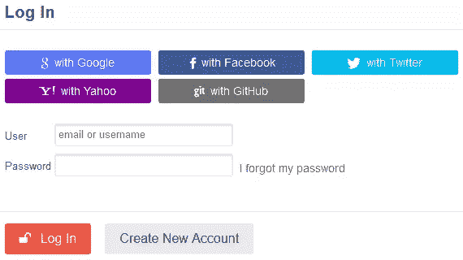

# 使用 HybridAuth 的 PHP 社交登录

> 原文：<https://www.sitepoint.com/social-logins-php-hybridauth/>

当今许多网站的一个趋势是允许用户通过他们的社交网络账户登录。一个经典的例子是 [SitePoint 社区](https://community.sitepoint.com/)，用户可以选择使用他们的脸书、推特、谷歌、雅虎或 GitHub 账户登录，而无需注册账户。



在本教程中，我们将学习[hybrid auth](http://hybridauth.sourceforge.net/index.html)——一个 PHP 库，它消除了构建社交登录功能的痛苦。

HybridAuth 充当您的应用程序与各种社交 API 和身份提供者之间的抽象 API。

## 装置

建议通过 Composer 安装 HybridAuth。我们还将使用 Slim 作为示例应用程序的基础。

```
{
    "require": {
        "slim/slim": "2.*",
        "hybridauth/hybridauth": "2.3.0"
    }
}
```

## 使用 HybridAuth 进行社交登录

要使用 HybridAuth，请将`/vendor/hybridauth/hybridauth/hybridauth`中的`config.php`和`index.php` (HybridAuth 端点)文件复制到项目的根文件夹中。

将`index.php`文件重命名为`hybrid.php`,因为`index.php`将被 Slim framework 用于我们的演示应用程序逻辑。

用您的应用程序(例如，[脸书](https://developers.facebook.com/)、[推特](https://dev.twitter.com/)应用程序)的凭证填充`config.php`文件。

例如，如果你想让用户通过脸书、谷歌和推特登录你的网站；您的配置文件看起来很像这样。我的申请网址是`http://slim.local`。

```
return 
	[
	    "base_url"   => "http://slim.local/",
	    "providers"  => [
	        "Google"   => [
	            "enabled" => true,
	            "keys"    => [ "id" => "", "secret" => "" ],
	        ],
	        "Facebook" => [
	            "enabled"        => true,
	            "keys"           => [ "id" => "", "secret" => "" ],
	            "trustForwarded" => false
	        ],
	        "Twitter"  => [
	            "enabled" => true,
	            "keys"    => [ "key" => "", "secret" => "" ]
	        ],
	    ],
	    "debug_mode" => true,
	    "debug_file" => "bug.txt",
	];
```

**注意:**`base_url`参数必须指向 HybridAuth 端点文件，在我们的例子中是`hybrid.php`。

更多信息见 [HybridAuth 配置文件](http://hybridauth.sourceforge.net/userguide/Configuration.html)。

接下来，要求供应商自动加载程序并实例化该类。

```
require 'vendor/autoload.php';
$hybridauth = new Hybrid_Auth( 'config.php' );
```

使用`authenticate`方法向给定的提供者认证用户。

对于脸书:

```
$adapter = $hybridauth->authenticate( "Facebook" );
```

对于 Twitter:

```
$adapter = $hybridauth->authenticate( "Twitter" );
```

对于谷歌:

```
$adapter = $hybridauth->authenticate( "Google" );
```

传递给`authenticate()`的参数必须与`config.php`文件中的提供者数组键匹配。

认证后，使用`getUserProfile()`方法检索用户的配置文件数据。

```
$user_profile = $adapter->getUserProfile();
```

`$user_profile`变量将是一个包含用户返回的个人资料数据的对象。

### 更多的社会提供者

要添加更多的提供者到现有的提供者中，比如 GitHub，将`GitHub.php`文件从`vendor/hybridauth/hybridauth/additional-providers/hybridauth-github/Providers`复制到应用程序中的一个位置(在我们的例子中是`provider`目录)。使用[提供者包装器](http://hybridauth.sourceforge.net/userguide/tuts/specific-provider-wrapper.html)加载文件，其中`path`是 GitHub 文件的路径，`class`是其 PHP 类的名称。

```
"Github"   => [
    "enabled" => true,
    "keys"    => [
        "id"     => "",
        "secret" => ""
    ],
    "wrapper" => [ "path" => "providers/GitHub.php", "class" => "Hybrid_Providers_GitHub" ]
]
```

使用 GitHub 的 HybridAuth 的`autheniticate()`方法对用户进行身份验证，如下所示:

```
$adapter = $hybridauth->authenticate( "Github" );
```

## 社交登录实现

通常，每个有登录和注册系统的网站都使用用户的电子邮件地址或用户名来识别和登录他们的帐户。如果您打算实现社交登录功能，建议不要使用用户的用户名或电子邮件进行身份验证。

反对这种做法的一个原因是，例如 Twitter 不会返回经过他们认证的用户的电子邮件地址。也就是说，返回的配置文件数据不包含用户的电子邮件。

大多数(如果不是全部的话)社交提供商，如脸书、Twitter、谷歌、LinkedIn 甚至 GitHub，都包含一个授权后返回的唯一用户标识号。

不使用用户的电子邮件来登录他们的帐户，而是使用社交提供商返回的标识符，如下所示:如果用户没有帐户，则创建一个用户帐户；如果用户有帐户，则登录到站点。

## 编写演示应用程序

我们将使用 Slim PHP 框架构建一个简单的 web 应用程序，展示如何使用 HybridAuth 实现社交登录的真实示例。

我假设你已经安装了 HybridAuth 和 Slim framework。否则，请参见上面的安装指南。

**应用结构**

```
|-scr/
|----App_Model.php
|-templates/
|----login.php
|----welcome.php
|-vendor/
|-composer.json
|-config.php
|-hybrid.php
|-index.php
|-.htaccess
```

下面是数据库表的 SQL。

```
CREATE TABLE IF NOT EXISTS `users` (
`id` int(10) NOT NULL AUTO_INCREMENT,
PRIMARY KEY  (id),
  `identifier` varchar(50) NOT NULL,
UNIQUE KEY `identifier` (`identifier`),
  `email` varchar(50) DEFAULT NULL,
  `first_name` varchar(20) DEFAULT NULL,
  `last_name` varchar(20) DEFAULT NULL,
  `avatar_url` varchar(255)
) ENGINE=InnoDB;
```

### 编写应用程序模型的代码

应用程序模型的所有代码都应该放在`src`文件夹中的`App_Model.php`文件中。

该文件是命名空间模型，后跟类定义和构造函数。

```
<?php
namespace Model;

class App_Model
{

    /** @var object Database connection */
    private $conn;

    /**
     * Instantiate the model class.
     *
     * @param object $db_connection DB connection
     */
    public function __construct(\PDO $db_connection)
    {
        $this->conn = $db_connection;
    }
```

如果数据库中已经存在一个标识符(用户标识号),则`identifier_exists`方法返回 true，否则返回 false。

```
/**
     * Check if a HybridAuth identifier already exists in DB
     *
     * @param int $identifier
     *
     * @return bool
     */
    public function identifier_exists($identifier)
    {
        try {
            $sql    = 'SELECT identifier FROM users';
            $query  = $this->conn->query($sql);
            $result = $query->fetchAll(\PDO::FETCH_COLUMN, 0);

            return in_array($identifier, $result);
        } catch ( \PDOException $e ) {
            die( $e->getMessage() );
        }

    }
```

方法`register_user`将用户简档数据插入数据库。

```
/**
     * Save users record to the database.
     *
     * @param string $identifier user's unique identifier
     * @param string $email
     * @param string $first_name
     * @param string $last_name
     * @param string $avatar_url
     *
     * @return bool
     */
    public function register_user( $identifier, $email, $first_name, $last_name, $avatar_url )
    {
        try {
            $sql = "INSERT INTO users (identifier, email, first_name, last_name, avatar_url) VALUES (:identifier, :email, :first_name, :last_name, :avatar_url)";

            $query = $this->conn->prepare($sql);
            $query->bindValue(':identifier', $identifier);
            $query->bindValue(':email', $email);
            $query->bindValue(':first_name', $first_name);
            $query->bindValue(':last_name', $last_name);
            $query->bindValue(':avatar_url', $avatar_url);

            return $query->execute();
        } catch (\PDOException $e) {
            return $e->getMessage();
        }

    }
```

调用`login_user`方法时，会将创建的用户会话添加到 HybridAuth 会话中(在提供者成功授权用户时创建)。

```
/**
     * Create user login session
     *
     * @param int $identifier
     */
    public function login_user($identifier)
    {
        \Hybrid_Auth::storage()->set('user', $identifier);
    }
```

当注销链接被点击时，`logout_user`方法删除或破坏用户的会话。

```
/** Destroy user login session */
    public function logout_user()
    {
        \Hybrid_Auth::storage()->set( 'user', null );
    }
```

最后，getter 方法返回用户的名字、姓氏、电子邮件和头像 URL。

```
/**
     * Return user's first name.
     *
     * @param int $identifier
     *
     * @return string
     */
    public function getFirstName( $identifier )
    {
        if ( ! isset( $identifier )) {
            return;
        }
        $query = $this->conn->prepare( "SELECT first_name FROM users WHERE identifier = :identifier" );
        $query->bindParam( ':identifier', $identifier );
        $query->execute();
        $result = $query->fetch( \PDO::FETCH_NUM );

        return $result[0];
    }

    /**
     * Return user's last name.
     *
     * @param int $identifier
     *
     * @return string
     */
    public function getLastName( $identifier )
    {
        if ( ! isset( $identifier )) {
            return;
        }
        $query = $this->conn->prepare( "SELECT last_name FROM users WHERE identifier = :identifier" );
        $query->bindParam( ':identifier', $identifier );
        $query->execute();
        $result = $query->fetch( \PDO::FETCH_NUM );

        return $result[0];
    }

    /**
     * Return user's email address
     *
     * @param int $identifier
     *
     * @return string
     */
    public function getEmail( $identifier )
    {
        if ( ! isset( $identifier )) {
            return;
        }
        $query = $this->conn->prepare( "SELECT email FROM users WHERE identifier = :identifier" );
        $query->bindParam( ':identifier', $identifier );
        $query->execute();
        $result = $query->fetch( \PDO::FETCH_NUM );

        return $result[0];
    }

    /**
     * Return the URL of user's avatar
     *
     * @param int $identifier
     *
     * @return string
     */
    public function getAvatarUrl( $identifier )
    {
        if ( ! isset( $identifier )) {
            return;
        }
        $query = $this->conn->prepare( "SELECT avatar_url FROM users WHERE identifier = :identifier" );
        $query->bindParam( ':identifier', $identifier );
        $query->execute();
        $result = $query->fetch( \PDO::FETCH_NUM );

        return $result[0];
    }
```

通过将下面的代码添加到 composer.json 文件中，为 Model 类注册一个 PSR-4 自动加载器。

```
"autoload": {
        "psr-4": {"Model\\": "src/"}
    }
```

运行`composer dump-autoload`重新生成`vendor/autoload.php`文件。

### 应用程序逻辑

要求 composer 自动加载文件，并在应用程序`index.php`文件中实例化 Slim。

```
require 'vendor/autoload.php';

$app = new \Slim\Slim();
```

创建一个名为 templates 的目录来存储我们所有的模板文件，然后在 Slim 中注册或配置如下:

```
$app->config(
    [
        'templates.path' => 'templates'
    ]
);
```

创建一个瘦数据库单例资源，该资源将在被调用时返回数据库连接实例。

```
// Set singleton value
$app->container->singleton( 'db', function () {
        try {
            $db = new PDO( 'mysql:host=localhost;dbname=hybridauth', 'slim', 'slim',
                [ \PDO::ATTR_PERSISTENT => false ] );
        } catch ( PDOException $e ) {
            die( 'Error!: ' . $e->getMessage() );
        }

        return $db;
    }
);
```

还创建了另一个返回 HybridAuth 实例的单例资源。

```
$app->container->singleton( 'hybridInstance', function () {
    $instance = new Hybrid_Auth('config.php');

    return $instance;
} );
```

通过将数据库连接作为参数传递来实例化应用程序模型类。

```
$model = new \Model\App_Model( $app->db );
```

下面的身份验证功能在作为参数添加到路由时，如果用户没有登录，会将他们重定向到登录页面。

```
$authenticate = function ( $app ) {
    return function () use ( $app ) {
        $app->hybridInstance;
        $session_identifier = Hybrid_Auth::storage()->get( 'user' );

        if (is_null( $session_identifier ) && $app->request()->getPathInfo() != '/login/') {
            $app->redirect( '/login/' );
        }
    };
};
```

当所有注销用户访问应用程序主页或索引页面时，将他们重定向到登录页面。

```
$app->get( '/', $authenticate($app) );
```

下面是社交登录链接的路由定义。即当点击链接[http://slim.local/login/facebook](http://slim.local/login/facebook)时，用户被 HybridAuth 重定向到脸书进行授权。http://slim.local/login/twitter 的推特[、http://slim.local/login/google 的谷歌](http://slim.local/login/twitter)以及其他所有受支持的提供商也是如此。

```
$app->get( '/login/:idp', function ( $idp ) use ( $app, $model ) {
        try {
            $adapter      = $app->hybridInstance->authenticate( ucwords( $idp ) );
            $user_profile = $adapter->getUserProfile();

            if (empty( $user_profile )) {
                $app->redirect( '/login/?err=1' );
            }

            $identifier = $user_profile->identifier;

            if ($model->identifier_exists( $identifier )) {
                $model->login_user( $identifier );
                $app->redirect( '/welcome/' );
            } else {
                $register = $model->register_user(
                    $identifier,
                    $user_profile->email,
                    $user_profile->firstName,
                    $user_profile->lastName,
                    $user_profile->photoURL
                );

                if ($register) {
                    $model->login_user( $identifier );
                    $app->redirect( '/welcome/' );
                }

            }

        } catch ( Exception $e ) {
            echo $e->getMessage();
        }
    }
);
```

调用 HybridAuth `authenticate()`方法将用户重定向到给定的社交提供者。

在成功授权后，变量`$user_profile`被填充以用户简档数据。

调用`identifier_exists()`方法来检查数据库中是否存在用户标识符。如果为 true，则用户登录到该站点。否则，将为用户创建一个帐户，然后用户登录。

这是注销路径的代码。

```
$app->get( '/logout/', function () use ( $app, $model ) {
        $app->hybridInstance;
        $model->logout_user();
        Hybrid_Auth::logoutAllProviders();
        $app->redirect( '/login/' );
    }
);
```

我们在模型类中讨论的`logout_user`方法被调用来销毁用户会话，并且`Hybrid_Auth::logoutAllProviders()`也被调用来将用户从连接的提供者中注销。

用户登录时重定向到的欢迎页面的路由:

```
$app->get( '/welcome/', $authenticate( $app ), function () use ( $app, $model ) {
		$app->render( 'welcome.php', [ 'model' => $model ] );
	}
);
```

最后，运行 Slim 应用程序。

```
// app/index.php
$app->run();
```

完整源代码见应用的 [GitHub repo](https://github.com/sitepoint-editors/HybridAuth-Demo-App) 。

## 结论

在本文中，我们学习了如何使用强大而健壮的 HybridAuth PHP 库将社交登录功能与网站集成。

如果你有任何问题或贡献，请在评论中告诉我们。

## 分享这篇文章