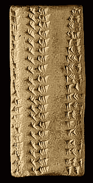
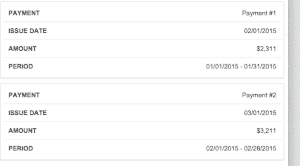
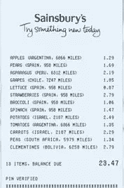
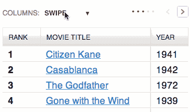

# 古代苏美尔人，平板电脑和 HTML 表格

> 原文：<https://www.sitepoint.com/ancient-sumerians-knew-html-tables/>

这是一块来自古代苏美尔(现代伊拉克)的 5000 年前的泥板。它是已知的最早的文字之一。

我们在看什么？

*   是诗还是歌？
*   也许是宗教教义？
*   也许是日常生活的日记？

不，都不是。即使你在大学里翘了古代苏美尔语课，你也可以*可能*已经猜到我们正在看某种数据表。比毕达哥拉斯或欧几里得早几千年的古代数字运算。

事实上，我们知道苏美尔人在记录方面是个十足的书呆子。我们从 Sumer 上找到的大多数平板电脑都是税务记录、农作物产量、股票清单和普通簿记。我们可能比我们更了解他们的经济，而不是他们的心灵和思想。

有一点是清楚的:几乎从书写发明的那一刻起——甚至在铁、铜或玉米片出现之前——人们就明白了数据表的力量。

表格允许我们的大脑处理比我们内置的“RAM”内存通常允许我们处理的更多的数据。我们知道我们的[短期记忆开始与任何超过 7 个项目](http://www.huffingtonpost.com/jane-g-goldberg-phd/memory-test-_b_801102.html?)的事情斗争，但是表格允许我们一次同时考虑 15、20 甚至 30 个项目。

那是一项非常有用的发明。

### 桌子和手机

最近有一些前端开发人员讨论在较小的屏幕上呈现表格数据的最佳方式。

上周，LivingSocial techblog 发布了一个有趣的新方法，它将每个表格行完全重组为一个较小的独立单元。

肯定有一些场合，这种堆叠技术将是一个伟大的适合。特别是那些*总是*会变短的表格，比如鞋号表或者商店开门时间。

然而，我真的怀疑，当我们选择把它们的骨头熬成肉酱时，我们是否太容易放弃桌子真正的美。

例如，在你的手机上以堆叠视图的形式呈现每月的银行对账单。当你丢失列视图时，定位一个发生在 10 月 14 日的重要交易需要更高的“认知负荷”。

尽管我们的可用屏幕空间更少，但我们已经从呈现单行列标题发展到呈现每条记录的标题——可以想象有几十条记录。

对我来说，这不像是一场胜利。

### 优化的表格

有时，我们可能会发现自己试图通过“电源布局”来解决信息架构问题。您的后端开发人员吐出了 6 列表格数据，所以 6 列就是您要布局的内容！

我认为我们的第一步应该总是试图优化我们放入原始表中的内容。

一些简单的问题是:

*   每个专栏都与移动用户相关吗？例如，在打印的银行对账单上，你每笔交易后的现金状况很有趣，但在手机上，这可能有点过头了。
*   有没有更简洁的方式来交流相同的数据？(也就是说，除了在手机上写“*02/01/2015–02/28/2015*”之外，你还能简单地写“ *Feb* ”？)
*   将精细的细节隐藏在“更多”链接和模态后面有意义吗？例如，在需要时，事务日期单元格可能会链接到详细描述精确事务时间的模型。

为此，想想你每周扔掉的普通购物收据。这通常是优化良好的小格式表格数据的一个很好的例子。

上面塞恩斯伯里的例子轻松地展示了产品、原产国、价格，甚至在一张可能比你的手机还窄的纸条上*它走了多远*。虽然它不太漂亮，但它确实有效地利用了可用空间。

好吧，但是如果你已经优化了你的表，但是你仍然为空间而挣扎呢？

### [Tablesaw](http://www.filamentgroup.com/lab/tablesaw.html) :一个灵活的响应表工具

去年，[灯丝组](http://www.filamentgroup.com/)的马特和扎克发布了[台锯](http://www.filamentgroup.com/lab/tablesaw.html)的代码，这是解决这个问题的一个很好的方法。

虽然 Tablesaw 提供了一个“堆叠”表格视图，但它还提供了另外两个有用的视图。

*   **切换视图**:让您只切换选择想要查看的列。
*   **滑动表**:保持主左栏不动，同时允许你左右滑动以访问其他栏。

虽然没有一种方法适合所有情况，但很难想象有哪种情况是 [Tablesaw](http://www.filamentgroup.com/lab/tablesaw.html) 无法处理的。

[**在这里玩一玩他们的 demo。**](http://filamentgroup.github.io/tablesaw/demo/stack.html)

*原载于[4 月 8 日](https://sitepointdotcom.createsend.com/campaigns/reports/viewCampaign.aspx?d=y&c=07F8D0DDA3BB4029&ID=8C397747830FE1FC&temp=False)SitePoint 设计简讯 *

## 分享这篇文章