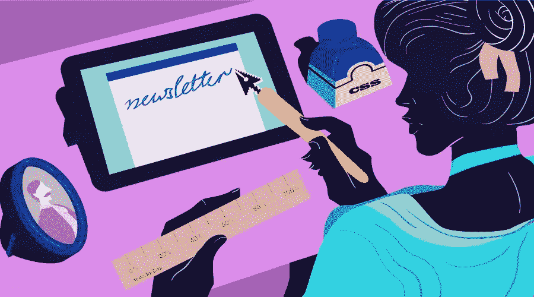

# 如何编码 HTML 电子邮件简讯

> 原文：<https://www.sitepoint.com/how-to-code-html-email-newsletters/>



这篇文章最初发表于 2006 年，然后在 2015 年更新。

自从这篇文章在 2006 年首次发表以来，HTML 电子邮件简讯已经走过了漫长的道路。对于出版商和读者来说，HTML 电子邮件仍然是一个非常成功的沟通媒介。出版商可以跟踪电子邮件的打开率、转发率和点击率，并衡量读者对产品和话题的兴趣；读者看到的信息就像网页一样，比纯文本邮件更具视觉吸引力，也更容易浏览和导航。

对程序员来说，编写一封 HTML 邮件是一个有趣而又实用的问题。与网页编码不同，HTML 电子邮件需要在旧的电子邮件软件上显示良好，比如 Outlook 或 Mac Mail，并适应手机和平板电脑屏幕。我将向您展示如何创建在任何设备上都显示良好的 HTML 电子邮件，以及如何修改您当前的 HTML 电子邮件代码以在手机和平板电脑上显示。

## HTML 电子邮件基础

编写 HTML 电子邮件时最大的痛苦是有太多不同的软件工具可以用来阅读电子邮件，从桌面软件如 Eudora、Outlook、AOL、Thunderbird 和 Lotus Notes，到基于网络的电子邮件服务如 Yahoo！、Hotmail 和 Google Mail，通过电子邮件发送手机和平板电脑上的应用程序。用于为每个电子邮件软件工具渲染 HTML 的软件决定了哪些 HTML 和 CSS 代码有效，哪些无效。

如果你认为很难确保网站的跨浏览器兼容性，请注意这是一个全新的游戏——这些电子邮件软件工具中的每一个都可以以非常不同的方式显示相同的电子邮件。即使这些工具能够正确显示 HTML 格式的电子邮件，考虑到读者阅读邮件时窗口的宽度变化，事情会变得更加棘手。

无论您选择手工编写 HTML 电子邮件(我的个人偏好)还是使用现有的模板，在创建 HTML 电子邮件时，有两个基本概念需要记住:

1.  使用 HTML 表格来控制设计布局和一些演示。你可能习惯于使用纯 CSS 布局来创建网页，但是这种方法在电子邮件环境中是行不通的。
2.  使用内联 CSS 控制电子邮件中的其他显示元素，如背景颜色和字体。

查看 HTML 表格和内联 CSS 如何在 HTML 邮件中交互的最快和最简单的方法是从 [Campaign Monitor](https://www.campaignmonitor.com/email-templates/) 和 [MailChimp](http://templates.mailchimp.com/) 下载一些模板。当您打开其中一个模板时，您会注意到一些我们稍后将详细讨论的内容:

*   CSS 样式声明出现在`body`标签下面，而不是在`head`标签之间。
*   没有使用 CSS 简写:不要使用简写样式规则`font: 12px/16px Arial, Helvetica`，而是应该将这个简写分解成它的单独属性:`font-family`、`font-size`和`line-height`。
*   为了达到特定的效果，很少使用 T0 和 T1，而 HTML 表格完成了大部分的布局工作。
*   CSS 样式声明非常简单，不使用任何 CSS 文件。

我的[代码 HTML 电子邮件网站](http://www.codehtmlemail.com)也有我下载并格式化的实际 HTML 电子邮件，所以你可以研究看看其他人是如何创建电子邮件的。

## 步骤 1:使用 HTML 表格进行布局

没错:桌子回来了，大时代！网络标准可能已经成为网页显示编码的标准，但这不是网络，宝贝。就 CSS 支持而言，一些电子邮件软件客户端远远落后于八球，这意味着如果我们真的希望我们的时事通讯为每个读者一致地显示，我们必须求助于使用表格进行布局(参见本文末尾的阅读列表，获得一些关于邮件客户端 CSS 支持的优秀资源)。

因此，把你的符合标准的最佳实践和精益标记技能放在一边:我们即将弄脏我们的手！

创建 HTML 电子邮件的第一步是决定你想要使用什么样的布局。对于时事通讯来说，单栏和两栏的布局效果最好，因为它们控制了当大量内容被放入像电子邮件这样的小空间时产生的自然混乱。单列电子邮件设计也使得它很容易在手机和平板电脑上显示。

单列布局通常包括:

1.  一个标题，包含一个徽标和一些(或全部)来自父网站的导航链接，以加强品牌效应，让网站访问者熟悉
2.  电子邮件内部链接，链接到电子邮件中出现在故事和内容后面的故事
3.  电子邮件底部的页脚，通常包含与顶部导航相同的链接，以及退订说明

两栏电子邮件也使用页眉和页脚。像两栏网页一样，它们通常使用一个窄的侧栏来存放功能和更多信息的链接，而较宽的栏则存放电子邮件的正文内容。要让一个两栏的电子邮件布局在手机或平板电脑上显示良好，需要一些代码，正如你将在本文后面看到的。

促销邮件遵循类似的规则，但在内容和链接方面要少得多。它们通常包含一两条消息，有时会利用一个大图片，并在图片下方添加小的说明文字和一些链接。

所有这些电子邮件布局的可能性都可以很容易地创建，使用 HTML 表格将空间划分为行和列。事实上，使用 HTML 表格是实现跨不同邮件客户端呈现一致的布局的唯一方法。

无论你的邮件是如何设计的，重要的是要记住最重要的内容应该出现在邮件的顶部或顶部附近，这样当读者打开你的邮件时，你就能立即看到。当人们打开一封电子邮件时，邮件信息的左上角通常是他们首先看的地方。

这是我用来创建 HTML 电子邮件的方法:

*   对于两列布局，为页眉、两个中间内容列和页脚各创建一个表格，总共有三个表格。将这些表包装到另一个容器表中。对单列布局使用相同的方法，但是给内容表一列。如果您的电子邮件设计包含分散在多个表格单元格中的图像，这种方法尤其适用。否则，除了 Lotus Notes 电子邮件软件之外，一个带有标题行(如果设计使用两列，则带有 T1)、内容和页脚的单个表格在其他所有软件中都应该显示良好。
*   使用表格中的属性和`td`标签来控制表格的显示。例如，设置`border="0"`、`valign="top"`、`align="left"`(或者`center`，如果适合设计的话)、`cellpadding="0"`、`cellspacing="0"`等等。这主要帮助老的电子邮件客户端以(勉强)可接受的方式显示电子邮件。
*   即使你的电子邮件的设计不包括表格周围的边框，你可能会发现在开发过程中设置`border="1"`有助于调试由`tr`和`td`标签的内部对齐引起的任何问题。改回`border="0"`测试生产。

虽然这种方法可能会冒犯喜欢使用最新标准进行编码的纯粹主义者，但这是目前唯一可行的方法。但是，我们使用表格进行布局的事实并不意味着我们需要完全采用老派的方法。例如，无论 Lotus Notes 显示 HTML 电子邮件有多糟糕，您都不应该使用`font`标记。虽然 Outlook 2007 的 HTML 呈现引擎并不完美，但它确实可以很好地显示基本的 HTML 表格。

不过，也有一些警告；接下来让我们来看看文本的样式。

## 步骤 2:添加 CSS 样式

我说过邮件客户端对 CSS 的支持很差吗？嗯，确实是。但是，一旦嵌套表格布局就绪，您仍然可以(也应该)将 CSS 用于电子邮件中的样式。有几件事需要注意。以下是我使用的步骤。

首先，使用内联样式存储所有样式信息，如下所示:

```
<p style="color: red;"></p>
```

这包括`table`、`td`、`p`、`a`等等。

不要在 HTML `head`标签中使用 CSS `style`声明，因为在创作网页时可能会用到。相反，将你的`style`声明放在`body`标签的正下方——然而，谷歌邮件会在邮件中寻找任何`style`声明并(有益地)删除它。另外，不要费心使用`link`元素来引用外部样式表:Google Mail、Hotmail 和其他电子邮件软件会忽略、修改或删除这些对样式表的外部引用。

对于包含页眉、内容和页脚的容器表格，将表格宽度设置为 98%。原来雅虎！mail 需要两边各有 1%的缓冲空间来正确显示邮件。如果侧边空白对你的邮件设计至关重要，将宽度设置为 95%甚至 90%以避免潜在的问题。当然，容器表中的表应该设置为 100%。

将一般字体样式信息放在最接近内容的表格`td`中。是的，这会导致在多个`td`单元格中重复的样式声明。仅在必要时将字体样式定义放入标题(如`h1`、`h2`、`p`或`a`标签中。

在表格的`td`单元格中，尽量少用`div`将小盒子的内容和链接浮动到左边或右边。例如，Google Mail 似乎忽略了 CSS float 声明(然而 Yahoo！而 Hotmail 处理得很好)。有时，编写一个更复杂的表布局比依赖 float 声明更好。或者，由于电子邮件太容易变得杂乱，让你的设计师把浮动内容放在窄边栏里。对浮动的不稳定支持是一个可能导致电子邮件设计返工的问题。

虽然`div`看起来没什么用，但是`span`几乎每次都有效，因为它们是内联元素。在某些情况下，`span`不仅可以用来给文本着色或调整大小:它们还可以用来将文本置于内容之上或之下。

请注意，一些电子邮件发送服务会将样式定义解包，以使它们更明确，因此更易于所有电子邮件软件阅读。例如，CSS 简写`style="margin: 10px 5px 10px 0;"`可以扩展成前面显示的长样式声明。测试每封电子邮件，看看电子邮件代码会发生什么变化。从 CSS 速记开始，因为在最坏的情况下，它似乎可以很好地与所有的电子邮件软件一起工作。

如果你已经从 Campaign Monitor 和 MailChimp 下载并研究了电子邮件模板，你会发现它们将容器表视为`html` `body`标签。Campaign Monitor 团队将此表称为“BodyImposter”，这是考虑框架或包装表的一个好方法。从 CSS 的角度来看，如果像 Google Mail 这样的服务没有禁用或忽略`body`标签，容器表会做`html` `body`元素会做的事情。

## 步骤 3:采用最佳实践

知道你已经使用我建议的指导方针创建了有效的 HTML 电子邮件只是解决方案的一部分——有几个最佳实践你应该遵循以确保你的电子邮件被很好地接收。

下一步是在各种电子邮件客户端测试你的 HTML 电子邮件。通常这将确定需要解决的问题。

首先要使用的测试工具是 Firefox 和 Internet Explorer web 浏览器。如果电子邮件在两种浏览器中都显示良好或完美，那么很有可能在 Outlook、Yahoo！、谷歌邮件和其他服务只会暴露一些小问题。如果可能的话，我还建议在 Internet Explorer 6 中测试您的电子邮件——这应该可以让您很好地了解您的电子邮件在 Outlook 2003 中的呈现方式(有关运行 Internet Explorer 6 的信息，请参考本文末尾的资源列表)。最后，为了测试电子邮件在 iPhone 或 iPad 上的外观，请在 Safari 网络浏览器中查看您的 HTML 电子邮件。

一旦电子邮件在这两个浏览器中显示正常，使用电子邮件发送服务将电子邮件发送到一系列测试电子邮件帐户。理想情况下，这应该包括与雅虎的帐户！、Hotmail 和 Google 邮件服务。当然，你使用的测试账户应该由接收邮件的人的邮件列表中的域名决定。例如，如果这个列表中没有 AOL 的用户，那么建立和测试一个 AOL 电子邮件帐户可能是浪费时间和金钱。

以下是我在测试阶段发现的最常见的代码调整:

*   有时，需要从百分比宽度切换到固定宽度。虽然这并不理想——因为读者可以在阅读时调整电子邮件窗口的大小，有时，使用固定宽度是在多个电子邮件客户端中正确显示布局的唯一方式。
*   如果电子邮件设计中的列有间距问题，首先调整 HTML 表格的`cellpadding`和`cellspacing`属性。如果这不起作用，应用 CSS `margin`和`padding`属性。HTML 间距与旧的电子邮件软件配合使用效果更好。
*   当一个`td`单元格在一个`img`标签的正下方关闭时，可能会发生图像位移。这是一个古老的 HTML 问题。将`</td>`标签放在`img`标签之后(同一行),消除了令人烦恼和困惑的 1 像素差距。

此外，建议采用以下最佳实践:

*   避免使用 JavaScript。大多数电子邮件软件都会禁用它。
*   如果一个图像被分割并分布在几个 HTML 表格单元格中，使用多个测试帐户测试电子邮件。有时，它在 Outlook 中看起来很棒，但在 Hotmail 和其他服务中会偏移一个或多个像素。还可以考虑在一个新的 HTML 表格中将图像作为背景图像，该表格包含了所有表格行和列，这些行和列将显示部分背景图像；这通常达到与分割图像相同的效果，但使用的代码更少，并且可以提供更好的结果(见下文)。请注意，Outlook 2007 不显示背景图像；一定要用你的目标邮件软件测试你的邮件代码。
*   对于背景图像，使用表格的`background`属性，而不是使用 CSS。与其他潜在的解决方案相比，这种方法在电子邮件软件中更加有效。
*   将电子邮件图像存储在网络服务器上——最好存储在与网站图像不同的文件夹中(例如，存储在名img/email`的文件夹中),并且不要删除它们。一些人在几周或几个月后打开电子邮件，就像人们使用书签返回网站一样。
*   确保你所有的图片都使用了`alt`、`height`和`width`属性。设置这些属性的值可以改善 Google Mail 的结果，并在读者关闭图片时保持您的布局。但是，请注意，Outlook 2007 不识别`alt`属性。
*   对 a 标签使用`target="_blank"`属性，这样使用 webmail 服务阅读的人就不会在他们的 webmail 界面中出现所请求的页面。
*   虽然 1×1 像素的图像可用于强制设置间距以创建精确的电子邮件布局，但垃圾邮件发送者通常使用 1×1 像素的图像来确定他们的电子邮件是否已被打开。使用这种做法会增加您的电子邮件被归类为垃圾邮件的可能性。
*   同样，避免在邮件中使用“折叠上方”的大图片。这是另一个典型的垃圾邮件发送者的做法，可能会导致您的电子邮件被解释为垃圾邮件。

确保你的 HTML 邮件在关闭图片的情况下也能正常显示是很重要的。许多电子邮件应用程序默认将图像显示设置为“关闭”。例如，如果您使用一个背景图像来提供一个上面有白色字体颜色的背景颜色，请确保该 HTML 表格部分的默认背景颜色是深色，而不是白色。

当我测试电子邮件在图像关闭的情况下如何显示时，我通常使用我的文本编辑器将每个图像的`src`属性替换为一个独特的字符组合，如“xsrcx ”,然后在测试后再次将其还原。

一旦 HTML 邮件经过调整，可以在你的测试邮件账户中很好地显示，下一步就是检查清单。例如，验证以下内容:

*   发件人地址是否正确显示(作为姓名，而不是简单的电子邮件地址)？
*   主题行是否正确？
*   联系方式是否正确，视觉上是否明显？
*   电子邮件的顶部是否显示文本“您收到此邮件是因为…退订说明在此邮件的底部。”？
*   你的电子邮件是否包含要求读者将你的发件人地址添加到他们的电子邮件地址簿中的文字？
*   你的电子邮件的顶部是否包含了该信息的网络版本的链接？

许多电子邮件发送服务包括查看您的 HTML 电子邮件如何在各种电子邮件软件中显示的功能。它有助于您在发送之前确定需要哪些代码调整。

## 步骤 Google Mail、Lotus Notes 和 Outlook 2007 的代码

Google Mail、Lotus Notes 和 Outlook 2007 提出了它们自己独特的编码挑战。信不信由你，Outlook 2007 对 CSS 的支持比以前的 Outlook 版本要少得多！

谷歌邮件缺乏支持是可以原谅的——因为应用程序在浏览器中运行，它不能控制显示的电子邮件的内容。因此，谷歌的工程师不得不采取措施，确保他们的应用程序能够正常显示，而不管撰写电子邮件的 HTML 或 CSS 的质量如何。

因此，谷歌邮件就像是 20 世纪 90 年代早期的人工制品，当时网络标准还很原始。这需要一些工作，但是打开一个谷歌邮件页面，看看他们呈现 HTML 电子邮件的方式有多复杂是可能的。

首先，Google Mail 会删除任何样式标签之间包含的 CSS 样式，不管它们出现在电子邮件的什么地方。HTML 表格中显示的字体——使用样式的唯一选择——有一个奇怪的习惯，就是看起来比预期的要大，不管 HTML 电子邮件的结构如何。

然而，好消息是，如果您编写代码来解释这三个电子邮件应用程序的奇怪之处，您的 HTML 电子邮件代码很可能在大多数(如果不是全部)电子邮件客户端中显示良好。以下是一些在谷歌邮件和其他旧的电子邮件软件中效果不错的技巧:

*   用`bgcolor`属性定义`td`单元格中的背景颜色，而不是 CSS 样式。
*   如上所述，对背景图像使用`td`单元格中的`background`属性，而不是使用 CSS。这种方法的一个副作用是，背景图像可以根据需要而变高——如果电子邮件模板中使用的内容大小可能不同，以这种方式使用超高的背景图像可以根据副本的高度，从一封电子邮件到下一封电子邮件收缩或扩展电子邮件的高度。但是请记住，Outlook 2007 完全忽略背景图像。
*   如果效果更好，可以使用填充声明来控制 td 单元格内的边距。`margin`样式在这些单元格中不起作用，但是`padding`起作用。
*   如果您需要在`td`单元格周围设置边框，请记住，当`td`单元格在`div`中定义时，Google Mail 会在它周围显示边框，但当它在`td`标签中定义为边框样式时，不会显示边框。
*   如果你需要一个深色背景色的浅色链接，把字体定义放在`td`单元格中(这样它同样适用于`p`和`a`标签)，然后给 a 标签添加一个`color:`样式。
*   如果`p`和`a`字体看起来大小不同，那么将`a`标签放在`p`标签中。
*   谷歌邮件积极使用谷歌邮件用户界面的右栏，将 HTML 格式的邮件挤入中央面板。确保内容 tds 中的填充样式设置为 10 像素，这样文本就不会碰到左右边缘。
*   当用谷歌邮件账户测试一封 HTML 邮件时，你可能会发现在`td`、`h1`、`h2`、`p`、`a`和其他标签中缺少一种或多种字体样式。仔细检查每种字体，确保谷歌邮件正确显示字体。

除了 Google Mail，程序员在创建 HTML 电子邮件时还面临另一个不太明显的风险:Lotus Notes。许多大公司继续支持和升级他们的 Notes 安装。

不幸的是，无法判断哪些公司使用 Notes。最好的方法是遵循本文中描述的指导方针——代码越原始，它就越有可能很好地(如果不是完美地)处理 Notes。

也就是说，Lotus Notes 很有可能会在您的 HTML 电子邮件中引入一些令人难以置信的怪癖。例如，旧版本的 Notes 可以将图像转换为其专有格式，或者在一封电子邮件中简单地忽略完美的基本 HTML，但在另一封电子邮件中显示其他 HTML 罚款。

这里有一些小技巧可以帮助你说服 Notes 正确显示你的 HTML 邮件:

*   正如我们前面所讨论的，使用包含所有内部布局表格的容器表格(例如，用于页眉、内容和页脚的表格)。这将电子邮件保存在一个 HTML 块中，因此当显示在 Notes 中时，布局的各个部分不太可能会发生偏移。
*   通过将宽度设置为一个百分比和/或使用至少为 5 的单元格边距，在容器表格周围创建一个装订线。
*   正如我之前提到的，避免在你的电子邮件的`head`标签中使用`style`声明。这可能是符合网络标准的方法，但是笔记(比如谷歌邮件)可能会删除你的风格。相反，依赖于`table`、`td`、`h1`、`h2`、`p`、`a`和其他标签中的内联样式。
*   对存储在 web 服务器上的图像使用绝对 URL。你不能做太多的笔记转换图像，但使用远程图像可能会有所帮助。
*   使用命名锚点的邮件内链接很少(如果有的话)在 Notes 中起作用。最好避免邮件中跳转到特定内容的链接。
*   在你的 HTML 表格中避免`colspan` s。notes——尤其是它的早期版本——只能处理基本的表格布局。
*   确保您的`td`单元格宽度是准确的。与 web 浏览器不同，web 浏览器会自动将所有单元格设置为定义的最宽宽度，Notes 会根据定义的宽度来调整每个`td`单元格的大小。
*   将电子邮件布局居中通常在 Notes 中不起作用。电子邮件布局通常必须左对齐。

使用这些技术在 Google Mail 和 Lotus Notes 中实现成功的呈现将确保您的电子邮件在 Outlook 2007 中也能正常显示，Outlook 2007 使用的是较旧的 HTML 呈现引擎。微软已经公布了他们的电子邮件软件会和不会正确显示的细节；更多细节可以在本文末尾的参考资料部分找到)。

电子邮件发送服务 Campaign Monitor 有一个全面的 CSS 元素列表，支持所有流行的移动、网络和桌面电子邮件客户端。

## 第五步:为手机和平板电脑编码

数量惊人的人在他们的智能手机和平板电脑上阅读 HTML 电子邮件，以及他们的桌面电子邮件软件。调整 HTML 表格以在这些设备上良好显示变得有些容易。它有助于 CSS 支持在新手机和平板电脑上使用的 HTML 渲染引擎非常好。

解决方案是使用 CSS @media 定义来定位 HTML 表格 TD 单元格，并增大显示所需的字体大小。例如，iPhone 上的字体需要为 13 像素才能清晰可见。最精彩的部分？网络邮件和桌面电子邮件软件要么删除要么忽略你的@media 定义，而你的手机和平板电脑会读取代码并完美显示一切。

下面是一组@media 定义的示例，用于为手机和平板电脑显示一个单列布局的 HTML 表格:

```
@media only screen and (max-width: 480px) {
  /* mobile-specific CSS styles go here */
  table[class=email], table[class=email-content] { 
    clear: both;
    width: 320px !important;
    font-size: 13px !important;
  }
}
```

将这个@media 代码直接放在您的`body tag` `class="email"`下面，放在您的`table`定义下面，将`class="email-content"`放在您的 TD 单元格下面。当使用小于 480 像素的设备(或水平调整大小的网络浏览器)查看您的 HTML 电子邮件时，这些定义将被激活。

编写两栏 HTML 邮件以适应小型手机和平板电脑屏幕的秘诀是什么？将每一列放入它自己的表中。接下来，对于每个 HTML 表格，使用内联 CSS to `float: left`和 HTML `align="left"`来浮动并向左对齐每个内容列表格。然后将`class="email"`添加到您的`table`定义中，将`class="email-content"`添加到您的 TD 单元格中。

使用上面的@media 代码，对于小于 480 像素宽的屏幕，这将设置列表格，您的左列和右列，与左内容列和主列下的幻灯片具有相同的宽度。

这种方法可以用来针对任何布局设计的变化，以配合手机和/或平板电脑。

这个解决方案来自于 Campaign Monitor 的一个优秀的指南， [Responsive Email Design](https://www.campaignmonitor.com/guides/mobile/) ，其中有更多关于如何让 HTML 电子邮件响应不同屏幕尺寸的细节和想法。

## 摘要

许多接收电子邮件的人更喜欢 HTML 而不是文本，原因有很多。然而，对于程序员来说，创建一封显示一致的 HTML 电子邮件的任务看起来既简单又复杂得可怕。本文描述了创建跨电子邮件软件工作的标记的许多问题和策略。

从这篇文章中可以得出什么最好的想法？如果要在简单的电子邮件设计和更复杂的解决方案之间做出选择，简单永远是最安全的选择。

## 进一步阅读

这些资源提供了有价值的信息，如果你想了解更多关于 HTML 电子邮件编码的知识，这些信息会对你有所帮助。

*   [活动监控:电子邮件中的 CSS 支持指南](http://www.campaignmonitor.com/css/)
*   [活动监控:响应性电子邮件设计](http://www.campaignmonitor.com/guides/mobile/)
*   [MailChimp:移动设备上的邮件](http://mailchimp.com/resources/guides/email-on-mobile-devices/)
*   [MailChimp:电子邮件蓝图](https://github.com/mailchimp/Email-Blueprints)
*   [MailChimp:电子邮件营销领域指南](http://mailchimp.com/resources/guides/email-marketing-field-guide/)

这里还有一些…

*[电子邮件标准项目](http://www.email-standards.org/)*
电子邮件标准项目可能是了解不同电子邮件客户端对 HTML 和 CSS 支持程度的最佳起点。该网站还维护了一个 acid 测试，可用于比较不同电子邮件软件的合规性，您可以通过多种方式参与其中，以帮助改进电子邮件对 web 标准的支持。

*免费的[竞选监视器](https://www.campaignmonitor.com/email-templates/)和 [MailChimp](http://templates.mailchimp.com/) HTML 电子邮件模板*
随着时间的推移，这两家电子邮件发送服务公司都在不同的电子邮件客户端上积极测试它们的模板。然而，两者采取的方法有细微的差别——Campaign Monitor 在`head`标签中放置了一个`style`声明，而 MailChimp 没有。确保用邮件列表中的收件人使用的任何邮件客户端来测试您的最终 HTML 代码。

*[纯文本邮件设计指南](http://www.campaignmonitor.com/resources/plain-text-templates.aspx)*
这篇文章列举了一些让文本邮件更容易扫描的简单技巧。

[测试 HTML 电子邮件](https://www.sitepoint.com/how-to-test-your-html-email-newsletter-before-you-hit-send/ "Test HTML Emails") 这篇文章探讨了跨多个电子邮件客户端的测试过程。其他相关文章包括创建 [HTML 电子邮件布局](https://www.sitepoint.com/10-popular-layouts-for-html-email/ "HTML Email Layouts")和理解[多元测试](https://www.sitepoint.com/how-multivariate-testing-can-help-you-convert-more-visitors/ "Learn Multivariate testing secrets")。

从 2004 年开始，ClickZ 的文章展示了主要的电子邮件软件在图像被屏蔽或在预览窗格中查看内容时的比较。Campaign Monitor 的文章更加详细，列出了实际的例子和想法，如何克服电子邮件的默认图像关闭渲染，以及设计你的电子邮件在预览窗格中看起来没问题。

*[Word 2007 在 Outlook 2007 中的 HTML 和 CSS 渲染能力](http://msdn.microsoft.com/en-us/library/aa338201.aspx)*
微软官方对 Outlook 2007 对于 HTML 和 CSS 会呈现什么、不会呈现什么的描述。包括指向在 Dreamweaver 中工作的验证程序的链接，以及 Microsoft 编辑工具。

*[MailChimp: HTML 电子邮件模板入门指南](https://templates.mailchimp.com/)*
大量关于 HTML 电子邮件各个方面的信息，包括垃圾邮件过滤器如何工作。为了使这个过程更容易，我们提供了一系列的工具。

*[“HTML 电子邮件的秘密”系列](http://www.graphics.com/modules.php?name=Sections&op=listarticles&secid=16)*
这些信息有些旧了，但提供了一篇关于 Lotus Notes 的好文章。

*[CSS 和 Email，在树上接吻](http://www.alistapart.com/articles/cssemail/)*
这个优秀的只用 CSS 处理 HTML 邮件的方法被一个 List Apart 公布。注意:作者已经写了这篇文章的更新，发布在 Campaign Monitor 博客上，[优化 HTML 电子邮件中的 CSS 表示](http://www.campaignmonitor.com/blog/archives/2005/08/optimizing_css_1.html)。

*[HTML 代码如何影响电子邮件的投递](http://www.clickz.com/experts/em_mkt/email_delivery/print.php/3490146)*
这是一个不错的概述，描述了不同的电子邮件服务如何看待你在 HTML 电子邮件中包含的 HTML。你不能直接解决每一个问题(例如，在你的电子邮件的 HTML 和文本版本之间建立一个清晰的界限对你的电子邮件服务提供商来说是一个问题，如果你使用一个的话)，但是知道发生了什么是有帮助的。

*这是从 2020 年末开始的，所以它对今天的电子邮件营销空间提供了一个坚实的前景。*

*[如何在 2020 年开始写博客(并赚钱):今天就开始写博客的简单指南](https://www.ryrob.com/how-start-blog/)*
扩大你的邮件列表的最好方法之一就是坚持写博客。这个指南是一个难得的发现——它向你展示了如何让一个有效的博客快速运行并产生结果，并消除了博客建议世界中的许多噪音。它还包括使用你的电子邮件简讯来增加你的博客读者，为你的整个运作创造一个良性循环。

## 分享这篇文章