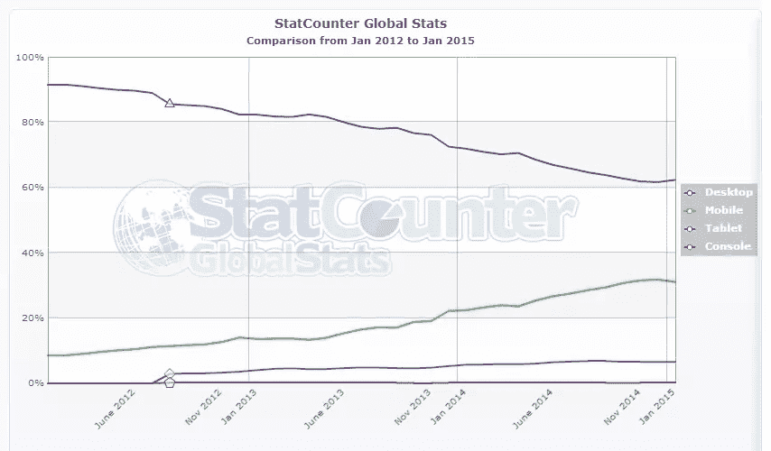
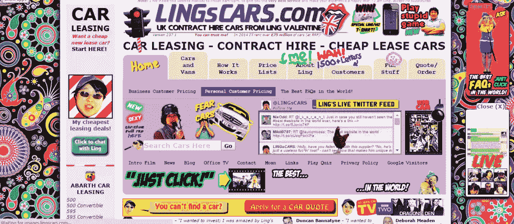

# 设计移动用户体验的 7 个最佳实践

> 原文：<https://www.sitepoint.com/7-best-practices-designing-mobile-user-experience/>

在过去 3 年中，桌面互联网使用率从 90%下降到 60%，而移动互联网使用率上升到 40%。按照这种趋势，移动设备很快就会抢走桌面互联网接入的风头。很快。

图片来自 [StatCounter](https://gs.statcounter.com/#all-comparison-ww-monthly-201201-201501)

许多设计师在为移动设备设计时使用的默认方法仍然是缩小他们的(桌面)网站，使其具有响应性。这种方法对于手机设计来说是一个糟糕的策略。你需要检查客户的业务，评估移动接入对他们特定业务的重要性，而不仅仅是缩小网站规模。

如果您客户的客户主要是台式机/笔记本电脑用户，例如，只能从工作站访问的企业级工具，那么您不必担心移动访问。但是如果你的客户想要一个在线商店或者根据客户的位置提供本地化信息，那么你最好使用[移动优先设计方法](https://www.sitepoint.com/making-case-mobile-first-designs/)。为了接触到尽可能多的人并发展您(客户)的业务，您的网站需要在从一系列设备访问时运行良好。所以，先努力勾画出你的[移动网络战略](https://www.sitepoint.com/decide-mobile-web-strategy/)。

为移动设备设计的挑战在于它们有如此多的变体、尺寸和风格。很像 20 世纪 90 年代浏览器大战期间的浏览器！

为了获得更好、更直观和用户友好的移动体验，让我们仔细看看移动设计中需要牢记的一些最佳实践:

## 1.有清晰、集中的内容

这是真的吗！？

许多人在旅途中使用他们的移动设备——在匆忙的状态下。结合小触摸屏，它不便于搜索或导航。在设计移动体验时，极简主义占主导地位。保持混乱最小化。包括主页在内的每一页都应该只有一个中心焦点。如果你有任何非典型的手势，比如滑动进入下一页或者水平滚动，不要认为用户会注意到这些。方便用户使用。用一个小箭头或悬停信息告诉他们如何使用这些功能，尽一切可能让他们轻松找到想要的东西。移动用户注意到并欣赏那些让他们的体验更流畅的小事情。当然，这对你也更好。

## 2.菜单和导航:保持简单

传统的桌面网站在页面顶部显示一个突出的菜单栏。在手机上，这会占用宝贵的屏幕空间。要解决这个问题，可以在手机屏幕的左上方或右上方设置一个下拉式折叠菜单或图标。

另一个在手机上不好用的桌面习惯是多级菜单，子菜单在鼠标悬停时显示。在移动设备上，您希望保持事物的可访问性。如果用户必须点击 4 级菜单才能找到某样东西，第二次点击后他们很可能会离开。尽可能避免移动网站上的多级菜单。这与桌面设计形成了鲜明的对比，在桌面设计中，人们努力获取网站上的几乎每一点信息，即使这意味着 3 级导航菜单和 10 个小部件挤满了侧边栏。移动设备的屏幕空间是有附加价值的。保持简洁，专注于你希望用户带走的关键信息。事实上，即使对于桌面网站来说，这也是一个很好的实践。

## 3.创建流畅的布局

许多移动设备意味着许多不同的维度。无论多么诱人，不要只设计 320 像素的宽度。无论喜欢与否，176、240、320、360、~480-600(横向)也是常见的设备宽度。保持你的布局灵活和流畅，确保它在不同的屏幕尺寸上正确显示。你不希望网站只在符合你的固定断点的设备上运行，但在其他设备上看起来很奇怪。这里有一本[关于流体布局](https://www.sitepoint.com/responsive-web-design-fluid-layouts/)的初级读本，还有一本关于[让流体布局在响应式设计中发挥作用](https://www.sitepoint.com/responsive-web-design-fluid-layouts/)。

## 4.触摸设计

我们只使用[键盘和鼠标事件](https://www.sitepoint.com/unifying-touch-and-mouse-with-pointer-events/)与网站互动的美好时光已经一去不复返了。在移动设备上，主要的交互方式通常是触摸。为触摸而设计需要一定程度的关注，这在桌面世界中是不需要的。代替精确的光标，你现在必须考虑各种形状和大小的手指对触摸屏施加不同的压力，做出不同的反应。你需要确保需要触摸输入或手势的表单、按钮和其他元素足够大，以避免与相邻元素重叠或误解[触摸事件](https://www.sitepoint.com/unifying-touch-and-mouse-with-pointer-events/)。

不要仅仅依赖触摸输入。有许多移动设备使用手写笔，一些旧的设备仍然使用方向键。有许多移动[设备/浏览器不完全支持](http://www.quirksmode.org/mobile/tableTouch.html) javascript 触摸事件。还有一种情况是用户拥有多种输入设备，例如，当他们使用连接到平板电脑的[鼠标时。虽然这种情况不太常见，但是要评估它们对你的网站有多重要，并采取适当的措施来处理它们。](http://www.html5rocks.com/en/mobile/touchandmouse/)

## 5.保持表单最小化

小触摸屏和更小的虚拟键盘的按键只有 5 毫米×5 毫米大小，这并不能带来愉快的打字体验。保持表单简单小巧。如果需要，为移动用户保留一个单独的表单，使用最少的字段来获取所需的数据。尽可能用默认值预填充字段。[对常用字段使用自动填充](https://developers.google.com/web/fundamentals/input/form/label-and-name-inputs.html#use-metadata-to-enable-auto-complete)。

例如，使用可视日历，而不是让用户键入日期。对于长于单个屏幕的表单，最好向用户显示一个进度条，表明他们已经完成了多少，更重要的是，他们离完成还有多远。这里有一些来自谷歌的好的指导方针来[创建好的表单](https://developers.google.com/web/fundamentals/input/form/label-and-name-inputs.html)。

当我们谈论表单时，我们怎么能不谈论标签放置呢？你知道用户使用顶端对齐标签填写表格会更快吗？将标签保持在输入栏上方可确保它仍然可见，即使设备在您键入时放大输入栏。顶部对齐的标签也使用户在向下滚动页面时更容易扫描字段并保持跟踪。你可以在这里了解更多关于标签定位[的信息。](https://www.sitepoint.com/definitive-guide-form-label-positioning/)

## 6.放下图像

大小和速度是移动网站最重要的两个性能指标。不要使用图像来实现像渐变和阴影这样的花哨效果。了解 CSS 的基本功能，并将它们融入到你的设计中。你试图用图像实现的特殊效果越少，效果就越好。不是所有的 CSS3 效果都可以在旧的移动浏览器上使用，但是没关系。该网站不需要在所有设备上 100%像素完美的设计。

如果你喜欢在设计中使用花哨的文本作为图像，这将是放弃它的好时机。保持文本为文本。使用花哨的字体来达到你想要的效果。但是为了保持你的站点占用空间和页面加载时间低，去掉多余的图片。

## 7.利用移动特定功能

在 iPhone 上滑动以解锁

移动设备有许多功能，如 GPS、陀螺仪和其他传感器，这些都是桌面设备所不具备的，如“滑动解锁”或拨打电话的功能。弄清楚如何使用这些功能来为您的网站提供更好的移动体验。您可以在联系人页面上添加简单的功能，如“点击呼叫”电话号码，在社交媒体平台上实现更轻松的共享，或者 GPS 提供特定位置的信息和服务。在这一部分，您可以拓展自己的思维，利用特定于移动设备的功能来获得更好的移动体验。

如果您热衷于了解更多关于移动设计的信息，这里有一些很好的资源供您探索:

*   [移动用户体验的要素](http://www.smashingmagazine.com/2012/07/12/elements-mobile-user-experience/)
*   [移动网站设计的原则](http://www.google.com/think/multiscreen/whitepaper-sitedesign.html)

你已经在遵循这些最佳实践了吗？设计良好的移动体验，你最喜欢的技巧是什么？

## 分享这篇文章