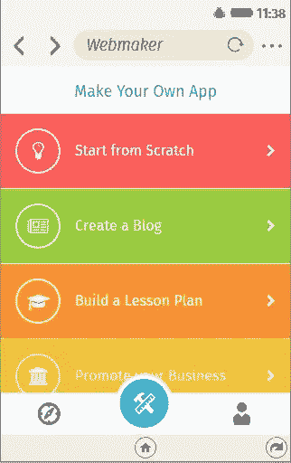
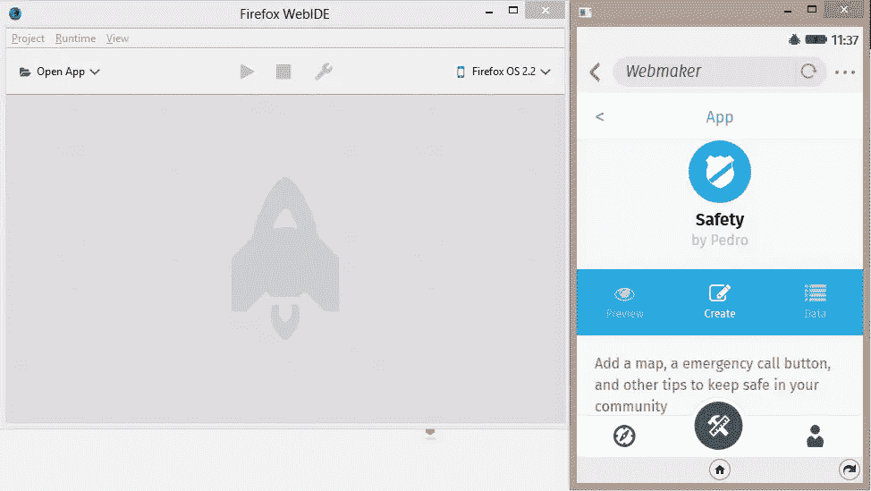
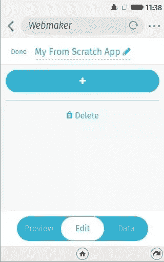
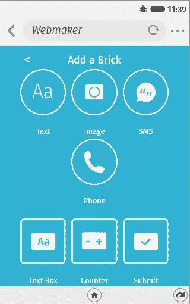
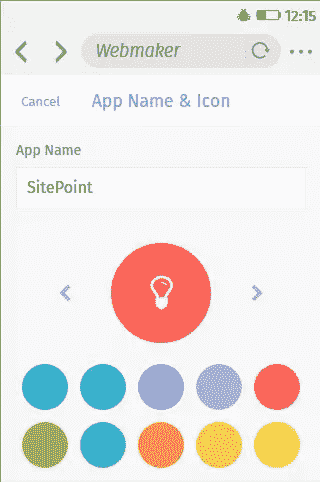
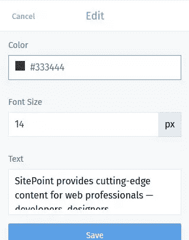
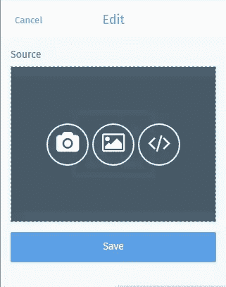
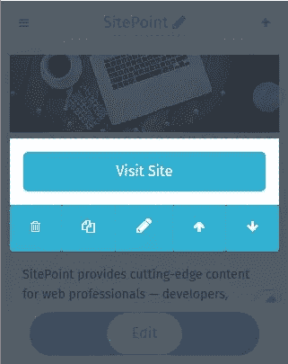
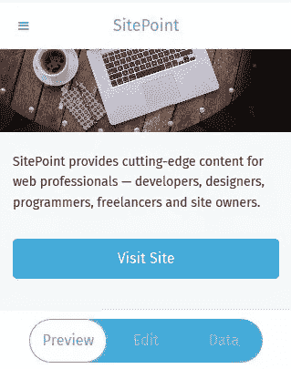

# 使用 Webmaker 应用程序创建移动应用程序

> 原文：<https://www.sitepoint.com/creating-mobile-apps-webmaker-app/>

Mozilla 基金会(因 Firefox 浏览器而闻名)最近推出了其[Teach Web](https://wiki.mozilla.org/Webmaker/TeachTheWeb/)计划(#TeachTheWeb)。这个项目的目的是支持和鼓励网络扫盲，帮助更多的人迈出开发网络的第一步，并与一个庞大的支持社区建立联系。

Webmaker 是一个 Mozilla 网站，它提供了许多促进网络素养的工具，比如 [Appmaker](https://apps.webmaker.org/) ，一个桌面工具，可以让创建移动应用变得容易。

最近，Mozilla 开始了另一个名为 [Webmaker 应用](https://mobile.mofodev.net/)的项目。这个项目为直接从 mobile 创建移动应用*提供了一个非常简单的接口。该项目仍处于测试阶段，因此目前托管在 Mozilla 的临时服务器上。*

Webmaker 应用程序可以在运行 Android 或 Firefox 操作系统的设备上使用。随着全球越来越多的设备支持 Firefox OS，这对发展中国家的学习者来说是一个好消息，因为它使应用程序的开发和分发变得容易。

## 回答了一些问题

我最近有机会与 Mozilla 的一些与这个项目密切相关的人交谈。他们能够解释为什么 Mozilla 觉得除了 Appmaker 之外还需要另一个应用创建工具。

Mozilla 基金会学习产品总监 Andrew Sliwinski 解释说

> Webmaker 应用和 Appmaker 都允许用户创建 web 应用。这两种应用的区别在于平台和准入门槛。Webmaker 应用程序旨在允许用户在移动设备上构建 web 应用程序，而无需使用台式计算机。正因为如此，我们相信它将更容易被那些无法使用像 Appmaker 这样的桌面产品的人所使用。

[该项目的首席开发者凯特·哈德森](https://twitter.com/k88hudson)也解释说

> Webmaker 应用程序将允许任何拥有智能手机的人创建和创作应用程序，并成为为网络创作的人的在线社区的一部分。创建应用程序以前需要专门的编程知识，至少需要一台台式电脑。人们将能够根据当地社区的需求，用自己的语言开发应用程序。

Mozilla 在三月份的世界移动通信大会上展示了 Webmaker 应用的公测版。在这篇文章发表后的几个月内，该应用程序将发布到 Firefox Marketplace 和 Google Play 商店。

## 我们去看看吧！

我们决定在运行 Firefox OS (2.2)的 WebIDE 中启动这个应用程序。

Appmaker(桌面应用程序)更侧重于教授输入/输出等基本编程概念，而 Webmaker 应用程序的重点是让人们能够创建有用的本地应用程序。我们认为，每个人都可以通过智能手机来创建应用程序，这一点很重要。

使用 Webmaker 应用程序，人们可以从头开始创建应用程序，添加不同的组件，如文本、图像、短信发送器、呼叫者、文本框、计数器和提交按钮。也就是说，基本上一个极简且易于制作的应用程序所需的所有组件。该框架目前在其主屏幕上有七个默认模板——*从头开始*、*创建博客*、*创建调查*、*推广你的业务*、*分享社区新闻*、*创建如何指导*和*创建安全应用*。

Webmaker 应用程序有一个简化的用户界面，正在进行测试，以确保不熟悉传统编码或计算机科学概念的用户可以使用它来创建自己的内容。

## 让我们做点什么！

让我们为 SitePoint 构建一个小应用程序，显示它的名称、封面图像和按钮，使用户能够访问网站。我们选择*从头开始*模板，开始编辑应用程序的标题。

然后，我们添加一个新的文本块，并输入 SitePoint 的描述。

现在，让我们通过添加 SitePoint 的精美封面图片来增加应用程序的吸引力吧！

我们最后添加一个按钮，并重新排列应用程序中各块的顺序。

这基本上结束了我们构建小应用程序的工作。您可以点击预览按钮，在发布前查看您的应用程序。还有一个分享按钮，允许用户在旅途中分享他们的应用程序，并让他们在 [Webmaker gallery](https://webmaker.org/en-CA/explore) 上被发现。整个手术不到五分钟！

## 参与进来！

Webmaker 应用是一个开源项目，其代码库位于 [GitHub](https://github.com/mozilla/webmaker-app) 。任何对贡献感兴趣的人都可以加入进来，通过[提交问题](https://github.com/mozilla/webmaker-app/issues/new)来获得 bug、功能请求或建议。虽然这个项目是在 [vue.js](http://vuejs.org/) 开始的，但是开发者计划在三月底将这个项目移植到 [react.js](http://facebook.github.io/react/) 上。

开发人员可以针对 HTML5 地理定位和应用动画等主题构建模块/砖块。您甚至可以对图库中显示的现有模板做出贡献，或者添加与您所在地区/国家更相关的新模板。你有兴趣成为这个项目的测试车手吗？你可以点击阅读现场测试指南[。](http://webmaker-mobile-guide.mofodev.net/_docs/field_testing/README.html)

## 网络扫盲万岁

网络素养是一个我们都应该关心的全球性问题。“教网络”倡议给了我们一个机会，让我们可以通过制作其他人可以学习的内容，以及其他人可以重新混合或修改的内容，为开放网络做出贡献。阅读 [Webmaker 白皮书](https://mozilla.github.io/webmaker-whitepaper/)以了解更多关于网络扫盲和网络教育计划的信息。

## 分享这篇文章