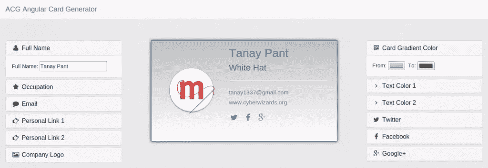

# 了解 AngularJS 中的双向数据绑定

> 原文：<https://www.sitepoint.com/two-way-data-binding-angularjs/>

在本教程中，我将通过构建一个动态名片生成器来演示双向数据绑定如何在 [AngularJS](https://angularjs.org/) 中工作。这个生成器将允许您创建自己的虚拟名片，您可以使用您的姓名、职业、电子邮件、公司徽标以及主页和社交媒体网站的链接进行个性化设置。您将能够使用 [HTML5 颜色输入](http://demosthenes.info/blog/588/The-HTML5-Color-Input)调整卡片的背景和文本颜色，并实时看到您所做的任何更改出现在屏幕上。

这就是我们的最终结果:



## 入门指南

我们将使用 [Bower](http://bower.io/) 来管理我们项目的依赖项。Bower 是一个用于 web 的包管理器，可以使用 npm 安装(这意味着您需要安装 Node.js)。如果你需要安装 Node.js(或 npm)的帮助，那么看看这篇[最近的 SitePoint 文章](https://www.sitepoint.com/beginners-guide-node-package-manager/)中关于这个主题的内容。如果你需要安装鲍尔的帮助，那么你可以[在他们的主页上查看说明](http://bower.io/#install-bower)。

我们对这个项目的依赖将是 [Bootstrap Framework](http://getbootstrap.com/) (用于样式和手风琴组件) [Font Awesome](http://fortawesome.github.io/Font-Awesome/) (用于图标)，以及 jQuery(Bootstrap 所依赖的)和 AngularJS。

假设您已经安装并配置了 Bower，创建一个新目录，`cd`到该目录中，并使用 Bower 初始化项目:

```
mkdir ACG && cd ACG
bower init
```

然后，Bower 将在项目的根目录下创建一个`bower.json`文件。它还会问你几个问题，比如项目名称，作者姓名，描述等等。在“名称”下输入“ACG”(角卡生成器)，并根据自己的意愿填写其余部分(或者接受默认值)。生成的 JSON 文件应该如下所示:

```
{
name: 'ACG',
version: '0.0.0',
authors: [
'Tanay Pant <tanay1337@gmail.com>'
],
description: 'Card Generator',
keywords: [
'AngularJS'
],
license: 'MIT',
ignore: [
'**/.*',
'node_modules',
'bower_components',
'test',
'tests'
]
}
```

接下来，在终端中运行以下命令:

```
bower install bootstrap --save
bower install font-awesome --save
bower install angular --save
```

这将在一个名为`bower_components`的目录中安装我们项目所需的所有依赖项，并将依赖项保存到 *JSON* 文件中。将`bower_components`添加到`.gitignore`是一个好主意，因为您不想将这个文件夹上传到您的 GitHub 资源库，因为任何贡献者都可以通过在项目的根目录下运行`bower install`来安装相同的依赖项。

## AngularJS 应用程序的剖析

在 ACG 文件夹中创建一个文件`index.html`和另一个名为`style.css`。将以下代码添加到`index.html`:

```
<!DOCTYPE HTML>
<html lang="en" ng-app="myApp" ng-controller="BusinessCardController">
<head>
<title>{{ user.name }} | Business Card</title>
<meta charset="utf-8">
<link href="path/to/bootstrap.min.css" rel="stylesheet">
<link href="path/to/font-awesome.min.css" rel="stylesheet">
<link href="style.css" rel="stylesheet">
</head>

<body>
<script src="path/to/jquery.min.js"></script>
<script src="path/to/js/bootstrap.min.js"></script>
<script src="path/to/angular.min.js"></script>
<script> 'use strict';

angular.module('myApp', [])
.controller('BusinessCardController', function($scope){
$scope.user = {
name: 'Tanay Pant'
}
}); </script>
</body>
</html>
```

我们通过将`ng-app="myApp"`和`ng-controller="BusinessCardController"`添加到< html >标签来开始网页。需要使用`ng-app`指令告诉 Angular 整个页面是一个 AngularJS 应用程序，而`ng-controller`指令将一个控制器类附加到我们的视图上。

然后我们在标题中使用`ng-bind`指令，以便在包含相关的 CSS 文件(在< head >中)和 JS 文件(在结束的< /body >标签之前)之前，保持页面标题与我们的模型同步。这些文件(除了`style.css`)都位于`bower_components`文件夹中。

最后，我们定义了`myApp`(应用程序启动时加载的主模块)，以及一个`BusinessCardController`，我们将在其中设置`$scope`对象的初始状态(我们的控制器和视图共享数据的方法)。

## 请给我手风琴！

现在我们需要一种向用户呈现配置选项的方式。当我们使用 Bootstrap 时，我们可以利用[折叠组件](http://getbootstrap.com/2.3.2/javascript.html#collapse)——一个基本的手风琴。折叠面板的结构如下:

```
<div class="panel panel-default">
<div class="panel-heading">
<h4 class="panel-title">
<a data-toggle="collapse" data-parent="#accordion" href="#collapseOne">
Panel Title
</a>
</h4>
</div>
<div id="collapseOne" class="panel-collapse collapse in">
<div class="panel-body">
Panel content
</div>
</div>
</div>
```

对于每个面板，我们希望用适当的图标和标题替换标题:

```
<i class="fa fa-user fa-fw"></i>Full Name
```

以及带有输入字段的内容:

```
Full Name: <input type="text" ng-model="user.name" placeholder="Full Name" />
```

请注意`ng-model`指令。这将 HTML 控件的值绑定到应用程序数据(在本例中是我们在控制器中声明的`user`对象的`name`属性)。

我们还可以给面板一个`in`类，让它们默认打开。

这是我们目前掌握的情况。如果你在家跟着做，将代码笔中的 HTML 复制到`index.html`，将代码笔中的 CSS 复制到`style.css`。

在 [CodePen](http://codepen.io) 上通过 SitePoint ( [@SitePoint](http://codepen.io/SitePoint) )看笔[zyqrwk](http://codepen.io/SitePoint/pen/ZYqrKW/)。