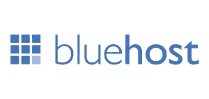

# 得益于 Bluehost 和 SitePoint Premium，您可以更好地学习，更轻松地展示自己

> 原文：<https://www.sitepoint.com/learn-better-show-easier-thanks-bluehost-sitepoint-premium/>

学习 web 开发最大的好处之一就是你可以很快从一无所知到创造出看起来有点专业的东西，然后向别人炫耀。

像木工这样的行业就不同了，你可能不想让你关心的人坐在你的第一把椅子上。或者在家酿造，你的第一批啤酒可能不会与你最大的敌人分享，更不用说你最亲近的人了。对于 web 开发来说,“能力与印象”的比例稍微宽容一些。当你能在一个项目中运用你的知识时，学习这个领域也变得容易一些。

但是展示你最新的不可思议的互联网产品的主要障碍之一是主机。它复杂、昂贵，并且对于新开发人员来说不太容易使用。

有趣的是，我们这里的 SitePoint 和 [SitePoint Premium](https://www.sitepoint.com/premium) 有一个解决方案。我们刚刚与全球最大、最值得信赖的虚拟主机公司之一 [Bluehost](http://bluehost.com/track/sitepointmedia?page=/affiliate/learnable) 合作，提供一些高质量的学习，以及展示你的新技能的方法。

通过这项交易，你可以以每月 3.5 美元的低价注册 Bluehost 的初级主机包，并获得一年免费的 SitePoint Premium 订阅。

如果你还没有尝试过 SitePoint Premium，你会错过一些很棒的东西:关于所有 web-ey 的书籍和课程，从 Angular 到 Bootstrap 到 CSS3，再到以字母表中的其他字母开头的主题(除了 X，但这只是时间问题)。网络行业是广阔的:每个人在某个方面都是初学者，所以即使你知道一点点，总会有新的东西要处理。

你可以[与交易](http://bluehost.com/track/sitepointmedia?page=/affiliate/learnable)签约，为你自己或你的企业建立一个基本的网站，然后在今年剩下的时间里(当然还有以后)使用 SitePoint Premium 的课程和书籍来改进它。这是启动你的网络开发职业或爱好的理想方式。

至少，这会简化炫耀——这难道不是最重要的事情吗？

## 分享这篇文章