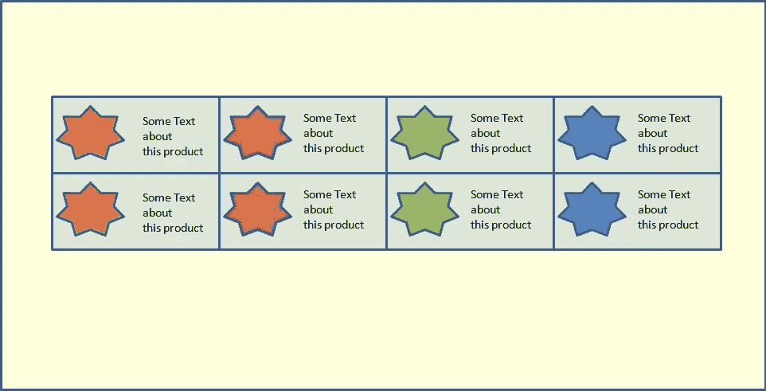
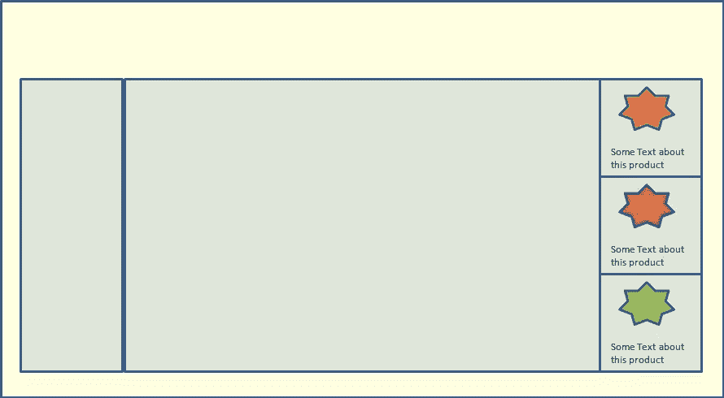

# 除了媒体的询问，是时候了解基本情况了

> 原文：<https://www.sitepoint.com/beyond-media-queries-time-get-elemental/>

当 Ethan Marcotte 写下这篇文章时，我想知道他是否知道这个概念会变得多么流行。或者它会在几年内成为主流。今天，网络上的每个响应站点都严重依赖媒体查询来使布局和其他元素适应视口的大小。这几乎有点像魔法。突然间，我们不必为每种尺寸的移动设备创建单独的代码、文件和作品。我们的网站神奇地“回应”了。

但有时，我怀疑我们是不是把伊森的话看得太重了。我们对媒体的询问沾沾自喜。我们抓住媒体的询问，把它作为响应式设计的黄金解决方案……而不再往远处看。

不要误解我。我喜欢[响应式网页设计](https://www.sitepoint.com/mobile/responsive-web-design/)。我喜欢它能让我们在各种尺寸的设备上显示相同的内容。我喜欢媒体查询——这种技术使我能够根据设备大小改变布局(简单地说)。但是我和他们一起工作的越多，我就越痛苦地意识到他们是多么的不足和被过度使用。

## 媒体查询:起源

熟悉媒体提问的人，请耐心听我说一分钟。

[媒体询问来自于](https://www.w3.org/TR/css3-mediaqueries/)在不改变内容本身的情况下，根据一系列输出设备定制演示的需求。一个[媒体查询](https://www.sitepoint.com/media-queries-look-different-media-features/)根据用户代理字符串检查媒体类型，如果匹配，它继续检查设备的某些物理属性，如高度、宽度、方向等。这是在不同尺寸的设备上提供不同演示的简单而有效的方法。随着智能手机和其他移动设备在全球的日益普及，媒体查询的需求也在增长，这绝非巧合。

最常用的媒体查询特性是高度和宽度特性。对于浏览器窗口或视口，有*宽度、高度、最小/最大宽度、最小/最大高度*，对于器件，有*器件宽度、器件高度、最小/最大器件宽度、最小/最大器件高度*。因此，当视口或设备大小改变时，您可以有效地指定您希望事情如何改变。

是的，差不多就是这么回事。为什么我要重复基础知识？将焦点拉回到媒体查询的基础——我们在热爱媒体查询时容易忽略的基本概念:

1.  媒体查询旨在解决在多种尺寸的设备上显示相同内容的问题。
2.  它们是*而不是*模块化的。

这就是媒体查询开始成为问题的地方——当你真的想要构建模块化的、独立的组件时。

## 将元素调整到容器，而不是视口

所以，想象你在一个电子商务网站上工作。为了模块化和编写好的代码，你创建了一个元素，比如说`my_product`，来代表每一个产品。这个元素有一个产品的图像和一些描述它的文本。在主页上，您希望所有的产品元素排成一行，每行四个。在“买家指南”页面上，你希望它们垂直排列，一个在另一个下面，在右边栏。合理要求。而且足够普通。

以全幅显示在主页上的产品。

产品显示在不同的页面，在侧边栏。

那么你如何着手做这件事呢？媒体询问？媒体查询将只检查视窗大小。在这种情况下，这两种布局中的视口大小相同。我们甚至还没有考虑过不同的设备尺寸。我们只是希望`my_product`元素根据其容器是窄的(即限于侧边栏)还是宽的(即遍布整个页面)以不同的方式显示。对此我们不能使用媒体查询。CSS 中还有什么让我们干净利落地做到这一点的吗？遗憾的是没有。有一些技巧和脚本可以帮助你；但是没有干净的方法(据我所知)来做到这一点。当海登·皮克林试图让他的设计独立于元素的内容和数量时，他也遇到了类似的困境。

## 模块化已经过时了

为了处理这一点，我必须维护代码，根据它的使用场合来设计不同的风格`my_product`。如果我想让这个响应更快，并考虑不同的设备大小，我会遇到更多的麻烦。我必须根据设备的大小，为这个元素找出并维护不同的断点。我甚至不打算进入代码会变得多么扭曲。你可以查阅伊恩·斯道姆·泰勒关于[与媒体询问](http://ianstormtaylor.com/media-queries-are-a-hack/)、[斯科特的问题](http://www.filamentgroup.com/lab/element-query-workarounds.html)在 FilamentGroup 的报道，以及泰森·马塔尼奇关于这个问题的[讨论](http://www.smashingmagazine.com/2013/06/25/media-queries-are-not-the-answer-element-query-polyfill/)。是的，我不是唯一一个在这方面挣扎的人。

我喜欢简单、干净的代码。我喜欢保持模块化。我喜欢<abbr title="Don't Repeat Yourself">干</abbr>。我*不*喜欢将相同的代码像纸屑一样分散在不同的地方。

这是一个基本的任务——如果一个元素变得太窄(或太小或什么的),稍微改变一下样式。应该有一个简单的方法可以做到这一点，而不会陷入混乱。应该有一种方法将元素的样式链接到它的容器，而不是总是链接到它的视区大小或设备尺寸。

## 变通办法

一些有创造力的人，与这种情况作斗争，试图让事情变得对我们这些凡人来说更容易。解决当前 CSS 规范中不足的一些创新性解决方法是:

*   斯科特·杰尔的《初级》
*   Tyson Matanich 的[元素查询](https://github.com/tysonmatanich/elementQuery)
*   萨姆·理查兹著
*   [CSS 元素查询](https://github.com/marcj/css-element-queries)来自 Marcj

这些都不错。它们服务于这个目的。但是它们都有自己的局限性，并增加了复杂性。我们需要更简单，更干净，内置于 CSS 中的东西。

## 为什么我们还没有元素查询？

有很多关于“元素查询”的讨论——和媒体查询一样，但是绑定到组件而不是视口。RICG 甚至正在起草用例及需求。但仍处于初级阶段。有几个[实际问题](http://www.xanthir.com/b4PR0)需要先理清。主要问题与循环有关。根据元素的内容，有许多方法可以指定元素的大小。当这些内容又依赖于包含元素的大小时会发生什么？先有鸡还是先有蛋？[关于处理此事的最佳方式的争论仍在继续。](http://www.xanthir.com/b4PR0)

但就像其他过去看似不可能的问题一样，我相信这也是可以解决的。也不是没有可能。这更多的是一个得到应有关注的问题。随着媒体查询成为焦点，围绕元素查询的讨论没有聚集足够的动力。虽然媒体的询问有助于我们了解 RWD，但它们是有限的。我们需要放眼未来。

媒体查询和“元素查询”是互补的。它们针对不同的情况和需求。仅仅因为我们现在有媒体的疑问，并不意味着我们应该自满，不推动 CSS 的进一步发展。我们需要研究出解决元素查询问题的最佳方法。

在接下来的几年里，随着更多的网站(好的和坏的！)每天都在创造比以往任何时候都多的网站，比以往任何时候都复杂的网站。大多数开发人员似乎对他们目前所拥有的感到满意，他们太忙了，或者太懒了，以至于不能展望未来。我们需要向前看，并确保我们有正确的工具来处理这些复杂性。否则我们会有几十亿个网站，到处都是杂乱无章的代码。

到目前为止，你是如何处理这个问题的？您认为关注元素查询的时机成熟了吗？

## 分享这篇文章