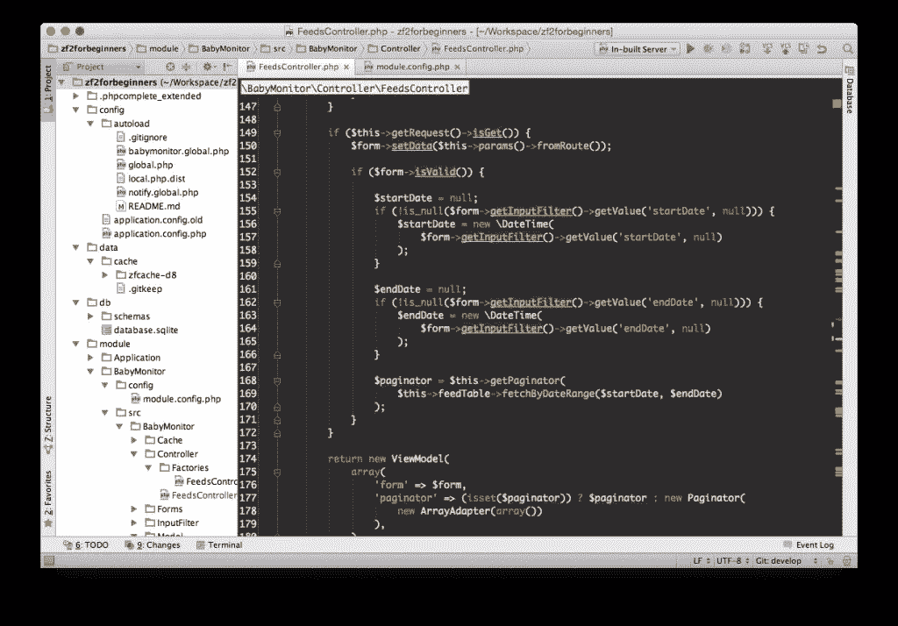
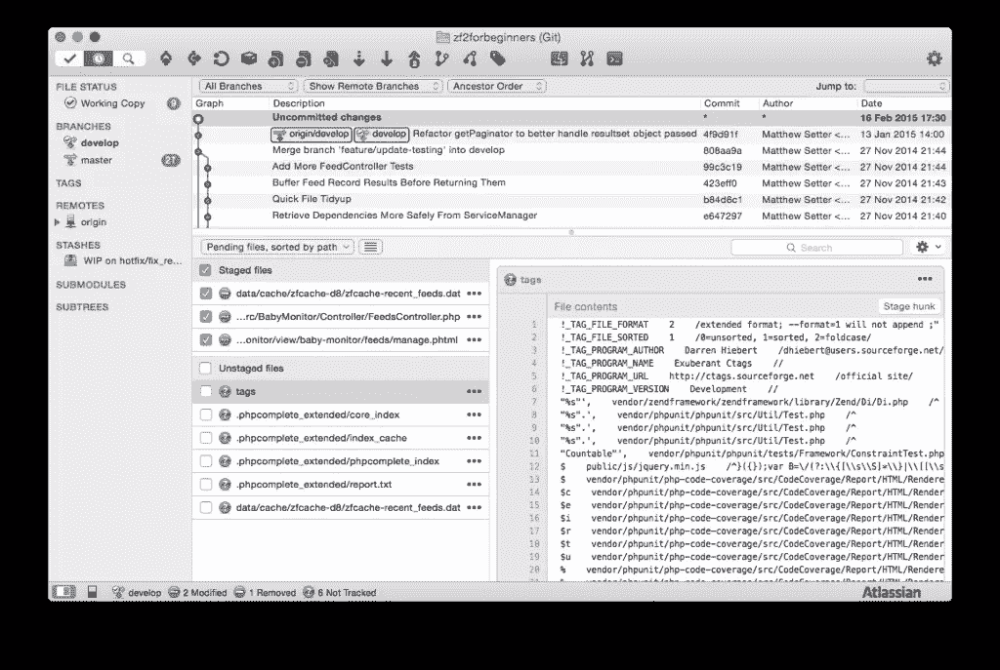
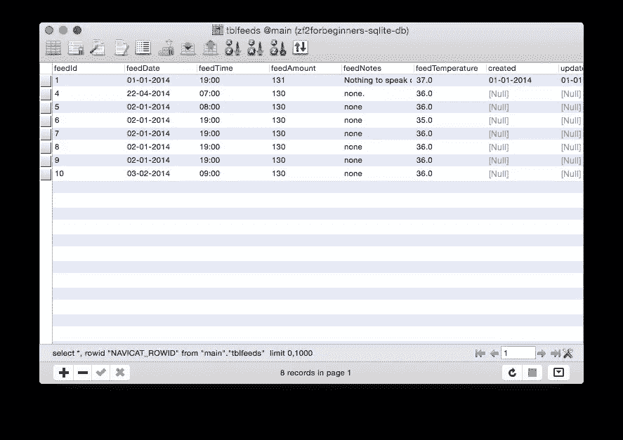

# 我如何设置我的 Mac 开发机器

> 原文：<https://www.sitepoint.com/set-mac-development-machine/>

SitePoint 上最近的两篇文章谈到了人们如何建立他们的开发环境。Zack Wallace 讲述了如何建立一个 Windows 开发环境， [Shaumik Daityari](https://www.sitepoint.com/set-up-development-machine/) 讲述了他使用 Ubuntu Linux 的经历。

在这篇文章中，我想谈谈我是如何在 Mac OS X 上建立一个开发环境的。

我是一名自由软件开发者和技术作家。鉴于此，我经常需要各种各样的工具，无论是用于软件开发、研究、写作还是实验。

从管理代码、访问远程服务器和管理数据库到编写和审查内容，这无疑是一项艰巨的任务。然而，Mac 的伟大之处在于它有如此多的可用工具。

## 基本工具

新的 MAC 电脑配备了 iWork 套件、Safari、Preview 和 Unarchiver，以及一系列其他 GUI 工具。在命令行上，它们附带了各种开源工具，比如 SSH、Wget 和 cURL。然而，仅仅这些还不够。为了进行适当的网站开发和技术写作，我们需要一些其他人。具体来说，我经常结合使用以下方法:

*   [Dropbox](https://www.dropbox.com/install) 和 [Google Drive](https://www.google.com/drive/download/)
*   [火狐](https://www.mozilla.org/en-US/firefox/new/)、[谷歌 Chrome](https://support.google.com/chrome/answer/95346?hl=en) 和[Chrome](http://www.chromium.org/getting-involved/download-chromium)
*   [像素化器](http://www.pixelmator.com)和 [Skitch](https://evernote.com/skitch/)
*   [座谈会](http://colloquy.info)、 [Skype](http://www.skype.com/en/) 和 [Slack](https://slack.com)
*   [Evernote](https://evernote.com/) 和[神童](https://www.wunderlist.com)。

这些工具在日常生活中几乎是不可或缺的。

Dropbox 和 Google Drive 让我可以和客户分享文件。我可以使用浏览器内版本，但安装应用程序会让同步变得更加简单。

没有现代浏览器，任何 web 开发环境都是不完整的。像 Zack 一样，由于 Mac 不支持 Internet Explorer，我使用了一系列工具来测试 IE 中的网站，例如 [BrowserStack](http://www.browserstack.com) 。

Pixelmator 和 Skitch 使编辑和注释图像变得简单。Pixelmator 不是免费的，但也不贵。你可以使用 GIMP 来代替，但是我发现它的界面还有很多需要改进的地方。

我用 Evernote 做笔记和储存笔记。它绝对有那个空间。我所需要的项目管理就是神童。有了它，我可以掌握我必须为每个客户做的所有工作，并记录我们已经进行的对话和我仍然需要做的事情。

有许多用于系统维护的强大工具。这个著名的 CleanMyMac 评论把它放在了首位，尽管也有一些免费和付费的 T2 选择。

## 编辑们

但是现在让我们进入更严肃的事情:编辑。我做两种类型的编辑——内容和代码——所以我对编辑器的讨论将反映这一点。不管你在做哪一个，Mac 上都有几个非常好的编辑器。

当我写作时，我用 [Markdown 格式](http://daringfireball.net/projects/markdown/syntax)写作。它让你可以在任何文本编辑器中编写结构化内容，而不需要特殊的软件(如 Microsoft Word ),这可能会让你听从某个供应商的命令。使用像 [Pandoc](http://johnmacfarlane.net/pandoc/) 这样的工具，你可以将你的内容导出到几乎任何其他文件格式。

### 编写应用程序

在 Markdown 中写作，有几个很棒的原生应用可用，包括 [MacDown](http://macdown.uranusjr.com) 、 [iA Writer](https://ia.net/writer) 和 [Writer Pro](http://writer.pro) 和 [Mou](http://25.io/mou/) 。见鬼，你甚至可以使用文本编辑，尽管它并不真正适合这项任务。除此之外，还有各种在线 Markdown 编辑器，包括[银杏](http://gingkoapp.com)、[选秀](https://draftin.com)和 Bruno kvorc 的最爱 [StackEdit](http://stackedit.io) 。

虽然我不经常使用它们，但我已经尝试过了，并且可以为所有这些做担保。对我来说，最好的工具是 Vim，最理想的是 [MacVim](https://code.google.com/p/macvim/) 。设置和配置确实需要一点时间。但是一旦做了，就很神奇。更重要的是——**它是免费的**。如果你感兴趣，或者正在努力，可以在 GitHub 上查看[我的 Vim 配置库](https://github.com/settermjd/vim-for-technial-writers)。

### 编写应用程序

接下来是代码。无论你是 PHP、Python、Ruby、Go、Haskell 还是 C++开发人员，Mac 都有许多可用的代码编辑器。

有一直存在的，优秀的质量[崇高的文本 3](http://www.sublimetext.com/3) ，我经常使用，并高兴地证明。还有 [TextMate 3](http://macromates.com) ，轻巧、简单、可扩展。但是对我来说，我的首选编辑器是 [PhpStorm](https://www.jetbrains.com/phpstorm/) 。基于 [IntelliJ](https://www.jetbrains.com/idea/) ，它只是做了这么多；它本身没有做什么，可能有一个插件。说了这么多，也不是免费的。但是价格真的没那么多，尤其是当你权衡利益的时候。

## 版本控制

接下来，我们来看看版本控制。无论我是在写作还是编码，我总是使用版本控制。我选择的版本控制系统是 [Git](http://www.git-scm.com) 。对我来说，这是显而易见的。然而，使用 [Mercurial](http://mercurial.selenic.com) 你可能会同样得心应手。如果你用的是 Subversion，OK。但是我不能老老实实支持 CVS。

以 Git 作为我的参照系，有几个不错的工具可供 Mac 选择。首先，有更简单的 GitX。开源且免费，是 Linus Torvolds 的 [GitK](https://www.kernel.org/pub/software/scm/git/docs/gitk.html) 的 Mac 克隆，它提供了管理 Git 库所需的关键功能，并提供了一个不错的内置比较查看器。

然后是发电站[资源树](http://www.sourcetreeapp.com)。如果你正在寻找一个能做所有事情的应用，一个由专注于开发者工具的大公司积极开发的应用，Atlassian，那么不要错过 SourceTree。我用了很长时间(在我从命令行提交 Git 之前),它非常棒。

我也会给聪明的人一个荣誉奖。

在这三个中，我用得最多并且强烈推荐的是 SourceTree。然而，由于 MacVim 是我选择的文本编辑器，我从命令行管理我的 Git 库。(我不打算建议您也使用命令行。但我要说的是，花时间去学习如何使用它是值得的，因为它确实能帮助你变得更有效率。也就是说，如果你不是命令行人士，SourceTree 是一个不错的选择！)

## 服务器

对于服务器，我选择两个选项中的一个。我要么使用内置的服务器，比如那些安装了 Ruby 和 PHP 的服务器，运行时不需要太多额外的软件，要么运行一个虚拟机。为此，我已经使用了 [VirtualBox](https://www.virtualbox.org) 和 Ubuntu Linux，但我越来越多地使用 [Ansible](http://www.ansible.com/home) 和[vagger](https://www.vagrantup.com)创建自己的。

你可以调用一系列的工具，默认情况下，有许多语言库和扩展没有安装在 Mac 上的二进制文件，甚至安装的版本也可能不够新。为了解决这个问题，我使用了 [Homebrew](http://brew.sh) ，这是 Mac 上两个优秀的包管理器之一。

Homebrew 的工作方式类似于 Linux 上的 APT 和 yum，因为您可以搜索软件包存储库，并使用它安装、升级和配置软件包。为了更好地理解它是如何工作的以及它提供了什么，请查看 Homebrew 的在线文档。

## 数据库

数据库工作，我大多用 [MySQL](http://dev.mysql.com/downloads/mysql/) 。我想你可以把这归因于我的 PHP 传统。但是我也经常与 [PostgreSQL](http://www.postgresql.org/download/macosx/) 和 [SQLite](http://www.sqlite.org/download.html) 一起工作。要安装这些数据库中的任何一个，您可以通过链接从它们各自的供应商那里下载它们。

虽然我想把自己看作是一个铁杆命令行专家，但当涉及到数据库时，我不是。为此，我已经使用 Navicat Lite 好几年了。这是一个优秀的工具，它提供了对大量数据库的统一访问。

Navicat 不仅支持 MySQL、PostreSQL 和 SQLite，还支持 Oracle 和 SQLServer。它允许轻松地创建任何模式元素，手动创建和运行查询，搜索、创建和更新记录——这是数据库管理工具所能提供的一切。

## 外部访问

对于外部访问，我经常使用工具的 [SSH 库](http://www.openssh.com),无论是 SSH 到远程服务器，还是从我的开发环境复制文件。除此之外，我还经常使用 cURL 和 Wget 来抓取文件、运行针对 API 的请求以及执行网站交互。

但是如果你不太喜欢命令行，有一些非常好的 GUI 工具。有古老的 [FileZilla](https://filezilla-project.org) ，还有看起来更光滑的 [Cyberduck](https://cyberduck.io/?l=en) 和 [Transmit](http://panic.com/transmit/) 。这三个工具中的每一个都允许你用鼠标远程管理文件。

## 包装它

这就是我如何用我需要的所有工具来设置我的环境。我承认我确实大量使用命令行和命令行类型的工具。但是我也介绍了一些 GUI 工具，如果您喜欢的话，也可以用它们来代替。

尽管人们经常对 Mac 做出嘲讽的评论，但毫无疑问——有大量的软件可供使用。由于它的 BSD 传统，它也可以访问开源和 Posix 兼容的工具。因此，无论您选择哪种方式，在 Mac 上工作和开发时，您都有大量的工具可供使用。

那么，我的系统和你的相比怎么样？

## 分享这篇文章