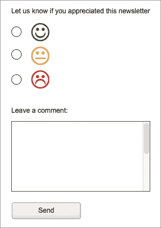
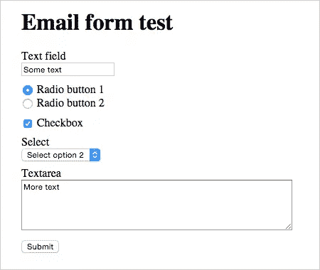
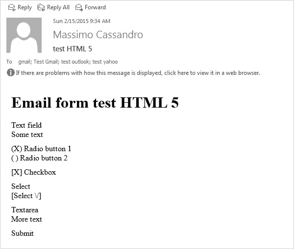
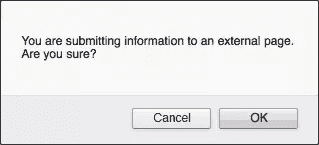
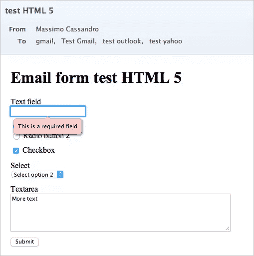
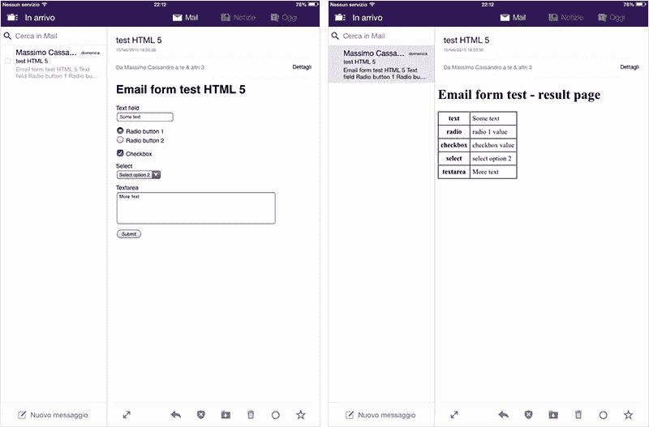

# 在电子邮件中使用表格:方法还是疯狂？

> 原文：<https://www.sitepoint.com/forms-in-email/>

所以，第一个问题是:为什么要在电子邮件中使用表单？

这是一个很好的理由，因为我个人不相信**目前有一个很好的理由**在电子邮件中嵌入表单。用户将*仍然*需要将表单提交到网页，所以在可用性方面真的没有额外的便利。

此外，您现在失去了在电子邮件表单上执行客户端验证的能力，因为 JavaScript 和 HTML5 表单约束不一致。

可能会有这样的使用案例，在邮件中添加一个表单被作为一个选项提出来——可能是为了增加消息的影响力或者刺激即时的用户交互(例如，征求评论)。

在这种情况下，我们不是在谈论可以通过简单的网络链接解决的事情。

你可能见过这样的东西:


最安全和最简单的方法是为每个笑脸添加一个链接，并添加一个特定的变量来记录用户的选择。

但是像这样的东西呢？



显然，你不能使用一个唯一的链接来保存满意度和评论，所以，**如果你决定不把用户发送到一个网页**，你需要在你的电子邮件中添加一个表单。

我在网上搜索了关于电子邮件格式兼容性的信息，但只找到了几篇关于这个主题的文章(大部分是旧的):

*   CSS 技巧:HTML 邮件中的 HTML 表单
*   [活动监控:在电子邮件中使用表格](https://www.campaignmonitor.com/resources/will-it-work/forms/)

从积极的方面来看，事情并没有像他们描述的那样发生很大的变化，但是出于好奇，我决定在一些电子邮件客户端上用一个简单的表单进行一些我自己的测试。

## 表单

我构建了一个非常简单的邮件:它包含主要表单元素的示例:

*   文本输入
*   两个单选按钮
*   一个复选框
*   精选
*   文本区。

我为它们中的每一个提供了一个默认值，此外，*输入文本*字段有一个`required`属性。

我用 *HTML5* 和 *XHTML 1 strict* 文档类型运行了两次测试。两个版本都通过了 W3C 验证。

下面是我使用的 HTML5 代码:

```
<!DOCTYPE html>
<html lang="en">
<head>
    <meta charset="utf-8">
    <title>Email form test</title>
</head>
<body>
    <h1>Email form test</h1>

    <form id="form1" action="result_page.html" method="get">
        <div style="margin-bottom:10px">
            <label for="text">Text field</label><br>
            <input required type="text" id="text" name="text" value="Some text">
        </div>

        <div style="margin-bottom:10px">
            <input type="radio" id="radio1" name="radio" value="radio 1 value" checked>
            <label for="radio1">Radio button 1</label><br>
            <input type="radio" id="radio2" name="radio" value="radio 2 value">
            <label for="radio2">Radio button 2</label>
        </div>

        <div style="margin-bottom:10px">
            <input type="checkbox" id="checkbox" name="checkbox" value="checkbox value" checked>
            <label for="checkbox">Checkbox</label>
        </div>

        <div style="margin-bottom:10px">
            <label for="select">Select</label><br>
            <select id="select" name="select">
                <option value="select option 1">Select option 1</option>
                <option value="select option 2" selected>Select option 2</option>
                <option value="select option 3">Select option 3</option>
            </select>
        </div>

        <div style="margin-bottom:10px">
            <label for="textarea">Textarea</label><br>
            <textarea cols="60" rows="5" name="textarea" id="textarea">More text</textarea>
        </div>

        <div>
            <button type="submit" name="Submit">Submit</button>
        </div>
    </form>
</body>
</html>
```

以下是它在 Chrome (mac)中的显示方式:



除了一些特定于语言的差异，XHTML 版本几乎是相同的。

## 已检查的客户端

我在这些客户端上尝试了表单的两个版本:

### 桌面:

*   苹果邮件(8.2 版)
*   雷鸟(OSX，第 31.4 版)
*   Windows Live Mail 2012 (Windows 7)
*   Outlook 2013 (Windows 7)

### 手机:

*   iPad 邮件(IOS 8.2)
*   iPad 上的 Gmail 应用程序
*   iPad 上的雅虎邮箱
*   IOS 的前景
*   Android 上的 Gmail 应用程序(5.0.1 版)
*   Android 4.4.4 上的原生电子邮件应用
*   安卓系统上的雅虎邮箱(4.8.4 版)
*   Gmail 收件箱 Android(1.2 版)

### 网络邮件:

*   谷歌邮箱
*   雅虎邮箱
*   Outlook.com

网络邮件版本已经在 OSX 使用 Firefox 35 进行了测试。

## 结果呢

首先:改变文档类型没有什么区别，因为 HTML5 和 XHTML 文档类型提供了相同的结果。

我测试过的所有客户端都能正确显示表单，除了 Windows 和 IOS 版的 Outlook。

总体而言，Outlook 在测试中给出了最差的结果:该表单在 Outlook 2013/Win 7 或 IOS 上都无法呈现。表单元素要么被完全删除(IOS 版本)，要么被呈现为纯文本(Outlook 2013)，如下图所示:



在 Outlook.com 上，表单可以正确显示，但无法提交。

您可能已经知道，Outlook 桌面版使用 MS Word 作为其 HTML 呈现引擎，这解释了它的大多数问题。Word 是为文档创建而设计的，不是为 web 表单而设计的。微软如何断定 Word 是创建电子邮件的合适工具，这是一个永恒的问题。

我没有直接访问其他 Outlook 版本，但我可以用 [Litmus](https://litmus.com/) 截取一些截图，在大多数情况下我都得到了相同的结果。

旧版本的 Outlook(使用 Internet Explorer 的 Trident 渲染引擎)和 Outlook 2011 for Mac(使用 Webkit)可以正确显示表单，尽管我无法确认它们是否正常工作(我很乐意听到任何能够直接测试这些客户端的人)。

想了解更多关于 Outlook 的信息，请看 Litmus 的[微软 Outlook 客户端渲染差异指南](https://litmus.com/blog/a-guide-to-rendering-differences-in-microsoft-outlook-clients)。

许多客户端在提交表单时会显示警告，因此用户总是可以选择取消表单发送。从安全角度来看，这并不是一件坏事。

以下是 Gmail web 显示的警告:



请注意，在几乎所有的邮件客户端中，he `required`属性被完全忽略，只有两个例外:**雷鸟**高亮显示空的必填字段，但是表单仍然可以提交。**另一方面，Opera Mail** 的行为就像一个浏览器，显示错误信息并阻止发送:



总而言之，Opera Mail 是我对其速度和易用性感到最惊讶的客户端。

我还发现非常有趣的是，雅虎 IOS 版邮件是唯一一个不使用外部浏览器就能显示结果的邮件客户端。我认为这对 UX 来说非常有价值。



这是我所做的测试的总结报告(我使用了之前引用的 Campaign Monitor 文章中的相同标准)。

所有的截图和邮件代码都在我的 [GitHub 库](https://github.com/massimo-cassandro/email-forms-test)上。

| 客户 | 显示表单 | 形式是功能性的 |
| --- | --- | --- |
| 雷鸟 31 (OSX) | Y | Y (2) |
| 苹果邮件 8.2 (OSX) | Y | Y (1) |
| 歌剧邮件 1 (OSX) | Y | Y |
| Windows Live Mail 2012 (win 7) | Y | Y (1) (3) |
| 展望 2013 (Win 7) | 普通 | 普通 |
| Outlook.com(网络) | Y | 普通 |
| 雅虎邮箱(网络) | Y | Y (1) (3) |
| GMail(网络) | Y | Y (1) (3) |
| GMail 应用程序(安卓) | Y | Y (1) (3) (4) |
| GMail 收件箱(Android) | Y | Y (1) (3) (4) |
| 雅虎邮件应用程序(安卓) | Y | Y (1) (4) |
| 安卓邮件(4.4.4) | Y | Y (1) (4) |
| Gmail 应用程序(IOS 8.1.3) | Y | Y (1) (3) |
| 苹果邮件(IOS 8.1.3) | Y | Y (1) |
| IOS 展望(IOS 8.1.3) | 普通 | 普通 |
| IOS 版雅虎邮箱 | Y | Y (1) (5) |

1.  `required`属性被忽略
2.  如果为空，带有`required`属性的字段会被突出显示，但是表单仍然可以提交
3.  提交时发出警报
4.  输入文本和文本区域字段不可编辑
5.  结果页面在应用程序中打开

## 结论

在这种情况下，我的结论非常简单:**不要在邮件中使用表格**。支持是非常不确定的，在大多数情况下，你甚至不能使用最基本的功能。

已经有一些例子可以说明如何使电子邮件成为一种极其有效的工具:如果电子邮件客户端开始以统一的方式实现 web 标准，这个结果是可以实现的。

## 分享这篇文章