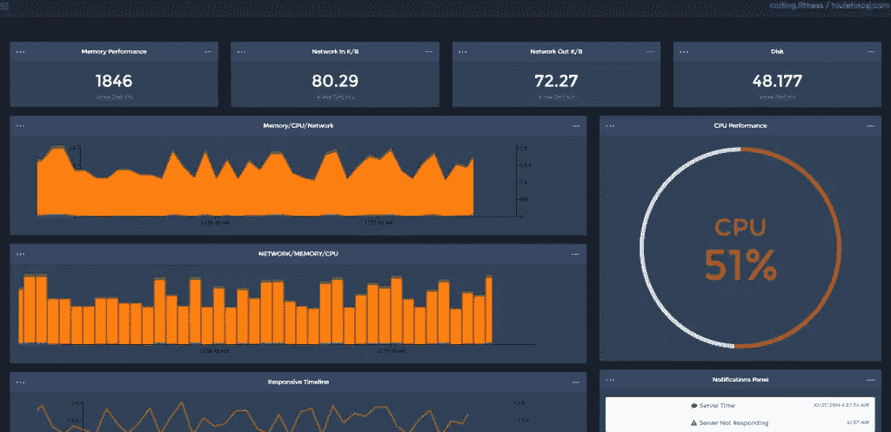
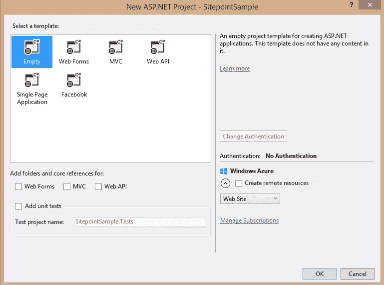
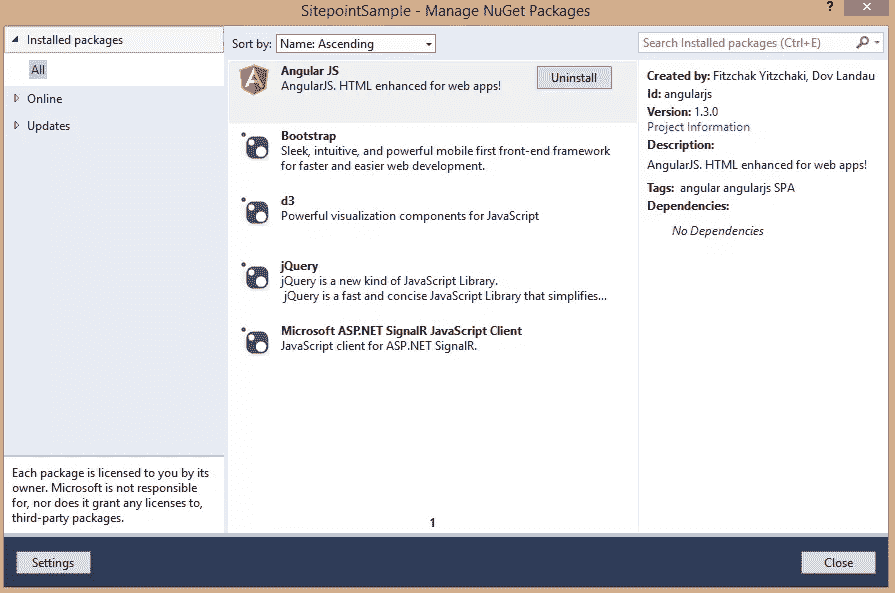
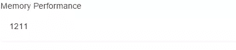
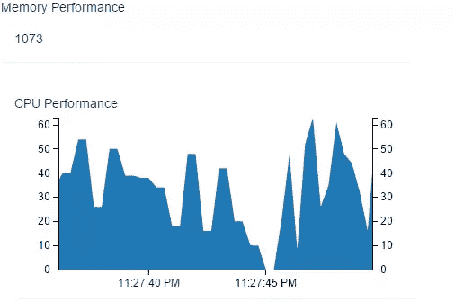
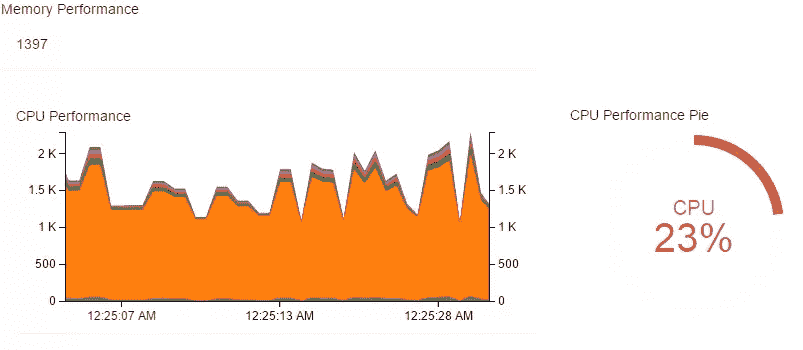
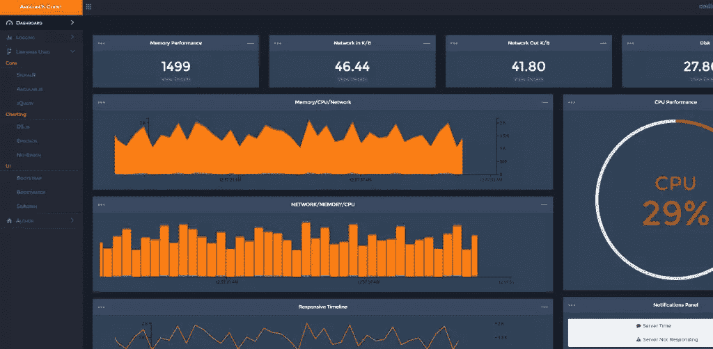
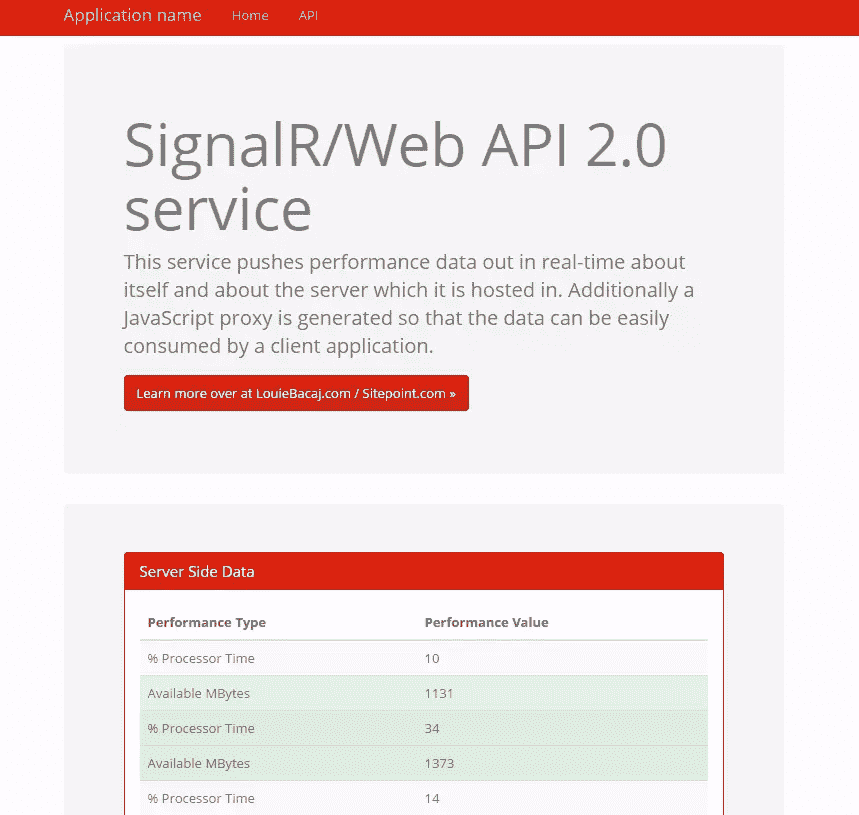

# 用 AngularJS 构建实时信号仪表板

> 原文：<https://www.sitepoint.com/build-real-time-signalr-dashboard-angularjs/>

让我们构建一个实时服务仪表板！



我们的服务仪表板将向我们实时显示真实数据。它将以近乎实时、异步、无阻塞的方式向我们展示我们的服务器和微服务上正在发生的事情。

**在这里看看一个完整的客户端会是什么样子[。](http://angularsignalrdashboardlouiebacaj.azurewebsites.net/)**

**服务器的演示可以在[这里](http://sitepointsignal.cloudapp.net/)看到。**

我们将使用 AngularJS 框架和大量包含大量实时数据的酷酷的实时图表来构建这个仪表板的一个较小版本。我们还将使用来自的 [SignalR](http://signalr.net/) 和 [Web API](http://www.asp.net/web-api) 库来构建我们的服务。净 4.5。

## 技术架构

### 客户

[AngularJS](https://angularjs.org/) 迫使优秀的应用程序开发实践开箱即用。一切都是注入的，这意味着依赖关系的耦合性很低。此外，Angular 在视图、模型和控制器之间有很大的分离。

拐弯抹角的恭维。NET 通过允许服务器端代码保持小的、可管理的和可测试的。服务器端代码只被用于它的优势——做繁重的工作。

### 服务器

使用 SignalR 和 Web API。NET 4.5 和 Socket 使用 Node.js 非常相似。IO，并允许从服务器到订阅客户端的相同类型的非阻塞、异步推送。SignalR 在底层使用 web 套接字，但是因为它抽象了通信，所以当在 Angular 内部运行时，它将退回到客户端浏览器支持的任何技术。(例如，对于较旧的浏览器，它可能会退回到长轮询。)

此外，借助动态标签和 Json.NET 的魔力，JavaScript 被视为一等公民。NET 框架。事实上，在 JavaScript 中使用 Web API 和 SignalR 技术往往比通过 native 更容易。NET 客户端，因为它们是用 JavaScript 构建的。

## 肉和土豆

### 获取设置

**本教程中使用的所有 AngularJS 代码都可以在[这里](https://github.com/sitepoint-editors/SitePointTutorialSimpleAngularClient)找到。**

我将用您最喜欢的文本编辑器和普通文件夹来创建它，也用 Visual Studio 来创建项目。

### 使用纯文本文件设置

文件夹和文件结构如下所示:

```
root
    app     (Angular application specific JavaScript)
    Content (CSS etc.)
    Scripts (Referenced JavaScript etc.)
    ...
    index.html

```

### 主要依赖关系

您需要下载以下文件:

*   [jQuery](http://jquery.com/download/) (选择“下载压缩版，生产 jQuery 2.1.1”链接)
*   [AngularJS](https://angularjs.org/) (点击大下载选项，然后点击 Angular 1.3 的最新版本。+)
*   [引导程序](http://getbootstrap.com/getting-started/#download)(点击“下载引导程序”选项)
*   [SignalR](https://github.com/SignalR/bower-signalr) (点击右边的“下载 ZIP”按钮)
*   [D3.js](http://d3js.org/) (点击页面中间的“d3.zip”链接)
*   [纪元](http://fastly.github.io/epoch/)(点击“下载 v0.6.0 链接”)
*   [ng-epoch](https://github.com/dainbrump/ng-epoch) (点击右边的“下载 ZIP”按钮)
*   [n3-pie](https://github.com/n3-charts/pie-chart) (点击右边的“下载 ZIP”按钮)

在我们的`Scripts`文件夹中，我们需要:

*   `jquery-2.1.1.min.js`
*   `angular.min.js`
*   `bootstrap.min.js`
*   `jquery.signalR.min.js`
*   `d3.min.js`
*   `epoch.min.js`
*   `pie-chart.min.js`

在我们的`Content`文件夹中:

*   `bootstrap.min.css`
*   `epoch.min.css`

### 使用 Visual Studio 进行设置

如果文本文件对您来说过于简单，那么通过 Visual Studio 进行设置是非常简单的。

只需转到`File -> New -> Project`设置一个空的 web 应用程序，然后选择 Web 作为模板类型。



然后只需右击项目，进入`Manage Nuget Packages`，搜索并下载 jQuery、AngularJS、Bootstrap、D3 和 SignalR JavaScript 客户端。

下载并安装这些文件后，您应该可以在脚本和内容文件夹中看到它们。此外，在已安装的 Nuget 软件包下，您将看到以下内容:



最后，Nuget 不包含 Epoch、ng-epoch 和 n3 图表库，所以您需要手动添加它们。只需按照上一节中详细介绍的步骤来获得这些。

## 让我们编写我们的应用程序

现在我们准备写一些代码。

首先，让我们创建我们的基本`index.html`文件，它将存放我们的 Angular JavaScript 代码。

```
<!DOCTYPE html>
<html xmlns="https://www.w3.org/1999/xhtml">
<head>
  <meta charset="utf-8">
  <meta http-equiv="X-UA-Compatible" content="IE=edge">
  <meta name="viewport" content="width=device-width, initial-scale=1">
  <title>AngularJS - SignalR - ServiceDashboard</title>
  <link rel="stylesheet" href="Content/bootstrap.min.css" />
  <link rel="stylesheet" href="Content/epoch.min.css" />

  <script src="Scripts/jquery-1.11.0.js"></script>
  <script src="Scripts/bootstrap.min.js"></script>
  <script src="Scripts/jquery.signalR-2.1.2.min.js"></script>
  <script src="Scripts/angular.min.js"></script>

  <script src="Scripts/d3.min.js"></script>
  <script src="Scripts/epoch.min.js"></script>
  <script src="Scripts/ng-epoch.js"></script>
  <script src="Scripts/pie-chart.min.js"></script>

  <script src="app/app.js"></script>
  <script src="app/services.js"></script>
  <script src="app/directives.js"></script>
  <script src="app/controllers.js"></script>

</head>
  <body ng-app="angularServiceDashboard">
  </body>
</html>
```

这里发生了一些事情。首先，我们要添加所有的依赖项，以便它们可以加载。其次，我们引用了一些尚不存在的新文件(app 文件夹中的所有文件)。我们接下来会写这些。

让我们进入我们的应用程序文件夹，创建我们的`app.js`文件。这是一个非常简单的文件。

```
'use strict';

var app = angular.module('angularServiceDashboard', ['ng.epoch','n3-pie-chart']);
app.value('backendServerUrl', 'http://sitepointsignal.cloudapp.net/');
```

这个文件为我们做了一些事情。它设置了我们的主应用程序模块`angularServiceDashboard`并注入了我们的两个外部引用——`ng.epoch`,这是我们对 Angular 的 Epoch.js 指令，以及`n3-pie-chart`,这是一个为 Angular 设计的图表库，结构合理。

如果您注意到了，我们还为`backendServerUrl`注入了一个值，当然它是在其他地方托管的，我们计划在这里使用它。

让我们创建一个绑定到服务器 URL 的服务工厂类。这将是我们在 HTML 中引用的`services.js`文件，它将进入 app 文件夹:

```
'use strict';

app.factory('backendHubProxy', ['$rootScope', 'backendServerUrl', 
  function ($rootScope, backendServerUrl) {

    function backendFactory(serverUrl, hubName) {
      var connection = $.hubConnection(backendServerUrl);
      var proxy = connection.createHubProxy(hubName);

      connection.start().done(function () { });

      return {
        on: function (eventName, callback) {
              proxy.on(eventName, function (result) {
                $rootScope.$apply(function () {
                  if (callback) {
                    callback(result);
                  }
                 });
               });
             },
        invoke: function (methodName, callback) {
                  proxy.invoke(methodName)
                  .done(function (result) {
                    $rootScope.$apply(function () {
                      if (callback) {
                        callback(result);
                      }
                    });
                  });
                }
      };
    };

    return backendFactory;
}]);
```

这段代码使用了流行的`on`和`off`(没有关闭，因为我们在这里不需要它)订阅模式，并通过使用 Angular factory 封装了我们的应用程序与 SignalR 的所有通信。

这段代码一开始可能看起来有点让人不知所措，但是当我们构建我们的控制器时，你会更好地理解它。它所做的只是接收我们后端 SignalR 服务器的 URL 和 SignalR hub 名称。(在 SignalR 中，您可以在同一台服务器中使用多个集线器来推送数据。)

此外，这段代码允许 SignalR 服务器通过`on`方法调用我们的应用程序，该服务器位于另一个机器上的某个地方。它允许我们的应用程序通过`invoke`方法调用 SignalR 服务器内部的函数。

接下来，我们需要我们的控制器，它将把来自服务的数据绑定到我们的范围。让我们在 app 文件夹中创建一个名为`controllers.js`的文件。

```
'use strict';

app.controller('PerformanceDataController', ['$scope', 'backendHubProxy',
  function ($scope, backendHubProxy) {
    console.log('trying to connect to service')
    var performanceDataHub = backendHubProxy(backendHubProxy.defaultServer, 'performanceHub');
    console.log('connected to service')
    $scope.currentRamNumber = 68;

    performanceDataHub.on('broadcastPerformance', function (data) {
      data.forEach(function (dataItem) {
        switch(dataItem.categoryName) {
          case 'Processor':
            break;
          case 'Memory':
            $scope.currentRamNumber = dataItem.value;
            break;
          case 'Network In':
            break;
          case 'Network Out':
            break;
          case 'Disk Read Bytes/Sec':
            break;
          case 'Disk Write Bytes/Sec':
            break;
          default:
            //default code block
            break;           
        }
      });     
    });
  }
]);
```

这个控制器在这里做一些事情。它创建了我们的 Angular 服务对象，并为它绑定了一个回调函数，这样服务器就有东西可以在我们的控制器中调用了。

您将看到，我们正在遍历服务器每次回调我们时返回的 JSON 数组。然后，我们对每种性能类型都有一个 switch 语句。现在，我们将设置内存，然后回来充实其余的内容。

就我们的指令而言，我们真的只需要一个纪元表。我们将使用一个名为 [`ng-epoch.js`](https://github.com/dainbrump/ng-epoch) 的开源指令，我们已经在存根`index.html`文件中引用了它。

我们可以将所有这些图表分割成不同的指令，使用一些模板并使用 [UI-Router](https://github.com/angular-ui/ui-router) ，但是我们将保持这里的简单，并将我们所有的视图转储到我们的`index.html`文件中。

现在让我们将我们的视图添加到`index.html`文件中。为此，我们可以在 body 标签下添加以下内容:

```
<div class="row" ng-controller="PerformanceDataController">
  <div class="col-lg-3 col-md-6">
    <div class="panel panel-dashboard">
      <div class="center">Memory Performance</div>
        <div class="panel-body">
          <div class="huge">{{currentRamNumber}}</div>
          <div class="clearfix"></div>
        </div>
      </div>
    </div>
  </div>
</div>
```

这将简单地为服务器创建一个位置来推回 RAM 数据。数据将首先到达我们的服务，然后到达控制器，最后到达视图。

它应该是这样的:



现在让我们添加一些图表，这是我们真正想要做的。我们将为`epoch.js`时间轴添加一个名为`timestamp`的变量。我们还将添加一个名为`chartEntry`的数组，我们将把它绑定到我们的`epoch.ng`指令。

```
var timestamp = ((new Date()).getTime() / 1000) | 0;
var chartEntry = [];
```

然后，让我们映射我们的`switch`语句中的数据，并添加其余必需的`epoch.js`数据项。当然，我们可以进一步分解它(比如使用更多的函数和过滤器)，但是为了本教程的缘故，我们将保持事情简单。

```
'use strict';

app.controller('PerformanceDataController', ['$scope', 'backendHubProxy',
  function ($scope, backendHubProxy) {
    ...

    $scope.currentRamNumber = 68;
    $scope.realtimeArea = [{ label: 'Layer 1', values: [] }];

    performanceDataHub.on('broadcastPerformance', function (data) {
      var timestamp = ((new Date()).getTime() / 1000) | 0;
      var chartEntry = [];

        data.forEach(function (dataItem) {
          switch(dataItem.categoryName) {
            case 'Processor':
              $scope.cpuData = dataItem.value;
              chartEntry.push({ time: timestamp, y: dataItem.value });
              console.log(chartEntry)
              break;
            case 'Memory':
              $scope.currentRamNumber = dataItem.value;
              break;
            case 'Network In':
              break;
            case 'Network Out':
              break;
            case 'Disk Read Bytes/Sec':
              break;
            case 'Disk Write Bytes/Sec':
              break;
            default:
              //default code block
              break;
          }
        });
        $scope.realtimeAreaFeed = chartEntry;
      });
      $scope.areaAxes = ['left','right','bottom'];
  }
]);
```

我们的控制器看起来更加充实了。我们向范围添加了一个`realtimeAreaFeed`，我们将通过`ng-epoch`指令将它绑定到我们的视图，我们还向范围添加了`areaAxes`，它决定了面积图的布局。

现在让我们将指令添加到`index.html`并显示 CPU 值的数据:

```
<div class="row" ng-controller="PerformanceDataController">
  <div class="panel-body" ng-controller="PerformanceDataController">

    <epoch-live-area chart-class="category10" 
                     chart-height="200" 
                     chart-data="realtimeArea" 
                     chart-stream="realtimeAreaFeed" 
                     chart-axes="areaAxes">
    </epoch-live-area>
  </div>
</div>
```

`chart-class`指 D3.js 的着色方案，`chart-height`是你怀疑的，`chart-stream`是 SignalR 服务器传回的数据。

有了这些，我们应该可以实时看到图表:



现在让我们将一大堆数据点连接到这个图表上，并从 n3-pie 框架中添加另一个完整的图表(因为谁不喜欢 pie 呢！).

要从 n3-pie 框架添加饼图，只需将以下内容添加到我们的控制器中:

```
$scope.data = [
  { label: 'CPU', value: 78, color: '#d62728', suffix: '%' }
];
```

当然，`value`将由 SignalR 服务器更新。你可以在[中看到我们控制器](https://github.com/sitepoint-editors/SitePointTutorialSimpleAngularClient/blob/master/app/controllers.js)的完整代码。

我们还应该花点时间考虑一下视图的[完整代码。](https://github.com/sitepoint-editors/SitePointTutorialSimpleAngularClient/blob/master/index.html)

我们应该会在屏幕上看到以下数据:



我们已经看到 Angular 可以非常容易地连接到 SignalR 只需在 AngularJS 服务或工厂中插入端点。AngularJS 工厂是一个与 SignalR 通信的封装机制。谁知道安古拉杰和。NET 在[【结婚】](http://louiebacaj.com/lets-marry-up-angular-to-net-2/)的时候会这么好的一起工作？

## 服务器的核心方面

我会稍微检查一下。允许这种通信发生在后端的. NET 代码。(你可以在这里找到源代码[。)](https://github.com/sitepoint-editors/SitePointTutorialBackendServer)

要首先开始构建服务器代码，您需要让 SignalR 在您的 Visual Studio 解决方案中运行。要做到这一点，只需按照在[ASP.NET](http://www.asp.net/signalr)的伟大教程来运行基本的 SignalR 解决方案。([这个](http://www.asp.net/signalr/overview/getting-started/tutorial-getting-started-with-signalr)是最简单的一个。)

启动并运行后，将 C# `Hub`类更改为以下内容:

```
public class PerformanceHub : Hub
{
  public void SendPerformance(IList<PerformanceModel> performanceModels)
  {
    Clients.All.broadcastPerformance(performanceModels);
  }

  public void Heartbeat()
  {
    Clients.All.heartbeat();
  }

  public override Task OnConnected()
  {
    return (base.OnConnected());
  }
}
```

一旦你改变了`Hub`类，Visual Studio 将会抱怨，你将需要添加一个性能模型(由于 Json，当它被服务器推出时，它会自动转换成 JSON。净):

```
using System;
using System.Collections.Generic;
using System.Linq;
using System.Web;
using Newtonsoft.Json;

namespace SignalrWebService.Models
{
  public class PerformanceModel
  {
    [JsonProperty("machineName")]
    public string MachineName { get; set; }

    [JsonProperty("categoryName")]
    public string CategoryName { get; set; }

    [JsonProperty("counterName")]
    public string CounterName { get; set; }

    [JsonProperty("instanceName")]
    public string InstanceName { get; set; }

    [JsonProperty("value")]
    public double Value { get; set; }
  }
}
```

`JsonProperty`元数据只是告诉 Json.NET 在为这个模型转换成 JSON 时，自动将属性名转换成小写。JavaScript 喜欢小写。

让我们添加一个`PerformanceEngine`类，它会将真实的性能数据推送给任何愿意倾听的人。引擎通过 SignalR 将这些消息发送给异步后台线程上的任何监听客户端。

由于它的长度，你可以在我们的 GitHub repo 上找到[代码。](https://github.com/sitepoint-editors/SitePointTutorialBackendServer/blob/master/SignalrWebService/Performance/PerformanceEngine.cs)

这段代码基本上将一组性能指标推送给每个`while`迭代中订阅的任何人。这些性能指标被注入到构造函数中。服务器推送的速度在构造器参数`pollIntervalMillis`中设置。

注意，如果你使用 [OWIN](http://owin.org/) 作为自己的主机来托管 SignalR，这将会很好，如果你使用 web worker，这也将会很好。

当然，最后要做的事情是在您的服务`OnStart()`或您的`Startup`类中启动后台线程。

```
using System;
using System.Collections.Generic;
using System.Linq;
using System.Web;
using Owin;
using System.Threading.Tasks;
using Microsoft.Owin;
using SignalrWebService.Performance;
using Microsoft.Owin.Cors;
using Microsoft.AspNet.SignalR;
using SignalrWebService.Models;

[assembly: OwinStartup(typeof(SignalrWebService.Startup))]

namespace SignalrWebService
{
  public class Startup
  {
    public void Configuration(IAppBuilder app)
    {
      app.UseCors(CorsOptions.AllowAll);
      var hubConfiguration = new HubConfiguration();
      hubConfiguration.EnableDetailedErrors = true;
      app.MapSignalR(hubConfiguration);

      PerformanceEngine performanceEngine = new PerformanceEngine(800, GetRequiredPerformanceMonitors());
      Task.Factory.StartNew(async () => await performanceEngine.OnPerformanceMonitor());
    }
  }
}
```

开始监控后台线程的两行代码(我相信你已经猜到了)是我们实例化`PerformanceEngine`和调用`OnPerformanceMonitor()`的代码。

现在，我知道你可能会认为我在对服务器上的数据进行随机化，这是真的。但是要推送真正的指标，只需使用 Windows 提供的`System.Diagnostics`库和`PerformanceCounter`即可。我尽量保持简单，但代码看起来应该是这样的:

```
public static readonly IEnumerable<PerformanceCounter> ServiceCounters = new[]
{
  //http://weblogs.thinktecture.com/ingo/2004/06/getting-the-current-process-your-own-cpu-usage.html
  new PerformanceCounter("Processor Information", "% Processor Time", "_Total"),
  new PerformanceCounter("Memory", "Available MBytes"),
  new PerformanceCounter("Process", "% Processor Time", GetCurrentProcessInstanceName(), true),
  new PerformanceCounter("Process", "Working Set", GetCurrentProcessInstanceName(), true)
};
```

## 结论

我们已经看到了如何通过 Angular 使用 SignalR 数据，并且我们已经将这些数据连接到 Angular 端的实时图表框架。

**客户端**最终版本的演示可以在[这里](http://angularsignalrdashboardlouiebacaj.azurewebsites.net/)看到，也可以在[这里](https://github.com/sitepoint-editors/SitePointTutorialFinalAngularClient)拿到代码。



**服务器**最终版本的演示可以在[这里](http://sitepointsignal.cloudapp.net/)看到，也可以在[这里](https://github.com/sitepoint-editors/SitePointTutorialBackendServer)拿到代码。



我希望你喜欢这次演练。如果你尝试过类似的东西，请在评论中告诉我们！

## 分享这篇文章