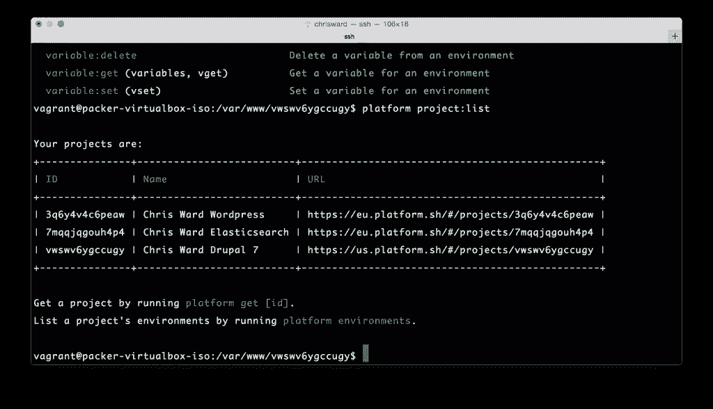
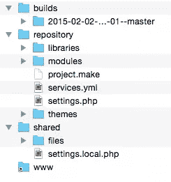
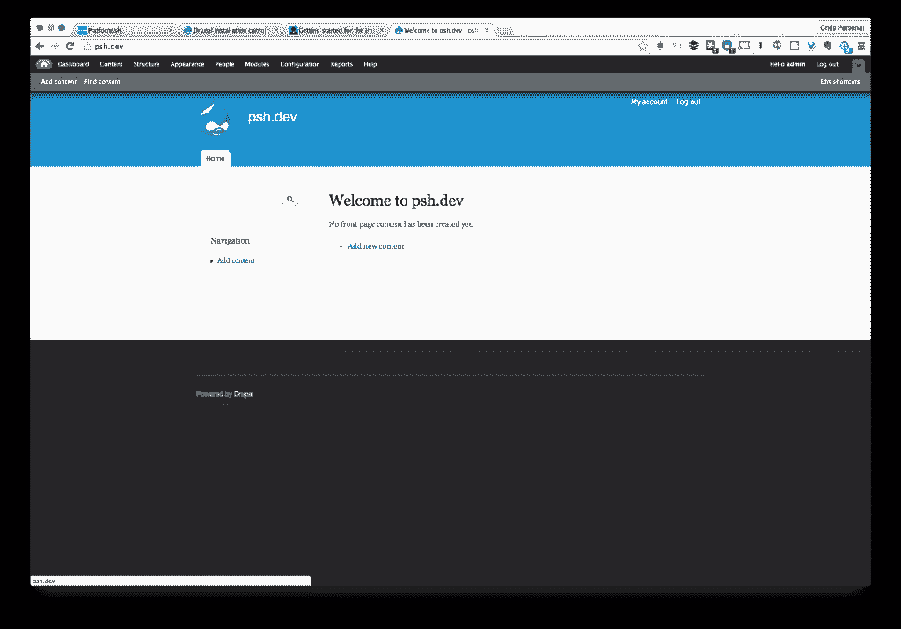
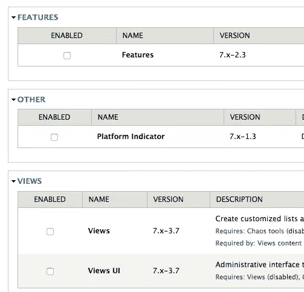
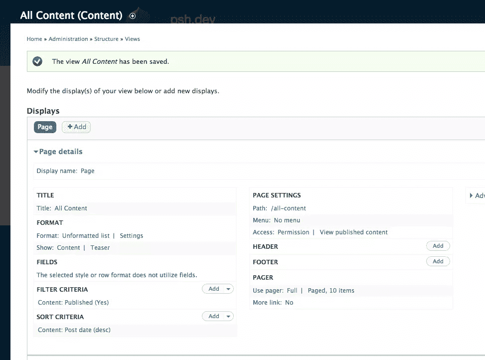
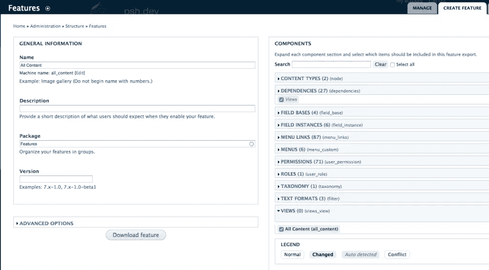
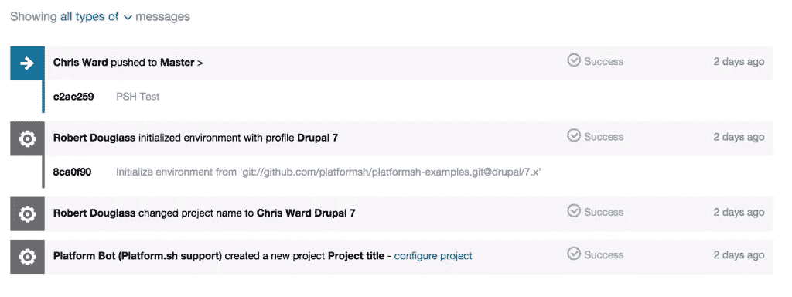
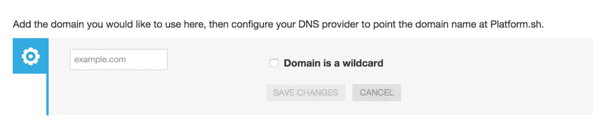
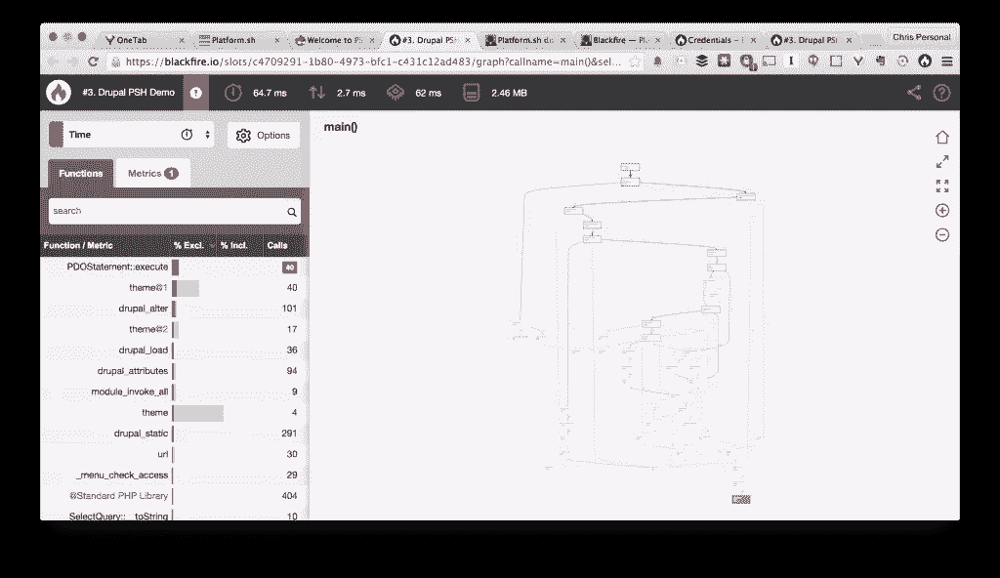
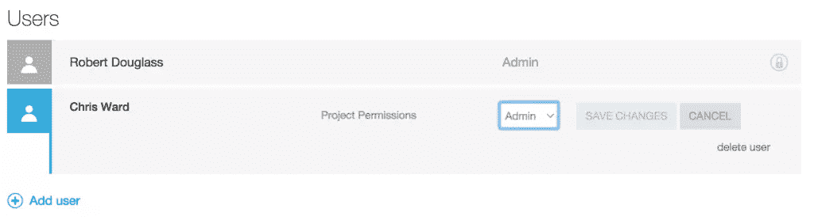

# 首先看一下 platform . sh——一个开发和部署 SaaS

> 原文：<https://www.sitepoint.com/first-look-platform-sh-development-deployment-saas/>

不久以前，我们中的许多人都满足于通过 FTP 将文件上传到 web 服务器来处理项目的部署。直到最近，我一直在做这件事，现在偶尔还会做(不要告诉任何人！).在过去几年的某个时候，对 web 应用程序提供的服务和功能的需求增加了，团队规模扩大了，快速迭代成为了常态。旧的部署方法变得不稳定、不可靠并且(通常)不可信。


因此诞生了一波新的工具、服务和工作流，旨在简化部署复杂 web 应用程序的过程，以及大量伴随的商业服务。一般来说，它们以有竞争力的价格提供了一个集成的工具集，用于版本控制、托管、性能和安全性。

[Platform.sh](http://Platform.sh) 是市场上的一个新玩家，由 [Commerce Guys](https://commerceguys.com/) 的团队创建，他们以 Drupal 电子商务解决方案而闻名。最初，该服务只支持基于 Drupal 的托管和部署，但它很快增加了对 Symfony、WordPress、Zend 和“纯”PHP 的支持，node.js、Python 和 Ruby 也即将推出。

它遵循[微服务架构](http://martinfowler.com/articles/microservices.html)概念，并提供越来越多的服务器、性能和配置选项，可轻松添加到您的应用堆栈中或从中删除。

我倾向于通过一个简单的例子来发现这些服务更有意义。我将使用 Drupal 平台，因为这是我最熟悉的平台。

对于每个平台，Platform.sh 都有一些不同的要求。在 Drupal 中，它们是:

*   id_rsa 公钥/私钥对
*   饭桶
*   设计者
*   Platform.sh CLI
*   刷

我不会在这里介绍安装这些；更多细节可以在 [Platform.sh 文档部分](https://docs.platform.sh)找到。

我有几个由 Platform.sh 团队为我创建的测试平台，为了这个例子，我们可以把这些当作我的工作场所，把我添加到一些我需要工作的新项目中。通过在我的首选工作目录中发出`platform project:list`命令，我可以看到这些列表。



使用`platform get ID`命令获得一个平台的本地副本(id 在上面的表格中列出)。

这将下载相关的代码库并执行一些构建任务，您需要知道的任何额外信息都显示在终端窗口中。完成后，您将拥有以下文件夹结构:



文件夹是你的代码库，这里是你修改和提交的地方。对于 Drupal 来说，这是添加模块、主题和库的地方。

`build`文件夹包含您的项目的构建，即 drupal 核心的组合，以及您在`repository`文件夹中所做的任何更改。

`shared`文件夹包含您的本地设置和文件/文件夹，仅与您的开发副本相关。

最后是`www`符号链接，它总是引用当前的构建。这将是您的`vhost`或等效文件的`DOCROOT`。

## 让你的网站运行起来

Drupal 仍然依赖于数据库的存在来开始，所以如果我们需要它，我们可以通过发出:

```
platform drush sql-dump > d7.sql
```

然后，我们可以将数据库导入本地机器，并相应地更新`shared/settings.local.php`中的凭证。

瞧啊。我们起来工作了！



## 让我们开始发展

让我们做一些简单的事情:添加[视图](http://drupal.org/project/views)和[功能](http://drupal.org/project/features)模块。Platform.sh 使用的是 [Drush make](https://www.drupal.org/project/drush_make) 文件，所以这与你可能习惯的过程不同。打开`project.make`文件，并向其中添加相关条目。在我们的例子中，它是:

```
projects[ctools][version] = "1.6"
projects[ctools][subdir] = "contrib"

projects[views][version] = "3.7"
projects[views][subdir] = "contrib"

projects[features][version] = "2.3"
projects[features][subdir] = "contrib"

projects[devel][version] = "1.5"
projects[devel][subdir] = "contrib"
```

在这里，我们设置我们想要包含的项目、特定的版本以及我们想要将它们放入模块文件夹的哪个子文件夹中。

用`platform build`重建平台。您应该注意到下载的开发、ctools、特性和视图模块，我们可以通过快速访问模块页面来确认这一点:



您会注意到，每次我们发出 build 命令时，都会在 builds 文件夹中创建一个新版本的站点。这对于在出现问题时快速恢复到我们项目的早期版本是非常完美的。

现在，让我们走一条典型的 Drupal 开发道路，创建一个视图并将其添加到一个特性中，以便在我们的团队中共享。启用我们刚刚添加的所有模块，通过 Drush 或模块页面，用 Devel Generate 特性生成一些虚拟内容。

现在，创建一个显示网站上所有内容的页面视图:



将其添加到功能中:



解压缩创建的归档文件，并将其添加到`repository -> modules`文件夹中。提交并将此文件夹推送到版本控制。现在，运行`platform build`命令的任何其他团队成员都将收到他们直接投入工作所需的所有更新。

然后，您可以按照您的正常流程获取应用于本地站点的模块、功能和主题更改，如更新挂钩或基于概要文件的开发。

## Platform.sh 还能做什么？

这简化了团队之间的开发过程，但是 Platform.sh 还提供了什么使它比其他类似的选项更有吸引力呢？

如果你是一个从事多种项目类型的代理人或自由职业者，更广泛的 CMS/框架/语言支持，所有这些都托管在同一个地方，并有统一的版本控制和备份，是一个令人信服的理由。

关于版本控制，platform.sh 提供了对 git 提交和分支的可视化管理和记录，这对于审查项目的代码和状态非常有用。除此之外，您可以随时创建项目的快照，包括代码和数据库。



当您准备好将您的站点推向现场时，只需从项目配置页面分配 DNS 和域即可。



### 性能、分析和其他优势

默认情况下，您的项目可以访问与 [Redis](https://docs.platform.sh/toolstacks/php/drupal/redis/) 、 [Solr](https://docs.platform.sh/toolstacks/php/drupal/solr/) 和 [EntityCache / AuthCache](https://docs.platform.sh/toolstacks/php/drupal/cache/) 的集成。只需要安装相关的 Drupal 模块，并将它们指向内置的服务器细节。

对于档案， [Platform.sh 刚刚增加了对 Sensiolabs Blackfire](https://platform.sh/new-features/blackfire-integration/) 的支持，你所需要做的就是安装[浏览器伴侣](https://chrome.google.com/webstore/detail/blackfire-companion/miefikpgahefdbcgoiicnmpbeeomffld/related?hl=en)，[添加你的凭证](https://docs.platform.sh/integration/blackfire/?highlight=blackfire)，创建一个帐户，然后你就可以开始了。



默认情况下包括备份以及从备份中恢复的能力。

团队成员可以在项目级别和环境级别被分配权限，允许团队成员在项目之间以及他们在每个项目中承担的角色之间轻松转换。



Platform.sh 提供了一些超越其最接近的竞争对手( [Pantheon](https://pantheon.io/) 和 [Acquia](https://www.acquia.com/products-services/acquia-cloud) )的引人注目的功能，并且定价具有竞争力。对于所有这些 SaaS 产品，要做出的主要决定是受限的服务器访问和“做事方式”对您的团队及其工作流是帮助还是阻碍。我很想在下面的评论中了解你的经历或想法。

## 分享这篇文章