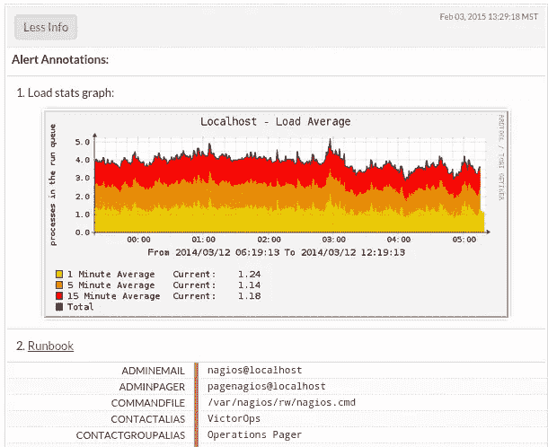
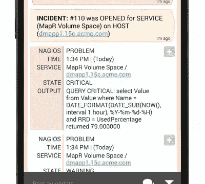

# 如何使用 VictorOps 管理停机

> 原文：<https://www.sitepoint.com/alert-post-mortem-manage-outage-victorops/>

*本文由 [VictorOps](http://victorops.com/) 赞助。感谢您对使 SitePoint 成为可能的赞助商的支持。*

当您被通知您的任务关键型应用程序或网站关闭或无法正常工作时，会发生什么情况？当然，大多数团队都有大量的服务来告诉他们什么时候出了问题，但是当需要实现解决方案的时候，你会怎么做呢？你需要一个计划，以及快速实施计划的能力。DevOps 方法看似简单，但实际上很复杂。幸运的是，有一些服务可以让这个过程变得更容易。

## Enter: VictorOps

这些服务之一是 [VictorOps](http://victorops.com/) 。VictorOps 将在随叫随到流程的各个方面帮助简化开发工作。他们通过提供大量的特性来做到这一点，每一个特性都旨在更好地管理多样化的 DevOps 团队的内部工作。

VictorOps 平台包括呼叫管理、事件通知、高级时间表功能、团队协作和警报注释/转换等功能。这些特性中的每一个都可以定制，并且可以证明对任何团队都是有用的，无论其规模或能力如何。当 VictorOps 支持您的团队时，DevOps 工程师面临的许多挑战开始消失([警报疲劳是真实的！](http://victorops.com/blog/axis41-case-study/))，让你的团队回到一个富有成效和有益的状态。

## VictorOps 的生命周期

每个事件都有自己的生命周期，从收到警报到事件结束后进行事后分析。记住这一点，让我们看看 VictorOps 如何帮助您完成事件生命周期，从而帮助您更快地解决问题。

[向 VictorOps 发送您的提醒](http://blog.librato.com/posts/sending-your-alerts-to-victorops)

### 过滤警报

警报无时无刻不在传来，虽然有些警报包含重要信息，但许多警报可能是不相关的，没有帮助。也就是说，VictorOps 在事件生命周期中帮助您实现的第一件事是确保通过高级路由向正确的人发出问题域内问题的警报。

高级路由允许您以编程方式提醒待命团队成员需要注意的问题。一旦 VictorOps 遇到您定义为严重的警报，它就会完全按照您设置的方式开始寻呼过程，它本身可以进行大量定制和用户特定的设置。可以通过推送通知、SMS、电子邮件和电话，以特定和预定的时间间隔，向用户寻呼关于传入警报的信息。

[Transmogrifier](http://victorops.com/transmogrifier/) 是最近推出的 VictorOps 功能，它可以极大地增加普通警报可以提供的价值。此功能允许在满足特定条件时升级警报，并使用文档和/或开发人员特定注释等进行注释。你可以在这里查看变形人[的详细概览](https://www.sitepoint.com/transmogrify-devops-alerts-avoid-downtime/)。

### 时间线

在过滤您的警报并通知开发人员电话技术支持后，VictorOps 时间线可帮助您了解事件的整体情况。该时间表可通过桌面和移动设备访问，使您能够帮助解决办公室内外的问题。时间线也是多线程的，这意味着您可以利用时间线来了解系统中可能导致问题的其他警报的情况，而不只是显示与单个警报相关的有限信息。将时间线视为 VictorOps 平台的主要关注点。时间线显示来自您的系统的所有警报、谁被寻呼，以及与问题识别和解决相关的对话。

### 利用事件窗格

DevOps 团队的成员可以看到事件窗格，这是他们系统中关键警报的精简视图。在那里，他们可以将问题确认或重新路由到一个或多个团队，同时还能够按呼叫他们的项目、呼叫他们所在的团队或所有呼叫事件来筛选事件窗格。

### 沟通

在整个事件生命周期中，VictorOps 提供了广泛的沟通工具，以确保您的团队能够协同工作。这包括 Twitter 惯例，如@messaging 和聊天平台集成(尽管 VictorOps 通过@@messaging 进一步发展了这一概念，允许您在聊天中 ping 整个团队)。说到聊天，VictorOps 提供了与贵公司使用的任何聊天客户端的强大集成，包括与 Slack 和 HipChat 的双向集成。用户甚至可以讨论具体的事件，将他们的笔记作为事件解决日志的一部分。

### 验尸和报告

尽管警报可能得到解决，但事件生命周期并未结束。收集关于您的团队如何处理警报的信息总是很重要，以便在必要时可以进行改进。这也是 VictorOps 为用户提供事后分析工具的原因。该工具将允许您提取时间表的一部分，用于回顾和报告内部和外部成员的 SLA。

VictorOps 通过事件频率和事后分析报告支持“连续记录”,这有助于讨论是否所有警报都是可操作的，如果是，操作手册和分类记录是否是最新的。

[youtube v=9lPenLEbk-8]

## 穿越一个假想的警报

假设您已经在 VictorOps 平台上设置好了，并且收到了第一个警报。会发生什么？在警报到达你之前，变形人已经在努力工作，确保正确的警报到达正确的人手中，并且解决问题所需的所有信息都随之而来。你甚至可以就此打住，仅仅是因为变形金刚为你处理了这么多，一旦困难的问题在几分钟内得到解决。但是让我们假设这个警报通知您一个特别具有挑战性的错误。使用 Transmogrifier 提供的自定义过滤器，一些其他成员会收到问题通知，确保您的团队中所有正确的人都参与了战斗。那么下一步是什么？

下一步也是最有帮助的事情是访问 VictorOps 时间轴。在这里你可以鸟瞰整个事件的发展。因为这个特殊的问题是一个大问题，所以您可能会收到一些与之相关的其他警报和警告。不过不要担心，因为事件窗格将允许您在一英里之外看到这种情况，并且您可以忽略这些新警报，而不是感到困惑和潜在的资源浪费，因为您知道一旦更大的问题得到解决，它们就会消失。

您的主要开发人员可以访问事件窗格，这是一件好事，因为您的一些团队成员意识到他们需要一些其他开发人员的帮助。听到这个消息后，他们很快就能呼叫更多的队员，为战斗带来更多的支持。但是你们是怎么保持联系的呢？当然是 VictorOps 聊天集成！在过去，很多这样的问题都可以通过电子邮件来解决，这导致了混乱和响应时间过长。但是现在，您已经拥有了 VictorOps 的强大功能，随之而来的是一系列优秀的沟通工具，确保您的所有团队成员都保持一致。

最终(迅速，希望！)警报最终得到了解决，从而最大限度地减少了停机时间，并为您的团队成员带来了总体积极的体验。但是我们现在还不能停下来！在明天早上的 scrum 上，你会想和你的团队一起检查这个问题，详细说明哪里出了问题，如何修复，以及下次如何做得更好来防止这个问题。这就是 VictorOps 的事后分析工具的用武之地。借助事后分析工具，您可以找出警报时间表中最相关的部分，以显示整个警报生命周期中最关键的问题。利用这些信息，你可以帮助你的团队制定一个计划，以确保你今天解决的问题不会成为你明天必须再次解决的问题。

## 结论

使用 VictorOps 可以在每次事故之前、之中和之后进行更好的沟通、规划和事后检查。在我给出的例子中，一个 DevOps 团队有了一个基本的计划和工具来实现它，成功地以一种比传统方法更有组织、更精简的方式解决了一个问题。VictorOps 平台不仅能够加快响应速度，还能加快解决问题的速度。最重要的是，VictorOps 为您的随叫随到团队提供大量功能，确保他们的工作效率，同时限制警报疲劳。如果您对 VictorOps 将如何为您的团队工作感兴趣，[请点击此处免费试用 14 天](http://victorops.com/product/#signup)！

*要了解 VictorOps 如何帮助您度过整个事故生命周期，请查看[他们的指南](https://victorops.com/knowledge-drop/devops-docs/incident-lifecycle-guide/)，该指南对每个阶段进行了单独细分。*

## 分享这篇文章