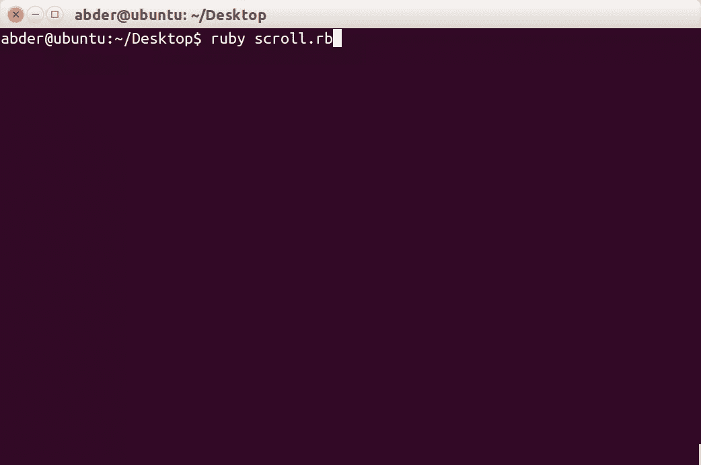
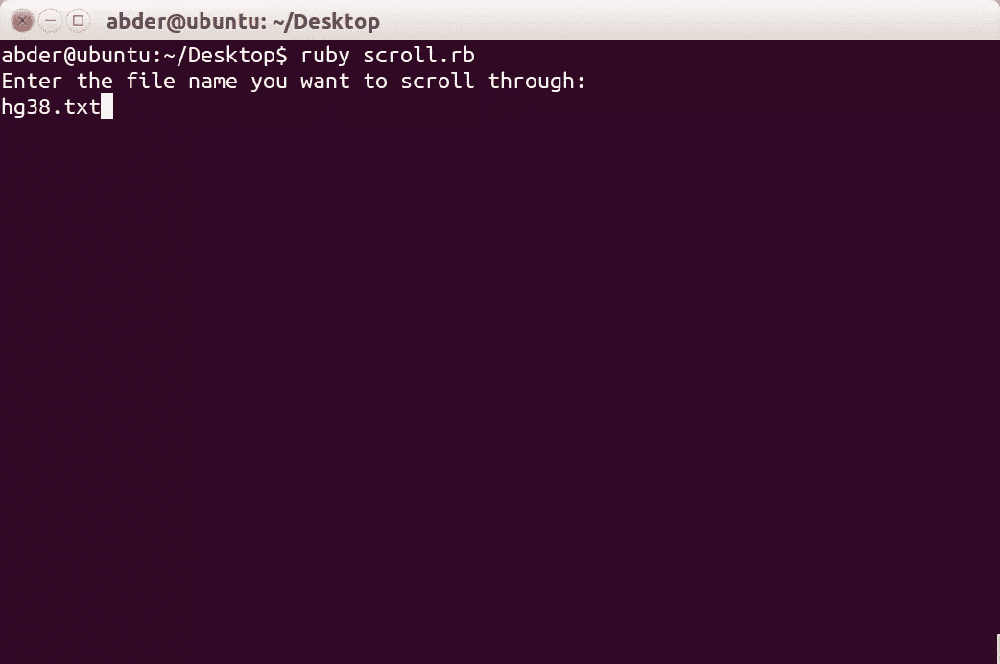
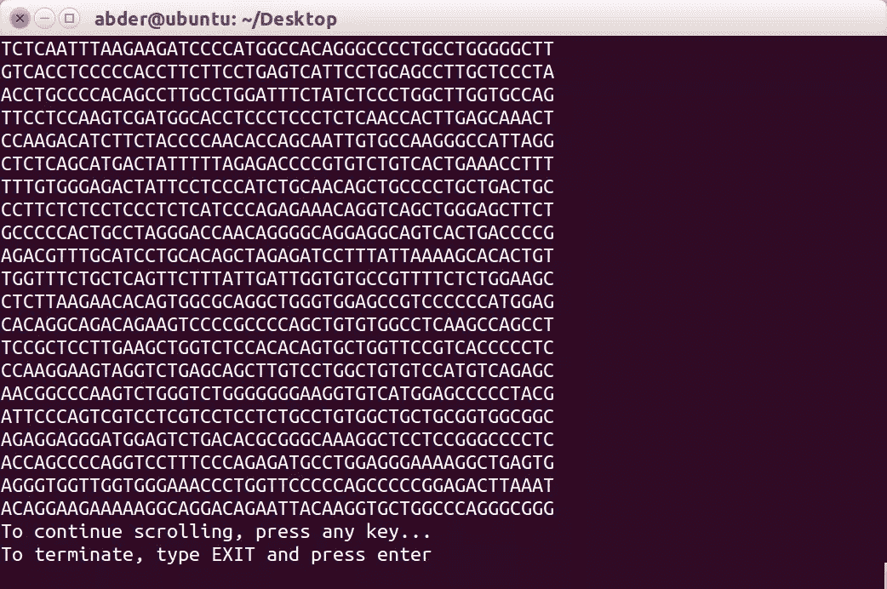

# Ruby on Medicine:滚动浏览大文件

> 原文：<https://www.sitepoint.com/ruby-medicine-scrolling-large-files/>


在我的教程[处理大文件](https://www.sitepoint.com/ruby-medicine-handling-large-files/)中，我们看到了如何使用 Ruby 从一个大文本文件中提取部分文本。该帖子中的文件非常大(3.3 GB！)，现在是时候稍微改进一下我们在过去教程中使用的方法了。

今天，我们不想提取大文本文件的一部分，而是想通过它来导航。换句话说，我们希望以 Ruby 的方式平滑地滚动这个大文本文件！

为了不在术语和我们将要处理的*文件*方面重新发明轮子，请参见[处理大文件](https://www.sitepoint.com/ruby-medicine-handling-large-files/)的“术语”和“获取文件”部分。术语部分将向您介绍一些对本教程有用的概念。后一部分向您展示了从哪里获取这个大的文本文件，因为这是我们将在本教程中使用的玩具。

让我们开始吧。

## 读，读，直到你累了…

我们现在有一个非常大的文本文件。你可能习惯了文本文件是最小的文件。然而，就基因组而言，情况并非如此。当你打开一个与基因组相关的文本文件时，你会读到很多，我是说很多！

如上所述，我们不想提取这个大文本文件的某个部分，而是希望平滑地浏览(滚动)文本文件。这个想法是，你可以决定继续滚动直到你厌倦这个过程，而不是像上一篇教程中那样一部分一部分地获取。

前一篇文章展示了我用来打开文本文件的文本编辑器是如何变得疯狂的。此时我们需要鲁比。

让我们写一个用户可以在命令行运行的脚本来指定文件和处理我们的平滑滚动。我们首先要求用户给我们文件名，文件名将存储在一个变量中。因此，打开一个空白文件并添加以下内容:

```
puts "Enter the file name you want to scroll through"
file_name = gets.chomp
```

`gets`是一个以字符串形式获取用户输入的方法。`chomp`用于移除按 enter/return 键时获得的`\n`。

太好了！我们已经读了文件名。现在，打开那个文件很简单。这是按如下方式完成的:

```
input_file = File.open(file_name,'r')
```

文件以`read`模式打开，该模式由`r`指定。

打开文件后，让我们一行一行地检查文件。因为我们想要浏览(滚动)文本文件，所以逐块显示输出是个好主意。换句话说，显示特定数量的文本，然后要求用户按任意键继续滚动或键入`EXIT`终止程序。

在这一步中派上用场的 Ruby 方法是 [`each_line`](http://www.rubydoc.info/github/ronin-ruby/ronin-support/File.each_line) ，它从文本文件中读取每一行。我们可以做到以下几点:

```
input_file.each_line do |line|
```

为了在文本文件中保持导航(滚动),我们将使用一个`while true`循环，这是一个无限循环。然而，我们将添加一个条件语句(*即* if)来检查用户的响应并根据需要退出。

我在上面提到过，我们将分块输出文本。假设每个块有 100 行。在这种情况下，在显示完这 100 行之后，要求用户按任意键继续阅读，或者输入`EXIT`退出。

因此，我们可以为这种情况添加以下`if-statement`:

```
if response == 'EXIT'
exit
end
```

至于继续滚动，用户可以按任意键。我们需要保存一些状态，以便知道何时停止并提示用户继续。每当我们停下来要求用户采取行动时，我们可以重置一个计数器来跟踪显示的行数。当计数器达到值`100`时，这意味着已经显示了 100 行，是时候提示用户采取行动了。同时，我们将计数器反转到`0`以保持显示线条的轨迹。

我将在下一节展示整个脚本。

## 放在一起

这是我们新奇的 Ruby 脚本:

```
puts "Enter the file name you want to scroll through"
file_name = gets.chomp
input_file = File.open(file_name,'r')
counter = 0 # used to keep track of the number of lines displayed
user_input = ' ' # stores input from user
while true
  input_file.each_line do |line|
    print line
    counter = counter + 1
    if counter == 100
      counter = 0
      puts 'To continue scrolling, press any key...'
      puts 'To terminate, type EXIT and press enter'
      user_input = gets.chomp
      if user_input == 'EXIT'
        exit
      end
    end
  end
end
```

## 运行程序

为了运行上述脚本，在命令行中键入以下内容(假设文件名为 *scroll.rb* ):

```
ruby scroll.rb
```



您将被提示输入文件名，在我们的例子中是`hg38.txt`:



当您运行该程序时，将显示前 100 行，并提示您是继续还是终止。下图显示了显示的第三页(滚动):



如果你键入`EXIT`而不是任何键，程序将终止，你可以自由地继续你的快乐之路。

## `EXIT`

正如我们在本教程中看到的，Ruby 使我们能够平滑轻松地浏览非常大的文本文件。现在，我们在处理大型文件时，不会受到文本编辑器的弱点的约束。

你认为这个想法会导致构建一个基于 Ruby 的文本编辑器吗？你认为这样的编辑器能提供什么好处？你认为这会是高性能的吗？编辑还需要处理哪些问题？

在 Ruby on Medicine 系列的下一篇文章中，我们将寻找难以捉摸的基因序列。敬请期待！

## 分享这篇文章