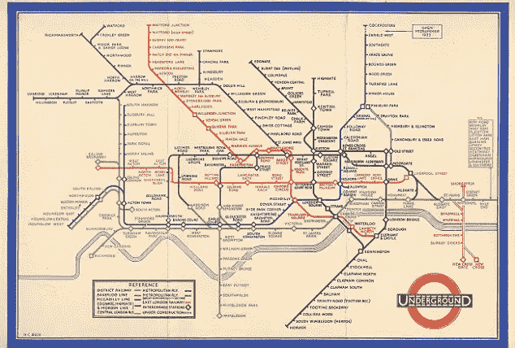
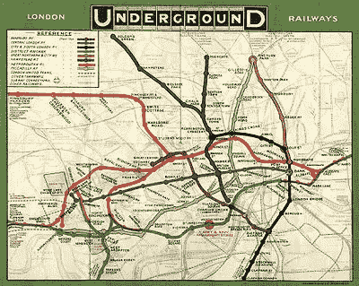
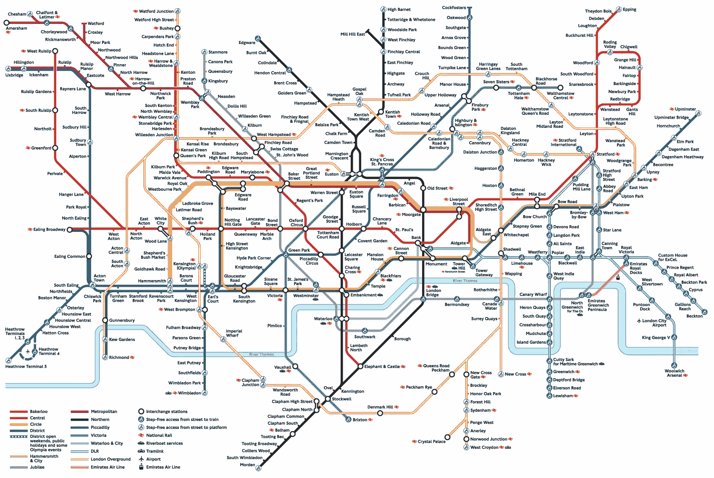
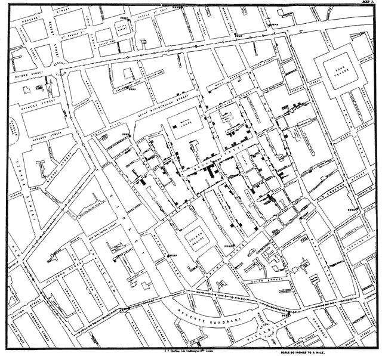
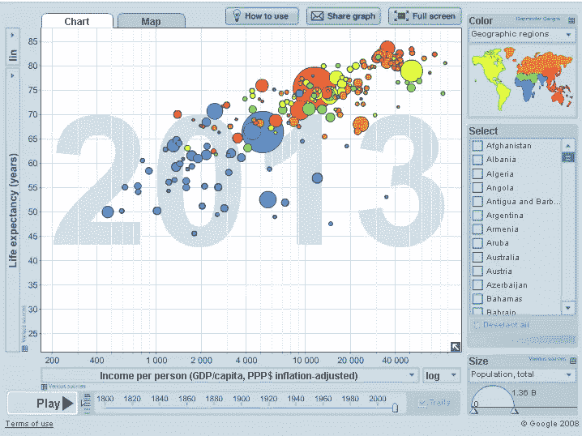
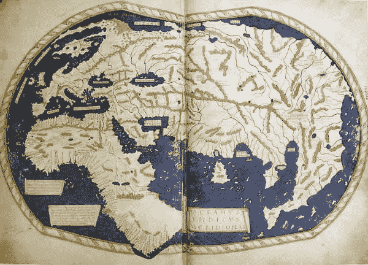
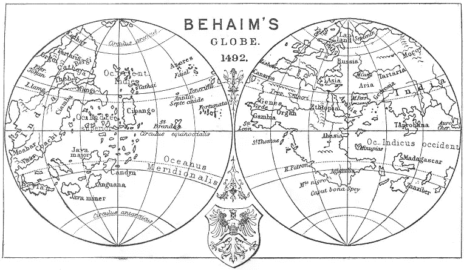

# 改变世界的 5 张信息图

> 原文：<https://www.sitepoint.com/5-infographics-changed-world/>

当你听到信息图这个词时，你很可能会想到近年来出现的在网站上可视化展示信息的趋势。

这些研究的质量各不相同，因此它们包含的信息也不同。它们的外观也千差万别，许多营销人员和设计师不断提出新的想法，让事情变得更有趣。

在线商业社区*喜欢*有趣的信息图，他们在社交媒体上表现得很好——尤其是 G+。

然而，信息图表并不是最近的发明——我们已经使用视觉学习辅助工具很多很多年了。

例如，地图可以追溯到文明的开端，可以被视为原始的信息图——一种将复杂的地理信息合成为更容易理解的格式的方法。

考虑到这一点，今天让我们来看看一些有史以来最有影响力的信息图，排名不分先后，以及我们从它们身上学到了什么。

## #1:哈里·贝克 1931 年的伦敦地铁图

当你看到上图时，你会毫不惊讶地得知[哈里·贝克是一名电气绘图员](http://britton.disted.camosun.bc.ca/beckmap.htm "Beck's London Underground Map")，他的工作是绘制电路图纸。当然，他没有像我们现在这样的花哨设备来帮助他，但这都是手工进行的，由他制作手绘草图。

贝克住在伦敦，在伦敦地铁工作时，他是一名工程绘图员，在业余时间设计地图，这是一个非委托项目。

起初人们对它的反应并不热烈，但在 1933 年，伦敦地铁屈服了，在一本小册子中介绍了这张地图。这一数字达到了 70 万份，地图非常受欢迎，以至于第二个月不得不再次印刷。

以前的地铁地图完全不同，更多地依赖于周围的街道，而不是实际的地铁网络本身，如下图所示。

地铁地图显示了铁路线是如何通过颜色编码系统与其他地下线路连接在一起的。这意味着到伦敦的游客不必依赖任何当地知识。最初的地图只有 8 条线，而随着交通系统的发展，现在我们会看到 14 条线。

地图在设计方面很重要，原因有几个。

首先，因为它打破了信息呈现方式的模式。它过去和现在都是高度可视化和逻辑性的，为棘手的问题提供了简单的解决方案。

从本质上来说，交通地图需要易于参考和理解，并且便于携带。这种颜色编码系统意味着不再需要复杂和令人困惑的钥匙，而且它工作得如此之好，以至于今天仍然可以在这个城市的所有地铁站找到它。

在伦敦走动并不容易，但这张地图确实有助于理解它(至少在某种程度上，我自己的方向感很差，以至于我上次去伦敦时都被它搞糊涂了，但毫无疑问，如果没有它，情况会更糟。)

地铁地图最棒的地方在于创新思维。Beck 利用他在绘制电路图方面的经验，提出了一些其他受过设计训练的人可能没有的东西。

作为设计师，我们能从中学到什么呢？简单。永远不要害怕从各个角度思考设计，要有创造力，要有创新精神，因为你永远不知道它会走向何方。

贝克继续他在地图上的工作，直到他 1964 年去世，尽管它取得了成功，但他肯定没有从中赚到钱(尽管可以肯定地说，他获得了一定的名气)。然而，他的想法现在被广泛用于世界各地的交通和其他系统。

## #2:约翰·斯诺的霍乱地图

《权力的游戏》中的约翰·斯诺可能什么都不知道，但同名的英国医生却知道很多。根据我们的朋友维基百科，斯诺是[“现代流行病学之父之一”，也是采用医疗卫生实践和麻醉的先驱。然而，他最出名的是在 1854 年绘制了霍乱地图，最终帮助改善了全世界的健康状况。](http://en.wikipedia.org/wiki/John_Snow_%28physician%29 "John Snow Wikipedia")

在 19 世纪，人们普遍认为是“瘴气”或“坏空气”导致了霍乱和伤寒等疾病。斯诺对此持怀疑态度，他认为这些疾病是通过水传播的。

当斯诺煞费苦心地绘制出伦敦所有的霍乱死亡人数时，很明显，许多病例都聚集在当时被称为宽街的一个水泵周围。

他的证据完全是间接的，因为当时还不知道细菌是如何传播的。尽管在显微镜下检查了被污染的水，他还是无法证明这一点。

然而，一些案例并不在宽阔的街道区域，但是雪证明了它们仍然受到水泵的影响。

[据《卫报》报道](http://www.theguardian.com/news/datablog/2013/mar/15/john-snow-cholera-map "John Snow article")，斯诺写道:

> 在某些情况下，死亡分散在离地图上其他地方稍远的地方，疾病可能是在离水泵较近的地方感染的。

一些人质疑一名 59 岁的女性受害者怎么可能感染上这种疾病，她与宽阔的街道没有任何联系。

斯诺接过了这个故事:

> 这位女士的儿子告诉我，她已经好几个月没有住在布罗德街附近了。每天都有一辆马车从布罗德街开往西区，按照惯例，她会从布罗德街的水泵里取出一大瓶水，因为她更喜欢这样。水是在 8 月 31 日星期四取的。，她喝了它在晚上，也在星期五。她在后一天的晚上染上了霍乱，星期六去世了。

然而，并非所有的宽街当地人都难逃厄运。该地区的酿酒工人显然幸免于难。由于他们收到了啤酒作为部分报酬，工人们喝了很少的水，也没有报告霍乱病例。

进一步的证据包括该地区有自己供水系统的建筑，其居民没有受到影响，包括附近的一个济贫院。这些是英国的机构，为穷人提供住宿以换取就业。这是最仁慈的描述，所以这些地方可能会比私人住宅更容易发生疾病。然而事实并非如此。

最终，斯诺的证据——以及他展示证据的方式——胜出了。后来的结论是，宽阔的街道上的水被一个婴儿的尿布污染了。

斯诺的地图很重要，因为它为疾病传播的方式以及如何有效地可视化数据提供了新的思路。当然，这不仅对英国很重要，它还帮助塑造了全球看待和治疗疾病的方式。

## #3:汉斯·罗斯林的 Gapminder

瑞典科学家汉斯·罗斯林在 2007 年的一次 TED 演讲中一举成名，这次演讲让他与世界分享了他的数据可视化。他在演讲中展示的原始图像显示了预期寿命和收入之间的关系。

罗斯林从事数据工作已经超过 30 年，自从他的讲话的决定性的一天以来，他创造了进一步的可视化，包括以下内容:

*   儿童健康
*   贫困
*   健康
*   气候
*   经济
*   教育
*   全球趋势
*   艾滋病病毒

罗斯林是瑞典卡罗林斯卡学院的健康教授，据 TED 报道:

> 罗斯林的与众不同之处不仅在于他对广泛的社会和经济趋势的恰当观察，还在于他展示这些趋势的惊人方式。保证:你从来没有见过这样的数据。从任何逻辑上来说，一个追踪全球健康和贫困趋势的报告都应该，一言以蔽之:无聊。但是在罗斯林手里，数据会唱歌。潮流栩栩如生。大画面——通常最多是模糊的——突然清晰起来。

目前，罗斯林正致力于消除关于“所谓的发展中世界”与西方之间差距的普遍误解。他旨在表明，感知的差距不再像人们仍然认为的那样大，发展中国家与西方一样处于健康和繁荣的轨道上。他开发了自己的可视化软件，2007 年，在他第一次与搜索巨头的代表见面的 TED 演讲后，该软件被谷歌收购。

他也是一名医生，在非洲花了很多时间追踪一种罕见的疾病，并出版了一本关于全球健康的书。罗斯林的数据可视化很重要，因为它们让我们可以轻松地看到世界上许多最重要问题的图形表示，并从中学习。我们中的许多人都会同意贫穷和收入之间存在联系，但这并不等同于真相就摆在你面前让你看到。

你可以在 Gapminder 网站获得全图，也可以浏览一系列问题的更多地图。

## 第四名:佛罗伦萨·南丁格尔——战争死亡率

弗洛伦斯·南丁格尔是一位著名的护士，在克里米亚战争期间，她去了土耳其，帮助护理被运到黑海的受伤的英国士兵。她是参加医疗站的 38 名志愿护士之一，由于缺乏卫生条件和医疗用品，这些医疗站不足以照顾受伤的士兵。

《泰晤士报》当时这样描述她:

> 在这些医院里，她是一个毫不夸张的“服务天使”,当她苗条的身影悄悄地滑过每一条走廊时，每个可怜的人一看到她，脸上都会因感激而变得柔和。当所有的医务人员都休息了一夜，寂静和黑暗降临到那些卧病在床的病人身上时，可以看到她独自一人，手里拿着一盏小灯，独自巡视。

在此之后，她被人们普遍称为“拿着灯的女士”，但这些并不是她最重要的事迹。南丁格尔保存了极好的记录，并用这些记录了医院里的许多病例。疾病确实以多种形式流行，尤其是痢疾、霍乱和伤寒。她改善了军队医院的许多条件，这导致了死亡率的急剧下降。

1859 年，南丁格尔发表了一篇论文，*对英俄战争后期英国军队卫生史的贡献*，该论文主要关注数据和图表，其中最著名的(也是有记录的)如上图所示。

![The Areas of the blue, red, & black wedges are each measured from the centre as the common vertex The blue wedges measured from the centre of the circle represent area for area the deaths from Preventible or Mitigable Zymotic Diseases, the red wedges measured from the center the deaths from wounds, & the black wedges measured from the center the deaths from all other causes.

In October 1854, & April 1855, the black area coincides with the red, in January & February 1856, the blue coincides with the black The entire areas may be compared by following the blue, the red & the black lines enclosing them.](img/a46889d90889094b5c94b95f3d7681cf.png)

图表给出了军队逐月驻扎在东部的数据，以及三种死亡原因的总数。在她看来，这些死亡本可以通过为病人提供更好的条件来避免。在其他图表中，她还展示了克里米亚战争结束时，如何通过改善条件来降低死亡率。

从这件事中得到的教训当然是，人们在不必要的时候死去，如果没有数据证明这一点，很可能会有更多的人丧生。

## 第五名:亨利库斯·马尔泰勒斯世界地图(1490 年)

人们认为这就是哥伦布用来说服阿拉贡的费迪南和卡斯蒂利亚的伊莎贝拉在他的冒险中支持他的地图，或者一张非常相似的地图。然而，哥伦布并没有绘制地图，而是当时居住在意大利佛罗伦萨的德国制图师(地图就是以他的名字命名的)的作品。

然而，人们认为这幅地图源自于 1485 年巴塞洛缪·哥伦布创作的一幅[。这个故事的特别之处在于，哥伦布用它来说服他的赞助者，欧洲实际上离中国并不远。](http://www.henry-davis.com/MAPS/LMwebpages/256mono.html "Martellus world map")

这也是第一张记录绕过好望角的地图，这进一步证明了在南方没有与亚洲的陆地联系。这反过来意味着欧洲人可以通过海路到达东印度群岛，而不必穿越穆斯林领土。

马尔泰勒斯创作了许多地图，尽管我们对他知之甚少，但这些地图被认为在很多方面都有巨大的影响力——上面提到的和上面的地图启发了马丁·贝海姆在 1492 年制作他著名的地球仪。在地图创建的时候，西方还没有进入东方，所以哥伦布渴望成为第一个征服它并获得该地区财富的人。

几千年来，人类一直以这样或那样的方式绘制地图，但这是一张对世界发现有着重大影响的地图。

## 有影响力的意象

很难挑出历史上出现过的一些最重要的图形表示，所以我真的希望我做到了公正。其他同样值得入选的是查尔斯·布斯的伦敦贫困地图，当然还有谷歌地球，因为对我们这个时代来说，它至少和其他一些地图一样重要。

重要的是，它展示了使信息可视化如何打破障碍，并有助于更好地理解通常很复杂的主题。

从健康福利，到旅行系统，到世界贫困和健康，我们在过去从信息图表中学到了很多，就像我们现在仍然可以学到很多一样。

现在我们也拥有了大数据的力量，谁知道可视化会把我们带向何方？

## 分享这篇文章