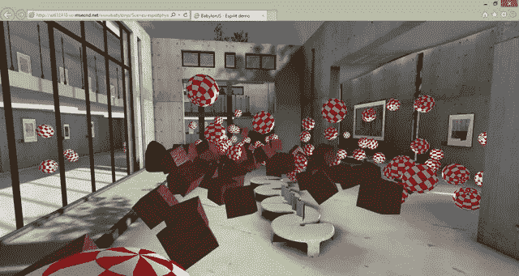
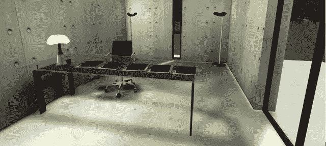
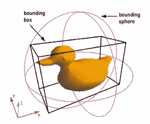
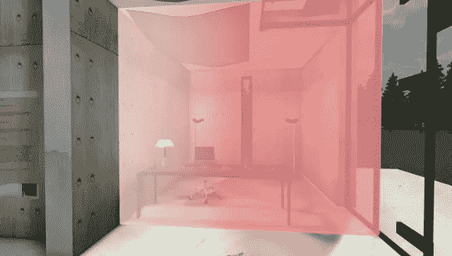
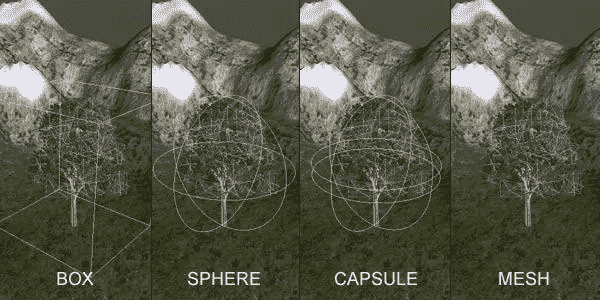
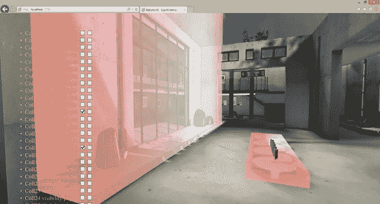
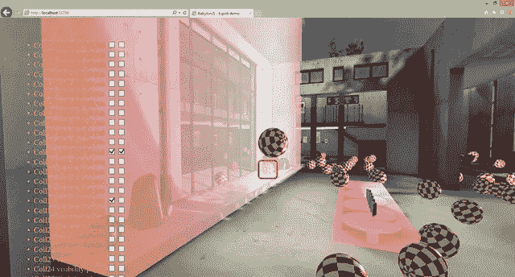
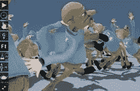

# 使用 Babylon.js 和 Oimo.js 了解碰撞和物理学

> 原文：<https://www.sitepoint.com/understanding-collisions-physics-babylon-js-oimo-js/>

本文是微软网站开发技术系列的一部分。感谢您对使 SitePoint 成为可能的合作伙伴的支持。

今天，我想通过使用 WebGL babylon.js 引擎和一个名为 oimo.js 的物理引擎伴侣，与您分享碰撞、物理和边界框的基础知识。

下面是我们要一起构建的演示: [babylon.js Espilit 与 Oimo.js 的物理演示](http://yoda.blob.core.windows.net/wwwbabylonjs/Scenes/espilitphysics/index.html?WT.mc_id=12833-DEV-sitepoint-othercontent)



你可以在兼容 WebGL 的浏览器中启动它——像 IE11、Firefox、Chrome、Opera Safari 8 或 Windows 10 技术预览版中的[Project Spartan——然后，像在 FPS 游戏中一样在场景内移动。按“s”键发射一些球体/球，按“b”键发射一些盒子。用你的鼠标，你可以点击其中一个球体或盒子来施加一些冲击力。](http://blogs.msdn.com/b/ie/archive/2015/02/26/a-break-from-the-past-the-birth-of-microsoft-s-new-web-rendering-engine.aspx?WT.mc_id=12833-DEV-sitepoint-othercontent)

## 理解碰撞

查看维基百科[碰撞检测](http://en.wikipedia.org/wiki/Collision_detection?WT.mc_id=12833-DEV-sitepoint-othercontent)的定义，我们可以读到:

*“碰撞检测通常指的是检测两个或多个物体相交的计算问题。虽然这个话题经常与它在视频游戏和其他[物理模拟](http://en.wikipedia.org/wiki/Computer_simulations?WT.mc_id=12833-DEV-sitepoint-othercontent)中的应用联系在一起，但它也在[机器人](http://en.wikipedia.org/wiki/Robotics?WT.mc_id=12833-DEV-sitepoint-othercontent)中有应用。除了确定两个物体是否碰撞，碰撞检测系统还可以计算碰撞时间(TOI)，并报告接触流形(相交点的集合)。[【1】](http://en.wikipedia.org/wiki/Collision_detection#cite_note-1)[碰撞响应](http://en.wikipedia.org/wiki/Collision_response?WT.mc_id=12833-DEV-sitepoint-othercontent)处理模拟检测到碰撞时发生的情况(参见[物理引擎](http://en.wikipedia.org/wiki/Physics_engine?WT.mc_id=12833-DEV-sitepoint-othercontent)，[布娃娃物理](http://en.wikipedia.org/wiki/Ragdoll_physics?WT.mc_id=12833-DEV-sitepoint-othercontent))。解决碰撞检测问题需要大量使用来自[线性代数](http://en.wikipedia.org/wiki/Linear_algebra?WT.mc_id=12833-DEV-sitepoint-othercontent)和[计算几何](http://en.wikipedia.org/wiki/Computational_geometry?WT.mc_id=12833-DEV-sitepoint-othercontent)的概念。*

现在让我们把这个定义分解到一个很酷的 3D 场景中，这个场景将作为本教程的基础。

你可以像在现实世界中一样在这个伟大的博物馆中移动。你不会从地板上摔下来，不会穿墙而过，也不会飞起来。我们在模拟重力。所有这些看起来都很明显，但需要大量的计算来模拟 3D 虚拟世界。当我们考虑碰撞检测时，我们需要解决的第一个问题是它应该有多复杂？事实上，测试两个复杂的网格是否发生碰撞会耗费大量的 CPU 资源，对于 JavaScript 引擎来说，更是如此，因为它很难将这一任务转移到 UI 线程之外的其他东西上。

为了更好地了解我们是如何管理这种复杂性的，请浏览这张桌子附近的 Espilit 博物馆:



你被桌子挡住了，即使右边似乎有一些空间。是我们碰撞算法的 bug 吗？不，不是(babylon.js 没有 bug！；-)).这是因为建造这个场景的 3D 艺术家米歇尔·鲁索选择了这样做。为了简化碰撞检测，他使用了一个特殊的碰撞器。

## 什么是对撞机？

您可以将它们放入简单的不可见几何体中，而不是针对完整的详细网格测试碰撞。这些碰撞器将作为网格表示，并由碰撞引擎使用。大多数情况下，你看不到区别，但它允许我们使用更少的 CPU，因为背后的数学计算更简单。

每个引擎至少支持两种类型的碰撞器:包围盒和包围球。看了这张图你会更好理解:



摘自:[计算机可视化、光线追踪、视频游戏、边界框替换](http://www.tcs.fudan.edu.cn/rudolf/Courses/Algorithms/Alg_ss_07w/Webprojects/Chen_hull/applications.htm)

这张漂亮的黄色卡片就是要展示的网格。我们可以尝试将它插入到最佳的边界几何体中，而不是针对它的每个面测试碰撞。在这种情况下，作为网格视点替用特效，长方体似乎比球体更好。但是选择真的取决于网格本身。

让我们回到 Espilit 场景，以半透明的红色显示不可见的边界元素:



你现在可以理解为什么你不能在桌子的右边移动了。是因为你在和这个盒子碰撞(嗯，babylon.js 相机在碰撞)。如果你想这样做，只需通过降低宽度来改变它的大小，以完全适应桌子的宽度。

**注:** *如果你想开始学习 babylon.js，你可以跟随我们在微软虚拟学院(MVA)的免费培训课程。例如，你可以直接跳转到“[web GL 3D 简介与 HTML5 和 Babylon.js——使用 Babylon.js 给初学者](http://www.microsoftvirtualacademy.com/training-courses/introduction-to-webgl-3d-with-html5-and-babylon-js?m=11719&ct=34560?WT.mc_id=12833-DEV-sitepoint-othercontent)”在那里我们将讨论 Babylon . js 的碰撞部分。你也可以看看我们的交互式游乐场工具中的代码: [Babylon.js 游乐场——碰撞示例](http://www.babylonjs-playground.com/index.html?9?WT.mc_id=12833-DEV-sitepoint-othercontent)。*

基于碰撞或物理引擎的复杂性，还有其他类型的碰撞器可用:例如胶囊和网格。



[摘自:Unity-Colliders 入门& UnityScript](http://code.tutsplus.com/tutorials/getting-started-with-unity-colliders-unityscript--active-8367)

胶囊对人类或类人生物有用，因为它比盒子或球体更适合我们的身体。网格本身几乎不是完整的网格，而是目标原始网格的简化版本，但仍然比长方体、球体或胶囊精确得多。

## 加载起始场景

要加载我们的 Espilit 场景，您有多种选择:

### 选项 1:

从我们的 [GitHub 库](https://github.com/BabylonJS/Samples/tree/master/Scenes/Espilit?WT.mc_id=12833-DEV-sitepoint-othercontent)下载它，然后按照我们 MVA 课程的[web GL 3D 简介和 HTML5 和 Babylon.js 加载资源](http://www.microsoftvirtualacademy.com/training-courses/introduction-to-webgl-3d-with-html5-and-babylon-js?m=11722&ct=34566?WT.mc_id=12833-DEV-sitepoint-othercontent)模块学习如何加载一个 Babylon 场景。基本上，您需要将资产和 Babylon.js 引擎托管到 web 服务器中，并为。巴比伦扩建工程。

### 选项 2:

下载[这个预制的 Visual Studio 解决方案](https://david.blob.core.windows.net/babylonjs/BabylonJSEspilitWithPhysicsStartingSolution.zip?WT.mc_id=12833-DEV-sitepoint-othercontent)(。zip 文件)。

**注意:** *如果你不熟悉 Visual Studio，看看这篇文章: [Web 开发人员，Visual Studio 可能是一个很好的免费开发工具……](http://blogs.msdn.com/b/eternalcoding/archive/2014/07/17/web-developers-visual-studio-could-be-a-great-free-tool-to-develop-with.aspx?WT.mc_id=12833-DEV-sitepoint-othercontent)也请注意，专业版现在对许多不同的场景都是免费的。它被命名为 [Visual Studio 2013 社区版](http://www.asp.net/get-started/websites?WT.mc_id=12779-DEV-sitepoint-link)。*

当然，如果不想用 Visual Studio，还是可以按照这个教程来做。下面是加载场景的代码。请记住，虽然现在大多数浏览器都支持 WebGL 但你应该[测试 Internet Explorer](https://remote.modern.ie/?utm_source=SitePoint&utm_medium=content&utm_campaign=SitePoint) ,即使是在你的 Mac 上。

```
// <reference path="/scripts/babylon.js" />
var engine;
var canvas;
var scene;
document.addEventListener("DOMContentLoaded", startGame, false);
function startGame() {
    if (BABYLON.Engine.isSupported()) {
        canvas = document.getElementById("renderCanvas");
        engine = new BABYLON.Engine(canvas, true);
        BABYLON.SceneLoader.Load("Espilit/", "Espilit.babylon", engine, function (loadedScene) {
            scene = loadedScene;

            // Wait for textures and shaders to be ready
            scene.executeWhenReady(function () {
                // Attach camera to canvas inputs
                scene.activeCamera.attachControl(canvas);

                // Once the scene is loaded, just register a render loop to render it
                engine.runRenderLoop(function () {
                    scene.render();
                });
            });
        }, function (progress) {
            // To do: give progress feedback to user
        });
    }
}
```

使用这种材料，您只会受益于 Babylon.js 的嵌入式碰撞引擎。事实上，我们正在使我们的碰撞引擎和物理引擎有所不同。碰撞引擎主要用于摄像机与场景的交互。您可以在相机上启用或不启用重力，您可以在相机和各种网格上启用`checkCollision`选项。碰撞引擎也可以帮助你知道两个网格是否碰撞。但仅此而已(这其实已经很多了！).两个 Babylon.js 对象碰撞后，碰撞引擎不会生成动作、力或冲动。你需要一个物理引擎来给物体带来生命。

我们在 Babylon.js 中集成物理的方式是通过一个插件机制。你可以在这里阅读更多内容:[添加你自己的物理引擎插件到 babylon.js](https://github.com/BabylonJS/Babylon.js/wiki/Adding-your-own-physics-engine-plugin-to-Babylon.js?WT.mc_id=12833-DEV-sitepoint-othercontent) 。我们支持两个开源物理引擎: [cannon.js](http://cannonjs.org/?WT.mc_id=12833-DEV-sitepoint-othercontent) 和 [oimo.js](https://github.com/lo-th/Oimo.js/?WT.mc_id=12833-DEV-sitepoint-othercontent) 。Oimo 现在是首选的默认物理引擎。

如果你选择“选项 1”来加载场景，那么你需要[从我们的 GitHub 下载 Oimo.js](https://github.com/BabylonJS/Babylon.js?WT.mc_id=12833-DEV-sitepoint-othercontent) 。这是我们为了更好地支持 Babylon.js 而做的一个略微更新的版本。如果你选择了“选项 2”，它已经在 VS 解决方案中的`scripts`文件夹下被引用并可用。

## 启用场景中的物理支持，将碰撞器转换为“物理冒名顶替者”

首先要做的是启用现场物理。为此，请添加这行代码:

```
scene.enablePhysics(new BABYLON.Vector3(0, -10, 0), new BABYLON.OimoJSPlugin());
```

您正在设置重力级别(在这个示例代码中 Y 轴上为-10，这或多或少类似于我们在地球上的情况)和您想要使用的物理引擎。我们将使用 Oimo.js，但是注释行显示了如何使用 cannon.js。

现在，我们需要遍历碰撞引擎使用的所有不可见碰撞器，并在其上激活物理属性。为此，您只需找到所有`checkCollisions`设置为 true 但在场景中不可见的网格:

```
for (var i = 1; i < scene.meshes.length; i++) {
    if (scene.meshes[i].checkCollisions && scene.meshes[i].isVisible === false) {
        scene.meshes[i].setPhysicsState(BABYLON.PhysicsEngine.BoxImpostor, { mass: 0, 
                                        friction: 0.5, restitution: 0.7 });
        meshesColliderList.push(scene.meshes[i]);
    }
}
```

请同时声明 meshesColliderList:

```
var meshesColliderList = [];
```

我们完事了。我们准备在我们的场景中扔一些物体，并在这个美丽但平静的博物馆中放置许多混乱。

## 用物理状态创建球体和长方体

我们现在将添加一些球体(带有 Amiga 纹理)和一些盒子(带有木头纹理)到场景中。该网格将设置物理状态。例如，这意味着如果你在空中发射它们，它们将在地板上反弹，在检测到碰撞后在它们之间反弹，等等。物理引擎需要知道哪种视点替用特效你想用于网格(现在是平面、球体或盒子)，质量和摩擦属性。

如果你选择了“*选项 1* ，你可以在这里下载两个纹理: [physicsassets.zip](https://david.blob.core.windows.net/babylonjs/physicsassets.zip?WT.mc_id=12833-DEV-sitepoint-othercontent)

将此代码添加到您的项目中:

```
function CreateMaterials() {
    materialAmiga = new BABYLON.StandardMaterial("amiga", scene);
    materialAmiga.diffuseTexture = new BABYLON.Texture("assets/amiga.jpg", scene);
    materialAmiga.emissiveColor = new BABYLON.Color3(0.5, 0.5, 0.5);
    materialAmiga.diffuseTexture.uScale = 5;
    materialAmiga.diffuseTexture.vScale = 5;
    materialWood = new BABYLON.StandardMaterial("wood", scene);
    materialWood.diffuseTexture = new BABYLON.Texture("assets/wood.jpg", scene);
    materialWood.emissiveColor = new BABYLON.Color3(0.5, 0.5, 0.5);
}
function addListeners() {
    window.addEventListener("keydown", function (evt) {
        // s for sphere
        if (evt.keyCode == 83) {
            for (var index = 0; index < 25; index++) {
                var sphere = BABYLON.Mesh.CreateSphere("Sphere0", 10, 0.5, scene);
                sphere.material = materialAmiga;
                sphere.position = new BABYLON.Vector3(0 + index / 10, 3, 5 + index / 10);
                sphere.setPhysicsState(BABYLON.PhysicsEngine.SphereImpostor, { mass: 1 });
            }
        }
        // b for box
        if (evt.keyCode == 66) {
            for (var index = 0; index < 10; index++) {
                var box0 = BABYLON.Mesh.CreateBox("Box0", 0.5, scene);
                box0.position = new BABYLON.Vector3(0 + index / 5, 3, 5 + index / 5);
                box0.material = materialWood;
                box0.setPhysicsState(BABYLON.PhysicsEngine.BoxImpostor, { mass: 4 });
            }
        }
    });
}
```

你可以看到盒子比球体重 4 倍。

**注意:** *如果您需要了解 babylon.js 中的材质如何工作，请观看本模块:[使用 HTML5 和 Babylon.js 的 WebGL 3D 简介——了解材质和输入](http://www.microsoftvirtualacademy.com/training-courses/introduction-to-webgl-3d-with-html5-and-babylon-js?m=11720&ct=34562?WT.mc_id=12833-DEV-sitepoint-othercontent)或使用我们专用的 Playground 示例:[Babylon . js Playground——材质示例](http://www.babylonjs-playground.com/index.html?4?WT.mc_id=12833-DEV-sitepoint-othercontent)*

在`scene.enablePhysics`行之后添加这两行代码:

```
CreateMaterials();
addListeners();
```

并启动 web 项目。导航到博物馆的中心，按下“s”或“b”键。您将获得这个有趣结果:


## 添加拾取支持以在网格上单击

让我们添加另一个很酷的功能:点击其中一个对象来扔掉它们的能力。为此，您需要从 3D 场景中鼠标的 2D 坐标发送一条光线，检查该光线是否接触到某个有趣的网格，如果是，对其施加一个脉冲力以尝试移动它。

**注意:** *要了解采摘如何工作，请查看此 MVA 模块:[web GL 3D 简介与 HTML5 和 Babylon . js-高级功能](http://www.microsoftvirtualacademy.com/training-courses/introduction-to-webgl-3d-with-html5-and-babylon-js?m=11723&ct=34568?WT.mc_id=12833-DEV-sitepoint-othercontent)或使用我们的在线示例:[Babylon . js Playground-采摘示例](http://www.babylonjs-playground.com/index.html?11?WT.mc_id=12833-DEV-sitepoint-othercontent)。*

将此代码添加到`addListeners()`函数中:

```
canvas.addEventListener("mousedown", function (evt) {
    var pickResult = scene.pick(evt.clientX, evt.clientY, function (mesh) {
        if (mesh.name.indexOf("Sphere0") !== -1 || mesh.name.indexOf("Box0") !== -1) {
            return true;
        }
        return false;
    });
    if (pickResult.hit) {
        var dir = pickResult.pickedPoint.subtract(scene.activeCamera.position);
        dir.normalize();
        pickResult.pickedMesh.applyImpulse(dir.scale(1), pickResult.pickedPoint);
    }
});
```

在您最喜欢的浏览器中启动您的代码。你现在可以点击你的物理网格来玩它们。

## 显示边界框以更好地理解整个故事

最后，我们将创建一个调试场景，让您显示/隐藏碰撞器，并激活/停用它们的物理属性。

我们将把 UI 注入到这个 div 中:

```
<div id="lcContainer">
    <ul id="listColliders">
    </ul>
</div>
```

我们将使用这个函数来处理 UI:

```
function CreateCollidersHTMLList() {
    var listColliders = document.getElementById("listColliders");
    for (var j = 0; j < meshesColliderList.length; j++) {
        var newLi = document.createElement("li");
        var chkVisibility = document.createElement('input');
        chkVisibility.type = "checkbox";
        chkVisibility.name = meshesColliderList[j].name;
        chkVisibility.id = "colvis" + j;
        var chkPhysics = document.createElement('input');
        chkPhysics.type = "checkbox";
        chkPhysics.name = meshesColliderList[j].name;
        chkPhysics.id = "colphysx" + j;
        (function (j) {
            chkVisibility.addEventListener(
             "click",
             function (event) {
                 onChangeVisibility(j, event);
             },
             false
           );
            chkPhysics.addEventListener(
            "click",
            function (event) {
                onChangePhysics(j, event);
            },
            false
            );
        })(j)
        newLi.textContent = meshesColliderList[j].name + " visibility/physx ";
        newLi.appendChild(chkVisibility);
        newLi.appendChild(chkPhysics);
        listColliders.appendChild(newLi);
    }
    function onChangeVisibility(id, event) {
        if (!meshesColliderList[id].isVisible) {
            meshesColliderList[id].isVisible = true;
            meshesColliderList[id].material.alpha = 0.75;
            meshesColliderList[id].material.ambientColor.r = 1;
        }
        else {
            meshesColliderList[id].isVisible = false;
        }
    }
    function onChangePhysics(id, event) {
        if (!meshesColliderList[id].checkCollisions) {
            meshesColliderList[id].checkCollisions = true;
            meshesColliderList[id].setPhysicsState(BABYLON.PhysicsEngine.BoxImpostor, { mass: 0, 
                                                   friction: 0.5, restitution: 0.7 });
        }
        else {
            meshesColliderList[id].checkCollisions = false;
            meshesColliderList[id].setPhysicsState(BABYLON.PhysicsEngine.NoImpostor);
        }
    }
}
```

我知道，它产生了一个非常丑陋的用户界面，但我懒得花更多的时间在它上面。可以随意改进！:-P

调用这个新函数并启动 web 项目。例如，现在显示碰撞器 12 和 17:



您还可以通过第二个复选框启用/禁用物理属性。例如，如果你禁用 12 号对撞机的物理属性并发射球体，它们现在会穿过这面墙！这在下面的截图中显示为被红色正方形包围的球体:



## 结论

你可以在你的浏览器这里直接玩这个调试样本: [babylon.js Espilit Physics 调试演示](http://az612410.vo.msecnd.net/wwwbabylonjs/Scenes/espilitphysicsdebug/index.html?WT.mc_id=12833-DEV-sitepoint-othercontent)。

也请看看 Samuel Girardin 制作的这个很棒的演示，它也在一些有趣的角色上使用了 Oimo.js:



希望你喜欢这个教程！请随时在推特上给我发短信，发表评论。

本文是微软网站开发技术系列的一部分。我们很高兴与你分享斯巴达项目的[和它的](http://blogs.msdn.com/b/ie/archive/2015/01/22/project-spartan-and-the-windows-10-january-preview-build.aspx?WT.mc_id=12833-DEV-sitepoint-othercontent)[新渲染引擎](http://blogs.msdn.com/b/ie/archive/2015/02/26/a-break-from-the-past-the-birth-of-microsoft-s-new-web-rendering-engine.aspx?WT.mc_id=12833-DEV-sitepoint-othercontent)。使用 [modern 获得免费虚拟机或在您的 Mac、iOS、Android 或 Windows 设备上进行远程测试。即](http://modern.ie?utm_source=SitePoint&utm_medium=other&utm_campaign=SitePoint)。

## 分享这篇文章