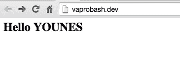

# 使用 Laravel 契约构建 Laravel 5 Twig 包

> 原文：<https://www.sitepoint.com/use-laravel-contracts-build-laravel-5-twig-package/>

Laravel 5 终于发布了，并带来了所有令人敬畏的功能。新的架构变化之一是新的[合同包](https://github.com/illuminate/contracts)。在本文中，我们将理解这一变化背后的原因，并尝试使用新契约构建一个实际的用例。


## 什么是合同

契约是定义行为的接口。让我们从[维基百科](https://en.wikipedia.org/wiki/Interface_(computing)#Software_interfaces_in_object-oriented_languages)中取这个定义。

> 在面向对象语言中，术语接口通常用于定义不包含数据或代码的抽象类型，但将行为定义为方法签名。

也就是说，我们使用接口将对象行为从一个类提取到一个接口，并且只依赖于定义。在 Laravel 的 IoC 容器中，你可以[将一个接口绑定到一个实现](http://laravel.com/docs/5.0/container#binding-interfaces-to-implementations)。

```
$this->app->bind('App\Contracts\EventPusher', 'App\Services\PusherEventPusher');
```

现在，每次从容器中解析`EventPusher`接口时，您都会收到一个`Pusher`实现。如果你决定切换到另一个服务，如[扇出](https://fanout.io/)，你只需要改变绑定。

```
$this->app->bind('App\Contracts\EventPusher', 'App\Services\FanoutEventPusher');
```

现在大部分 Laravel 核心服务都被提取到一个契约中，如果你想覆盖`Illuminate/Mail`服务，你可以实现`Illuminate\Contracts\Mail`契约，定义必要的方法，并将其作为提供者添加。

## Laravel 视图合同

Laravel 使用自己的模板引擎，名为 [Blade](http://laravel.com/docs/5.0/templates) 。然而，我想使用 [Symfony Twig](http://twig.sensiolabs.org/doc/templates.html) 作为我的模板引擎。Blade 已经提供了注册你自己的扩展的可能性；查看[树枝桥](https://github.com/rcrowe/TwigBridge/)了解更多信息。Laravel 5 有一个更好的方法来使用契约实现相同的目标，所以让我们创建自己的实现。

### 定义包

为了开始构建我们的包，我们需要在`composer.json`文件中定义它。我们需要 Twig 并自动加载我们的`src`文件夹作为我们的根名称空间。

```
// composer.json
{
  "name": "whyounes/laravel5-twig",
  "description": "Twig for Laravel 5",
  "authors": [
    {
      "name": "RAFIE Younes",
      "email": "younes.rafie@gmail.com"
    }
  ],
  "require": {
    "twig/twig": "1.18.*"
  },
  "autoload": {
    "psr-0": {
      "RAFIE\\": "src/"
    }
  }
}
```

### 查看服务提供商

注册你的包绑定的更好的方法是通过一个[服务提供商](http://laravel.com/docs/5.0/providers)。

```
// src/RAFIE/Twig/TwigViewServiceProvider.php

public function registerLoader()
{
  $this->app->singleton('twig.loader', function ($app) {
    $view_paths = $app['config']['view.paths'];
    $loader = new \Twig_Loader_Filesystem($view_paths);

    return $loader;
  });
}
```

`registerLoader`方法将把我们的[树枝加载器](http://twig.sensiolabs.org/doc/api.html#loaders)绑定到容器。`$app['config']['view.paths']`包含我们的视图路径。默认情况下，它只有`resources/views`文件夹。

```
// src/RAFIE/Twig/TwigViewServiceProvider.php

public function registerTwig()
{
  $this->app->singleton('twig', function ($app) {
    $options = [
        'debug' => $app['config']['app.debug'],
        'cache' => $app['config']['view.compiled'],
    ];

    $twig = new \Twig_Environment($app['twig.loader'], $options);

    // register Twig Extensions
    $twig->addExtension(new \Twig_Extension_Debug());

    // register Twig globals
    $twig->addGlobal('app', $app);

    return $twig;
  });
}
```

`Twig_Environment`类是 Twig 核心类。它接受一个`Twig_LoaderInterface`和一个选项列表:

*   从配置文件中获取我们的调试标志。
*   `$app['config']['view.compiled']`是我们在`config/view.php`文件中注册的编译视图路径。

`$twig->addGlobal`方法注册一个对所有视图都可用的变量。

```
// src/RAFIE/Twig/TwigViewServiceProvider.php

namespace RAFIE\Twig;

class TwigViewServiceProvider extends ServiceProvider
{
	public function register()
	{
	   $this->registerLoader();
	   $this->registerTwig();

	   $this->app->bind('view', function ($app) {
	     return new TwigFactory($app);
	   });
	 }
}
```

`register`方法将把`twig`和`twig.loader`绑定到容器。`view`键之前持有刀片视图工厂，现在它将解析我们的新`TwigFactory`类，它将负责渲染我们的视图。默认情况下，Laravel 不会加载您的服务提供者，所以您需要在您的`config/app.php` providers 数组中注册它。我们还将注释掉 Laravel 视图服务提供者。

```
// config/app.php

...
'providers' => [
	'RAFIE\Twig\TwigViewServiceProvider',
	//'Illuminate\View\ViewServiceProvider',
...
```

### 查看工厂

`TwigFactory`类必须实现`Illuminate\Contracts\View\Factory`接口来获得视图系统的形状和行为。这个类将完成将视图传递给 Twig 解析器的工作。为了实现更松散的耦合，我们有一个实现`Illuminate\Contracts\View\View`契约的`TwigView`类。这个类将作为视图对象的一个包，并且有一个对`TwigFactory`类的引用。

```
// src/RAFIE/Twig/TwigFactory.php

class TwigFactory implements FactoryContract
{

  /*
   * Twig environment
   *
   * @var Twig_Environment
   * */
  private $twig;

  public function __construct(Application $app)
  {
    $this->twig = $app['twig'];
  }

  public function exists($view)
  {
    return $this->twig->getLoader()->exists($view);
  }

  public function file($path, $data = [], $mergeData = [])
  {
    // or maybe use the String loader
    if (!file_exists($path)) {
      return false;
    }

    $filePath = dirname($path);
    $fileName = basename($path);

    $this->twig->getLoader()->addPath($filePath);

    return new TwigView($this, $fileName, $data);
  }

  public function make($view, $data = [], $mergeData = [])
  {
    $data = array_merge($mergeData, $data);

    return new TwigView($this, $view, $data);
  }

  public function share($key, $value = null)
  {
    $this->twig->addGlobal($key, $value);
  }

  public function render($view, $data)
  {
    return $this->twig->render($view, $data);
  }

  public function composer($views, $callback, $priority = null){}

  public function creator($views, $callback){}

  public function addNamespace($namespace, $hints){}

}
```

我们用之前解释的参数从容器中解析出`twig`对象，并开始实现方法的逻辑。我省略了最后三个函数，因为定义它们将涉及创建事件和分派事件，并将使我们的简单示例变得更加复杂。`make`方法返回一个带有当前工厂、视图和数据的新的`TwigView`实例。

```
// src/RAFIE/Twig/TwigView.php

use Illuminate\Contracts\View\View as ViewContract;

class TwigView implements ViewContract
{
  /*
   * View name to render
   * @var string
   * */
  private $view;

  /*
   * Data to pass to the view
   * @var array
   * */
  private $data;

  /*
   * Twig factory
   * @var RAFIE\Twig\TwigFactory
   * */
  private $factory;

  public function __construct(TwigFactory $factory, $view, $data = [])
  {
    $this->factory = $factory;
    $this->view = $view;
    $this->data = $data;
  }

  public function render()
  {
    return $this->factory->render($this->view, $this->data);
  }

  public function name()
  {
    return $this->view;
  }

  public function with($key, $value = null)
  {
    $this->data[$key] = $value;

    return $this;
  }

  public function __toString()
  {
    return $this->render();
  }
}
```

让我们来看一个普通的场景，其中我们有一个返回 home 视图的索引页面路径，我们还提供了一个变量来确保我们的数据被传递给视图。

```
// app/Http/routes.php

Route::get('/', function(){
	return View::make('home.twig', ['name' => 'younes']);
});

// we can also pass the name by chaining the call to the `with` method.
Route::get('/', function(){
	return View::make('home.twig')->with('name', 'younes');
});
```

```
// resources/views/home.twig

 <h2>Hello {{ name|upper }}</h2>
```



当您点击应用程序的索引页面时，执行流程将是:

*   将从容器中解析出`View` facade，并返回一个`TwigFactory`实例。
*   调用`make`方法，它返回一个带有工厂、视图和数据的新的`TwigView`实例。
*   Laravel `Router`接受一个`Response`对象或一个字符串作为请求响应，因此在我们的`TwigView`实例上调用`__toString`方法。`TwigFactory`中的`render`方法调用了`Twig_Environment`对象上的`render`方法。

当使用契约时，应用程序 API 总是一致的，所以测试其他实现的方法将像以前一样进行。

```
// test if a view exists
View::exists('contact.twig');

// render a view from a different folder
View::file('app/contact.twig');
```

## 结论

点击查看项目的最终版本[。](https://github.com/sitepoint-editors/laravel5-twig)

新的 Contracts 包提供了一种更好的方式来扩展 Laravel 核心组件，并为开发人员提供了一个稳定的 API 来访问框架的行为。请在评论中告诉我你对新合同的看法，如果你有任何问题，请不要犹豫，把它们写在下面。

## 分享这篇文章