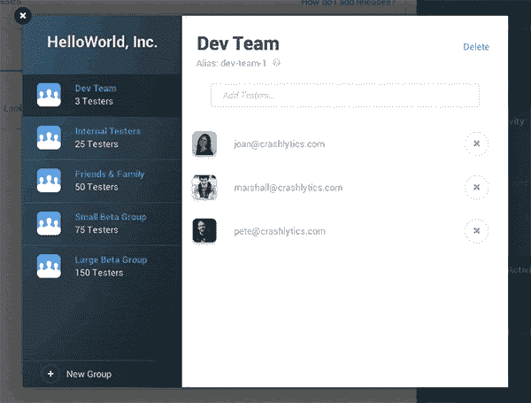
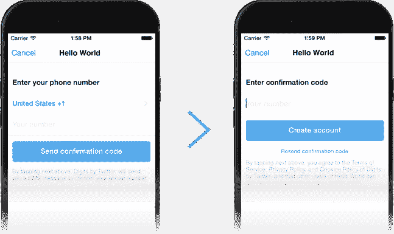

# 介绍 Twitter 的移动开发平台 Fabric

> 原文：<https://www.sitepoint.com/introducing-fabric-twitters-mobile-development-platform/>

在所有科技公司中，Twitter 因与开发者的复杂关系而臭名昭著。公司似乎想改变这种状况。Twitter 去年举办了“Flight”，这是它的第一次开发者大会，最近又举办了“Flock”，在那里它宣布了由三个开发套件组成的新开发平台*Fabric*:*crash lytics*、 *Mopub* 和 *Twitter 套件*。

Fabric 向开发者承诺了许多功能，比如用 Twitter 登录、Twitter 嵌入和基于电话号码的登录，“只需一行代码”。这使得 Twitter 与亚马逊、脸书和谷歌展开竞争，这些公司都提供开发者构建移动应用所需的后端支持和工具。该公司公布了已经在使用 Fabric 的公司名单，包括 *AOL* 、 *Kickstarter* 、*麦当劳*和 *Spotify* 。

让我们来看看布料的成分，看看它能做什么！

## Crashlytics

Fabric suite 的第一个组件是 [Crashlytics](https://get.fabric.io/crashlytics) ，Twitter 在 2013 年初收购了它，作为其构建移动开发社区战略的一部分。Crashlytics 以其核心产品而闻名，这是一个轻量级的崩溃报告框架，易于安装和开箱即用。

Crashlytics 可让您跟踪 iOS 和 Android 应用的每个版本，捕捉所有崩溃并提供见解。对于 iOS，Crashlytics 工具包使用多步骤流程来提供更高级别的细节。它始于设备上的符号化。一旦崩溃报告进入 Crashlytics 的系统，堆栈帧就会在 Crashlytics 的服务器上根据应用程序的 dSYM 重新处理。

对于 Android，它会分析您的崩溃并自动消除堆栈跟踪，从设备上的异常处理开始。一旦崩溃报告到达系统，Crashlytics 会根据构建时自动上传到服务器的应用程序映射文件重新处理堆栈帧。

Crashlytics 支持 NDK，允许用 C/C++编写代码的 Android 开发者构建更稳定的应用。这对 Android 的未来来说是重要的一步，因为对于应用程序来说，利用不断发展的新硬件是至关重要的。

Crashlytics 与大多数版本的 OS X 兼容，并完全支持 Android Studio、Eclipse 和 IntelliJ。

## 贝塔

由 Crashlytics 提供的 Beta 是一个集成到 Crashlytics 中的跨平台工具集，旨在使 Beta 版本分发成为一项更直观的任务。

你可以通过 web dashboard 或 Crashlytics 插件，通过电子邮件邀请单个测试人员加入你的应用。一旦你在应用中选择了一个发行版，你就可以添加新的测试者或者重新选择你之前添加的任何人。

有趣的是，Crashlytics 的测试版是操作系统感知的，这意味着，例如，如果你为 iOS7 构建，你的 iOS6 测试人员将不会得到提示。

## Twitter 工具包

为了帮助分发你的应用，Twitter 发布了 [Twitter 工具包](https://dev.twitter.com/twitter-kit/overview)，包括三个产品，有助于轻松集成各种 Twitter 功能。

### 原生嵌入式推文

过去，在一个应用程序中集成推文需要花费很多时间。Twitter 现在承诺，只需几行代码，开发者就可以将推文嵌入到他们的应用程序中，并根据应用程序的主题对其进行定制。

### 推特作者

Tweet composer 允许人们将你的应用程序中的瞬间分享给他们的 Twitter 关注者。Fabric 允许您轻松实现这一点。

### 使用 Twitter 登录

Twitter 正在推动其身份验证 API 与 Fabric，允许用户使用他们的 Twitter 凭据登录，而不是记住个人用户名和密码。

通过实施 Twitter 的凭证整合网关，开发人员可以获得经过身份验证的用户的 Twitter 个人资料的洞察力，包括推文、照片和他们网络中的追随者，这些可以用来创建病毒式参与活动。

## 数字

Twitter 认为，在我们生活的世界里，手机号码是识别我们身份的最常见方式。由于人们已经将他们的手机号码提供给公司用于各种事情，如忠诚度计划，Twitter 希望手机登录将大大降低新注册的门槛。在发展中国家，手机号码通常是唯一的标识符，因为智能手机用户通常没有电子邮件地址。使用通过手机号码进行验证的简单登录流程， [Digits](https://get.fabric.io/digits) 鼓励用户进行身份验证，同时保护或泄露可识别的用户个人资料信息。

与 Twitter 的视频分享应用 Vine 类似，Digits 可以让你管理其他应用对你电话号码的访问，或者在需要时删除你的账户。这对开发者来说意味着，这是一种更安全的方式，让可能没有电子邮件的新用户加入进来，不管他们在哪里。

Digits 建立在 Twitter 基础设施之上，是 Twitter 工具包的一部分。由于完全主题化，它能够适应任何应用程序的用户体验。它也不会代表用户发布任何东西，因为它与用户的社交网络账户(包括 Twitter)无关。

Digits 在 216 个国家有 28 种语言的版本，在 iOS、Android 和网络上都可以使用。

## 答案

作为 Crashlytics 套件的一部分， [Answers](https://get.fabric.io/answers) 对您的应用性能进行实时分析，为您省去从数据中获得有用反馈所需的大部分工作。它会分析你的应用在一段时间内的行为，并不断观察趋势，解释用户行为的周期性，只有当模式异常时才会提醒你。

由于 Answers 与您用于崩溃报告的相同 SDK 相集成，您现在可以直接进入问题仪表板中的特定版本，并立即解决您的应用程序的稳定性问题。

## MoPub

MoPub 是一个面向移动应用开发者的盈利平台，旨在通过单一平台最大化应用的广告收入。开发者可以直接从广告商那里提供广告，与多个广告网络合作，并利用成千上万的广告商，这些广告商在 MoPub 的交易所 MoPub Marketplace 上与其他广告合作伙伴竞争库存。MoPub 显示来自最高付费广告客户的广告，确保开发者可以最大化他们的收入。

MoPub 支持所有主要的广告格式，包括横幅、插播广告、视频和原生广告，并拥有一套新的功能，使原生广告的创建和试验更加容易。通过 MoPub 的原生位置控制，您现在可以在 MoPub UI 中选择广告的位置以及它们出现在内容流中的频率，从而让您在应用程序中的广告和内容之间找到正确的平衡。

## 又一次机会？

在 2012 年改变其平台开发者的“游戏规则”后，Twitter 因改变其 API 级别而引发了激烈的反弹。每隔几年就改变方向和策略会导致 Twitter 失去追随者(*双关语*)。该公司与开发者社区的关系一直不好。

有了 Fabric，Twitter 希望再次脱颖而出，重新赢得开发者的信任。参加过柏林的 Twitter 开发者大会“Twitter Flock ”,它看起来非常令人印象深刻，但为开发者观众提供的硅谷式的流畅演讲有时是陈词滥调。希望这种物质和交货相符。

你期待使用布料吗？你对它的功能有足够的利用来取代你目前正在使用的类似产品吗？

## 分享这篇文章