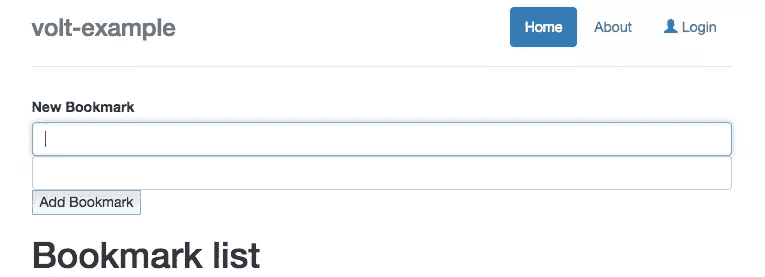
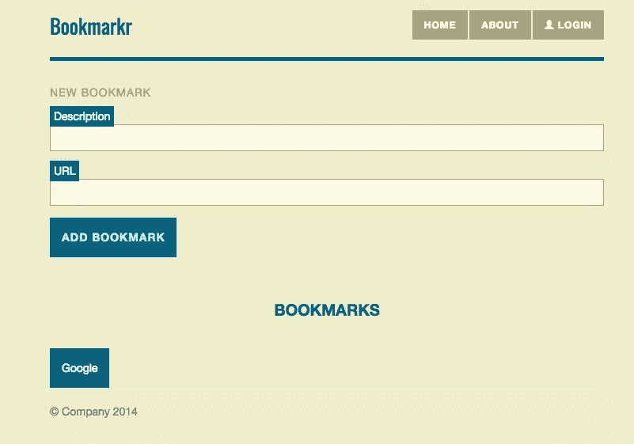

# 电压:资产、组件和路线

> 原文：<https://www.sitepoint.com/volt-assets-components-routes/>


Volt 是一个很棒的新 Ruby web 框架，旨在减少客户端和服务器之间的障碍(有点像 T2 的流星，但是在 Ruby 中)。[上次在](https://www.sitepoint.com/real-time-web-apps-volt-ruby/)左右，我们揭开了 Volt 的一些基础知识。你可以在这里查看代码。在这里，我们将构建书签应用程序，并通过资产管理，组件和路由，伏特的方式。即使你没有完整阅读上一篇文章，也应该很容易理解。

让我们从上次用 Volt 构建的简单书签页面开始。现在看起来是这样的:



那确实不吸引我的眼睛，而且它有点难以使用。为了让它看起来更好，我们应该能够链接一些 CSS。

## 资产

Volt 的资产管理有点原始，主题为的简洁的[文档页指出，“资产管理仍处于早期，可能会有很大变化。”幸运的是，我们仍然可以做我们需要的基本东西，例如添加一些 CSS。在我们开始之前，让我们改变标记，使页面的样式变得简单一些。打开 **config/base/index.html** 并将其更改为以下内容:](http://voltframework.com/docs)

```
<!DOCTYPE html>
<html>
    <head>
        <meta charset="UTF-8" />
    <% javascript_files.each do |javascript_file| %>
      <script src="<%= javascript_file %>"></script>
    <% end %>

    <% css_files.each do |css_file| %>
      <link href="<%= css_file %>" media="all" rel="stylesheet" type="text/css" />
    <% end %>

    <link href='http://fonts.googleapis.com/css?family=Oswald' rel='stylesheet' type='text/css'>
    </head>
    <body>

    </body>
</html>
```

实际上，我们添加的唯一内容是一个谷歌网络字体:

```
<link href='http://fonts.googleapis.com/css?family=Oswald' rel='stylesheet' type='text/css'>
```

这将让我们使用 CSS 中的字体来使页面看起来更好一点。我们需要在**app/main/views/main/bookmarks . html**中再做一些修改，以便使用 CSS 选择器获得页面元素:

```
<:Title>
  Bookmarks

<:Body>
    <form e-submit="add_bookmark" role="form">
        <div class="form-group">
            <label class="muted">New Bookmark</label>

          <div class="form-element">
            <span class="input_label">Description</span><input class="form-control" type='text' value="{{ page._new_bookmark._description }}" />
          </div>

          <div class="form-element">
            <span class="input_label">URL</span><input class="form-control" type="text" value="{{ page._new_bookmark._url  }}" />
            <input type="submit" value="Add Bookmark" />
          </div>
        </div>
    </form>

  <div id="bookmarks">
    <h1 id="bookmark_header">Bookmarks</h1>

      {{ _bookmarks.each do |bookmark| }}
          <a class="bookmark" href="{{ bookmark._url }}">{{ bookmark._description }}</a>
      {{ end }}
    </ul>
  </div>
```

快速回顾一下这段代码的内容可能会有所帮助。真的只有两个部分特别。首先，我们有表单输入:

```
<input class="form-control" type="text" value="{{ page._new_bookmark._url  }}" />
```

这里，我们定义了一个绑定`page._new_bookmark._url`,这样我们就可以访问控制器中的值，并期望它保存文本字段的值。另一个重要部分是书签显示:

```
{{ _bookmarks.each do |bookmark| }}
      <a class="bookmark" href="{{ bookmark._url }}">{{ bookmark._description }}</a>
  {{ end }}
```

如果您以前使用过 Rails，这种类型的代码应该不会让人感到惊讶。基本上，我们循环浏览书签，然后为每个书签创建链接。然而，Volt 让这变得特别，因为我们实际上是为从数据库构建的书签对象中的`bookmark._url`和`bookmark._description`创建绑定。好了，我们有了基本的显示器，但是看起来很糟糕。让我们用一些 CSS 来美化它。

Volt 的资产管理仍处于早期阶段，但如果你来自 Rails，你会感觉如鱼得水。资产由组件划分。现在，我们只有一个组件，它叫做“主组件”。伏链接在你的资产给你。它到底和什么有联系？正如文档中提到的:“组件 asset/js 或 assets/css 文件夹中的任何内容都在/assets/{js，css}中提供(通过链轮)。”像 Rails 一样，Volt 也使用链轮来预编译和管理资产。

我们将为书签页面做一个简单的双色(带一些阴影)方案。让我们首先得到一些颜色作为 SCSS 变量，这样我们就不必一直重复它们。创建文件**app/main/assets/variables . CSS . scss**并选择颜色:

```
$background-color: #EFECCA;
$muted-color: #A7A37E;
$accent-color: #046380;
$muted-accent: #CDE0E5;
$text-field: #FAF8E4;
```

我们有一些可以应用于整个组件的 CSS 指令。把这些东西塞进**app/main/assets/CSS/app . CSS . scss**:

```
@import 'variables';

body {
    background-color: $background-color;
}

.header {
    border-bottom: 5px solid $accent-color;
}

.header h3 {
    font-family: Oswald;
    color: $accent-color;
}

.header li a, .header li:hover a {
    background-color: $muted-color;
    border-radius: 0px;
    color: #fff;
    font-weight: bold;
    font-size: 12px;
    letter-spacing: 1px;
    text-transform: uppercase;
}

.header li:hover a {
    background-color: $accent-color;
}

.muted {
    color: $muted-color;
}
```

CSS 本身非常简单，因为它只是设置颜色和字体。然而，重要的是，我们可以找到 SCSS 的其他文件。如果您来自 Rails-land，您可能希望将`app.css.scss`转换成`app.css`，并将所有的保存在一个地方。然而，Volt 还没有资产捆绑*和*，所以耐心等待吧。

我们有一些特定于书签的 CSS，可以放在**app/main/assets/CSS/bookmarks . CSS . scss**中:

```
@import 'variables';

.form-group .muted {
    font-size: 14px;
    text-transform: uppercase;
    font-weight: normal;
    letter-spacing: 1px;
}

.form-group input[type="text"] {
    border: 1px solid $muted-color;
    border-radius: 0px;
    box-shadow: none;
    margin-bottom: 15px;
    background-color: $text-field;
}

.form-group input[type="submit"] {
    background-color: $accent-color;
    border: none;
    color: $muted-accent;
    font-size: 14px;
    padding: 15px;
    text-transform: uppercase;
    font-weight: bold;
    letter-spacing: 1px;

}

.form-group .input_label {
    background-color: $accent-color;
    color: #fff;
    padding: 5px;
}

.form-element {
    margin-top: 5px;
}

#bookmarks {
    margin-top: 55px;
}

#bookmark_header {
    text-align: center;
    font-weight: bold;
    text-transform: uppercase;
    font-size: 20px;
    color: $accent-color;
    margin-bottom: 35px;
}

#bookmarks ul li {
    list-style-type: none;
}

.bookmark {
    background-color: $accent-color;
    color: #fff;
    padding: 15px;
    margin-top: 3px;
    display: inline-block;
}

.bookmark:hover {
    color: #fff;
    text-decoration: none;
}
```

我们的页面现在应该是这样的:


记住，仅仅将文件命名为 **bookmarks.css.scss** 实际上没有任何作用。即使我们将它命名为“treefrogs.css.scss”，Volt 也会包含它。坦率地说，Volt 根本不在乎这个文件的名字。但是，如果您想将代码的一部分分离到不同的组件中，保持 CSS 的某种程度的分离可能会有所帮助。另一种思考方式是:如果你真的想让你的 CSS 不要乱成一团，你可能应该拆分成另一个组件。顺便问一下，组件到底是什么？

## 成分

组件不仅仅是你所期望的伏特。首先，它们的作用是把你的应用程序分成小块。但是，当您加载组件的第一页时，Volt 也会加载特定组件的所有文件。这样做的目的是，如果你的网站有一个名为`sales`的组件，我们可以相当有把握地说，一旦用户访问了`sales`组件中的一条路线，该用户很可能会转到同一组件中的另一条路线。因此，文档建议我们将组件视为应用程序中的“重新加载边界”。

我们可以很容易地生成一个组件，因为 Volt 给了我们一个简单的生成器，它将设置目录结构和一些文件。

```
volt generate component bookmarks
```

该命令的输出让您大致了解了我们所说的“电压分量”的含义:

```
create  app/bookmarks
  create  app/bookmarks/assets/css
  create  app/bookmarks/assets/js
  create  app/bookmarks/config/dependencies.rb
  create  app/bookmarks/config/routes.rb
  create  app/bookmarks/controllers/main_controller.rb
  create  app/bookmarks/models
  create  app/bookmarks/tasks
  create  app/bookmarks/views/index/index.html
```

基本上，控制器、模型、视图和资产都是由组件分开的。由于书签应用程序现在非常简单，没有必要把它移到一个单独的组件中。我们将坚持使用主要组件(即，您可以安全地删除**应用程序/书签**)。

我们可以通过这些“组件”来分离我们的应用程序，每个组件都有一些与之相关联的路由。虽然我们以前见过这些路线，但我们并没有真正理解它们在 Volt 中是如何工作的。

## 路线

路由是大多数 web 框架的生命线，因为它们告诉我们在任何给定的时间点我们在应用程序中的位置。但是，因为 Volt 通过网络套接字进行所有这些数据同步，所以该 URL 以某种“实时”方式工作。假设我们加载一个路径为“/people/dhaivat”的页面，其中“dhaivat”是其中一个“人”的名字。如果在控制器中我们最终改变了与“dhaivat”相关联的模型值，那么 URL 将在客户端上改变！从根本上说，URL 不控制应用程序的状态；URL 只是引用特定州的一种方式。

那么我们实际上能对路线做些什么呢？我们知道我们必须在**app/<component name="">/config/routes . Rb</component>**中设置它们。最简单的路线是这样的:

```
get '/bookmarks', _action: 'bookmarks'
```

这只是将“/书签”路径映射到`controllers/main_controller.rb`中的“书签”动作。原来我们可以像处理标记一样在路由上进行绑定:

```
get "/bookmarks/{{ _bookmark_id }}", _action: 'show_bookmark'
```

有了这个路由，如果我们访问 URL“/bookmarks/16”，`params._bookmark_id`就会包含`16`。然后，我们可以在控制器中更改该值，客户端上的 URL 将会更新以反映该更改。这也是 Volt 试图模糊客户机和服务器之间区别的地方之一。

## 包装它

如果你来自一个传统的 Rails 背景，一开始，Volt 可能看起来有点奇怪。Volt 仍然有一些粗糙的边缘(例如，没有资产捆绑)，但随着这些继续消失，Volt 是一个 web 应用程序的出色框架，客户端与服务器端一样重要(如果不是更重要的话)。希望这篇文章能帮助你用 Volt 编写下一个应用程序。

## 分享这篇文章