# Pythonists 们使用哪些代码编辑器？

> 原文：<https://www.sitepoint.com/which-code-editors-do-pythonists-use/>

*没进 Python？更喜欢 Ruby？以下是对 ruby 爱好者来说最受欢迎的[编辑](https://www.sitepoint.com/editor-rubyists-use/)和 [IDEs](https://www.sitepoint.com/ides-rubyists-use/) 。*

所以，你决定学 Python 了？太好了！Python 是一种非常有趣的编程语言，[被描述为吸引 Unix/C 开发人员的 ABC 的后代。而且以 Monty Python 命名的语言是不会错的！](http://en.wikipedia.org/wiki/Python_%28programming_language%29)

所以是的，你有许多令人兴奋的事情在等着你。

但是您需要做的第一件事是选择一个编辑器，您将使用它来编写您的 Python 程序。好了，困惑来了。你面临着大量的编辑器，每个编辑器都有一个社区试图吸引你使用这个编辑器。“用 vim！”“用 Emacs！”“用崇高的文字！”

你在恐惧中退缩…如果你做了错误的选择呢？

这种感觉激发了我去采访 Python 们，询问他们最喜欢的 Python 编辑器。这将显示哪些编辑器被大多数 python 爱好者使用，从那里我们可以尝试找出原因。我希望它能作为 Python 新手的指南，甚至是已经在使用 Python 的人的指南。

我将从讨论最流行的编辑器开始，然后看一看获胜者的优点(和缺点)，然后再看如何将它安装到您的系统上。

## 该调查

我采访了 100 位蟒蛇学家，他们提出了以下编辑(按受欢迎程度排列):

1.  崇高的文本
2.  精力
3.  Emacs
4.  记事本++
5.  TextWrangler
6.  闲置的
7.  原子
8.  Aquamacs
9.  GNU Nano
10.  凯特
11.  gedit

Sublime Text 是迄今为止最受欢迎的编辑器，有 45%的受访者使用它。下面的图表讲述了这个故事:

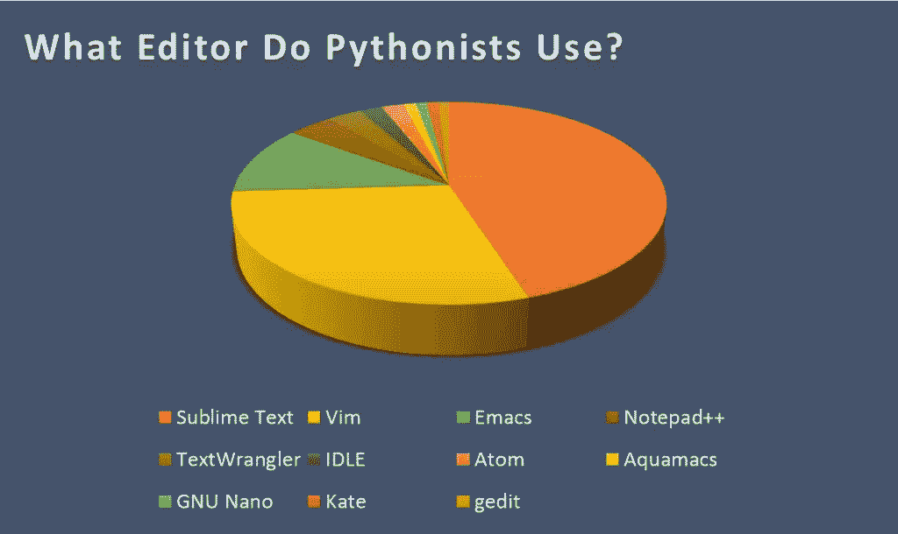

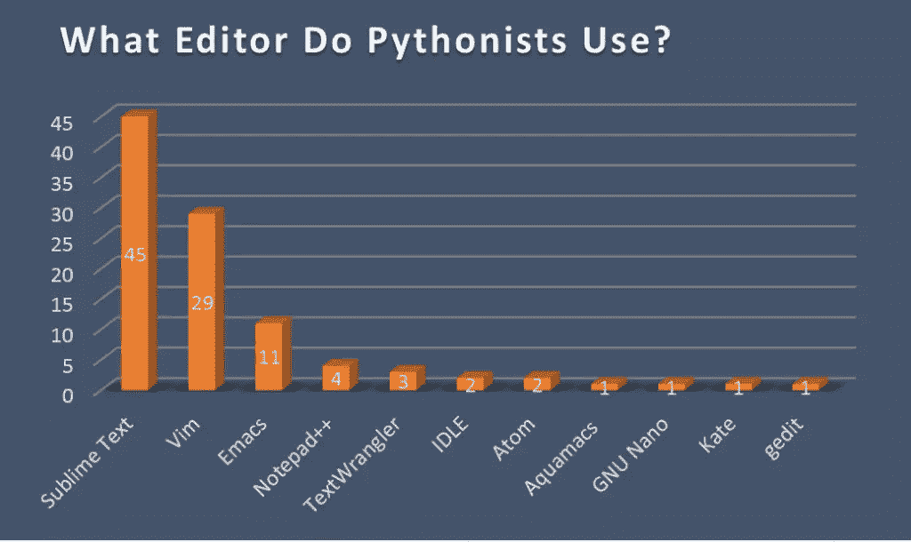

从上面的图中，我们可以看到 *Sublime Text* rules 是我采访过的样本中最受欢迎的 Python 编辑器。这似乎和 Sublime Text 的口号是一致的:*你会爱上的文本编辑器*。

## 崇高文本的优势

那么是什么让崇高的文本如此特别呢？

和其他人一样，我使用 Sublime 来完成我的 Python 工作。我喜欢[这篇关于崇高文字](http://lesseverything.com/blog/archives/2012/09/19/6-sublime-text-featuresenhancements-that-ive-discovered-in-the-past-5-hours-using-the-app/)的帖子中提到的特性。简而言之，这些是:

*   *包* : Sublime Text 附带了一个全功能的[包管理器](https://packagecontrol.io/)，帮助程序员发现、安装、更新和删除 Sublime Text 的包。

*   *宏*:您可以简单地录制[宏](http://webdesign.tutsplus.com/tutorials/quick-tip-banish-repetitive-tasks-with-sublime-text-2-macros--webdesign-6398)并创建一个键盘快捷键，将文本输出到您的文档中，而不是重新键入简单的文本字符串。

*   *颜色*:在 Sublime Text 中，你可以快速[为界面和文本挑选颜色](https://github.com/jnordberg/sublime-colorpick)。

Sublime Text 的其他有用功能，如 [this SitePoint Smackdown 帖子](https://www.sitepoint.com/sitepoint-smackdown-atom-vs-brackets-vs-light-table-vs-sublime-text/)中所述，如下所示:

*   具有 TextMate 兼容语法的全面语言支持

*   “转到任何地方”快速导航定位文件和代码

*   用于访问所有功能的命令选项板

*   广泛的定制，伟大的主题和众多的插件

## 崇高文本的缺点

然而，Sublime Text 仍然需要一些改进，才能成为更好的 Python 编辑器。

以下是一些可以改进 Sublime Text 的方法，以便更好地使用 Python:

*   在 Sublime Text 中，一些深层语言特定的集成特性，如静态分析和重构，也可以通过插件获得，但没有经过[修饰](http://opensourcehacker.com/2014/03/10/sublime-text-3-for-python-javascript-and-web-developers/#The_position_of_Sublime_Text_on_the_programmer%E2%80%99s_editor_markets)。

*   代码的动态分析和自动完成[需要增强](http://dmishh.com/blog/2013/05/moving-from-jetbrains-ides-to-sublime-text-2)。

*   崇高的文本可以变得对新的 Python 程序员更友好。例如，如果需要[配置应用程序的首选项](http://trevan.co/dreamweaver-vs-textmate-vs-coda-2-vs-sublime-text-2/)，这可以通过编写/编辑代码行来完成。这是一个新程序员可能会感到不舒服的尝试。

*   作为上一点的延续，Sublime Text 需要[简化](http://www.blog.tweenout.com/tag/sublime-text/)一点，因为它有一个陡峭的学习曲线，插件需要简化，因为它们可能会令人困惑。

*   虽然该应用程序可以配备[令人印象深刻的功能](https://burningthemidnightoil.wordpress.com/2013/08/09/my-top-3-latex-environments-notepad-sharelatex-and-sublime-text/)，但这些必须单独安装，其中一些不是免费的。

*   崇高文本[无法通过终端](http://incrediblevehicle.com/2012/04/21/sublime-text-2/)访问。

## 如何为 Python 设置崇高的文本

所以，你想试试吗？在这一节中，我将向您展示如何设置 Sublime Text 来使用 Python。我将在微软 Windows 8.1 机器上[演示](http://www.davidbaumgold.com/tutorials/set-up-python-windows/)这个。如果你想在 MAC OS X 机器上这样做，你可以按照[这个教程](http://www.penjee.com/programming/setting-up-python-on-mac/)，在 Ubuntu 机器上，你可以参考[这个线程](http://ubuntuforums.org/showthread.php?t=2216832)。

让我们开始吧。

### 安装 Python

从[这里](https://www.python.org/downloads/)下载 Python。我会下载 Python 3.4.2。这将是一个`msi`文件。因此，您将下载的文件是`python-3.4.2.msi`。运行安装程序，将显示如下图所示的向导:

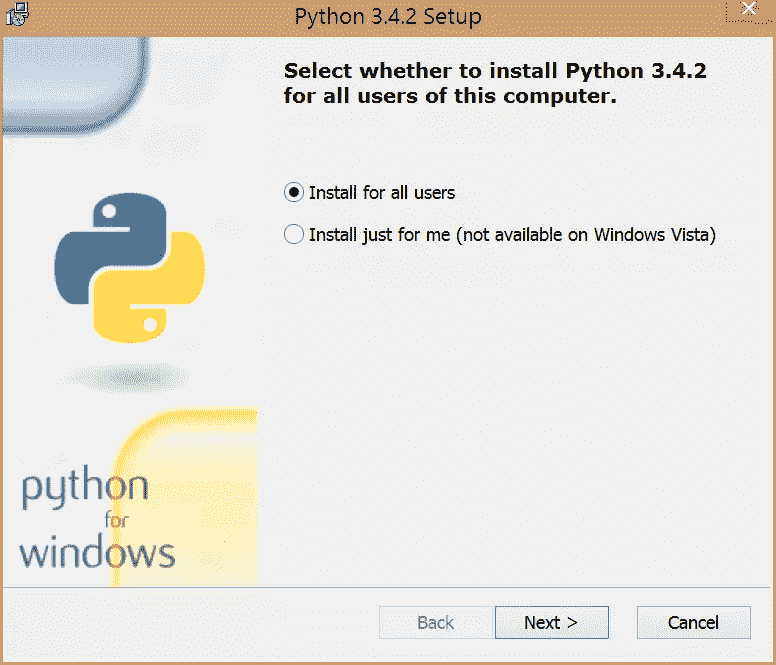

浏览这些步骤，直到完成安装向导。如果您保留默认位置，您会注意到 Python 安装在`C:\Python34\`中。

### 安装 Cygwin

下一步是安装 [Cygwin](http://cygwin.com/) ，这是一个为 Windows 提供与 Linux 发行版相似功能的工具。如果你用的是 32 位的 Windows，从[这里](https://cygwin.com/setup-x86.exe)下载安装文件。如果您使用的是 64 位 Windows，请点击从[下载安装文件。下载适当的安装文件后，运行该文件，您将在向导中看到以下起始页:](https://cygwin.com/setup-x86_64.exe)


继续浏览安装程序，直到到达以下步骤:

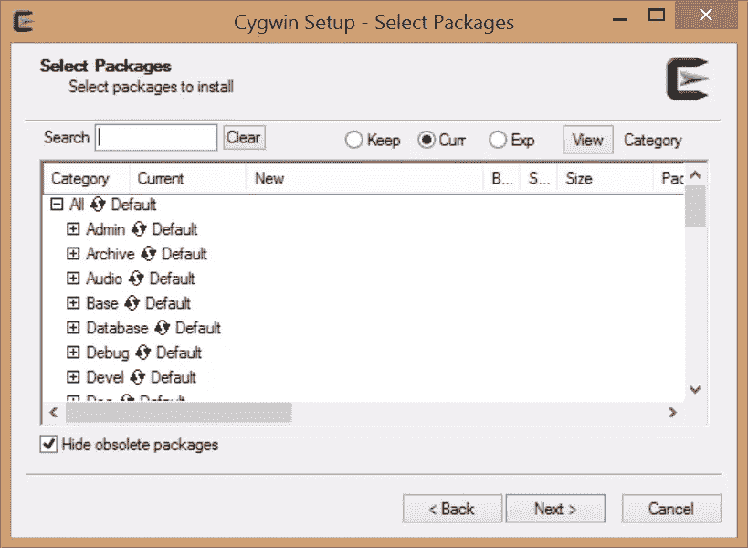

在这一步，我们将安装三个软件包:`curl`、`git`和`openssh`。为此，我们使用`Search`框。例如，对于`curl`，在搜索框中输入单词，但是要小心，不要按回车键，因为这将继续 Cygwin 的安装。当您在搜索框中键入`curl`时，您应该会看到如下内容:

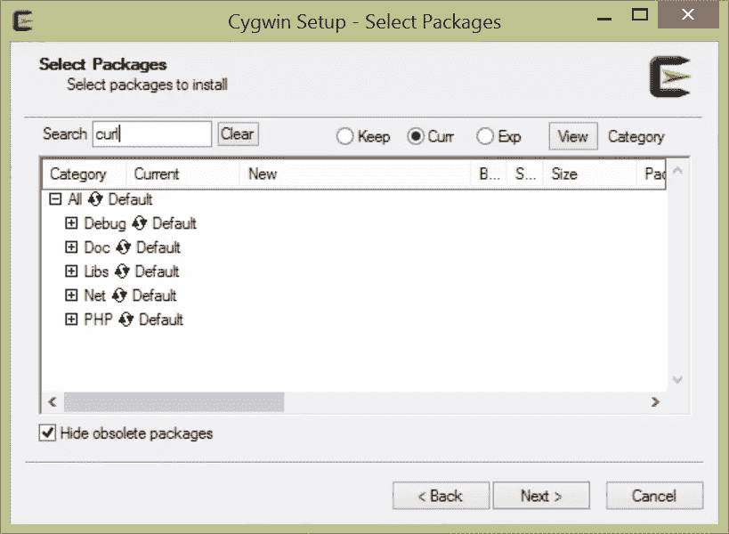

我们现在要做的是安装上面的每个包。点击`+`符号。你会注意到`skip`，点击`skip`，这样你就获得了软件包的最新版本号，这是我们想要安装的。在这种情况下，您应该得到类似于以下内容的内容:

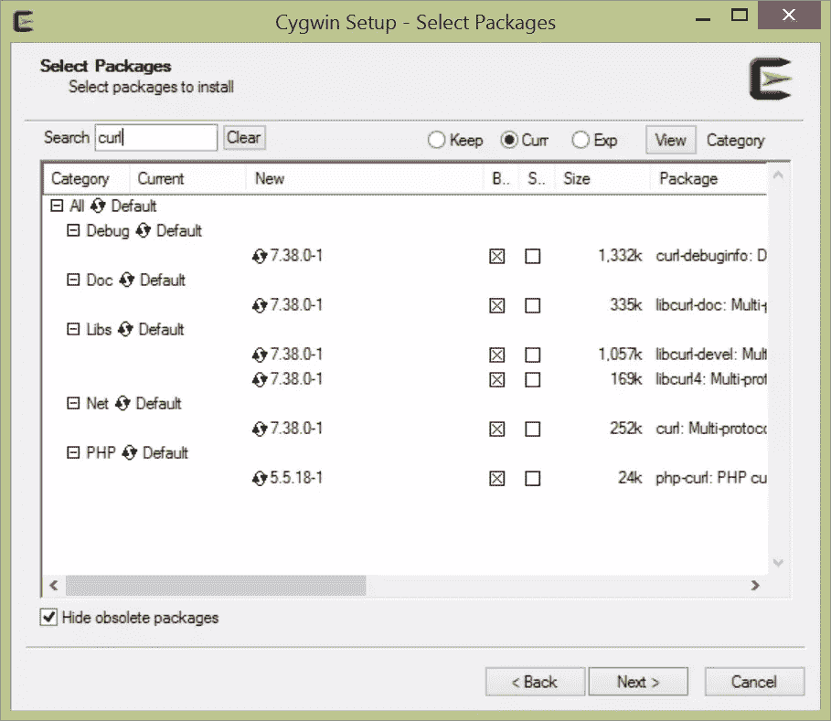

点击`Next`按钮，等待软件包下载完毕。这可能需要一些时间来完成。

对另外两个包`git`和`openssh`进行同样的操作。

完成后，您应该会在桌面上看到一个 Cygwin 快捷方式，如下所示:

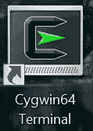

通过这个终端，除了访问上面安装的包之外，您还将运行您的 Python 代码。如果双击图标快捷方式，您应该会看到类似下图的内容:

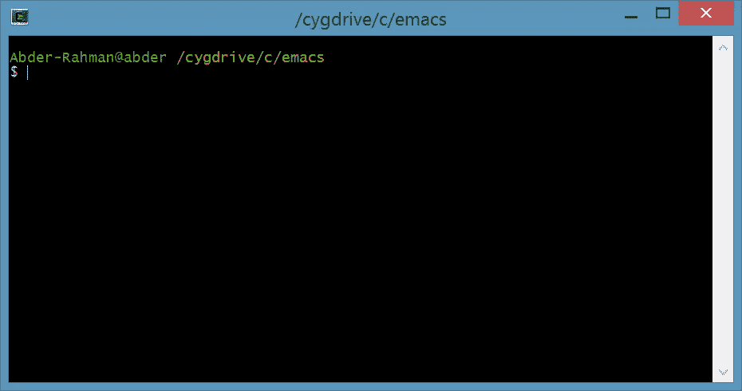

为了确保软件包已经安装，并了解它们的位置，我们将使用
`which`命令，如下所示:

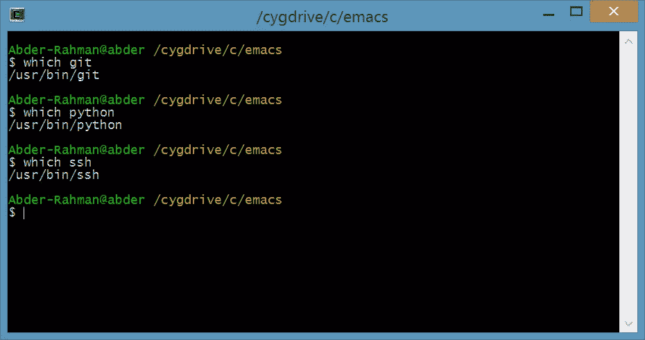

我能够使用以下步骤通过 Cygwin 安装 Python(注意末尾的“Python”):

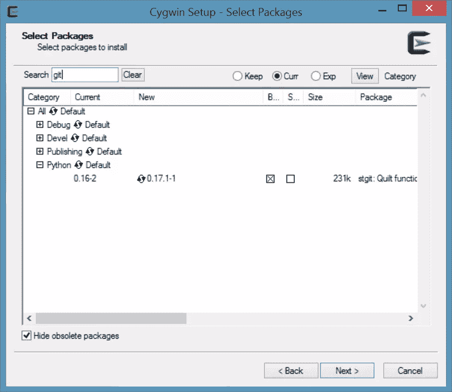

如果您碰巧错过了这一步，或者您希望 Cygwin 找到并使用上面安装的 Python 版本，您可以在终端中发出以下命令:

```
$ echo "PATH=\$PATH:/cygdrive/c/Python34" >> .bash_profile 
```

### 安装崇高的文本

现在，最简单的部分。要安装 Sublime Text，进入 Sublime Text [主页](http://www.sublimetext.com/)，下载，设置。非常容易！

### 测试您的安装

在本教程的这一部分，让我们测试一下我们的设置是否有效，我们已经准备好使用 Sublime Text 来处理 Python 了。

打开 Sublime Text，键入这行代码:

```
print("Hello Python!) 
```

选择`File -> Save`。在`Save As`对话框中，选择保存文件的位置，给文件命名，在`Save as type:`中，选择 Python。例如，这是我选择的:

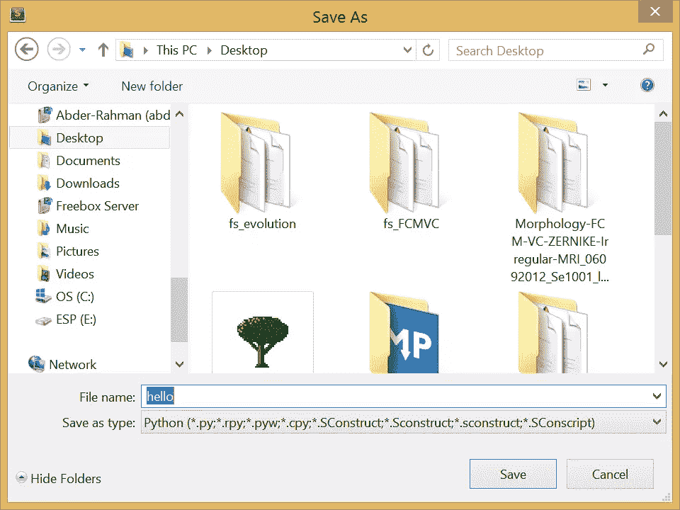

现在，打开终端(Cygwin 图标快捷方式)，导航到保存 Python 文件的位置。对我来说，是在`Desktop`号。在我的例子中，文件路径如下所示:

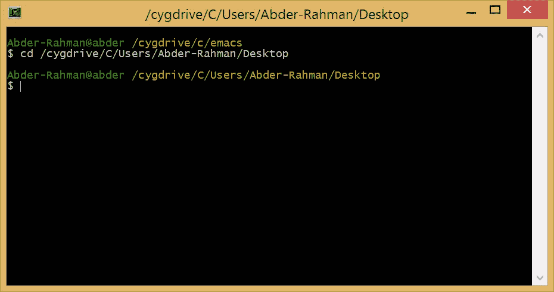

最后，在终端中键入以下命令来运行 Python 程序:

```
python hello 
```

在这种情况下，您应该得到以下输出:

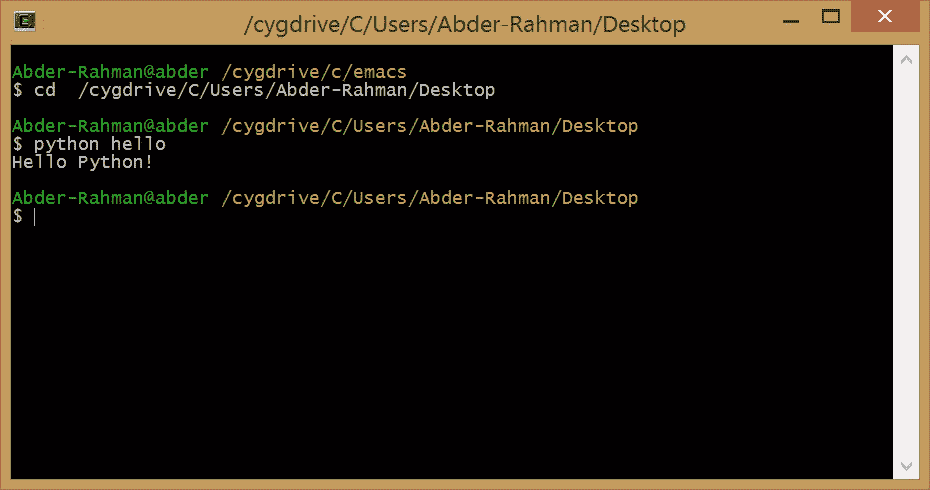

现在您已经设置好了一切，并准备好使用 Sublime Text 深入 Python 世界了！你现在应该做的第一件事就是用 Sublime Text 查看这个插件集合。

## 结论

虽然崇高的文本在数量上遥遥领先，但这只是一个考虑因素。有很多流行的编辑器，并不一定适合每一个 Pythonist 爱好者。然而，了解大多数人如何处理他们的项目总是好的，使用流行的应用程序或技术也是有好处的。

*你最喜欢的 Python 编辑器是什么？你如何设置它来提高工作效率？*

## 分享这篇文章