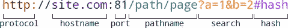

# 使用同构 JavaScript 轻松解析 URL

> 原文：<https://www.sitepoint.com/url-parsing-isomorphic-javascript/>

大多数 web 应用程序都需要 URL 解析，无论是提取域名、实现 REST API 还是查找图像路径。下图描述了典型的 URL 结构:



你可以使用正则表达式将一个 URL 字符串分解成几个组成部分，但是这很复杂而且没有必要…

## 服务器端 URL 解析

Node.js(以及 io.js 之类的 forks)提供了一个 [URL API](http://nodejs.org/api/url.html) :

```
// Server-side JavaScript
var urlapi = require('url'),
url = urlapi.parse('http://site.com:81/path/page?a=1&b=2#hash');

console.log(
url.href + '\n' + // the full URL
url.protocol + '\n' + // http:
url.hostname + '\n' + // site.com
url.port + '\n' + // 81
url.pathname + '\n' + // /path/page
url.search + '\n' + // ?a=1&b=2
url.hash // #hash
);
```

正如您在上面的代码片段中看到的，`parse()`方法返回一个包含您需要的数据的对象，比如协议、主机名、端口等等。

## 客户端 URL 解析

浏览器中没有对等的 API。但是如果有一件事浏览器做得很好，那就是 URL 解析，DOM 中的所有链接都实现了类似的 [Location](https://developer.mozilla.org/en-US/docs/Web/API/Location) 接口，例如:

```
// Client-side JavaScript
// find the first link in the DOM
var url = document.getElementsByTagName('a')[0];

console.log(
url.href + '\n' + // the full URL
url.protocol + '\n' + // http:
url.hostname + '\n' + // site.com
url.port + '\n' + // 81
url.pathname + '\n' + // /path/page
url.search + '\n' + // ?a=1&b=2
url.hash // #hash
);
```

如果我们有一个 URL 字符串，我们可以在内存中的锚元素(`a`)上使用它，这样就可以在没有正则表达式的情况下解析它，例如:

```
// Client-side JavaScript
// create dummy link
var url = document.createElement('a');
url.href = 'http://site.com:81/path/page?a=1&b=2#hash';

console.log(url.hostname); // site.com
```

## 同构 URL 解析

Aurelio 最近讨论了[同构 JavaScript 应用](https://www.sitepoint.com/isomorphic-javascript-applications/)。本质上，它是一种渐进的增强，达到了一个极限水平，应用程序可以在客户机或服务器上愉快地运行。拥有现代浏览器的用户会使用单页面应用程序。旧的浏览器和搜索引擎机器人会看到一个服务器渲染的替代品。理论上，根据设备的速度和带宽能力，应用程序可以实现不同级别的客户机/服务器处理。

同构 JavaScript 已经讨论了很多年，但是它很复杂。很少有项目比
实现可共享的视图走得更远，标准渐进增强也不会有太多的情况*(如果不是更好的话，大多数“同构”框架在没有客户端 JavaScript 的情况下似乎会失败)*。也就是说，创建环境不可知的微库是可能的，它提供了进入同构概念的初步尝试。

让我们考虑如何在一个`lib.js`文件中编写一个 URL 解析库。首先，我们将检测代码在哪里运行:

```
// running on Node.js?
var isNode = (typeof module === 'object' && module.exports);
```

这不是特别健壮，因为你可以在客户端定义一个`module.exports`函数，但是我不知道更好的方法*(欢迎建议)*。其他开发人员使用的类似方法是测试`window`对象的存在:

```
// running on Node.js?
var isNode = typeof window === 'undefined';
```

现在让我们用一个`URLparse`函数来完成 lib.js 代码:

```
// lib.js library functions

// running on Node.js?
var isNode = (typeof module === 'object' && module.exports);

(function(lib) {

"use strict";

// require Node URL API
var url = (isNode ? require('url') : null);

// parse URL
lib.URLparse = function(str) {

if (isNode) {
return url.parse(str);
}
else {
url = document.createElement('a');
url.href = str;
return url;
}

}

})(isNode ? module.exports : this.lib = {});
```

在这段代码中，为了清晰起见，我使用了一个`isNode`变量。但是，您可以通过将测试直接放在代码片段的最后一个括号内来避免它。

服务器端，`URLparse`导出为常用。JS 模块。要使用它:

```
// include lib.js module
var lib = require('./lib.js');

var url = lib.URLparse('http://site.com:81/path/page?a=1&b=2#hash');
console.log(
url.href + '\n' + // the full URL
url.protocol + '\n' + // http:
url.hostname + '\n' + // site.com
url.port + '\n' + // 81
url.pathname + '\n' + // /path/page
url.search + '\n' + // ?a=1&b=2
url.hash // #hash
);
```

客户端，`URLparse`作为方法添加到全局`lib`对象:

```
<script src="./lib.js"></script>
<script> var url = lib.URLparse('http://site.com:81/path/page?a=1&b=2#hash');
console.log(
url.href + '\n' + // the full URL
url.protocol + '\n' + // http:
url.hostname + '\n' + // site.com
url.port + '\n' + // 81
url.pathname + '\n' + // /path/page
url.search + '\n' + // ?a=1&b=2
url.hash // #hash
); </script>
```

除了库包含方法之外，客户端和服务器 API 是相同的。

不可否认，这是一个简单的例子，`URLparse`在客户端和服务器端运行(大部分)独立的代码。但是我们已经实现了一个一致的 API，它展示了如何编写 JavaScript 代码以在任何地方运行。我们可以扩展这个库来提供更多的客户机/服务器实用功能，如字段验证、cookie 解析、日期处理、货币格式化等。

鉴于客户机和服务器上需要不同类型的逻辑，我不相信完全同构的应用程序是实际可行的。然而，环境不可知的库可以减轻编写两套代码来做同样事情的痛苦。

## 分享这篇文章