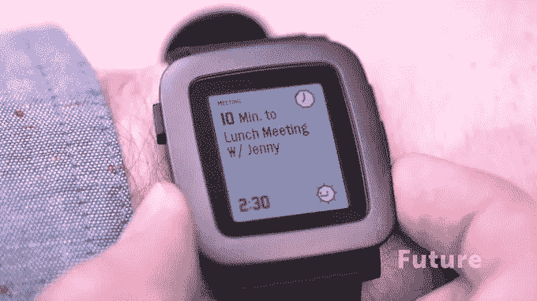
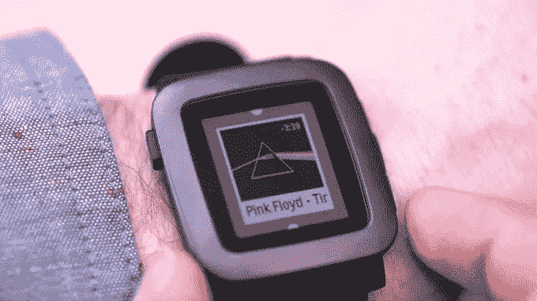

# Pebble Time 对开发者来说意味着什么？

> 原文：<https://www.sitepoint.com/pebble-time-mean-developers/>

Pebble 在 2012 年的第一次智能手表众筹活动通过认捐筹集了超过 1000 万美元，迄今已售出超过 100 万只智能手表。

Pebble 团队最近宣布了他们最新即将推出的智能手表—[Pebble Time](https://www.kickstarter.com/projects/597507018/pebble-time-awesome-smartwatch-no-compromises)。Pebble Time 是一款彩色电子纸智能手表，具有新的按时间顺序排列的时间轴界面、动画用户界面、麦克风、智能配件端口等。新一代 Pebble 智能手表带来了更新的 API 和许多令人兴奋的潜力。

截至 2014 年 2 月，Pebble 应用程序商店已有超过 1，000 个应用程序是使用 Pebble 的免费软件开发套件开发的。现在，Pebble 团队带着他们的最新项目 Pebble Time 回来了。到目前为止，Pebble Time 已经筹集了超过 1100 万美元的众筹资金，在剩下的一个月里有超过 50，000 名支持者。这使得他们的资助可能会更高。

新的 3.0 SDK 已经发布，所以在这篇文章中，我们将看看这些变化对开发人员意味着什么，您现在可以开始做什么，还有什么正在进行中。非常感谢 Pebble 的 Thomas Sarlandie 为本文回答了一系列问题。

## 时间轴界面

新版 Pebble OS 在时间轴上按时间顺序排列通知、新闻、提醒和事件。无需搜索并打开应用程序来检查信息，您可以滚动到过去或未来，查看哪些启用了时间线的应用程序已锁定到您的时间线。



时间轴将有一个 web API，允许开发人员将各种信息输入到用户的 watchface 上，而无需构建完整的 Pebble watch 应用程序。您将能够添加一个简单的应用程序来允许配置选项，然后使用 web API 构建其余的功能。

## 彩色电子纸显示器

Pebble Time 将拥有 64 种颜色的显示屏。如果需要，Pebble SDK 会自动减少颜色，但对于那些渴望精确的人来说，可以先在您选择的图像编辑器中编辑您的图像。

当前的应用程序将在手表上优雅地降级，新的应用程序将能够检测用户是否在黑白或彩色显示器上，并使用编译时和运行时 API 做出相应的响应。它就像代码中简单的 if 语句一样简单:

```
#ifdef PBL_COLOR
  window_set_background_color(s_main_window, GColorSunsetOrange);
#else
  window_set_background_color(s_main_window, GColorBlack);
#endif
```

颜色可通过`GColorBabyBlueEyes`、`GColorIcterine`、`GColorRed`和`GColorYellow`等名称定义。你也可以通过 RGB ( `GColorFromRGB(255, 255, 0)`)和 hex ( `GColorFromHEX(0xFFFF00)`)来访问它们。

## 新应用菜单

您的应用程序现在将有一个更直观的选择过程，磁贴可以在滚动时显示应用程序的摘要信息。比如在音乐 app 中听的最后一首歌，或者游戏中的最后一个高分。



## 新的 UI 组件和动画框架

[新的 Pebble SDK 中提供了一个新的强大的动画框架](http://developer.getpebble.com/docs/c/User_Interface/Animation/),允许在您的应用程序中使用各种动画。Pebble OS 的整个更新具有非常圆滑和微妙的动画填充设计，因此新的 SDK 将允许开发者满足相同的标准是有意义的。与 Pebble 设计相匹配的新 UI 组件正在开发中，并将包含自己的动画。

## 麦克风

今年晚些时候，我们将在 Pebble Time 中为新的麦克风提供语音到文本的 API。在 Android 上，语音识别通过 Android Wear 工作，而 iOS 则有点难以实现。

在最初推出时，麦克风将主要用于语音回复。Pebble Time 将仅限于 iOS 上的 Gmail 通知，而 Android 将有更大的范围，还可以使用短信、视频聊天、Facebook Messenger 等。幸运的是，当语音转文本 API 发布时，它将包括对两个平台的兼容性。

## BLE 连通性

今年晚些时候，Pebble 将拥有一个蓝牙低能耗 API，用于访问支持 ble 的对象。将 Pebble 进一步连接到一个互联设备的世界。心率监测器、车库门开启器、健身追踪器、蓝牙灯泡等都可以通过蓝牙与 Pebble 连接。

## 全面支持巴布亚新几内亚和 APNG

我们目前可以在 Pebble SDK 中使用 PNG 文件，但它们必须经过转换才能使用。在新的 SDK 中，我们将能够直接使用 PNG 文件，在每个 Pebble 上使用较少的宝贵内存。这对于那些希望从网上使用大量远程图像的人来说尤其令人兴奋——事情将变得更加容易。

将提供动画 PNG 文件支持。当我听到这个消息时，我有点担心电池寿命。当然，播放动画 PNG 文件会耗尽电池电量！向 Pebble 团队提出这个问题时，有人建议我不要使用太多 30 fps 的动画。因此，不要以 30 帧/秒的速度观看超级疯狂的动画——保持冷静和简单，以免耗尽用户的电池寿命。谨慎使用。

## 将提供 3D Pebble 数据

Pebble Time 不仅拥有应用程序开发的新功能，而且还可以利用新 Pebble 的可用 3D 数据，开发表带、外壳和底座等配件。一个全新的 Pebble 配件生态系统即将诞生。

## 智能附件端口

配件不仅仅是定制的漂亮的皮带和外套，还会有更多的功能。Pebble Time 将有一个智能附件端口，因此硬件开发人员可以构建传感器和智能表带来扩展其硬件功能。想要一次安装多个传感器和配件？我听说它有被电子链接的潜力。然而，开发者需要在上面写一个软件层来管理冲突。

## 应用程序限制已取消！

用户在新的 Pebble Time 上不再有八个应用程序的限制，这意味着更多的应用程序有更多的空间，你的应用程序有更多的机会出现在更多的手表上。手表上仍然可以安装多个表盘。它使用缓存来存储最近使用的应用程序和观看面孔，如果达到限制(这是相当高的，可能大于 50)，那么它会巧妙地将最后一个应用程序推出，直到它再次被使用。

## 更大的应用程序大小、CPU 和资源大小余量

我们的代码和堆的应用程序大小将从 24kB 增加到 64kB(代码本身的限制为 32kB)。CPU 频率从 64MHz 跳到 100 MHz，最大资源大小从 96kB 增加到 256kB。

## JavaScript 和卵石时代

我们熟悉并喜爱的用于 web API 调用和配置窗口的 PebbleKit JavaScript 框架将通过一些新功能进行扩展，以支持时间轴。

遗憾的是，Pebble.js API 需要一点时间才能赶上。由于 Pebble.js API 是社区驱动的，因此它不会成为开发者预览版的一部分。但是，我确信 Pebble 团队将与社区合作，尽快更新它。

## 敏锐的 Pebble 开发者应该做些什么准备？

1.  阅读 Pebble 的[入门](http://developer.getpebble.com/sdk/whats-new/)指南和他们的[迁移指南](http://developer.getpebble.com/sdk/migration-guide/)，感受一下编码方面的新功能。
2.  从《入门指南》中提供的链接安装最新的 SDK，或者在更新的 CloudPebble 中进行自我设置，以便进行一些开发。
3.  如果你已经有了一个现有的应用程序，开始将它导入到更新的 CloudPebble 或 SDK 中，查看上面提到的[迁移指南](http://developer.getpebble.com/sdk/migration-guide/)，并做一些小的更改以使你的应用程序保持最新。

## 是时候开始发展了！

新的 Pebble Time 不仅因其 7 天电池续航时间、永远在线的彩色屏幕、麦克风、更薄且防水的设计、没有 8 个应用程序限制等而令我们作为智能手表所有者感到兴奋，而且它还为 Pebble 开发者提供了巨大的潜力，他们希望扩展他们当前的 Pebble 应用程序，并通过新功能构建全新的应用程序。这将是 Pebble dev 精彩的一年！

## 分享这篇文章