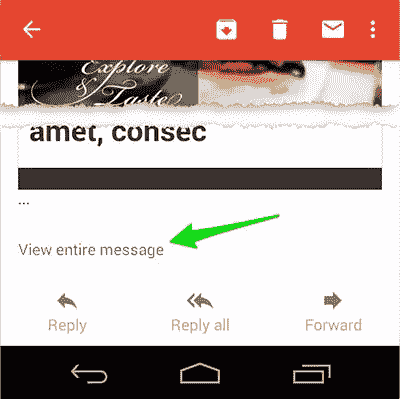
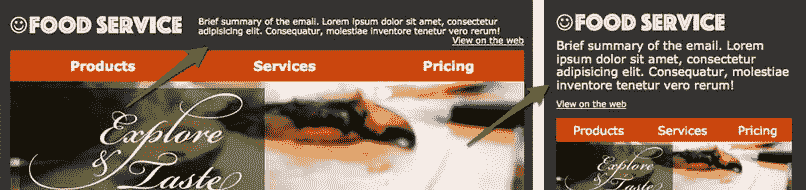
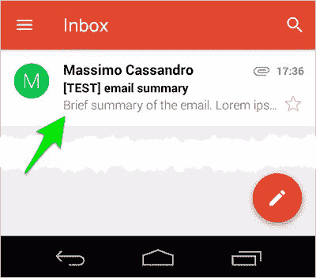
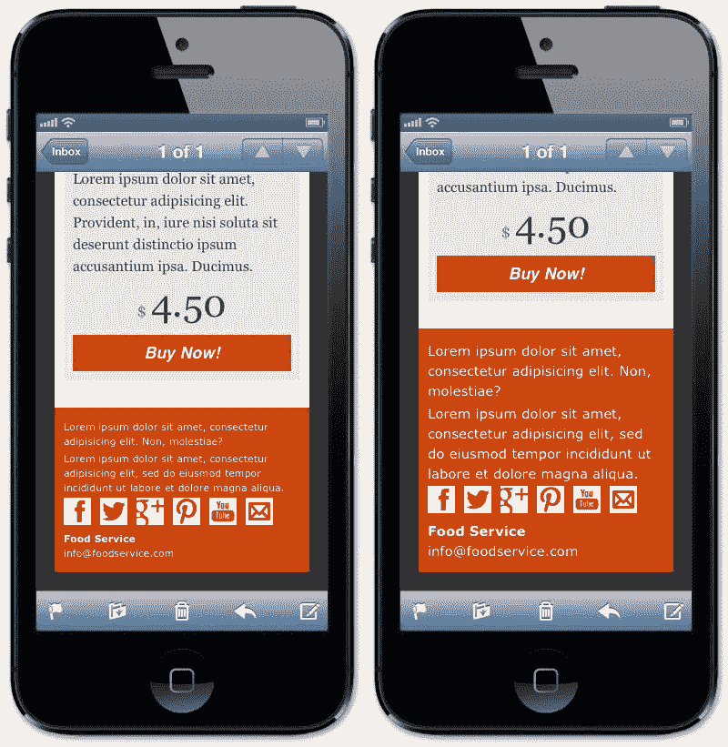
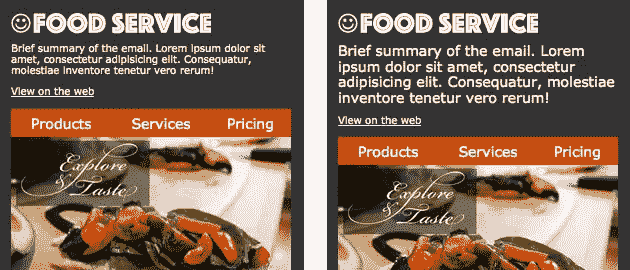
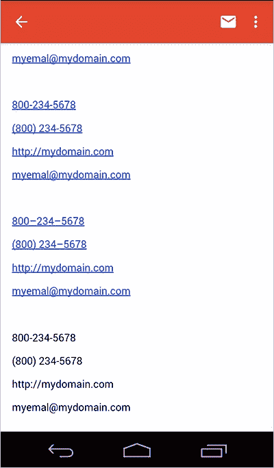

# 手机邮件设计的 5 条黄金法则

> 原文：<https://www.sitepoint.com/golden-rules-mobile-email-design/>

正如我在[上一篇文章](https://www.sitepoint.com/tricks-building-responsive-email/)中提到的，**手机邮件设计**不仅仅是一个*内容编排*的问题，而是涉及到很多设计元素。

我们永远不应该把移动设备的设计看作是迎合“屏幕尺寸”的简单问题。相反，我们需要一个全面的方法，考虑到人们在小型设备上使用网络(尤其是电子邮件)的不同方式。

我们将确定移动电子邮件撰写中的一些关键考虑因素。这些规则并不意味着一定要回答移动设备电子邮件设计的所有要求，但它们肯定是一个非常好的起点。

## 1.保持邮件简单

复杂性是致命的——尤其是在电子邮件中。总是避免在小屏幕上呈现时不可避免会失败的复杂结构。请记住，许多设备根本不支持媒体查询(例如 Gmail 应用程序)，所以你不能指望复杂的内容重排技术。

线性和简单的布局在大多数情况下会提供最好的结果。

电子邮件的整体大小也很重要:如果超过预设的大小(大约 100Kb)，你的电子邮件可能无法完全加载。我没有在所有客户端测试过这个问题，但是 Gmail 应用程序和 IOS 设备都表现出这种行为(Gmail web 应用程序也是)。

在下面的截图中，你可以看到用户如何点击一个链接来查看整个邮件:这可能会阻止人们阅读你的电子邮件全文。



## 2.专注于邮件目标，注意折叠

尽管我并不喜欢“折叠之上”这个问题(看看[这篇古老而有趣的文章](http://iampaddy.com/lifebelow600/))，但在移动设备上阅读电子邮件的方式意味着我们应该始终将邮件的上半部分视为至关重要。

在许多情况下，快速浏览这些内容是吸引读者阅读更多内容的最佳机会，所以给他们一个易于消化的摘要会有所不同。

电子邮件顶部的一小段通常可以达到这个目的。



对于一些在其收件箱列表视图中显示这些行的重要客户端(如 Gmail 应用程序，或 IOS 和 OSX 上的 Apple Mail)，这也非常方便。



## 3.调整字体和图像的大小

本主题仅适用于支持媒体查询的设备。不幸的是，我们不能为其他人做任何事情:有时他们自己调整文本和图像的大小，但我们无法真正控制这种行为。

目前，所有 IOS 设备、Android 原生电子邮件应用程序(有一些问题并且记住 Lollipop 为了支持 Gmail 应用程序而放弃了它)、最新的黑莓手机和少数其他设备都支持媒体查询(要获得更完整的列表，请查看[竞选监督指南 CSS](https://www.campaignmonitor.com/css/) 或 [FreshInbox 电子邮件客户端媒体查询和嵌入式风格支持 2014](http://freshinbox.com/blog/email-client-media-query-and-embedded-styles-support-2014/) )。

它们共同对应着一个显著且持续增长的电子邮件客户端的百分比，所以照顾它们确实是强制性的。

IOS 设备在字体和图像大小方面有两个主要问题:

*   默认情况下，小字体会被放大
*   电子邮件宽度基于最大的元素

字体大小放大通常不是一个严重的问题，但在某些情况下，它可能会导致一些文本行被拼接，可能会破坏您的布局。

将这一行添加到您的 CSS 中可以很容易地解决这个问题:

```
* { -webkit-text-size-adjust: none; }
```

在下面的截图中，你可以看到红色区域的文本大小是如何改变的，添加`-webkit-text-size-adjust`规则(左边)或删除它(右边)。



字体大小管理也会影响用户在手机上的体验。在桌面设备上容易阅读的小文本在小屏幕上可能会有不同的效果。

在下面的示例中，右侧版本的摘要文本已被放大，以便于阅读并吸引用户的注意力:



一般来说，在移动设备上增加字体大小是一个很好的做法，尤其是对于电子邮件，阅读时间非常紧张，你需要迅速抓住用户的注意力。

### 关于图像

我刚刚在我的[上一篇文章](https://www.sitepoint.com/tricks-building-responsive-email/)中写了关于图像的内容:基于经典的`max-width`响应图像技术，为移动设备优化图像是一项简单的任务。

你还可以为支持媒体查询的设备加载有针对性的图像(看看 Acid blog 上用于回复邮件的[一种巧妙的新图像交换技术](http://www.emailonacid.com/blog/details/C13/a_slick_new_image_swapping_technique_for_responsive_emails)，或者 Campaign Monitor 上用于移动设备的[优化图像](https://www.campaignmonitor.com/guides/mobile/optimizing-images/))。

## 4.自定义链接和按钮

电子邮件移动设计需要一些链接技巧。

首先，考虑到链接将使用…手指点击，因此保持它们的间距并严格限制它们的数量([移动设备人体工程学和电子邮件简讯中的链接](https://www.campaignmonitor.com/blog/post/3917/mobile-touch-ergonomics-links-in-email-newsletters)Campaign Monitor 博客上的文章解决了关于这一论点的一些有趣的话题)。

按钮的大小和间距是强制性的(通常是对动作的调用链接):确保它们易于点击和可见。此外，请始终记住在内联的 CSS: Gmail 应用程序样式链接中添加锚定规则，默认情况下，链接为蓝色并带有下划线。

一个潜在的小问题是 Gmail 和 IOS 默认添加的电话号码链接(两者都有)，以及 URL 和电子邮件字符串链接(仅在 Gmail 应用程序中)。

为了避免在 IOS 上自动生成电话链接，您只需在代码中添加这个 meta 标记:

```
<meta name="format-detection" content="telephone=no">
```

Gmail 的修复有点棘手(也更黑客):它包括添加一些不可见的字符，以确保字符串不会被识别为潜在的链接(同时显然保留了它的显示)。

我已经使用 HTML 实体和“neutral”`span`标签进行了一系列测试。只有通过用一个`span`标签(样本代码的最新部分)断开链接的每一部分，我才能获得预期的行为。

这是结果:

```
<p>800-234-5678</p>
<p>(800) 234-5678</p>
<p>http://mydomain.com</p>
<p>myemal@mydomain.com</p>

<p><span>800-234-5678</span></p>
<p><span>(800) 234-5678</span></p>
<p><span>http://mydomain.com</span></p>
<p><span>myemal@mydomain.com</span></p>

<p>800&ndash;234&ndash;5678</p>
<p>(800) 234&ndash;5678</p>
<p>http:&#47;&#47;mydomain.com</p>
<p>myemal&#64;mydomain.com</p>

<p><span>800</span>-<span>234-5678</span></p>
<p><span>(800)</span> <span>234-5678</span></p>
<p>http<span>://</span>mydomain<span>.</span>com</p>
<p>myemal<span>@</span>mydomain<span>.</span>com</p>
```



## 5.添加间距

我最新的关于移动电子邮件设计的小建议是考虑在主要文本内容周围增加填充:这将显著增加你的电子邮件的可读性。

## 资源

*   [活动监控指南:响应性电子邮件设计](https://www.campaignmonitor.com/guides/mobile/)
*   [关于 Acid 的电子邮件:为 iPhone 设计和开发电子邮件的 7 个技巧](https://www.emailonacid.com/blog/details/C13/7_tips_on_designing_and_developing_emails_for_the_iphone)
*   [试金石:扔掉你的电子邮件的“手机版”](https://litmus.com/blog/ditch-the-mobile-version-of-your-email)
*   [石蕊:响应性电子邮件设计指南](https://litmus.com/blog/the-how-to-guide-to-responsive-email-design-infographic)
*   [石蕊:](https://litmus.com/blog/anatomy-mobile-email)【https://litmus.com/blog/anatomy-mobile-email】T2
*   [Acid 上的电子邮件:
    为 Gmail 和 Gmail 移动应用开发电子邮件时你必须知道的 12 件事](https://www.emailonacid.com/blog/details/C13/12_things_you_must_know_when_developing_for_gmail_and_gmail_mobile_apps)
*   [Acid 上的电子邮件:视口元标签呈现不可用](https://www.emailonacid.com/blog/details/C13/emailology_viewport_metatag_rendered_unusable)
*   [关于 Acid 的电子邮件:Android 如何扼杀响应式设计](https://www.emailonacid.com/blog/details/C13/how_android_is_strangling_responsive_design)
*   [关于 Acid 的邮件:
    5 种改进手机设计的简单方法](https://www.emailonacid.com/blog/details/C13/5_easy_ways_to_improve_your_mobile_design)
*   试金石:移动电子邮件将会继续存在。接下来是什么？
*   [石蕊:三步媒体查询模仿 Expedia 邮件的流体大小调整](https://litmus.com/blog/three-step-media-queries-imitate-fluid-resizing-expedia)

## 分享这篇文章