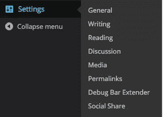
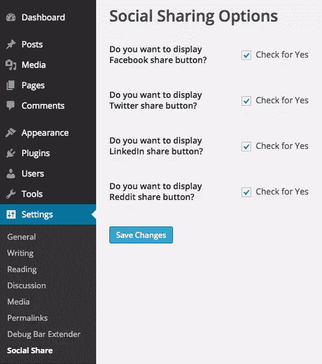
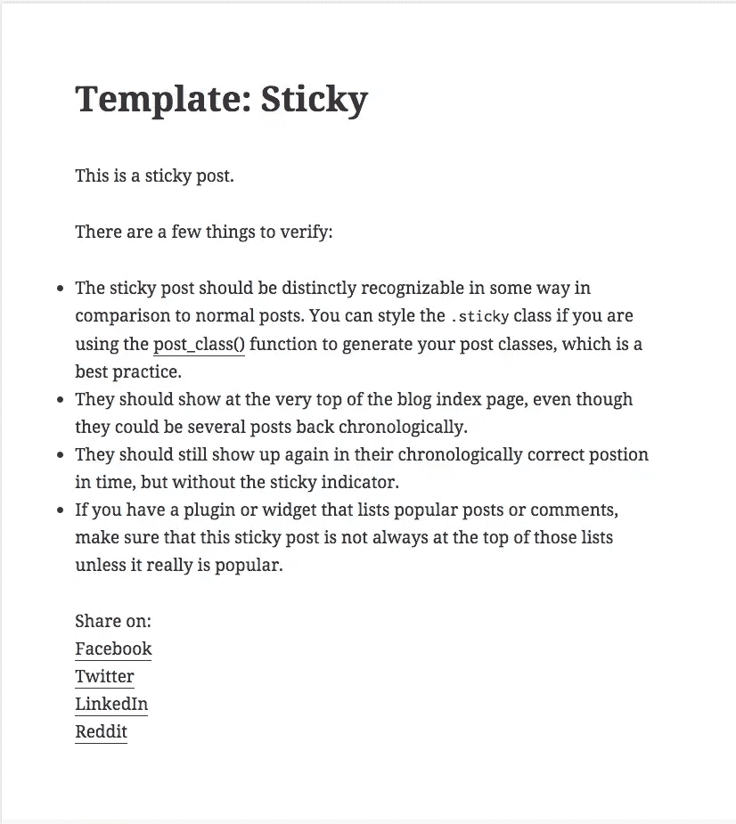
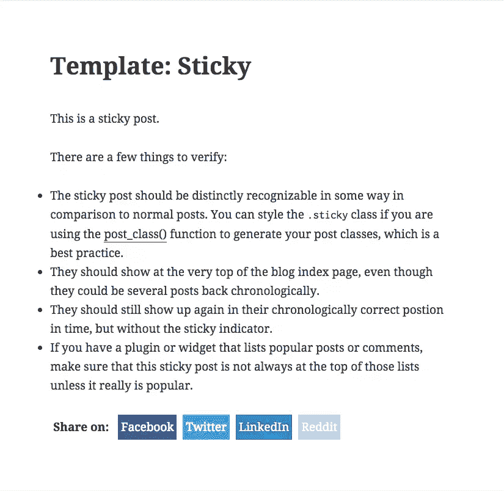

# 为 WordPress 构建你自己的社交分享插件

> 原文：<https://www.sitepoint.com/building-your-own-social-sharing-plugin-for-wordpress/>

社交共享插件允许您的网站访问者在社交媒体网站上轻松共享您的网站内容。这有助于提高网站的整体知名度。

已经有几十个现有的社交分享插件，你可以安装并使用它们，但这有什么意思呢？

在本教程中，我将向你展示如何为 WordPress 从头开始构建你自己的社交分享插件，它可以在每篇文章下面添加社交分享按钮。用户只需点击想要的社交媒体网站按钮，就可以分享帖子。

## 为什么需要社交媒体分享按钮？

经常有报道称，超过 80%的用户会根据朋友的推荐阅读内容。有了社交分享，你让用户能够与他们自己的朋友网络分享你的内容。

网络上每天有超过 400 亿的分享被点击，因此在你的 WordPress 网站上添加社交分享按钮是帮助推广你的网站的第一步。

## 插件目录和文件

首先，创建一个名为 **social-share** 的目录，并在其中创建以下文件:

```
--social-share
	-social-share.php
	-style.css
```

在**social-share.php**文件中添加以下文本使插件可安装。

```
<?php

/*
Plugin Name: Social Share
Plugin URI: https://www.sitepoint.com
Description: Displays Social Share icons below every post
Version: 1.0
Author: Narayan Prusty
*/
```

## 创建管理菜单项

我们需要为我们的插件创建一个选项页面，用户可以选择社交媒体网站应该显示的按钮。为了创建一个选项页面，我们首先需要创建一个菜单项，选项页面将被附加到该菜单项。

下面是在**设置**顶级菜单项下创建管理菜单项的代码。

```
function social_share_menu_item()
{
  add_submenu_page("options-general.php", "Social Share", "Social Share", "manage_options", "social-share", "social_share_page"); 
}

add_action("admin_menu", "social_share_menu_item");
```

这里我们使用`add_submenu_page`添加了一个菜单项，它实际上是在`admin_menu`动作中被调用的。`social_share_page`是需要显示选项页内容的回调函数。

下面是我们的菜单项的样子:



## 创建选项页面

让我们编写`social_share_page`函数来显示选项页面内容。

```
function social_share_page()
{
   ?>
      <div class="wrap">
         <h1>Social Sharing Options</h1>

         <form method="post" action="options.php">
            <?php
               settings_fields("social_share_config_section");

               do_settings_sections("social-share");

               submit_button(); 
            ?>
         </form>
      </div>
   <?php
}
```

这里我们添加了一个名为`social_share_config_section`的部分，并将设置注册为`social-share`。

现在让我们显示该部分及其选项字段。

```
function social_share_settings()
{
    add_settings_section("social_share_config_section", "", null, "social-share");

    add_settings_field("social-share-facebook", "Do you want to display Facebook share button?", "social_share_facebook_checkbox", "social-share", "social_share_config_section");
    add_settings_field("social-share-twitter", "Do you want to display Twitter share button?", "social_share_twitter_checkbox", "social-share", "social_share_config_section");
    add_settings_field("social-share-linkedin", "Do you want to display LinkedIn share button?", "social_share_linkedin_checkbox", "social-share", "social_share_config_section");
    add_settings_field("social-share-reddit", "Do you want to display Reddit share button?", "social_share_reddit_checkbox", "social-share", "social_share_config_section");

    register_setting("social_share_config_section", "social-share-facebook");
    register_setting("social_share_config_section", "social-share-twitter");
    register_setting("social_share_config_section", "social-share-linkedin");
    register_setting("social_share_config_section", "social-share-reddit");
}

function social_share_facebook_checkbox()
{  
   ?>
        <input type="checkbox" name="social-share-facebook" value="1" <?php checked(1, get_option('social-share-facebook'), true); ?> /> Check for Yes
   <?php
}

function social_share_twitter_checkbox()
{  
   ?>
        <input type="checkbox" name="social-share-twitter" value="1" <?php checked(1, get_option('social-share-twitter'), true); ?> /> Check for Yes
   <?php
}

function social_share_linkedin_checkbox()
{  
   ?>
        <input type="checkbox" name="social-share-linkedin" value="1" <?php checked(1, get_option('social-share-linkedin'), true); ?> /> Check for Yes
   <?php
}

function social_share_reddit_checkbox()
{  
   ?>
        <input type="checkbox" name="social-share-reddit" value="1" <?php checked(1, get_option('social-share-reddit'), true); ?> /> Check for Yes
   <?php
}

add_action("admin_init", "social_share_settings");
```

在这里，我们让用户从脸书、Twitter、LinkedIn 和 Reddit 分享按钮中进行选择。我们提供了一个复选框界面，允许管理员选择显示哪些按钮。您可以根据需要扩展列表以支持更多的社交媒体网站。

这是我们最终选项页面的外观:



## 显示社交分享按钮

为了在每篇文章下面显示社交分享按钮，我们需要在每篇文章发出之前对其内容进行过滤。我们需要使用`the_content`过滤器将社交分享按钮添加到帖子的末尾。

下面是关于如何过滤帖子内容和显示社交媒体按钮的代码。

```
function add_social_share_icons($content)
{
    $html = "<div class='social-share-wrapper'><div class='share-on'>Share on: </div>";

    global $post;

    $url = get_permalink($post->ID);
    $url = esc_url($url);

    if(get_option("social-share-facebook") == 1)
    {
        $html = $html . "<div class='facebook'><a target='_blank' href='http://www.facebook.com/sharer.php?u=" . $url . "'>Facebook</a></div>";
    }

    if(get_option("social-share-twitter") == 1)
    {
        $html = $html . "<div class='twitter'><a target='_blank' href='https://twitter.com/share?url=" . $url . "'>Twitter</a></div>";
    }

    if(get_option("social-share-linkedin") == 1)
    {
        $html = $html . "<div class='linkedin'><a target='_blank' href='http://www.linkedin.com/shareArticle?url=" . $url . "'>LinkedIn</a></div>";
    }

    if(get_option("social-share-reddit") == 1)
    {
        $html = $html . "<div class='reddit'><a target='_blank' href='http://reddit.com/submit?url=" . $url . "'>Reddit</a></div>";
    }

    $html = $html . "<div class='clear'></div></div>";

    return $content = $content . $html;
}

add_filter("the_content", "add_social_share_icons");
```

下面是这段代码的工作原理:

*   首先，我们为我们的社交媒体共享链接添加一个包装器。
*   然后，我们检索当前帖子的完整 URL，该帖子将在社交媒体网站上共享。我们也使用 WordPress 提供的`esc_url`函数来转义 URL。
*   然后，我们检查用户想要显示哪些按钮，并将相应的按钮标记添加到帖子内容中。
*   最后，我们将当前帖子的 URL 添加到各个社交媒体网站的社交分享链接的末尾。

以下是我们的社交媒体按钮在每个帖子下方的前端外观:



## 设计社交媒体按钮

让我们将`style.css`附加到前端，我们将在其中放置按钮样式的代码。下面是将`style.css`文件入队的代码。

```
function social_share_style() 
{
    wp_register_style("social-share-style-file", plugin_dir_url(__FILE__) . "style.css");
    wp_enqueue_style("social-share-style-file");
}

add_action("wp_enqueue_scripts", "social_share_style");
```

下面是设置按钮样式的 CSS 代码:

```
.social-share-wrapper div
{
	float: left;
	margin-right: 10px;
}

.social-share-wrapper div.share-on
{
	padding: 5px;
	font-weight: bold;
}

.social-share-wrapper div.facebook
{
	background-color: #3a5795;
	padding: 5px;
}

.social-share-wrapper div.facebook a
{
	color: white;
}

.social-share-wrapper div.twitter
{
	background-color: #55acee;
	padding: 5px;
}

.social-share-wrapper div.twitter a
{
	color: white;
}

.social-share-wrapper div.linkedin
{
	background-color: #007bb6;
	padding: 5px;
}

.social-share-wrapper div.linkedin a
{
	color: white;
}

.social-share-wrapper div.reddit
{
	background-color: #ACD4FC;
	padding: 5px;
}

.social-share-wrapper div.reddit a
{
	color: white;
}

.social-share-wrapper div a
{
	text-decoration: none;
	border: none;
}

.clear
{
	clear: left;
}
```



### 结论

在这篇文章中，我向你展示了如何轻松构建自己的社交媒体共享插件。现在，您可以继续进行扩展，为更多的社交媒体网站添加按钮，并在显示按钮的同时显示分享数量。请在下面分享你自己插件的经验。

## 分享这篇文章