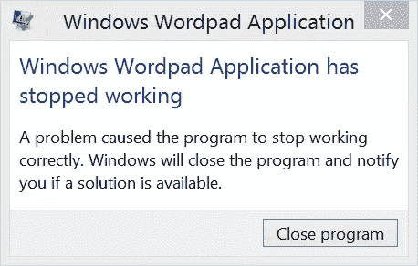
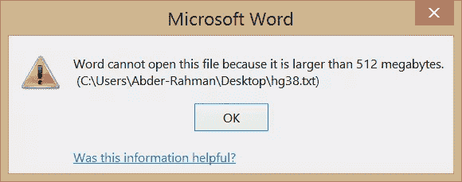
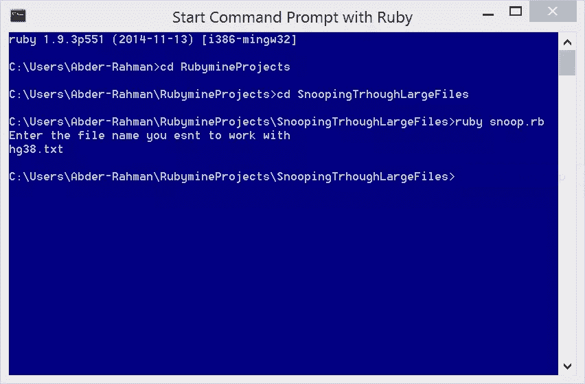

# Ruby on Medicine:处理大文件

> 原文：<https://www.sitepoint.com/ruby-medicine-handling-large-files/>


我在那里，访问 UCSC 基因组生物信息学网站上的[序列和注释下载](http://hgdownload.cse.ucsc.edu/downloads.html)页面。该页面包含 UCSC 基因组浏览器中基因组装配的序列和注释数据下载的链接。有这么多文件可供选择，但我对下载人类基因组数据集中的以下文件感兴趣:

> hg38.fa.gz——一个文件中的“软屏蔽”装配序列。来自 RepeatMasker 和 Tandem Repeats Finder 的重复序列(周期为 12 或更短)以小写显示；不重复的序列以大写形式显示。

你猜怎么着？该文件大于 3GB！你可能会说，不用担心。今天的文本编辑器可以处理大量的文件，对吗？？我用的是 Windows，所以我们说的是*记事本*、*写字板*和*微软 Office Word* 等等。

看来我们高估了这些编辑的能力。当我尝试上面提到的文本编辑器时，它们痛苦地尖叫着。看看这个:

*记事本*


*写字板*



*微软 Office Word*



呀。

我们的目标是快速浏览一下这个大文件的各个部分。在本系列未来的教程中，我们将会看到如何使用 Ruby 在如此大的文件中导航。

在继续学习本教程之前，让我们先来看一些术语，它们会让我们的生活更轻松。

## 术语

*基因组*(摘自[遗传学之家参考文献](http://ghr.nlm.nih.gov/handbook/hgp/genome/))

基于遗传学家的参考，一个[基因组](http://ghr.nlm.nih.gov/handbook/hgp/genome)是一个生物体的一整套 [DNA](http://ghr.nlm.nih.gov/handbook/basics/dna) ，包括其所有的[基因](http://ghr.nlm.nih.gov/handbook/basics/gene)。每个基因组又包含了构建和维持生物体所需的所有信息。在人类中，所有具有细胞核的细胞中都有一份完整基因组的拷贝，即超过 30 亿个 DNA 碱基对。

*基因组测序*

正如基因组新闻网所说，[基因组测序](http://www.genomenewsnetwork.org/resources/whats_a_genome/Chp2_1.shtml)是计算出基因组中 DNA [核苷酸](http://en.wikipedia.org/wiki/Nucleotide)或碱基顺序的过程。即组成生物体 DNA 的 As、Cs、Gs、Ts 的顺序。如上所述，人类基因组由超过 30 亿个这些遗传字母组成。

*基因组组装*

Ensembl 所说的[基因组组装](http://www.ensembl.org/Help/Faq?id=216)是在[染色体](http://ghr.nlm.nih.gov/handbook/basics/chromosome)被分割后产生的基因组序列，这些片段被测序，产生的序列被放回一起。

但这些你都已经知道了，对吧？；)

## 获取文件

在这一节中，我们来看看本教程开头提到的那个大文件。

UCSC 基因组生物信息学公司的好心人慷慨地提供了一种自述文件，描述了这些巨大的文件和它们的内容。我们要下载的文件是 hg38.fa.gz(注意，文件大小是 938 MB)。

下载完文件后，继续解压缩。你可以使用 [WinRAR](http://www.rarlab.com/download.htm) 或者 [7-Zip](http://www.7-zip.org/) 或者 tar。解压文件后，您将得到一个名为`hg38.fa`的文件。继续将其重命名为`hg38.txt`，这样我们就有了一个`txt`文件，而不是一个`fa`文件。如本教程开头所述，使用记事本、写字板和 Microsoft Office Word，由于文件太大而无法打开。

## 千行之旅

让我们看看使用 Ruby 一次提取 1000 行大文件需要什么。当然，您可以随意提取任意多行。这里我们要做的第一件事是要求用户提供要窥探的文件的名称。为此，请执行以下操作:

```
puts 'Enter the name of the file'
```

在向用户询问文件名后，我们需要读取该文件名并将其存储在一个变量中。这可以在 Ruby 中实现，如下所示:

```
file_name = gets.chomp
```

让我们分析一下这里发生了什么。`gets`是一种方法，用于从标准输入中获取下一行作为字符串，直到返回。`chomp`用于返回没有终止行返回的字符串`\n`。如果我们不`chomp`这个字符串，程序返回如下错误:

```
snoop.rb:4:in `initialize': Invalid argument - hg38.txt (Errno::EINVAL)
       from snoop.rb:4:in `open'
       from snoop.rb:4:in `<class:XYZ>' 
       from snoop.rb:1:in `<main>'
```

从这个错误来看，Ruby 似乎是在读取下面的文件名`hg38.txt\n`而不是`hg38.txt`。

读完文件名后，我们现在要将 [`open()`](http://www.ruby-doc.org/core-2.2.0/File.html#method-c-open) 文件:

```
input_file = File.open(file_name,'r')
```

这里的`r`表示我们正在以*读取*模式打开文件。

我们的脚本将把提取的行写到另一个文件中，这些笨拙的文本编辑器可以处理。在这种情况下，`File.open()`，使用`w`(写)模式:

```
output_file = File.open('output.txt','w')
```

我们将从输入文件中逐行读取。在这个过程中帮助我们的 Ruby 方法是 [`readline()`](http://www.ruby-doc.org/core-2.2.0/IO.html#method-i-readline) :

```
read_line = input_file.readline
```

[`write()`](http://ruby-doc.org/core-2.0.0/IO.html#method-c-write) 是将读取的行写入输出文件所必需的。是的，我在这里提到了线条(*即带“s”的*)。但是，我们使用的是一次只能读取一行的`readline()`。首先，`for`会把我们的阅读限制在 1000 行。

现在，让我们看看执行上一节讨论的操作的 Ruby 脚本是什么样子的。

```
class Snoop
  puts 'Enter the file name you want to work with'
  file_name = gets.chomp
  input_file = File.open(file_name,'r')
  output_file = File.open('output.txt','w')
  for i in 1..1000
  read_line = input_file.readline
  output_file.write(read_line)
  end
end
```

## 运行程序

为了运行这个程序，我在 Windows 8.1 机器上用 Ruby 使用了*命令提示符，如下所示:*



程序的结果(*即* output.txt)，可以从[这里](https://www.dropbox.com/s/iq89giuuxghwfla/output.txt?dl=0)下载。

## 我们为什么需要这个？

作为一名 Ruby 程序员，你可能会注意到这个程序很简单。我们不要忘记，因为这个系列是面向将 Ruby 应用于医学相关主题的，所以我们可以期待非程序员蜂拥而至(*即*科学家、生物学家、研究人员)寻找他们问题的解决方案。

对于一个程序员来说，也许我们一直在处理的大文件中的内容没有太大意义。然而，这对处理文件的专家来说很重要。

专家经常面对如此大的文件，正如我们所看到的，我们使用的文本编辑器经常不能处理这样的文件。本教程中介绍的程序的要点是对科学家、研究人员等来说是简单的(Ruby 开始发挥作用)。去理解和利用。本文中使用的技术正好满足了专家的需求:一个带有相关输出的较小文件，可以在标准文本编辑器中打开。随着技术障碍的消除，专家现在可以专注于改善生活，进而改善世界。

好吧，也许这有点夸张，但它的核心是真实的。这个系列不仅给 Ruby 带来了医学上的关注，而且(也许，更重要的是)把 Ruby 带到了医学领域。

## 分享这篇文章