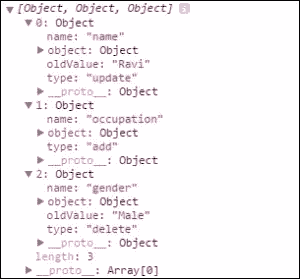
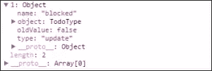
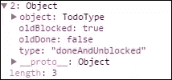

# Object.observe 简介

> 原文：<https://www.sitepoint.com/introduction-object-observe/>

双向数据绑定现在是客户端应用程序的重要特性之一。如果没有数据绑定，每当模型发生变化时，开发人员就必须处理大量的逻辑来手动将数据绑定到视图。像 [Knockout](http://knockoutjs.com/) 、 [AngularJS](https://angularjs.org) 和 [Ember](http://emberjs.com/) 这样的 JavaScript 库支持双向绑定，但是这些库使用不同的技术来检测变化。

击倒和灰烬使用可观测量。可观测量是围绕模型对象的属性包装的函数。每当相应对象或属性的值发生变化时，就会调用这些函数。尽管这种方法工作得很好，并检测和通知所有的变化，但它剥夺了使用普通 JavaScript 对象的自由，因为现在我们必须处理函数。

Angular 使用脏检查来检测更改。这种方法不会污染模型对象。它为添加到模型中的每个对象注册观察器。每当 Angular 的摘要周期开始时，如果数据有任何变化，所有这些观察器都会被执行。这些更改由相应的观察器处理。该模型仍然是一个普通的对象，因为没有围绕它创建包装器。但是，随着观察器数量的增加，这种技术会导致性能下降。

## 什么是`Object.observe`？

`Object.observe`，又名`O.o`，是作为 ECMAScript 7 的一部分添加到 JavaScript 中的一个特性，用于支持浏览器中的原生对象变化检测。虽然 ES7 还没有完成，但是基于 [Blink](http://en.wikipedia.org/wiki/Blink_%28layout_engine%29) 的浏览器(Chrome 和 Opera)已经支持这个特性了。

因为浏览器本身就支持`Object.observe`,而且它直接作用于对象，不需要在它周围创建任何包装器，所以这个 API 既易于使用，又在性能上有所提高。如果有浏览器支持`Object.observe`，就可以实现双向绑定，不需要外部库。这并不意味着一旦`O.o`实现，所有现有的双向绑定库都将无用。我们仍然需要他们在使用`O.o`检测到变化后有效地更新 ui。此外，如果不是所有目标浏览器都支持`O.o`，库将在内部填充变更检测的逻辑。

## 观察物体的属性

既然你已经知道了`O.o`的好处，让我们来看看它的实际应用。

`observe()`方法是在`Object`上定义的异步静态方法。它可用于查找对象的变化，并接受三个参数:

*   被观察的物体
*   检测到更改时要调用的回调函数
*   包含要监视的更改类型的可选数组

让我们看一个使用方法的例子。考虑下面的片段:

```
var person = {
  name: 'Ravi',
  country: 'India',
  gender: 'Male'
};

function observeCallback(changes){
  console.log(changes);
};

Object.observe(person, observeCallback);

person.name = 'Rama';  // Updating value
person.occupation = 'writer';  // Adding a new property
delete person.gender;  // Deleting a property
```

在这段代码中，我们用一些数据创建了一个对象文字。我们还定义了一个名为`observeCallback()`的函数，用于记录对象的变化。然后，我们通过使用`O.o`开始观察变化。最后，我们对对象进行了一些修改。

如果您看到控制台上的输出，您将看到所有三个更改都被检测到并记录下来。下面的屏幕截图显示了代码片段产生的结果:



`O.o`异步运行，当回调被调用时，它将所有发生的变化分组并传递给回调。因此，这里我们收到了应用于对象的三个更改的三个条目。正如您所看到的，每个条目都由更改的属性名称、旧值、更改的类型以及具有新值的对象本身组成。

下面是前面代码的现场演示(记得打开控制台查看结果):

在 [CodePen](http://codepen.io) 上通过 SitePoint ( [@SitePoint](http://codepen.io/SitePoint) )看到笔[emk web](http://codepen.io/SitePoint/pen/emKveB/)。

在我们的代码中，我们没有指定要查找的更改类型，所以它观察添加、更新和删除。这可以使用`observe`方法的第三个参数进行控制，如下所示:

```
Object.observe(person, observeCallback, ['add', 'update']);
```

## 注册通知

`observe()`方法能够检测添加到对象的直接属性的变化。它不能检测使用 getters 和 setters 创建的属性的变化。因为这些属性的行为是由作者控制的，所以更改检测也必须由作者拥有。为了解决这个问题，我们需要使用一个通知程序(通过`Object.getNotifier()`可用)来通知对属性所做的更改。

考虑下面的片段:

```
function TodoType() {
  this.item = '';
  this.maxTime = '';

  var blocked = false;

  Object.defineProperty(this, 'blocked', {
    get:function(){
      return blocked;
    },
    set: function(value){
      Object.getNotifier(this).notify({
        type: 'update',
        name: 'blocked',
        oldValue: blocked
      });
      blocked = value;
    }
  });
}

var todo = new TodoType();

todo.item = 'Get milk';
todo.maxTime = '1PM';

console.log(todo.blocked);

Object.observe(todo, function(changes){
  console.log(changes);
}, ['add', 'update']);

todo.item = 'Go to office';
todo.blocked = true;
```

`TodoType`是一个具有两个属性的构造函数。除此之外，`blocked`是使用`Object.defineProperty`添加的。在我们的例子中，为这个属性定义的 setter 是一个简单的 setter。在典型的业务应用程序中，它可能会执行一些验证，如果验证失败，它可能不会设置值。然而，我想让事情变得简单。
最后一点，您可以看到，在我们的示例中，只有在有更新时才发送通知。

对属性`blocked`的更改在 Chrome 开发者工具中产生了以下结果:



下面是该示例的现场演示(记得打开控制台查看结果):

在 [CodePen](http://codepen.io) 上通过 SitePoint ( [@SitePoint](http://codepen.io/SitePoint) )看笔 [NPzgOO](http://codepen.io/SitePoint/pen/NPzgOO/) 。

## 观察多重变化

有时，在两个或更多的属性以某种方式被修改后，我们可能有一个计算要运行。虽然我们可以使用通知程序分别通知这两个更改，但是最好发送一个带有自定义类型名称的通知来表明这两个值都被修改了。这可以使用`notifier.performChange()`方法来完成。该方法接受三个参数:

*   自定义类型的名称
*   执行更改的回调函数。从该函数返回的值用于变更对象
*   应用更改的对象

让我们给上面定义的类`TodoType`添加一个名为`done`的新属性。此属性的值指定 todo 项是否已完成。当`done`的值被设置为`true`时，我们需要将属性`blocked`的值也设置为`true`。

以下代码片段定义了该属性:

```
var done = false;
Object.defineProperty(this, 'done', {
    get: function(){
      return done;
    },
    set: function(value){
      if(value){
        var notifier = Object.getNotifier(this);

        if(blocked && value) {
          notifier.performChange('doneAndUnblocked', function(){
            done = value;
            blocked = false;

            return { oldDone: false, oldBlocked: true };
          }, this);
        }
        else{
          notifier.notify({
            type: 'update',
            name: 'done',
            oldValue: done
          });

          done = value;
        }
      }
    }
});
```

一旦执行了`performChange`的回调中的逻辑，将会用传递给它的自定义变更类型来通知变更。默认情况下，`Object.observe`不会观察到该类型；我们需要明确地要求`O.o`观察自定义类型的变化。下面的代码片段显示了在`todo`对象上修改的`O.o`，以观察自定义类型以及添加和更新类型的变化:

```
Object.observe(todo, function(changes){
  console.log(changes);
}, ['add', 'update', 'doneAndUnblocked']);

todo.blocked = true;
todo.done = true;
```

上面的代码片段在将`done`设置为`true`之前，将 blocked 的值设置为`true`。因此，它发送一个带有自定义更改类型的通知。以下屏幕截图显示了由自定义类型返回的变更对象的详细信息:



下面是该示例的现场演示(记得打开控制台查看结果):

通过[码笔](http://codepen.io)上的 SitePoint ( [@SitePoint](http://codepen.io/SitePoint) )看笔 [yyEXGd](http://codepen.io/SitePoint/pen/yyEXGd/) 。

## 观察阵列

观察数组类似于观察物体。唯一的区别是观察者功能必须使用`Array.observe`而不是`Object.observe`来注册。以下代码片段演示了这一点:

```
var array = ['morning', 'Afternoon', 'Evening'];

var arrayObserver = function(changes){
  console.log(changes);
};

Array.observe(array, arrayObserver);

array[0] = 'Morning';
array.push('Night');
array.splice(1, 1);
```

下面是该示例的现场演示(记得打开控制台查看结果):

在 [CodePen](http://codepen.io) 上通过 SitePoint ( [@SitePoint](http://codepen.io/SitePoint) )看笔 [GgGEzQ](http://codepen.io/SitePoint/pen/GgGEzQ/) 。