# 让用户感觉而不是思考的图像技巧

> 原文：<https://www.sitepoint.com/tricks-images-make-users-feel-think/>

一张图胜过千言万语。

我们都听过这个老掉牙的故事一千遍了，对吧？在网页设计中，图片和你的真实文本一样重要。

尽管清晰的文字可以给一个想法带来的精确性毋庸置疑，但图像有能力绕过高层次的分析大脑，在情感层面上直接与我们对话。我们还需要另一个傻瓜猫 Youtube 视频来证明图像可以把正常、聪明、有洞察力的人变成咯咯笑、转发的傻瓜吗？

你的网站会遇到三种类型的读者。你有:

*   读者:阅读每一行的人
*   扫描者:一个“扫描”或“浏览”你的内容以找到有趣部分的人
*   **:阅读前几个句子，然后切入摘要段落的人**

 **请记住，同一个用户可以扮演这些角色中的任何一个，甚至可能在同一个浏览会话中。

大多数读者属于*扫描仪*类别，这使得对你的视觉内容做出情感上有影响力的选择变得更加重要。不管你遇到什么类型的读者，有一件事你必须永远记住，你是在和人类打交道，而人类会受到情绪触发的影响。

## 电影提示

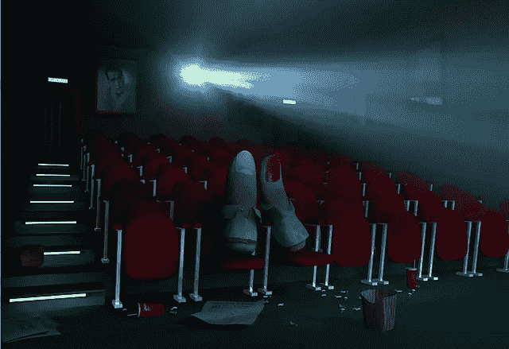

我发现解释和说明例子和技术的最简单的方法是使用公共链接。在这篇文章中，我将借用电影的世界。

我们大多数人都有自己感兴趣的电影。我们欢笑或哭泣，我们为英雄欢呼，我们为角色的安全担忧。每部电影都运用图像和声音的巧妙结合来操纵我们的感受。我们可能很喜欢它。

除了娱乐我们和创造一个有强烈故事的视觉杰作，导演们的目标是引发某种形式的情感反应——如果你有反应，哪怕只有一秒钟，那么他们就完成了他们的工作。

这应该是你选择网站图片的方式。引发情绪，抓住你的观众。

## 逻辑并不支配

让我们拍一张笑脸和生动的肢体语言的照片。你三岁的侄女很有可能会告诉你微笑的人是快乐的。

虽然我们的逻辑大脑可以证明*为什么*图像可能传达快乐，但它不是唤起观众情感的过程的一部分。通常，我们对图像的“直觉”反应是第一位的，而我们的逻辑大脑被赋予稍后解释我们推理的任务。

在下面两张图片中，左边的图片在科学上可能更有助于准确理解青蛙是什么。但这可能是我们所认同的正确形象。

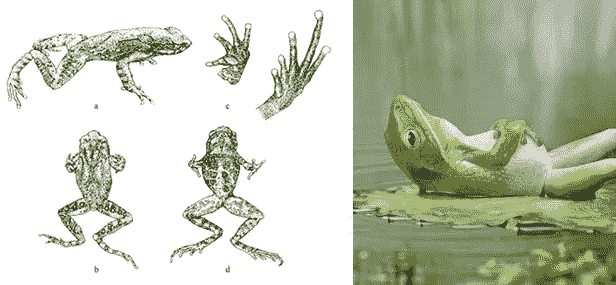

两张精确的青蛙图片——但是哪一张能吸引你呢？

这就是为什么，作为设计师，我们应该总是支持强调“感觉胜于逻辑”。它更有影响力，能更好地让你的访客“联系”起来。

为了帮助这一点，我们可以采用一些微妙的技术来调整框架，操纵颜色和焦点，我们可以精心制作情感信息，就像我们制作书面文本一样。

## 关键技术

虽然产生和唤起情感的方法有很多，但最简单快捷的方法还是来自合适的取景和照明。这两种方法有助于营造气氛。

想想电影中令人震撼的时刻。你真正感受到的部分。这些都是由于电影摄影师的工作。

下面我将向你展示框架和照明选择如何激发你的网站所需的情感。请注意，每张图片都经过了 5 分钟的快速编辑，以作为示例。

## 框架

无论是拍电影还是拍照片，取景都是一个重要的方面。适当的角度和与镜头的距离只是那些小的变化，可以为你的观众创造一个“哇”的效果。

让我们看看下面的两个例子，看看一个好的裁剪或更紧的框架是如何改变图像的整体情绪的。

**例一**

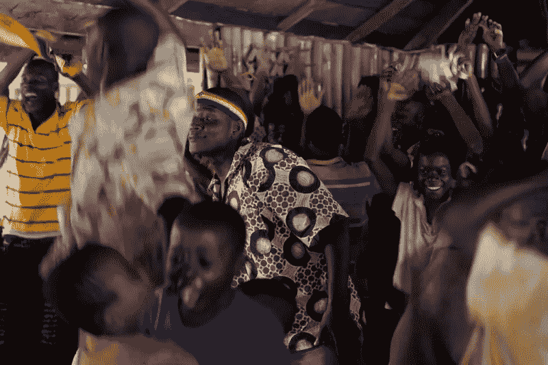

鸣谢:[https://www . Flickr . com/photos/coffeemakesitbetter/4866329711/in/photostream/](https://www.flickr.com/photos/coffeemakesitbetter/4866329711/in/photostream/)

乍一看，这个图像质量很好，并且抓住了情感。第二次看的时候，如果你想把它放在你的网站上，比如说标题/滑块的图片是相当中性的。

是的，人们看起来很开心，但那是因为逻辑告诉你“微笑意味着开心”。当引发情绪时，人群拍摄是很棘手的。

如果这个图像是一个慈善组织的网站，并附有文字“更好的生活，更好的照顾”和一个捐款按钮，你会想激励人们实际捐款，以创造一个更好的生活给受援国。

在特定人脸上创建更紧密的镜头很容易对此产生影响。

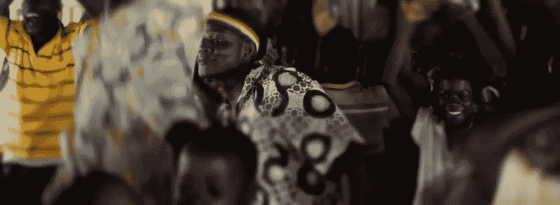

这里你可以看到我把注意力集中在人群中那些真正快乐的面孔上。通过集中注意力，我帮助隔离了那些快乐的感觉。与原始图片相比，如果用原始图片提示，你更可能微笑并考虑捐赠。

**例 2**

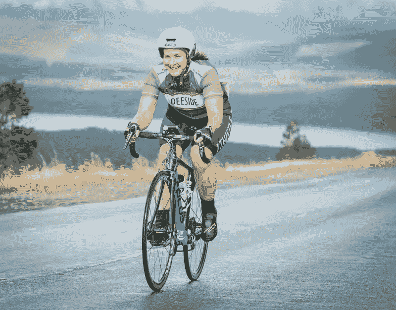

信用:[https://www.flickr.com/photos/robinmcconnell/9700775038/](https://www.flickr.com/photos/robinmcconnell/9700775038/)

甚至当你的照片中只有一个人时，也可以使用情感冲击的框架过程。记住人类喜欢看其他人。我们生来就有阅读人脸的软件，我们可以在任何事物中看到人脸，从云彩到树皮到汽车发动机罩。

就像以前一样，我们有一张笑脸，但我们真的可以让它比现在更有影响力。

考虑一下，如果这个图像是一个网站，希望促进妇女积极和健康的生活。虽然这张照片没什么问题，但我们可以通过更多地关注女性的面部来放大照片。

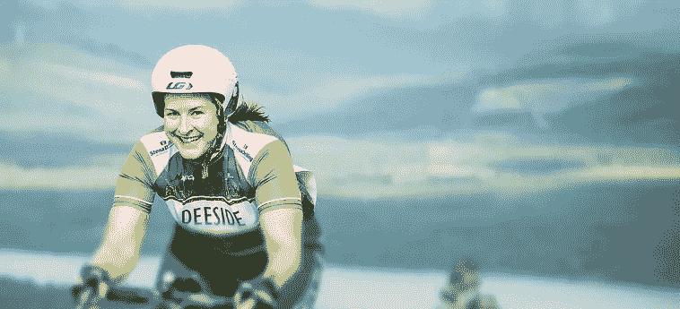

通过更严格地强调她的脸而不是她的实际活动，我们可以从“哦，她看起来很开心”到“哇，那可能是我在健康的同时享受自己”来激发思维过程。更不用说我们有直接的眼神交流，这是在你的网站图片中使用的一种有用的技术。

现在，再加上一个精心设计的行动号召(CTA ),它可能会提示你“学习更多”,这种情感暗示更有可能发生。

## 照明设备

灯光是图像内外极其重要的资产。我们人类每天使用照明不仅是为了看，也是为了刺激视觉。房地产经纪人故意打开他们展示的房子的窗户，以创造一种愉快和热情的气氛。餐馆通过控制照明的数量和类型来提升就餐体验。

电影当然也是如此。蓝色照明可以用来激发忧郁的情绪和色调，而温暖的照明可以描绘无忧无虑的气氛或高能量。

让我们来看看我们的照明例子。

**例 1**

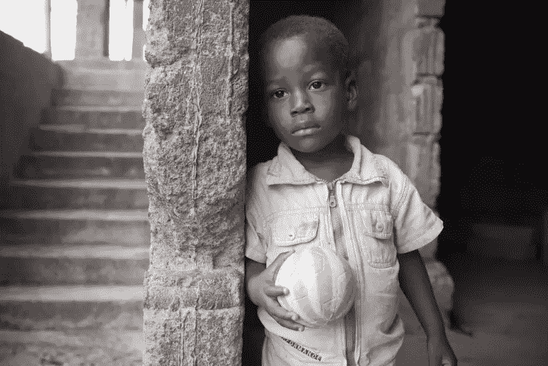

虽然我们上面的图像看起来确实是一个情绪化的镜头，但我们可以提高效果。根据周围的文本内容，这幅图像的背景很容易被看作是沉思的，甚至是中性的。

通过控制这张照片的灯光，我们可以创造出一种稍微严肃一点的感觉。这总是需要微妙的。

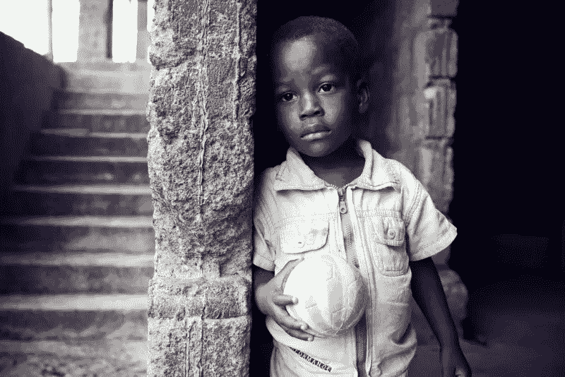

通过加深阴影和增加冷色调，我们建立了比原始图像更明确的情感。

如前所述，你可以通过改变照明来获得感觉。这意味着你可以像制造悲伤一样容易地制造爱的感觉。

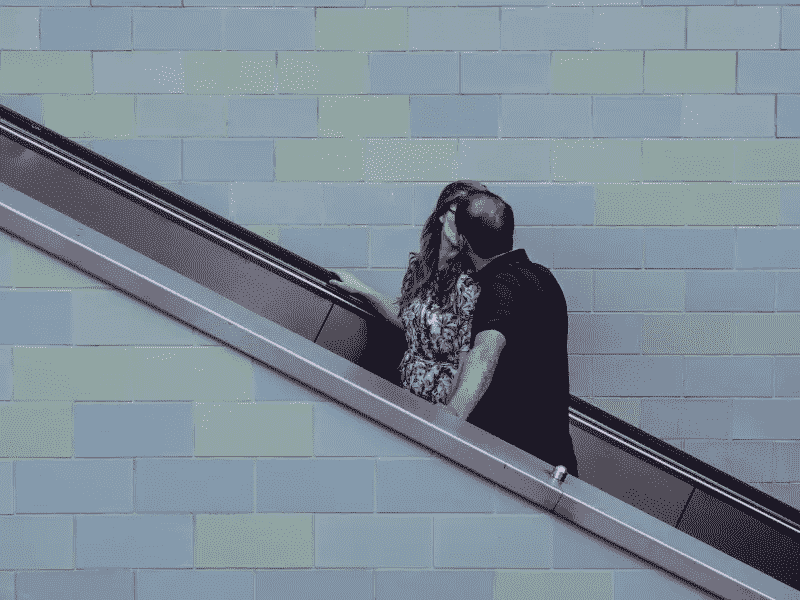

我们在这里的形象有一些方面，你会自动决定是积极的。我们有这个彩色的背景，一对情侣在最前面和中间接吻。

如果你想把这张图片用在情侣网站上，那就需要对灯光进行一些调整，给你一种更“明亮”和“可爱”的感觉。

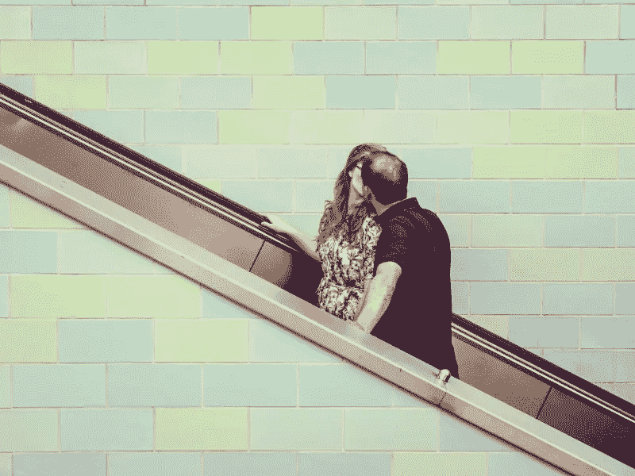

通过用光打开我们的图像，我们不仅有更明亮的东西，而且给你一种天真、无忧无虑的感觉，而不是原始照片中更粗糙的阴影和饱和的颜色。

## 框架和照明

既然你已经看到了取景和照明是如何分开工作的，那么结合使用这两种技术会给你带来怎样的不同。

**之前** 

**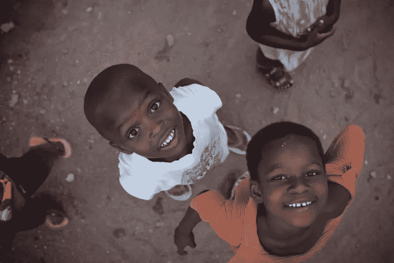

鸣谢:[https://www . Flickr . com/photos/coffeemakesitbetter/6288435873](https://www.flickr.com/photos/coffeemakesitbetter/6288435873)**  **之后

 **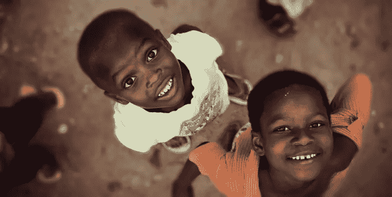

## 快速提示

*   避免拍摄人群照片。如果你必须创造一个拉或架的重点，以产生兴趣，在一个特定的领域。
*   你的图片中使用的对比度应该与网站的背景成比例，这样才不会造成脱节。
*   如果你的图像似乎落入“中立地带”,尝试调整你的裁剪。
*   尽量选择显示人类或动物的图片。这将有助于激发积极的情绪和兴趣，而不是反对对象。
*   当选择实物拍摄时，确保创造有趣的角度。
*   去找一个令人惊奇的图片，而不是五个好的图片。
*   如果你的文章中有图片，确保图片后面有文字或标题，以激励读者继续滚动。
*   当裁剪/框住图像时，您可能需要应用模糊效果来创建焦点。

## 结论

正如你所看到的，无论你使用什么类型的图片，这只是你的一个小小的调整就能真正唤起情感。只要稍微考虑一下你想让你的访问者感觉如何，你就可以很容易地通过简单的心理触发而不是逻辑刺激来引导他们。

希望这篇文章足以激励你自己测试框架和照明。

## 分享这篇文章******