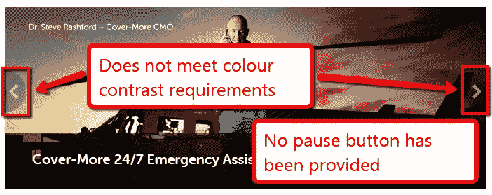
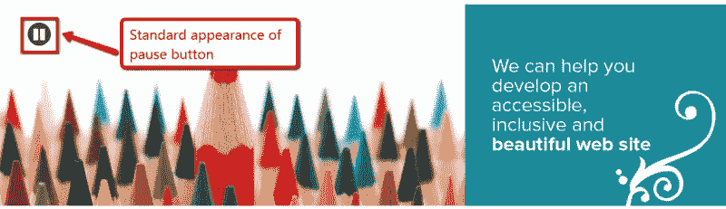
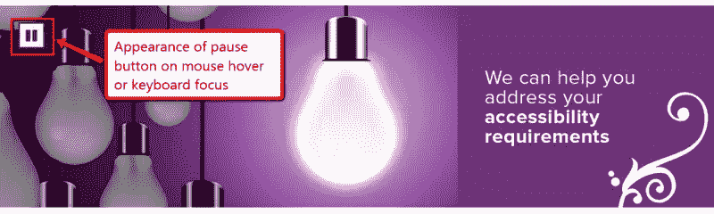
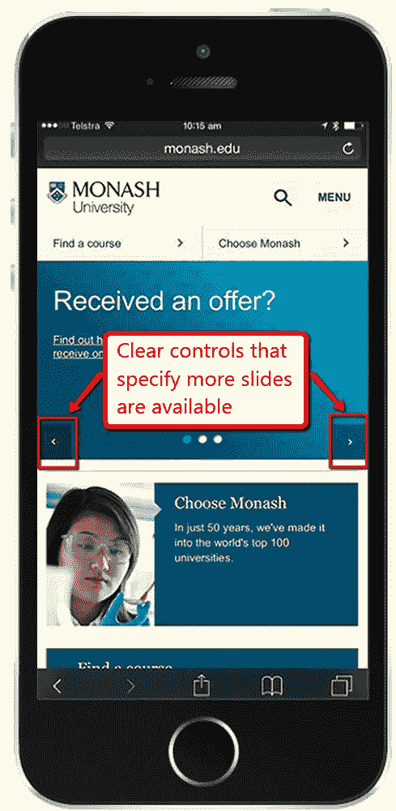

# 难以忍受的幻灯片无法使用

> 原文：<https://www.sitepoint.com/unbearable-accessible-slideshow/>

照片:[游乐场奇才](http://www.flickr.com/photos/40365132@N04/7734834938)

幻灯片。滑块。旋转木马。不管你怎么称呼它们，它们在网络上的组织主页上无处不在。而且几乎都是无法接近的。

有时它们是不可访问的，因为人们根本不关心可访问性。但是在大多数情况下，仅仅有 ***那么多*** 的可访问性需求需要被解决，以至于错过了一些。这对可访问性来说是灾难性的。

不幸的是，像 Bootstrap、Foundation 或 Slick Carousel 这样的主流工具包都没有在默认情况下获得可访问性，所以如果你想要一个可访问的幻灯片，你需要做出实质性的改变。

在这篇文章中，我们将探讨**所有**创建无障碍幻灯片需要满足的无障碍要求。在下一篇文章中，我们将提供指南和实际代码来制作一个可访问的幻灯片。

我们经常看到的幻灯片主要有两种类型。第一个(图 1)用圆圈表示幻灯片，并提供了在幻灯片之间移动的方法。第二张幻灯片(图 2)在幻灯片的左右边缘有箭头，允许用户选择下一张或上一张幻灯片。

图 1

图 2

这些幻灯片的最大问题是它们不能被用户暂停。下一个最严重的问题是两者都不能通过键盘访问。在第一个例子中，键盘完全跳过幻灯片。

在第二个示例中，箭头不是键盘可访问的，但幻灯片中两张幻灯片内的链接是键盘可访问的。这意味着当键盘焦点位于当前不可见的幻灯片上时，它会消失。

我们最近发布了两个幻灯片。能量等级([www.energyrating.gov.au](http://www.energyrating.gov.au))是用 Bootstrap 构建的(有一些重大修改)。易访问性 yoz(【www.accessibilityoz.com.au】T2)有一个易访问的幻灯片，也是基于 Bootstrap(有更大的修改)。

创建可访问的幻灯片需要满足五个原则:

1.  允许用户停止所有运动
2.  提供可通过键盘、鼠标和触摸操作的可视控件
3.  通过幻灯片演示提供有效且易于理解的焦点顺序
4.  有效的编码和样式表
5.  为幻灯片放映提供有意义的替代方案

## 原则 1:允许用户停止所有运动

营销部门喜欢幻灯片的原因之一是因为页面上有移动，这将观众的注意力吸引到那个区域。

允许用户控制幻灯片的移动是 WCAG2 的四个“不干涉”条款之一。这四个成功标准适用于页面上的所有内容，甚至是被所有者归类为不可访问的内容。

具体的成功标准是 **2.2.2:暂停、停止、隐藏**:对于任何移动、闪烁或滚动的信息，如果(1)自动开始，(2)持续时间超过 5 秒，并且(3)与其他内容同时呈现，则有一种机制可以让用户暂停、停止或隐藏它，除非移动、闪烁或滚动是活动的一部分，在这种情况下它是必不可少的。

我不认为任何人会认为幻灯片是必要的！

正如 WCAG2 所说，“*这个成功标准的目的是避免用户在与网页*交互时分心”。当它获得焦点时，仅仅暂停移动是不够的。它必须能够被用户通过键盘、鼠标或触摸(在移动设备上)完全停止。

最简单的解决方案是提供一个停止移动的链接。我们将在原则 2 下的控制部分详细讨论实现这一点的最佳方式。

关于运动还有一点:如果你可以完全避免使用动画幻灯片或淡入淡出效果，那就这样做。过渡效果是幻灯片中最大的可访问性问题之一，因为两张幻灯片必须同时存在于 DOM 中。如果你能避免过渡，那么你的幻灯片会更容易让人看得懂。

## 原则 2:为键盘、鼠标和触摸提供可见的控制

幻灯片上的控件通常很小，或者与它们覆盖的内容相比对比度很低。而焦点/悬停往往也不太明显。这里需要考虑四个要求:

*   A.有停止、开始和在幻灯片之间移动的控制吗？
*   B.控制装置是否高度可见(足够大以至于能被看见并满足颜色对比要求)？
*   C.焦点/悬停指示是否与默认状态足够不同，同时与内容有足够的对比度？
*   D.这些控件可以通过鼠标、键盘和触摸来操作吗？

### A.有停止、开始和在幻灯片之间移动的控制吗？

正如原则 1 中提到的，用户能够通过鼠标、键盘或触摸停止幻灯片中的所有移动是绝对必要的。同样必要的是，如果用户已经停止播放幻灯片，他们可以重新开始播放。用户能够在幻灯片之间移动并不是一个实际的要求，但这是一个好主意。

### B.控制装置是否高度可见(足够大以至于能被看见并满足颜色对比要求)？

我们在很多幻灯片的**上看到了这个要求的问题。要么控件非常小，要么控件覆盖在内容上，颜色对比完全取决于底层幻灯片。对此有许多解决方案，包括在提供对比的控件后面使用实心背景，以及在提供对比的控件周围使用实心边框。**

### C.焦点/悬停指示是否与默认状态足够不同，同时与内容有足够的对比度？

我们通常只在鼠标悬停时看到焦点指示器(而不是键盘焦点),它通常只包含控件的轻微颜色变化。重要的是，如果你要使用颜色变化，你需要满足颜色对比的要求。

一个更好的解决方案是改变焦点上控件的形状，就像我们在 [AccessibilityOz](http://www.accessibilityoz.com) 幻灯片上所做的那样(见图 3 和图 4)。但是记住它也需要出现在键盘焦点上！

图 3

图 4

### D.这些控件可以通过鼠标、键盘和触摸来操作吗？

键盘完全无法访问大多数幻灯片显示控制。组成幻灯片的所有控件都需要仅通过键盘来访问。如果控件是使用按钮或链接完成的，那么它们应该是隐式键盘可访问的，除非你使用 TABINDEX。

我们看到的可移动访问的幻灯片要少得多，因为在移动设备上制作可访问的幻灯片有许多附加的可访问性要求。

首先，必须有一个**明显的**方法来暂停幻灯片放映(仅通过触摸暂停幻灯片放映是不够的)。提供一个真正的暂停按钮是必要的。

但是，重要的是这个按钮足够大，以便人们可以轻松地点击(至少 7-10 毫米)。如果用户可以滑动来查看下一张幻灯片，这需要在幻灯片上直观地指示出来。以及所有的动作；滑动、滚动和触摸必须在触摸的**移除**时触发，而不是在触摸开始时触发(即。当用户将其手指从设备移开时，而不是当用户第一次触摸设备时)。

莫纳什大学提供了一个很好的例子。

在 [Monash 桌面网站](http://www.monash.edu/)上，幻灯片有一个暂停按钮，但在移动版本中，幻灯片不会自动移动，所以没有暂停按钮(见图 5)。然而，幻灯片之间有清晰的控制，这也告诉用户幻灯片中有更多的内容。

图 5

格里菲斯大学是在桌面和手机上正确控制的另一个很好的例子。桌面上有在幻灯片之间移动和播放幻灯片的选项(默认情况下幻灯片暂停播放)。

在移动网站中，默认情况下幻灯片会移动，但是有一个清晰的暂停按钮以及在幻灯片之间移动的控件(图 6)。幻灯片下面是一个很好的例子，表明添加了箭头控件后会有更多的内容。

图 6

## 原则 3:通过幻灯片演示提供一个有效的和可理解的焦点顺序

焦点顺序是一个重要的可访问性要求。最好的解释是，当在项目间切换时，项目获得焦点的顺序应该与底层 HTML(即禁用样式表的站点)相匹配，这应该与页面的视觉顺序相匹配。

然而，还有一个额外的要求，那就是当你对页面进行更改时，它只改变当前焦点之后的内容。所以右边有箭头的幻灯片不符合这个要求，因为变化发生在当前焦点的之前**。有一个例外，那就是如果用户被警告内容发生了变化；我们将在下一篇文章中讨论这个问题。**

所以这里有三个要求:你希望焦点顺序与视觉布局相匹配。你希望控件出现在内容之前，或者至少让“暂停”控件出现在其他控件之前。您需要确保激活控件不会改变当前焦点之前的内容。

这是一个妥协不可避免的地方，但一般来说，尝试将暂停/播放按钮和位置指示器放在幻灯片的顶部，并将它们放在 tab 键焦点顺序中的内容之前。

但是，如果您使用了通常不接受键盘焦点的 HTML 元素(比如 LI 元素)，您需要显式地将它们添加到键盘焦点顺序中(tabindex="0 "通常就足够了)。然后，您还需要添加一个 JavaScript 处理程序来接受击键，以及您分配给 click 事件的任何内容。

## 原则 4:有效的编码和样式表

这就给我们带来了幻灯片的正确编码和样式表使用。正如我提到的，我们将在以后的文章中讨论这个问题，但是这些是需要知道的重要事情。幻灯片不需要在样式表被禁用的情况下**运行**，但是所有的内容都需要**可用**。

我们的大多数客户只是一张接一张地展示幻灯片。它不漂亮，但很容易接近。

当样式表被禁用时，你必须非常小心地避免幻灯片移动。通常我们看到的是所有的幻灯片都显示出来，一张接一张，然后第一张幻灯片消失，所有的幻灯片上移，然后下一张幻灯片消失，其他所有的幻灯片上移，等等。

这对于屏幕阅读器用户来说是显而易见的；他们阅读幻灯片，然后当他们回去试图找到它时，它不见了。我们经常看到的另一件事是当样式表被禁用时内容重叠。

隐藏的结构标签也应该包含在幻灯片中，但是我们将在下一篇文章中详细讨论。

如果幻灯片上有任何文本，当用户在浏览器中增加文本大小时，它需要增加。在移动设备上，您的幻灯片需要支持缩放。

## 原则 5:提供有意义的选择

可悲的事实是，无论你在这方面付出多少努力，总会有一些边缘情况——旧浏览器和辅助技术的结合——你漂亮的幻灯片根本无法访问。

所以你需要提供一个幻灯片的替代品，假设其中有任何有意义的内容。坦率地说，如果你的幻灯片中没有有意义的内容，那么**你应该扔掉你的幻灯片**。

提供替代方案的最简单方法是将每张幻灯片中的文本与任何链接一起放在“仅屏幕阅读器”部分。然后加上一个“跳过幻灯片”链接。这是通过创建一个“仅屏幕阅读器”类来实现的。

另一个值得考虑的技巧是不要在 HTML 中直接应用这个类，而是在启用幻灯片代码之前用 JavaScript 应用它。这样，如果没有 JavaScript(因此没有幻灯片),替代方案将是可见的。

重要的是(也是一个可访问性要求),这种替代显示在幻灯片的位置，而不是页面上的其他地方。还要记住，在 JavaScript 被禁用的情况下，依赖于 JavaScript 的控件应该是不可见的。

这是必要的选择是相当于幻灯片的。因此，如果你的幻灯片中有链接到你的网站，你需要复制这些链接。

在某些情况下，幻灯片中的图像需要具有有效的 ALT 属性。如果图像纯粹是装饰性的(如 AccessibilityOz 示例)，那么您可以使用 alt= " "。然而，如果图像传达信息，那么他们需要一个有效的 ALT 属性。

## 结论

现在你明白为什么制作一个无障碍的幻灯片如此困难了吧！我希望这些原则对您有所帮助，请关注我们的下一篇文章，届时我们将为您提供一些真正的代码。

## 分享这篇文章