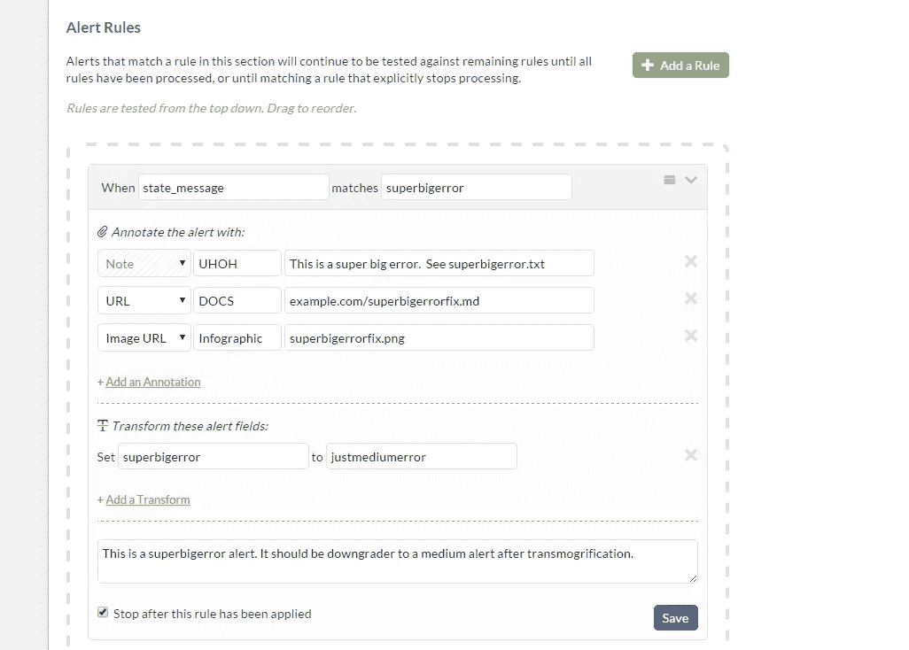
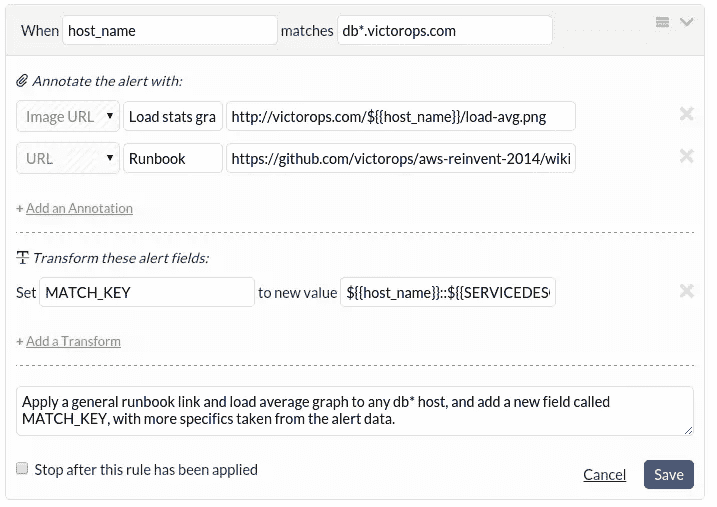
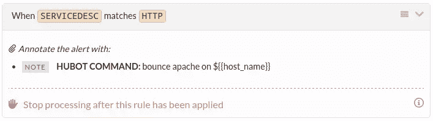
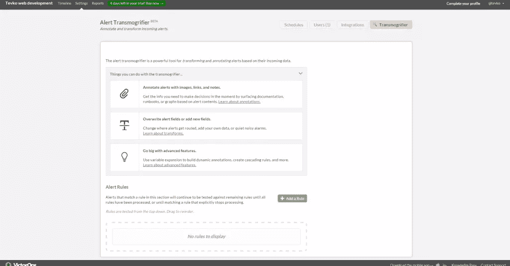
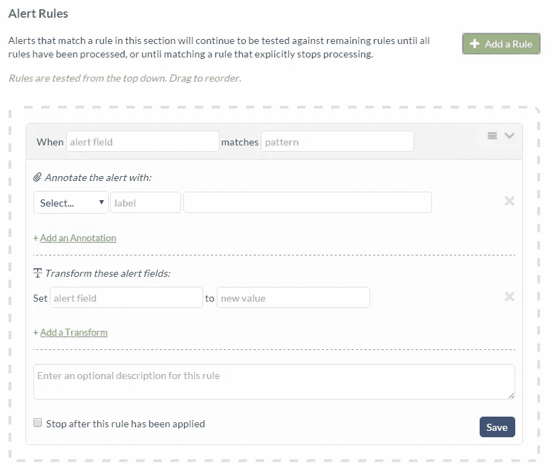
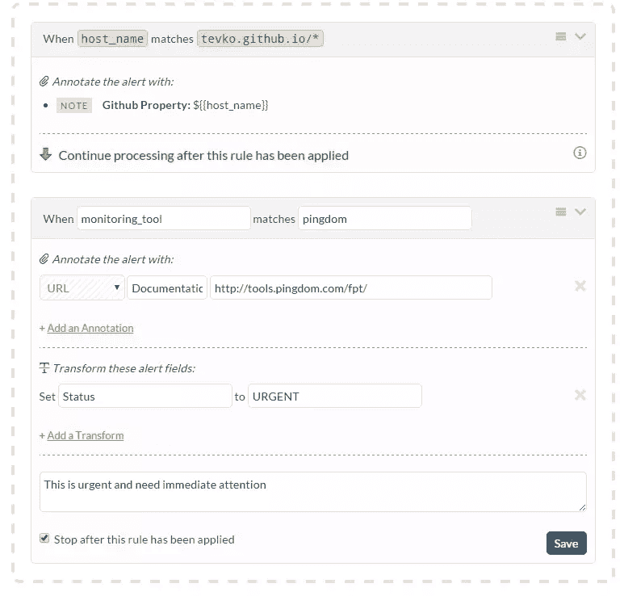

# 传递您的 DevOps 警报并避免停机

> 原文：<https://www.sitepoint.com/transmogrify-devops-alerts-avoid-downtime/>

*本文由 [VictorOps](http://victorops.com/) 赞助。感谢您对使 SitePoint 成为可能的赞助商的支持。*

这听起来像是你可能记得的卡尔文&贺伯斯漫画中的一些东西。但是，[的 VictorOps Transmogrifier 工具](http://victorops.com/blog/tips-tricks-transmogrifier/)不是用来帮助读心和变形的，而是用来帮助工程师解决应用程序警报和最小化停机时间的。

通过将自动化引入警报生命周期的关键阶段，Transmogrifier 在使用范围和用户满意度方面都是无与伦比的。工程师不再需要筛选不相关的警报，同时寻找与真正重要的文档相关的文档。这是因为变形金刚可以自己处理这些任务，把解决问题的重要部分留给随叫随到的工程师。

## 为什么你需要变形人

如果您已经成功地将警报监控系统集成到您的工作流程中，您可能会注意到两件事情。第一个是，只要有一点点错误的迹象(有效或无效)，就会发出警报。这可能会在短时间内累积大量警报，尤其是当您开始考虑可能需要监控的应用程序的所有不同部分时。

您可能注意到的第二个问题是，作为这些警报的结果，您的 devops 团队可能开始感到有点不知所措。这被称为警报疲劳，这是一个困扰待命团队的问题，待命团队的责任是对发送给他们的所有这些警报做出响应。

这两个问题可能会导致一个持续的业务和混乱的环境，因为团队很难过滤警报并收集实际解决它们所需的相关信息。

使用 VictorOps Transmogrifier 就像是在您的 devops 团队中添加了另一名成员。它通过向您的警报通知流程添加许多关键功能，消除了警报疲劳问题。使用 Transmogrifier，您可以过滤掉不相关的警报，只将重要的警报发送给您的团队。

为了减少开发时间，您可以确保每个警告都附有相关文档，这样您的开发人员就不必为一个常见问题寻找解决方案。您甚至可以动态更改警报的状态，以便特定的警报模式继续通知您团队中合适的成员。

Transmogrifier 有助于改变您当前的警报监控策略，这样您就不会被蒙在鼓里，去应对每一个随机出现的警报。

## 那么它是如何工作的呢？

[//player.vimeo.com/video/118712187?title=0&byline=0&portrait=0](//player.vimeo.com/video/118712187?title=0&byline=0&portrait=0)

[维多利亚号变形者](https://vimeo.com/118712187)从[维多利亚号](https://vimeo.com/user20817052)到[维多利亚号](https://vimeo.com)。

通过简单的拖放界面，Transmogrifier 为您提供了许多功能，您可以将这些功能添加到您的警报中，将它们转换为微型程序，为您和您的团队做许多重要的工作。让我们回顾一下这些特性，并解释如何定制它们来帮助您的团队。

### 警报规则

使用 Transmogrifier 设置警报规则类似于 [IFTT](https://ifttt.com/) (如果这样，那么那样)模式。指定警报字段和指定值之间的匹配将使用户能够向警报附加特定的注释、链接和文档。

您可以根据需要设置任意多的警报规则，对通过管道的每个警报测试每个规则。如果您希望变形在特定规则匹配后停止，您可以使用巧妙命名的“应用该规则后停止”选项来指定。

这些规则非常灵活，尤其是在警报值字段中使用通配符时。

`When host\_name matches db\*.victorops.com`

注意在值字段中使用了“*”。您可以使用'【T1 ']和'？'简单通配符的字符，分别表示任何字符串或任何单个字符。*

### 自定义注释

Transmogrifier 提供的另一个有用的功能是能够为您的警报添加自定义注释。使用这些注释，您可以向警报添加数据可视化、图形和图表以及额外的文档。此功能部分得益于在警报规则中使用变量的能力，如下图所示。

### 自动化

您甚至可以通过注释将警报配置为为您运行某些流程，方法是将命令直接写入注释字段。

你可以用 Transmogrifier 提供的特性做很多有趣的事情，所以一旦你准备好深入研究，一定要[查看他们的文档](http://victorops.force.com/knowledgebase/articles/Getting_Started/Transmogrifier-Getting-Started/)！

## 使用变形器

现在我们已经了解了 Transmogrifier 及其功能，让我们使用它来设置一些警报过滤器！

导航到 settings > Transmogrifier 后，我们会看到一个仪表板，在这里我们可以开始设置过滤器来过滤每一个提醒。

点击“添加规则”按钮，给我们呈现一个全新的菜单，开始插入我们的选项。

我的目标是修改当我的任何 Github pages 站点遇到与性能监控相关的问题时通知我的警报，因此我将配置我的过滤器，以便在 host_name 字段 matchestevko.github.io/*.后立即开始传输。这将是我的顶级过滤器，这意味着在此过滤器通过后，将应用所有其他过滤器。

接下来，我将使用说明来注释该警报，以澄清问题。在“注释警告:”字段中，我放置了一个注释，告诉我错误来自 Github pages url。这里是我将使用双花括号变量语法的地方，所以我将被通知错误来自的确切位置。相当酷！

让我们再设置一个规则，以确保可以快速处理警报。我将添加另一个规则，检查警报的确切来源，如果警报来自特定位置，则更新警报的状态。为此，我配置了过滤器来检查与 pingdom 匹配的 monitoring_tool。如果这一点得到验证，那么我将使用 pingdom 性能监控工具的 url 对警报进行注释。然后，我将警报的状态转换为紧急，并添加一条提示，说明该警报需要立即关注。

现在，我们有了一套定义良好的规则，可以过滤我的所有警报，并通知我其中是否有来自 Github pages URL 的性能相关警报。令人难以置信的是，我们只用两条规则就能得到如此具体的结果！

## 总体思路

在有机会预览 Transmogrifier 并设置了几个我自己的警报后，我对 VictorOps 再次改进待命过程的方式印象深刻。警报疲劳是随叫随到中最可怕的部分，能够整理和澄清警报使这一过程运行得更有效率。您不必过滤无关和不重要的错误消息，您的警报可以附带有用的文档和数据可视化，有些警报甚至可以自行解决或降级！

我最喜欢的 Transmogrifier 部分是它能够动态地将文档附加到警报中。想象一下你收到的下一个提醒，包括解决手头问题的具体和详细的途径。有了 Transmogrifier，这个功能只需点击几下鼠标。

虽然变形金刚是一个伟大的解决方案，以提醒疲劳和其他通话困难，它也非常容易使用。Transmogrifier 仪表板简单而强大，结合了极简的拖放界面和功能丰富的用户控件集。

## 结论

没有网站或应用程序会有 100%的正常运行时间。但是有了变形金刚，在解决导致停机的问题的同时，防止停机就容易多了。如果您的工程师厌倦了随叫随到，饱受警报疲劳之苦，或者只是对他们当前的监控解决方案不满意，那么 VictorOps 具有 transmogrifier 功能的解决方案可能就是您的完美工具。

*您如何管理警报并避免警报疲劳？你给维克多普斯一次机会了吗？*

## 分享这篇文章