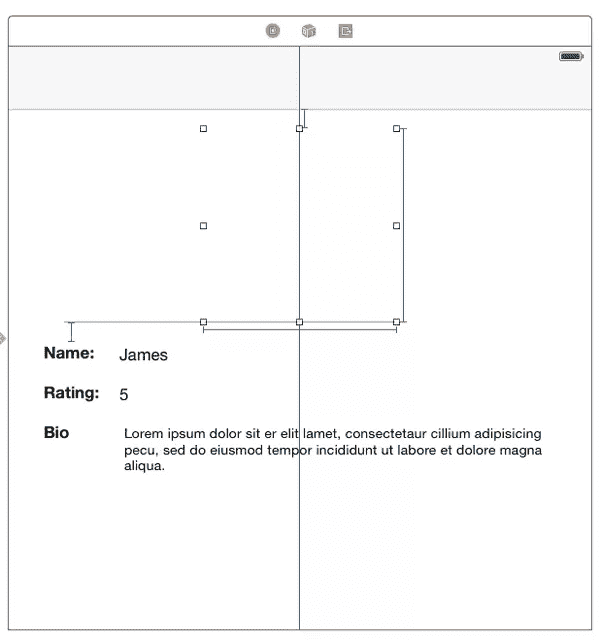
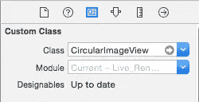
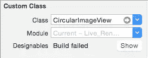
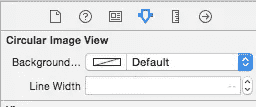
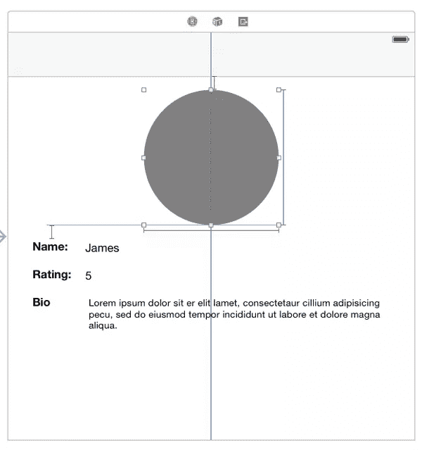
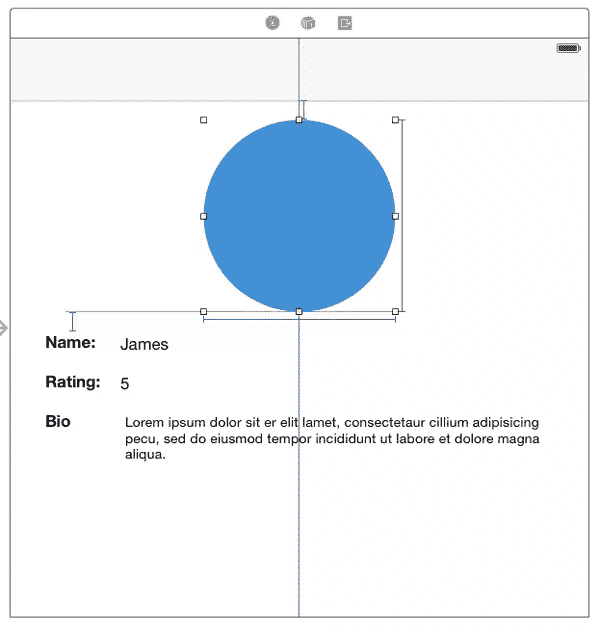
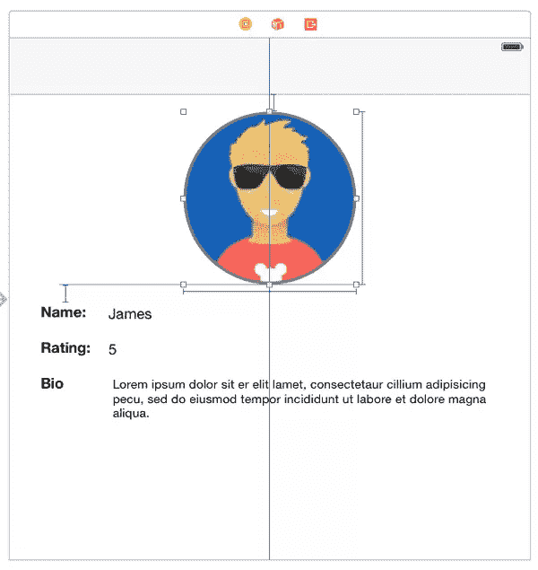
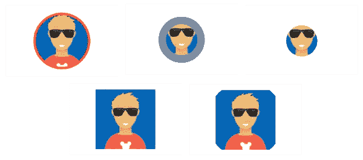

# 创建自定义 UI 组件和实时渲染

> 原文：<https://www.sitepoint.com/creating-custom-ui-components-live-rendering-xcode/>

iOS 允许您创建自定义控制，这些控制可以与 Apple 提供的控制一起在您的应用程序中使用。在 Xcode 6 之前，您不能在界面构建器中预览自定控制，您必须运行应用程序来查看您构建的内容。当您不得不连续运行应用程序来检查您所做更改的结果时，这可能会令人沮丧，因为在模拟器或设备上运行应用程序可能需要一些时间。

Xcode 6 改进了这一过程，因此您现在可以在 Interface Builder 中预览您的自定控制，并实时查看您所做的更改。这使得开发更快，因为你可以很快看到你所编码的结果。Xcode 6 更进一步，让你不用先运行应用程序就能调试控件。

内置控件现在具有可通过界面构建器自定义的优势，您可以在属性检查器中轻松更改控件的属性。要更改自定义控件的属性，以前只能在代码中进行。这一点已经得到了改进，现在您可以在 Interface Builder 中公开控件的属性，并从属性检查器中编辑它们，就像对内置控件一样。这个特性对于创建可重用的控件非常有用。您可以创建一个可以在不同应用程序中使用的控件，该控件可以在 Interface Builder 中自定义，非常像内置控件。能够以这种方式自定义自定义控件使得开发人员和设计人员更容易合作。开发人员可以创建控件，并让设计人员根据自己的需要对其进行样式化和自定义，而无需编写任何代码。

在本教程中，我们将看看如何创建一个自定义控件，启用实时渲染，并在界面生成器中显示控件的属性。

为了跟随教程，[下载启动项目](https://github.com/sitepoint-editors/Live-Rendering-Starter)，我们将使用它而不是从头开始。该项目是一个假想的社交网络的简单应用程序，用户可以在那里查看用户资料。选择个人资料后，您将看到一个显示用户详细信息的视图，包括姓名、简介、个人资料评分和照片。如果你运行这个应用程序，你会注意到用户的图像没有被包括在个人资料视图中。相反，在我们计划放置图像的地方有一个空视图。(应用中使用的图片从 [uifaces](http://uifaces.com/) 下载)

我们不想使用苹果的`ImageView`,而是想创建我们自己的定制视图，它将采用不同的风格，并且可以通过界面构建器进行定制。(我将交替使用“自定义视图”和“自定义控件”)。

首先，通过打开*文件- >新建- >文件- > iOS - >源- > Cocoa Touch 类*，在 starter 项目中创建一个新类。将其命名为`CircularImageView`，使其成为`UIView`的子类，并将语言设置为 Swift。

打开故事板文件，并选择用户详细信息上方的视图。



在身份检查器中将它的类设置为`CircularImageView`。

在`CircularImageView.swift`文件中，在类声明前添加`@IBDesignable`。这将该类标记为可设计的。您需要这样做，以便为该类打开实时渲染。类声明应该如下所示:

```
@IBDesignable
class CircularImageView: UIView {
}
```

返回到故事板文件，选择视图(我将假设从现在起视图被选中)并打开 Identity Inspector。你会注意到一个*可设计的*状态指示器已经出现在自定义类部分。



一个`Up to date`状态意味着定制视图被正确编译和呈现。如果渲染时出现错误，将出现一个状态`Build failed`，旁边有一个标有*显示*的按钮。点按该按钮时，Xcode 将打开一个调试会话，并向您显示导致崩溃的问题。



打开`CircularImageView.swift`并将以下内容添加到类中。

```
var backgroundLayer: CAShapeLayer!
@IBInspectable var backgroundLayerColor: UIColor = UIColor.grayColor()
@IBInspectable var lineWidth: CGFloat = 1.0
```

将`@IBInspectable`属性应用到属性会在属性检查器中显示该属性。返回到故事板文件，您将会看到这两个属性。



*我建议你使用助理编辑器来拆分`CircularImageView.swift`和`Main.storyboard`文件，而不是在文件之间来回切换来查看更改。*

可以用`@IBInspectable`标记的房产类型有`Int`、`CGFloat`、`Double`、`String`、`Bool`、`CGRect`、`CGSize`、`CGPoint`、`UIImage`、`UIColor`。

将以下内容添加到类中:

```
override func layoutSubviews() {
    super.layoutSubviews()
    setBackgroundLayer()
}

func setBackgroundLayer() {

    if backgroundLayer == nil {
        backgroundLayer = CAShapeLayer()
        layer.addSublayer(backgroundLayer)
        let rect = CGRectInset(bounds, lineWidth / 2.0, lineWidth / 2.0)
        let path = UIBezierPath(ovalInRect: rect)
        backgroundLayer.path = path.CGPath
        backgroundLayer.lineWidth = lineWidth
        backgroundLayer.fillColor = backgroundLayerColor.CGColor
    }

    backgroundLayer.frame = layer.bounds
}
```

这里我们检查是否已经创建了一个`backgroundLayer`。如果没有，我们创建一个`CAShapeLayer`对象并将其添加到视图的子层。然后我们创建一个圆形`UIBezierPath`，并将其应用到`backgroundLayer`路径。然后我们设置`backgroundLayer`的*线宽*和*填充颜色*。

如果您查看界面构建器，您会看到一个灰色的对象。这将是我们图像的背景。



在代码中，`backgroundLayer`的默认颜色被设置为灰色。您可以通过在属性检查器中更改背景颜色或线宽来测试您之前设置的可检查属性。一旦改变了这些，故事板将会立即更新。



将以下内容添加到类中:

```
var imageLayer: CALayer!
@IBInspectable var image: UIImage?

func setBackgroundImageLayer() {

    if imageLayer == nil {
        let mask = CAShapeLayer()
        let dx = lineWidth + 3.0
        let path = UIBezierPath(ovalInRect: CGRectInset(self.bounds, dx, dx))
        mask.fillColor = UIColor.blackColor().CGColor
        mask.path = path.CGPath
        mask.frame = self.bounds
        layer.addSublayer(mask)
        imageLayer = CAShapeLayer()
        imageLayer.frame = self.bounds
        imageLayer.mask = mask
        imageLayer.contentsGravity = kCAGravityResizeAspectFill
        layer.addSublayer(imageLayer)
    }

}

func setImage() {
    if let pic = image {
        imageLayer.contents = pic.CGImage
    }
}
```

在这里，我们首先检查 imageLayer 是否尚未创建。如果没有，我们创建一个圆形路径，并将其设置为图层蒙版。遮罩层会使遮罩透明的层透明。

如下修改`layoutSubViews()`,以便调用两个新方法。

```
override func layoutSubviews() {
    super.layoutSubviews()
    setBackgroundLayer()
    setBackgroundImageLayer()
    setImage()
}
```

回到故事板文件，检查属性检查器，你会看到图像的另一个属性已经被添加到圆形图像视图属性中。从下拉菜单中选择一个图像，您应该会看到故事板中的变化。



我们现在完全控制了。唯一的问题是，如果你运行这个应用程序，你会得到所有用户相同的图像。我们不希望用户配置文件的静态图像。我们希望它为每个用户更新。

将以下内容添加到该类中。

```
var userImage: UIImage?
```

然后打开`ViewController.swift`，为我们的自定义视图创建一个出口，命名为`circularImageView`。您应该在代码中包含以下内容。

```
@IBOutlet weak var circularImageView: CircularImageView!
```

在同一个文件中，将这个添加到`viewDidLoad()`中的`if`块的底部，就在设置`userBio.text`的行之后

```
circularImageView.userImage = user.avatar
```

在`CircularImageView.swift`中修改`setImage()`方法，如图所示。

```
func setImage() {  
        if imageLayer != nil {
            if let userPic = userImage {
                imageLayer.contents = userPic.CGImage
            } else {
                if let pic = image {
                    imageLayer.contents = pic.CGImage
                }
            }
        }

    }
```

这将检查`userImage`是否不为零，如果不为零，视图的图像将被设置为该值，否则将被设置为界面构建器中选择的图像。

在 Interface Builder 中，渲染的图像将是您在属性检查器中设定的图像，但如果您运行该应用程序，每个配置文件将显示其各自的图像。

## 值得一说

您的自定控制可能会显示仅在运行时可用的数据，因此 Xcode 将无法向您显示带有数据的控制预览。为了解决这个问题，您可以在代码中覆盖`prepareForInterfaceBuilder()`,并在函数中放置虚拟数据。该方法仅在设计时调用，在运行时对应用程序没有影响。

如前所述，您可以在不运行应用程序的情况下调试自定义控件。为此，请在自定义控件类中需要的位置设置断点。在故事板文件中选择视图，选择*编辑器- >调试所选视图*。调试视图将显示出来，就像调试正在运行的应用程序时一样，您将能够像往常一样调试自定义控件。

## 结论

我们已经了解了如何构建自定义控件和设置界面生成器，以便在编写代码时可以立即呈现控件。此功能极大地改进了创建自定义控件的工作流程，因为您现在可以更快地工作，并在错误发生时知道它们。

除了在 Interface Builder 中实时呈现控件之外，我们还看到了如何制作一个可定制的控件。下图显示了我们可以得到的控件的一些变化，只是通过在界面生成器中自定义它。这对于创建可重用的控件非常有帮助。我们可以在任何需要显示图像的应用程序中使用`CircularImageView`,然后根据应用程序的要求设计它的样式，而无需修改代码。



你可以在这里下载完成的项目(断链)。

## 分享这篇文章