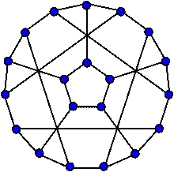
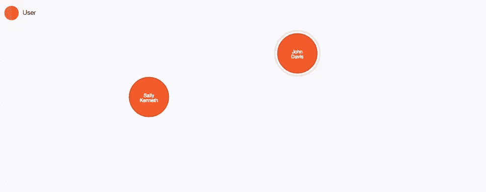
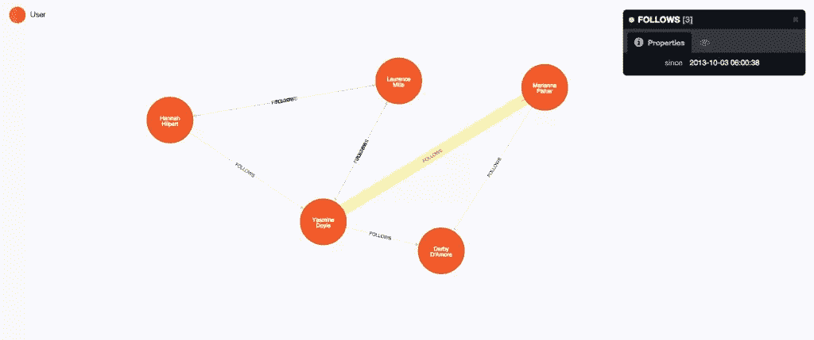
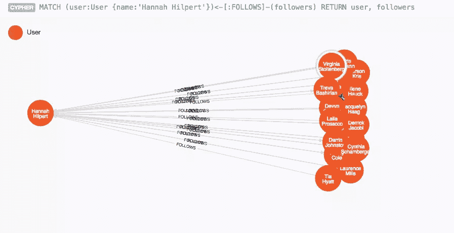
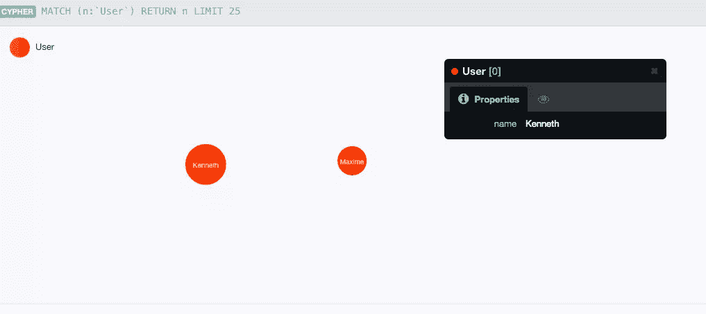
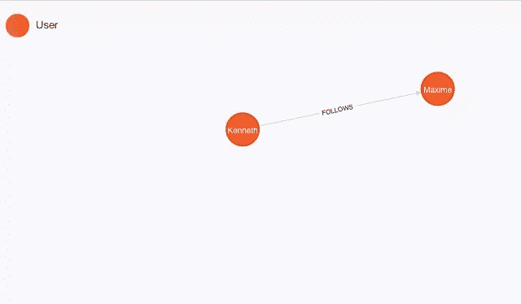
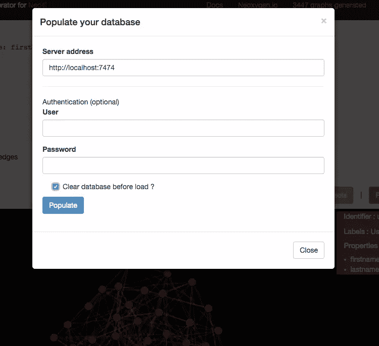
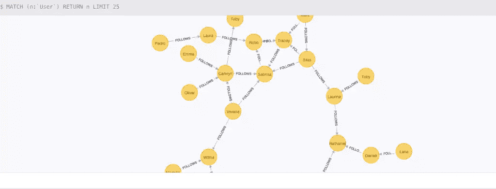
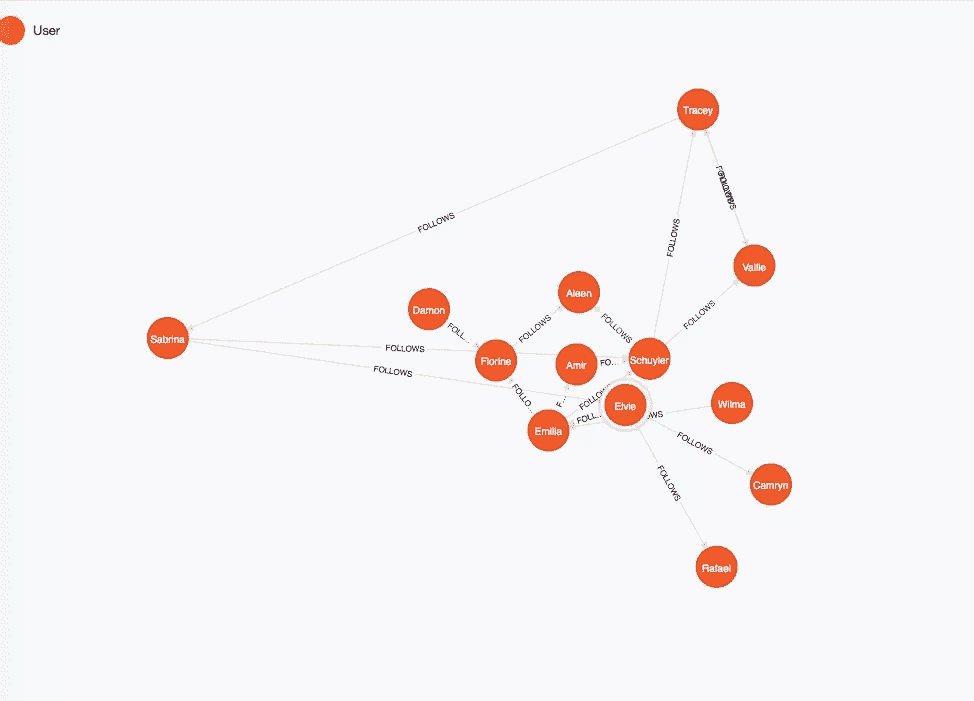

# 用 Neo4j 和 PHP 发现图形数据库

> 原文：<https://www.sitepoint.com/discover-graph-databases-neo4j-php/>

在本帖中，我们将学习领先的图形数据库 Neo4j，以及在 PHP 中使用它的方法。在后续的文章中，我们将构建一个由 Silex 支持的合适的图形应用程序。

* * *

图形数据库现在是处理高度关联数据的公司的核心技术之一。

商业图表、社交图表、知识图表、兴趣图表和媒体图表经常出现在(科技)新闻中——这是有原因的。图模型代表了一种非常灵活的处理数据关系的方式，而图数据库为它提供了快速有效的存储、检索和查询。

最受欢迎的图形数据库 Neo4j 已经证明了它在许多用例中处理大量高度关联数据的能力。

在上一届 [GraphConnect 大会](http://graphconnect.com)期间，TomTom 和 Ebay 的 Shuttle 展示了图形数据库给公司带来的价值，例如，提供出色的客户体验或支持复杂的路线图编辑。Neo4j 由 Neo Technology 开发和支持，Neo Technology 是一家初创公司，现已发展成为一家备受尊敬的数据库公司。

## 简短的介绍

对于新手来说，除了我们去年在理论上对它的一瞥之外，这里有一个关于图形数据库和 Neo4j 的简短介绍。

### 什么是图？

图是一种通用的数据结构，由通过关系连接的节点(实体)组成。有时，这些也被称为顶点和边。在属性图模型中，每个节点和关系都可以被标记，并拥有描述它的任意数量的属性。



*图片来自维基百科*

### 什么是图形数据库

图形数据库是针对连接数据的操作而优化的数据库。图形数据库通过为节点和关系使用专用的存储结构来提供适合于在线操作的高性能。
它们不需要在查询时计算关系(连接),而是作为数据的一部分高效地存储它们。

我们以一个简单的社交应用为例，用户关注其他用户。

用户将被表示为一个*节点*，并且可以有一个*标签*和*属性*。标签描述了节点的各种角色。



这两个用户之间的链接将被表示为一个*关系*，它也可以有属性和一个*类型*来标识关系的性质。关系为数据增加了语义。


通过查看图表，可以看出用图表表示数据并将其存储在图表数据库中是多么自然。



### Cypher，Neo4j 图形查询语言

查询一个图可能看起来并不简单。为了简单起见，Neo4j 开发了 *Cypher* ，这是一种声明式图形查询语言，专注于开发人员、管理员和领域专家的可读性和表达能力。

作为声明性的，Cypher 专注于表达从图中检索什么，而不是 T2 如何检索。

查询语言由几个不同的子句组成。你可以在 Neo4j 手册中读到更多关于它们的细节。

以下是一些用于读取和更新图表的子句:

*   MATCH:查找您在图形中提供的“示例”图形模式，并为每个找到的匹配返回一个路径。
*   WHERE:用谓词过滤结果，很像 SQL 中的情况。但是在 Cypher 中有更多的谓词，包括集合操作和图匹配。
*   RETURN:以您需要的形式返回查询结果，比如标量值、图形元素或路径、集合甚至文档。
*   创建:创建带有标签和属性的图形元素(节点和关系)。
*   合并:匹配现有模式或创建它们。是`MATCH`和`CREATE`的组合。

Cypher 完全是关于模式的，它将你已经看到的视觉表现描述为文本模式(使用 ASCII-art)。
它使用圆括号来描述节点(如`(m:Movie)`或`(me:Person:Developer)`)和箭头(如`-->`或`-[:LOVES]->`)来描述关系。

查看我们的最后一个用户图，将检索 *Hannah Hilpert* 以及跟随她的用户的查询将如下所示:

```
MATCH (user:User {name:'Hannah Hilpert'})<-[:FOLLOWS]-(follower) 
RETURN user, follower
```



* * *

## Neo4j 和 PHP

在对 Neo4j 图形数据库的快速介绍之后(这里有更多的)，让我们看看如何在 PHP 中使用它。

Neo4j 作为数据库服务器安装。
一个 [HTTP-API](http://neo4j.com/docs/stable/rest-api.html) 可用于操作数据库和发布密码查询。

如果你想安装运行 Neo4j graph 数据库，可以在这里下载最新版本:[http://neo4j.com/download/](http://neo4j.com/download/)，解压你电脑上的存档文件，运行`./bin/neo4j start`命令。请注意，这仅适用于基于*nix 的系统。

Neo4j 配备了一个很酷的视觉界面， *Neo4j 浏览器*可在*[http://localhost:7474](http://localhost:7474)*获得。
试试吧！浏览器内有一些入门指南，但更多信息可在线[找到](http://neo4j.com/developer)。

如果你不想把它安装在你的机器上，你可以在作为服务提供商的 Neo4j 上创建一个免费的实例。

### 新氧成分

Neoxygen 是一组开源组件，大部分在 PHP 中，用于在 [Github](https://github.com/neoxygen) 上可用的 Neo4j 生态系统。目前，我是主要的开发者。如果你也有兴趣贡献，就 [ping 我](http://twitter.com/ikwattro)。

Neo4j HTTP-API 的一个强大的客户端被命名为 [NeoClient](https://github.com/neoxygen/neo4j-neoclient) ，具有多数据库支持和内置的高可用性管理。

#### 安装和配置

安装很简单，只需在您的`composer.json`文件中添加`neoclient`依赖项:

```
{
  "require": {
    "neoxygen/neoclient":"~2.1"
  }
}
```

您可以在构建客户端时配置您的连接:

```
use Neoxygen\NeoClient\ClientBuilder;

$client = ClientBuilder::create()
  ->addConnection('default', 'http', 'localhost', 7474)
  ->build();
```

如果您在 GrapheneDB 上创建了一个实例，那么您需要配置一个带有凭证的安全连接。这是通过将 *true* 附加到`addConnection`方法来实现的，用于使用授权模式和您的凭证:

```
<?php

use Neoxygen\NeoClient\ClientBuilder;

$connUrl = parse_url('http://master.sb02.stations.graphenedb.com:24789/db/data/');
$user = 'master';
$pwd = 's3cr3tP@ssw0rd';

$client = ClientBuilder::create()
  ->addConnection('default', $connUrl['scheme'], $connUrl['host'], $connUrl['port'], true, $user, $password)
  ->build();
```

现在，通过连接到 HTTP API 的客户机，您可以完全访问 Neo4j 数据库。

该库提供了访问不同端点的简便方法。然而，最常用的方法是*发送一个密码查询*。

在原始 json 响应中处理 graph 结果有点麻烦。这就是为什么这个库附带了一个方便的结果格式化程序，可以将响应转换成节点和关系对象。默认情况下，格式化程序是禁用的，您可以通过在客户端构建过程中添加一行代码来启用它:

```
$client = ClientBuilder::create()
  ->addConnection('default', 'http', 'localhost', 7474)
  ->setAutoFormatResponse(true)
  ->build();
```

### 让我们建造一些很酷的东西

我们将逐步构建一组*用户*节点和*追随*关系。然后，我们就可以查询*的朋友的朋友*的信息，提供交友建议。

创建用户的查询如下:

```
CREATE (user:User {name:'Kenneth'}) RETURN user
```

该查询由 5 部分组成:


*   CREATE 子句(蓝色)，表示我们想要创建一个新元素。
*   标识符(橙色)，用于在查询中标识您的节点
*   标签(红色)，用于将用户添加到`User`标签组。
*   节点属性(绿色)特定于该节点。
*   RETURN 子句，指示您想要返回的内容，这里是创建的用户。

您还可以尝试在 Neo4j 浏览器中运行该查询。

不需要等待，让我们用客户端创建这个用户:

```
$query = 'CREATE (user:User {name:"Kenneth"}) RETURN user';
$result = $client->sendCypherQuery($query)->getResult();
```

您可以在浏览器中可视化创建的节点(打开*星号*选项卡并运行“获取一些数据”)，或者使用客户端获取图形结果。

```
$user = $result->getSingleNode();
$name = $user->getProperty('name');
```

我们将对另一个用户做同样的事情，现在使用查询参数。查询参数随查询一起传递，它允许 Neo4j 缓存查询执行计划，这将使您的进一步相同查询更快:

```
$query = 'CREATE (user:User {name: {name} }) RETURN user';
$parameters = array('name' => 'Maxime');
$client->sendCypherQuery($query, $parameters);
```

如您所见，参数被嵌入在`{}`中，并作为`sendCypherQuery`方法的第二个参数传入一个参数数组。

如果你现在看这个图，你会看到两个用户节点，但是他们感觉很孤独:(，不是吗？



#### 创建关系

为了创建节点之间的关系，我们将再次使用 Cypher。

```
$query = 'MATCH (user1:User {name:{name1}}), (user2:User {name:{name2}}) CREATE (user1)-[:FOLLOWS]->(user2)';
$params = ['user1' => 'Kenneth', 'user2' => 'Maxime'];
$client->sendCypherQuery($query, $params);
```

一些解释:

我们首先匹配名为 Kenneth 和 Maxime 的现有用户(名称作为参数提供)，然后我们在两者之间创建一个`FOLLOWS`关系。

肯尼斯将成为`FOLLOWS`关系的**开始节点**，马克西姆将成为**结束节点**。
关系**类型**将为*跟随*。

再次查看图表，可以看到关系已经创建。



#### 创造一群用户

为一组 100 个用户手动编写所有的创建语句和关系会很无聊。
我想介绍一个非常有用的工具，叫做`Graphgen`(Neoxygen 组件之一)，用于轻松生成图形数据。

它使用一个非常接近 Cypher 的规范来描述你想要的图形。
这里我们将创建一组 50 个用户和相应的`FOLLOWS`关系。

进入[http://graph gen . neo xygen . io](http://graphgen.neoxygen.io)，在编辑器区域复制粘贴以下模式，点击**生成**:

```
(user:User {login: userName, firstname: firstName, lastname: lastName} *50)-[:FOLLOWS *n..n]->(user)
```


您可以看到，它自动生成了一个包含 50 个用户、关系以及 login、firstname 和 lastname 的实际值的图表。印象深刻，不是吗？

让我们将这个图形导入到我们的本地图形数据库中，点击**填充您的数据库**并使用默认设置。



很快，数据库将被数据填充。

如果打开 Neo4j 浏览器，再次运行“获取一些数据”，可以看到所有的用户节点及其关系。



#### 获取建议

用 Neo4j 获取建议很简单，你只需要匹配一个用户，按照 *FOLLOWS* 关系找到其他用户，然后对于每个找到的用户，找到他们关注的用户，并返回那些你还没有关注的用户。建议也不能是我们正在寻找建议的用户。

在一个常见的应用程序中，将有一个登录系统，用户将只被允许看到他正在关注的用户。为了这篇介绍 Neo4j 的文章，你可以和所有的用户一起玩。

我们用密码写吧:

```
$query = 'MATCH (user:User {firstname: {firstname}})-[:FOLLOWS]->(followed)-[:FOLLOWS]->(suggestion)
WHERE user <> suggestion 
  AND NOT (user)-[:FOLLOWS]->(suggestion)
RETURN user, suggestion, count(*) as occurrence
ORDER BY occurrence DESC
LIMIT 10';
$params = ['firstname' => 'Francisco'];
$result = $client->sendCypherQuery($query, $params)->getResult();

$suggestions = $result->get('suggestion'); // Returns a set of nodes
```

如果您在 neo4j 浏览器中运行这个查询，您将得到第一个匹配的用户和建议:



## 结论

在这一部分中:

*   你已经发现了图形数据库和 Neo4j
*   您学习了 Cypher 查询语言的基础知识
*   您已经看到了如何使用 PHP 连接到 Neo4j 数据库并在其上运行查询

在接下来的文章中，我们将使用我们目前所学的一切，制作一个真正的 Neo4j powere Silex PHP 应用程序。

## 分享这篇文章