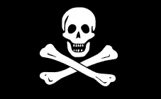
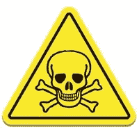
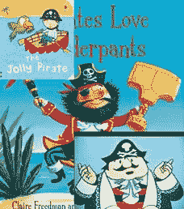
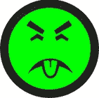

# 一个关于毒药、海盗和尤克先生的故事

> 原文：<https://www.sitepoint.com/poison-pirates-mr-yuk/>

骷髅会。

有一个很好的论点，这是过去 1000 年来最成功的平面设计之一。也许这就是它看起来在笑的原因。除了宗教肖像，没有太多的符号在 500 多年的时间里一直被普遍使用。

从中世纪开始，骷髅头和十字架就被印在轮船载货单上已故船员的名字旁边。

当然，到了 18 世纪——作为“[海盗旗](http://en.wikipedia.org/wiki/Jolly_Roger)”——我们看到这个符号被用在海盗的旗帜上。这面旗帜旨在恐吓受害者，让他们尽可能不战而降。

大约从 1850 年开始，头骨开始被用来标记“毒药”。在那个时候，惯例也是在毒药瓶子上使用蓝色的有棱纹的玻璃——但这在 20 世纪就不再受欢迎了。

今天，它甚至有一个 unicode 符号——'☠——html☠

通常，设计这样的符号时，您的任务是:

1.  **保持简单:**你的符号可能需要在小规模和光线不好的环境下复制。
2.  **避免使用书面语言:**即使你的用户有文化，也可能不是你所选择的语言。
3.  避免依赖文化:一个好的符号不应该严重依赖于以前的知识、童话、民间传说、历史、科学或其他专门知识。

作为毒物识别专家，骷髅会在这几个方面都做得很好。这当然很简单，而且没有文字。如果它有一个弱点，可以说是最后一点。

孩子什么时候第一次明白什么是头骨？当然，他们可能知道这是一张各种各样的脸，但他们会理解他们在看骨头吗——这意味着什么？3 岁的时候？也许 5 个？它必须有所不同。

更重要的是，文化是如何无意中软化了这个符号的含义。环顾一下任何一家玩具店——即使是儿童玩具和书籍也充斥着有趣友好的海盗，几乎总是印有欢乐罗杰斯。

对于一个孩子来说，断定任何标有海盗旗的瓶子表明里面的东西是推荐在跳快步舞或舞剑时饮用的，这不会是疯狂的。

不是理想的结果。

### 另一种选择？

那么，有没有更好的标记毒药的符号呢？也许有过。

在 20 世纪 70 年代，理查德·莫里阿提博士提出了这个新的毒药标签。作为匹兹堡海盗队的球迷，莫里亚蒂发现，海盗形象非但没有起到威慑作用，事实上还深受他的病人的喜爱，无论老少。

莫里亚蒂的替代符号使用了一张“令人作呕”的绿色脸、眯眼和伸出的舌头来传达令人作呕的味道。

任何一个吐出过抱子甘蓝的孩子都知道这意味着什么——也许在他们会说话之前。人类是群居动物，我们生来就有先进的面部识别软件。莫里亚蒂孩童般的偶像挖掘了这种与生俱来的能力。

那么，为什么我们现在到处看不到育先生呢？

尽管这个尤克先生的图标在当时获得了一些关注，但该设计目前仍由莫里阿蒂的雇主——UPMC 匹兹堡儿童医院——拥有、注册商标和版权。与骷髅会(公有领域)不同，没有医院的明确许可，你不能在你的毒瓶上使用尤克先生。

我们现在被海盗旗困住了。至少要感谢——尽管他们掠夺成性、血腥暴力、粗鄙语言和糟糕的卫生条件——海盗从来都不是他们商标的坚定捍卫者。

## 分享这篇文章