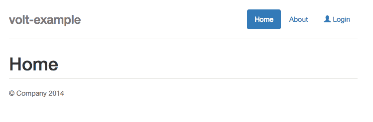

# Ruby 中的 Volt 实时网络应用

> 原文：<https://www.sitepoint.com/real-time-web-apps-volt-ruby/>


Volt 是一个漂亮的新 Ruby web 框架，旨在模糊客户机和服务器代码之间的界限。该框架背后的基本思想是，您可以使用 Javascript 中的 Ruby 运行时 Opal 用 Ruby 编写客户端代码(通常是 Javascript)。此外，Volt 提供了一些在客户端和服务器端之间传递数据的好方法。如果你以前用过[流星](https://www.meteor.com/)，伏特是一个非常相似的想法，但是流星有很多部分是伏特没有的。我认为伏特很有潜力。随着 web 应用程序变得越来越依赖客户端，在 Javascript 和 Ruby 之间切换思维环境是一件痛苦的事情。弄清楚如何在客户机和服务器之间传输简单的数据更是一件痛苦的事情。伏特可以帮助你快速到达那里。

在本文中，我将介绍如何用 Volt 构建一个极其简单的书签“app”。本文的重点是让您快速掌握一些非常基础的知识，并让您感受一下客户机/服务器划分在 Volt 中是如何工作的。我们开始吧。

## 视图

首先，我们需要一个 Volt 的副本:

```
gem install volt 
```

如果您以前使用过 Rails，那么您会发现一些“volt”命令行参数非常熟悉。下面是我们创建新项目的方法:

```
volt new volt-example 
```

您应该会看到一个看起来很熟悉的目录布局(如果您是 Rails 一类的人的话):

```
Gemfile
Gemfile.lock
README.md
app
config
config.ru
lib
spec 
```

要查看 Volt 已经为我们设置了什么，请启动 web 服务器:

```
bundle exec volt server 
```

您应该会看到类似这样的内容:



好吧，那么这个页面到底是在哪里生成的呢？如果你进入应用程序目录，你应该看到一个“主”目录。与 Rails 不同，Volt 允许你将你的 webapp 分解成“组件”(这个想法类似于 Django 风格的分离)。它会自动为您定义“主”组件，所以让我们进入该目录。你现在看到了:

```
assets
config
controllers
models
tasks
views 
```

如果您在**视图/main** 中查看，您可以看到与该组件相关的视图。作为该组件一部分的视图布局在 main.html 的**中定义，如下所示:**

```
<:Title>
  {{ template main_path, "title", {controller_group: 'main'} }}

<:Body>
  <div class="container">
    <div class="header">
      <ul class="nav nav-pills pull-right">
        <:nav href="/" text="Home" />
        <:nav href="/about" text="About" />
        <:user-templates:menu />
      </ul>
      <h3 class="text-muted">volt-example</h3>
    </div>

    <:volt:notices />

    {{ template main_path, 'body', {controller_group: 'main'} }}

    <div class="footer">
      <p>&copy; Company 2014</p>
    </div>

  </div>

<:Nav>
  <li class="{{ if active_tab? }}active{{ end }}">
    <a href="{{ attrs.href }}">{{ attrs.text }}</a>
  </li> 
```

古怪的表情`<:body></:body>`、`<:title></:title>`等。是视图如何在 Volt 中工作的重要组成部分。基本上，如果你看到一个`<:tagname></:tagname>`(注意第一个字母的大写)形式的标签，它正在定义或使用一个*部分*。在布局中，我们定义了三个部分:`<:title></:title>`、`<:body></:body>`和`<:nav></:nav>`，它们包括一些基本的布局，然后遵从我们调用的动作的模板。具体来说，这是调用操作模板的两行代码:

```
{{ template main_path, "title", {controller_group: 'main'} }}
...
{{ template main_path, 'body', {controller_group: 'main'} }} 
```

在 Volt 中，只要我们有一些用``括起来的代码，它就会像 Ruby 一样使用 Opal 来执行。在这种情况下，我们使用了一些可用的变量，以便使用这种布局调出适合页面的模板。好的，让我们来看看其中的一个模板。打开**app/main/views/main/about . html**:

```
<:Title>
  About

<:Body>
  <h1>About</h1>

  <p>About page...</p> 
```

这看起来很简单！基本上，我们只是填充布局中的部分。让我们跳回模板，更仔细地检查一下。您可能会注意到一些标签是以`<:tagname></:tagname>`的形式出现的(注意第一个字母是小写的)。这些不是部分；他们是*控制者*。在某种意义上，它们就像是 Rails 的模板助手(例如`link_to`)，因为它们帮助你生成一些 HTML。我们将继续看到更多这样的例子。

## 布线和添加视图

好了，这些知识暂时就够了。让我们开始构建我们的书签应用程序。我们需要一个页面，用户可以看到书签列表，并添加一个新的。我们将在前进的过程中处理功能，但是首先，创建一个新的视图和一条路线。创建视图很简单；只需创建文件**app/main/views/main/bookmarks . html**:

```
<:Title>
  Bookmarks

<:Body>
  <h1>Bookmarks</h1> 
```

为了添加路由，我们转到 **config/routes.rb** 和下面一行:

```
get '/bookmarks', _action: 'bookmarks' 
```

安妮，就是这样！您必须重启服务器(Volt 的作者说很快您就不用这么做了)，然后您应该会在`localhost:3000/bookmarks`看到一个漂亮的页面。事实上，我们可以通过将 **config/routes.rb** 的最后一行改为以下内容来使`bookmarks`动作成为索引:

```
get '/', {_action: 'bookmarks'} 
```

Volt 的另一个优点是它可以自动重新加载页面。如果您尝试更改`app/main/views/main/bookmarks.html`的内容，然后保存文件，您将能够在浏览器中看到页面重新加载。

## 基本的部分

让我们弄清楚如何处理一个表单，以便我们可以实际创建新的书签。随后，我们希望在页面上很好地显示这些书签。在此之前，了解 Volt 和 Rails 之间的根本区别非常重要。Volt 是一种 MVVM(模型视图，视图模型)框架，而不是 MVC 框架。实际上，Volt 中的视图调用控制器来完成任务，而不是相反。

首先，我们需要一个表格。这相当简单，只需在**bookmarks.html**的`<:body></:body>`中添加以下内容:

```
<form e-submit="add_bookmark" role="form">
    <div class="form-group">
        <label>New Bookmark</label>
        <input class="form-control" type='text' value="{{ page._new_bookmark._description }}" />
        <input class="form-control" type="text" value="{{ page._new_bookmark._url  }}" />
        <input type="submit" value="Add Bookmark" />
    </div>
</form> 
```

好吧，这段代码的一些部分是普通的，其他的不是。我们有一个看似简单的表单元素。但是它有一些古怪的属性，比如`e-submit`。这里，`e-submit = "add_bookmark"`告诉 Volt，当提交表单中的数据时，应该调用控制器中的`add_bookmark`方法/动作。另外两条奇怪的线是:

```
<input class="form-control" type="text" value="{{ page._new_bookmark._description }}" />
<input class="form-control" type="text" value="{{ page._new_bookmark._url }}" /> 
```

我们正在定义文本输入元素，但神奇的事情发生在`value`字段。在`value = "..."`属性中，我们正在创建一个*绑定*。当这些文本元素的值改变时，变量`page._new_bookmark._description`和`page._new_bookmark._url`的值也会改变。此时，这个表单不会做任何重要的事情，因为我们还没有在`add_bookmark`控制器动作中放入任何东西。因此，打开`app/main/controllers/main_controller.rb`并添加以下方法:

```
def add_bookmark
  page._bookmarks << {url: page._new_bookmark._url, description: page._new_bookmark._description}
  page._new_bookmark._url = 'URL'
  page._new_bookmark._description = 'Description'
end 
```

在伏特，这个叫做`page`的东西是一个*型号*。它不是 Rails 意义上的模型——它不一定与您的数据库有任何关系。相反，模型是前端和后端都可以获得的数据。记住，Volt 不是 T4，而是一个服务器端的 Ruby 框架(比如 Rails 或 Sinatra)。Volt 的要点在于它让客户端和服务器端可以无缝地互操作。

回到`page`。在表单中，我们绑定了变量`page._new_bookmark._description`和`page._new_bookmark._url`(注意变量名前面的下划线；使用这些自动给我们空模型来放入数据)到特定的表单值。在控制器代码中，我们可以获取并使用这些变量！在视图中更新它们，对这些变量的更改在控制器中可用。乍一看，这似乎并不那么神奇，但是这个想法的强大之处在于，你可以在客户端创建一个任何类型的*模型，然后当你从视图中调用控制器代码时，它就会出现。*

然后，控制器获取`page._bookmarks`并将一个 Ruby 哈希放入其中，该哈希表示与我们简单的 webapp 中的一个书签相关联的数据。在我们看到我们努力的结果之前，我们需要在显示这些书签的视图中有一些代码:

```
<ul class="bookmark-list">
  {{ page._bookmarks.each do |bookmark| }}
  <li>
          <a href="{{ bookmark._url }}">{{ bookmark._descr }}</a>
  </li>
  {{ end }}
</ul> 
```

好的，转到“localhost:3000”，你会看到一个非常简单的表单，你可以输入一个描述和一个 URL，点击回车键，看到它出现在下面的书签列表中。

## 坚持

如果你在输入一些书签后刷新页面，你会大吃一惊:它们可能都消失了。我们需要某种方法来保存这些信息。

在 Volt 中，持久性确实很容易，但它也带来了一个问题:如果您想使用客户机-服务器共享的魔力，Volt 目前只支持 MongoDB。你可能会问为什么 Volt 不支持更“标准”的东西，比如 Postgres 或 MySQL。问题是在多个 SQL 表之间来回转换 JSON 对象是一件非常令人头疼的事情，我们需要一个 ORM 作为中间媒介。本质上，Volt 属于这样一个阵营，它认为在一个 web 框架中使用这种翻译形式是一个坏主意。

如果你没有 Mongo 的副本，它很容易得到。关于麦克·OS X:

```
brew install mongodb
mongod 
```

如果你在 Linux 上，出于我们的目的，使用你的发行版的包管理器中可用的 Mongo 版本应该没问题。对于 Windows，我发现这个指南很有帮助。

如果你去了 **db/config/app.rb** ，你；我会发现下面几行被注释掉了:

```
config.db_driver = 'mongo'
config.db_name = (config.app_name + '_' + Volt.env.to_s)
config.db_host = 'localhost'
config.db_port = 27017 
```

让它们重新存在。我们需要为我们的书签创建一个模型。由于 Volt 中的“模型”并没有真正连接到“创建表”SQL 命令，所以我们并不需要指定太多。我们只需创建文件`app/main/models/bookmark.rb`并进入:

```
class Bookmark < Volt::Model
end 
```

重启 Volt 服务器后，您的数据库设置就可以运行了。然而，我们确实需要改变一下我们的观点和控制器。还记得我们放书签的那个`page._bookmarks`数组吗？为了同步到 MongoDB，我们只需将`page._bookmarks`改为`_bookmarks`。伏特会处理剩下的。

以下是修改后的行:

```
_bookmarks << {url: page._new_bookmark._url, description: page._new_bookmark._description}

{{ _bookmarks.each do |bookmark| }} 
```

就是这样！请注意，我们从浏览器向 Mongo 获取数据是多么容易。然而，这种方法存在一些问题。客户端和服务器之间数据库同步的想法随着 [Meteor](https://www.meteor.com/) 的出现而流行起来。然而，Meteor 通过 Mongo 的完全客户端实现[将客户端-服务器连接向前推进了一步。此外，Meteor 允许您的应用程序监听服务器上集合的变化，并将它们直接推送到客户端数据库。从现有的文档来看，这些东西不是 Volt 的一部分。因此，当涉及到具有实时数据更新的实时应用程序时，Volt 的持久性支持不如 Meteor 强大。](http://www.quora.com/How-is-Meteors-client-side-database-implemented?redirected_qid=1102411)

## 这是一个总结！

我们只是触及了伏特的皮毛。事实上，我们的书签管理器看起来有点…垃圾。但是，我们已经走得够远了，可以让您感受一下 Volt 的基本思想是什么:客户机和服务器之间更紧密、更容易的集成。

这篇文章的代码可以在 [Github](https://github.com/sitepoint/real-time-apps-with-volt) 上找到。

## 分享这篇文章