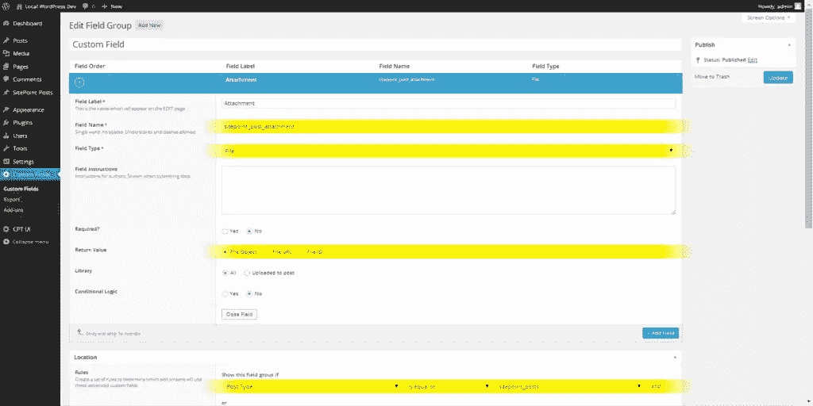
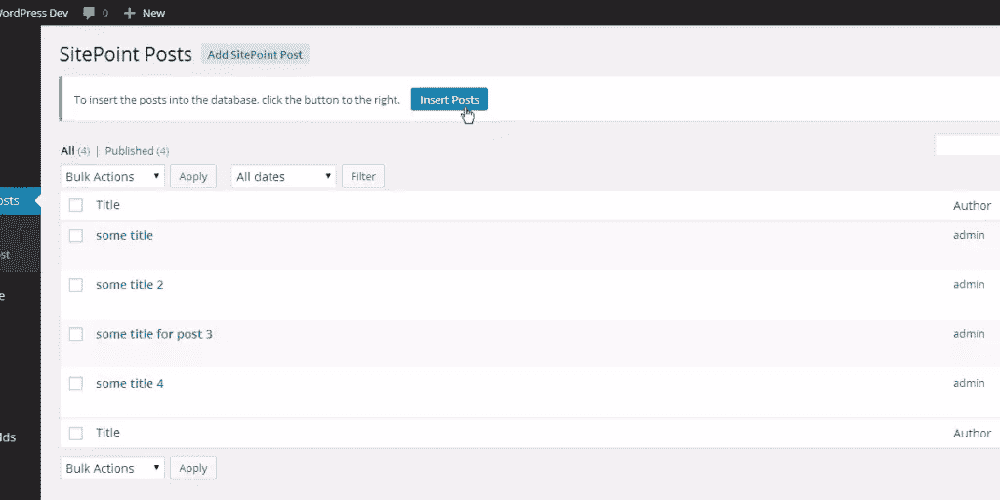

# 以编程方式从 CSV 数据创建 WordPress 文章

> 原文：<https://www.sitepoint.com/programmatically-creating-wordpress-posts-from-csv-data/>

作为 WordPress 开发人员，我们经常会遇到需要包含以前获得的数据的项目，无论是来自简单的文本文件、CSV 文件，甚至是旧的数据库。任何后端开发人员都会遇到数据迁移。几个月前，我们有一个项目，需要从大量 CSV 文件中生成近 1，000 个帖子。现在，通常这不会很难，但是这些数据也需要有自己的文章类型，自定义文章类型有一些自定义字段，包括 MP3 文件的媒体附件。

我不会用创建自定义文章类型和自定义字段的代码来烦你，因为已经有[一吨](https://www.sitepoint.com/getting-started-with-advanced-custom-fields/) [的文章](https://www.sitepoint.com/acf-flexible-content-fields/) [漂浮在](https://www.sitepoint.com/custom-post-types-take-wordpress-beyond-blogging/) [的网页上](https://www.sitepoint.com/creating-custom-post-types-in-wordpress/) [主题](https://www.sitepoint.com/custom-wordpress-taxonomies/)。我只想提一下，我为每个任务分别使用了[自定义帖子类型 UI](http://webdevstudios.com/plugins/custom-post-type-ui/) 和[高级自定义字段](http://www.advancedcustomfields.com/)。如标题所示，我们将在这里讨论的是从一堆 CSV 文件(有些包含多个帖子)中以编程方式获取数据，然后将这些数据转换成自定义帖子类型的 WordPress 帖子。我们甚至会给每篇文章附上一个简单的文本文件。

为了从 CSV 文件中获取我们需要的所有数据，我们将使用一些漂亮的 PHP 函数，例如: [`glob()`](http://php.net/manual/en/function.glob.php) ，它“globs”一个目录并返回其中的文件名数组； [`fopen()`](http://php.net/manual/en/function.fopen.php) ，它打开一个文件，这样我们就可以读取它的内容，最后 [`fgetcsv()`](http://php.net/manual/en/function.fgetcsv.php) ，它将一个 CSV 文件解析成一个漂亮的关联数组，容纳我们所有的数据。

*实际上，我们将在本文中使用的大部分数据可能都在一个 CSV 文件中，而不是像我们现在这样将数据分散在多个文件中。这样做是为了让这里使用的技术可以使用其他类型的数据来实现，比如 JSON、Yaml 甚至纯文本文件。整篇文章的想法来自于关于这个主题的教程和文章的严重缺乏，特别是当你使用自定义的文章类型和自定义字段时。*

## 了解我们的数据

如果您想继续，您可以从这个 repo 中获取所需的 CSV 文件(以及本文中使用的所有代码)。好的，首先，让我们看看我们将要处理的 CSV 数据(请注意,“File”列是为了向您显示我将所有这些数据分布在多个 CSV 文件中)。

| 文件 | 标题 | 内容 | 附件 |
| :-- | :-- | :-- | :-- |
| 虚拟. csv | 一些标题 | 帖子的一些内容 | 附件 1.txt |
| dummy2.csv | 一些标题 2 | 帖子 2 的一些内容 | 附件 2.txt |
| dummy3.csv | 帖子 3 的一些标题 | 第三篇文章的一些内容 | 附件 3.txt |
| dummy3.csv | 一些标题 4 | 帖子 4 的一些内容 | 附件 4.txt |

很简单，是吧？接下来，我们将看看我们将使用的自定义帖子类型。我用[自定义帖子类型 UI](http://webdevstudios.com/plugins/custom-post-type-ui/) 创建了它，所以如果你使用插件，你可以使用相同的设置，或者用 WordPress 的许多功能自己做。这里是我们将使用的选项的快速截图(我突出显示了 slugs 和我们将在本文中使用的其他字段，所以请记住这一点):


最后，让我们看看我们将使用的自定义字段。它是用可爱的[高级定制字段](http://www.advancedcustomfields.com/)创建的。这是我们将要使用的设置的另一个快速截图。

*请注意，您的定制字段的 ID 可能与本文中使用的 ID 不同，所以一定要用正确的 ID 更新您的`$sitepoint`数组。这可以是字段的实际哈希键，也可以只是字段的名称。为了清楚起见，我还是坚持用这个名字。*



## 几个先决条件

值得一提的是，本文使用的代码至少需要 **PHP 5.3** 。我们将使用[匿名函数](http://php.net/manual/en/functions.anonymous.php)，以及`fgetcsv()`，它们都需要 5.3 版本，所以在你离开并在一个旧的不稳定的生产服务器上使用它之前*(请不要这样做)*，[你可能想升级](https://www.sitepoint.com/legacy-code-cancer/)。

还有一点要提的是，我不打算进入 PHP 的 [`max_execution_time`](http://php.net/manual/en/info.configuration.php#ini.max-execution-time) ，一次插入大量帖子会造成一些问题。服务器之间的设置差异很大，因此在本文中讨论它是不可行的。如果你想了解更多，有大量关于栈溢出的信息，以及关于如何增加最大执行时间的官方 PHP 文档。

## 事实真相

首先，让我们创建一个简单的按钮，在我们站点的*后端*中执行我们的脚本。这将确保我们的代码只由我们管理员执行。要做到这一点，我们只需使用 [`admin_notices`](http://codex.wordpress.org/Plugin_API/Action_Reference/admin_notices) 钩子。基本上，它要做的就是创建一个`$_POST`变量，我们将使用它来决定我们是否应该将帖子插入到数据库中。

```
/**
 * Show 'insert posts' button on backend
 */
add_action( "admin_notices", function() {
    echo "<div class='updated'>";
    echo "<p>";
    echo "To insert the posts into the database, click the button to the right.";
    echo "<a class='button button-primary' style='margin:0.25em 1em' href='{$_SERVER["REQUEST_URI"]}&insert_sitepoint_posts'>Insert Posts</a>";
    echo "</p>";
    echo "</div>";
});
```

我前面提到过，我们将在整篇文章中使用匿名函数(为了简单起见，我将把它们称为[闭包](http://culttt.com/2013/03/25/what-are-php-lambdas-and-closures/)，这样做的原因是，不值得用一堆本质上是一次性函数的函数来污染全局名称空间。闭包很棒，如果你不熟悉它们，我强烈建议你阅读一下。如果你有 JavaScript 或 Ruby 背景，你会有宾至如归的感觉。

如果您想将所有这些代码放入您的`functions.php`文件中，这很好，尽管如果您想创建一个单独的页面模板、一个隐藏的页面或其他东西，这也很好。最后真的无所谓了。要开始了，让我们使用另一个 WordPress 钩子， [`admin_init`](http://codex.wordpress.org/Plugin_API/Action_Reference/admin_init) 。我们还将包括 [`$wpdb`](http://codex.wordpress.org/Class_Reference/wpdb) 全局变量，以便我们稍后可以进行自定义数据库查询。

```
/**
 * Create and insert posts from CSV files
 */
add_action( "admin_init", function() {
	global $wpdb;

	// ... code will go here
});
```

好吧，那接下来呢？让我们从检查我们的`$_POST`变量是否存在开始，如果不存在，我们可以退出函数。毫无意义的浪费记忆。为了检查我们的变量是否存在，我们将使用`$_GET`变量。如果你不熟悉这些类型的变量，你可以在这里阅读它们[。除了上面的检查，我们还将定义我前面提到的`$sitepoint`数组。它将包含您的自定义文章类型和自定义字段 ID。](http://php.net/manual/en/reserved.variables.request.php)

*值得注意的是，每当我在本文的代码中使用`// ...`时，那都是我们讨论过的最后一个代码块的延续。本文中的大部分代码都在我们刚刚创建的`admin_init`动作的闭包内。在文章的最后，我将为您提供完整的代码，所以如果您有点迷路，请不要担心。*

```
// ...

global $wpdb;

// I'd recommend replacing this with your own code to make sure
//  the post creation _only_ happens when you want it to.
if ( ! isset( $_GET["insert_sitepoint_posts"] ) ) {
	return;
}

// Change these to whatever you set
$sitepoint = array(
	"custom-field" => "sitepoint_post_attachment",
	"custom-post-type" => "sitepoint_posts"
);

// ...
```

接下来，让我们创建一个闭包，它将获取我们的 CSV 数据，并为所有数据创建一个漂亮的关联数组。现在，值得注意的是，根据您使用的数据类型(是 CSV、JSON 还是 Yaml 等)。)，这个闭合会有所不同。所以，我建议你调整这个来适应你的数据。我对下面的代码做了注释，这样你可以更好地了解实际发生的事情。

几个附加说明:
*`$array[] = "value"`语法是 [`array_push`](http://php.net/manual/en/function.array-push.php) 的缩写，它将赋值推送到数组的末尾。我将我的 CSV 数据存储在我的主题中，在一个`data/`目录中。你可以把它存储在任何你想存储的地方，但是只要记住把`glob()`路径调整到你选择的路径。

```
// ...

// Get the data from all those CSVs!
$posts = function() {
	$data = array();
	$errors = array();

	// Get array of CSV files
	$files = glob( __DIR__ . "/data/*.csv" );

	foreach ( $files as $file ) {

		// Attempt to change permissions if not readable
		if ( ! is_readable( $file ) ) {
			chmod( $file, 0744 );
		}

		// Check if file is writable, then open it in 'read only' mode
		if ( is_readable( $file ) && $_file = fopen( $file, "r" ) ) {

			// To sum this part up, all it really does is go row by
			//  row, column by column, saving all the data
			$post = array();

			// Get first row in CSV, which is of course the headers
	    	$header = fgetcsv( $_file );

	        while ( $row = fgetcsv( $_file ) ) {

	            foreach ( $header as $i => $key ) {
                    $post[$key] = $row[$i];
                }

                $data[] = $post;
	        }

			fclose( $_file );

		} else {
			$errors[] = "File '$file' could not be opened. Check the file's permissions to make sure it's readable by your server.";
		}
	}

	if ( ! empty( $errors ) ) {
		// ... do stuff with the errors
	}

	return $data;
};

// ...
```

如果你是一个视觉型的人(我知道我是)，当闭包被执行时，返回的数据将会是这样的(正如你在上面所说的，已经有一个简单的错误处理模板，以防你想做一些疯狂的事情):

```
$data = array(
    0 => array(
        "title" => "some title",
        "content" => "some content for the post",
        "attachment" => "attachment1.txt"
    ),
    1 => array(
        "title" => "some title 2",
        "content" => "some content for post 2",
        "attachment" => "attachment2.txt"
    ),
    // ...
);
```

这可能看起来不多，但足以完成工作。接下来，我们需要一个函数来检查我们的帖子是否已经在数据库中。没有什么比执行一个插入数百个帖子的脚本，却发现它将所有内容都插入了两次更糟糕的了。这个漂亮的小闭包将查询数据库，并确保这不会发生。在这个闭包中，我们将使用`use()`函数，它允许我们访问闭包范围之外的变量。

```
// ...

// Simple check to see if the current post exists within the
//  database. This isn't very efficient, but it works.
$post_exists = function( $title ) use ( $wpdb, $sitepoint ) {

	// Get an array of all posts within our custom post type
	$posts = $wpdb->get_col( "SELECT post_title FROM {$wpdb->posts} WHERE post_type = '{$sitepoint["custom-post-type"]}'" );

	// Check if the passed title exists in array
	return in_array( $title, $posts );
};

// ...
```

你可能想知道我们什么时候会把所有这些数据作为真实的帖子插入，嗯？如你所知，我们必须做大量的工作来确保所有的数据都组织得井井有条，并且我们已经设置了进行所需检查的功能。为此，我们将执行我们的`$post()`闭包，这样我们就可以循环返回的数据。接下来，我们将执行我们的`$post_exists()`闭包来查看当前的文章标题是否存在。

因此，在下面的代码中，有许多数组和数据在传递。我对代码进行了注释，以便您可以更好地理解所有内容。基本上，我们用 [`wp_insert_post`](http://codex.wordpress.org/Function_Reference/wp_insert_post) 将文章插入数据库，并保存返回的文章 ID 以备后用。然后，我们获取上传目录，并通过创建上传文件的路径(在`uploads/sitepoint-attachments`中)来创建所需的附件元数据；最后获取文件的名称和扩展名，我们将用它将附件插入到新创建的帖子中。

```
// ..

foreach ( $posts() as $post ) {

	// If the post exists, skip this post and go to the next one
	if ( $post_exists( $post["title"] ) ) {
		continue;
	}

	// Insert the post into the database
	$post["id"] = wp_insert_post( array(
		"post_title" => $post["title"],
		"post_content" => $post["content"],
		"post_type" => $sitepoint["custom-post-type"],
		"post_status" => "publish"
	));

	// Get uploads dir
	$uploads_dir = wp_upload_dir();

	// Set attachment meta
	$attachment = array();
	$attachment["path"] = "{$uploads_dir["baseurl"]}/sitepoint-attachments/{$post["attachment"]}";
	$attachment["file"] = wp_check_filetype( $attachment["path"] );
	$attachment["name"] = basename( $attachment["path"], ".{$attachment["file"]["ext"]}" );

	// Replace post attachment data
	$post["attachment"] = $attachment;

	// Insert attachment into media library
	$post["attachment"]["id"] = wp_insert_attachment( array(
		"guid" => $post["attachment"]["path"],
		"post_mime_type" => $post["attachment"]["file"]["type"],
		"post_title" => $post["attachment"]["name"],
		"post_content" => "",
		"post_status" => "inherit"
	));

	// Update post's custom field with attachment
	update_field( $sitepoint["custom-field"], $post["attachment"]["id"], $post["id"] );

}

// ..
```

那么，下一步是什么？尽可能简单地说:我们按下按钮。我们所有的努力即将得到回报(希望如此！).当我们按下按钮时，我们的代码应该检查 post 变量，然后它将运行我们的脚本并插入我们的帖子。很好很容易。这里有一个截图给我们所有的视觉人:



就是这样！正如我之前承诺的，这里是本文中使用的所有代码:

```
/**
 * Show 'insert posts' button on backend
 */
add_action( "admin_notices", function() {
    echo "<div class='updated'>";
    echo "<p>";
    echo "To insert the posts into the database, click the button to the right.";
    echo "<a class='button button-primary' style='margin:0.25em 1em' href='{$_SERVER["REQUEST_URI"]}&insert_sitepoint_posts'>Insert Posts</a>";
    echo "</p>";
    echo "</div>";
});

/**
 * Create and insert posts from CSV files
 */
add_action( "admin_init", function() {
	global $wpdb;

	// I'd recommend replacing this with your own code to make sure
	//  the post creation _only_ happens when you want it to.
	if ( ! isset( $_GET["insert_sitepoint_posts"] ) ) {
		return;
	}

	// Change these to whatever you set
	$sitepoint = array(
		"custom-field" => "sitepoint_post_attachment",
		"custom-post-type" => "sitepoint_posts"
	);

	// Get the data from all those CSVs!
	$posts = function() {
		$data = array();
		$errors = array();

		// Get array of CSV files
		$files = glob( __DIR__ . "/data/*.csv" );

		foreach ( $files as $file ) {

			// Attempt to change permissions if not readable
			if ( ! is_readable( $file ) ) {
				chmod( $file, 0744 );
			}

			// Check if file is writable, then open it in 'read only' mode
			if ( is_readable( $file ) && $_file = fopen( $file, "r" ) ) {

				// To sum this part up, all it really does is go row by
				//  row, column by column, saving all the data
				$post = array();

				// Get first row in CSV, which is of course the headers
		    	$header = fgetcsv( $_file );

		        while ( $row = fgetcsv( $_file ) ) {

		            foreach ( $header as $i => $key ) {
	                    $post[$key] = $row[$i];
	                }

	                $data[] = $post;
		        }

				fclose( $_file );

			} else {
				$errors[] = "File '$file' could not be opened. Check the file's permissions to make sure it's readable by your server.";
			}
		}

		if ( ! empty( $errors ) ) {
			// ... do stuff with the errors
		}

		return $data;
	};

	// Simple check to see if the current post exists within the
	//  database. This isn't very efficient, but it works.
	$post_exists = function( $title ) use ( $wpdb, $sitepoint ) {

		// Get an array of all posts within our custom post type
		$posts = $wpdb->get_col( "SELECT post_title FROM {$wpdb->posts} WHERE post_type = '{$sitepoint["custom-post-type"]}'" );

		// Check if the passed title exists in array
		return in_array( $title, $posts );
	};

	foreach ( $posts() as $post ) {

		// If the post exists, skip this post and go to the next one
		if ( $post_exists( $post["title"] ) ) {
			continue;
		}

		// Insert the post into the database
		$post["id"] = wp_insert_post( array(
			"post_title" => $post["title"],
			"post_content" => $post["content"],
			"post_type" => $sitepoint["custom-post-type"],
			"post_status" => "publish"
		));

		// Get uploads dir
		$uploads_dir = wp_upload_dir();

		// Set attachment meta
		$attachment = array();
		$attachment["path"] = "{$uploads_dir["baseurl"]}/sitepoint-attachments/{$post["attachment"]}";
		$attachment["file"] = wp_check_filetype( $attachment["path"] );
		$attachment["name"] = basename( $attachment["path"], ".{$attachment["file"]["ext"]}" );

		// Replace post attachment data
		$post["attachment"] = $attachment;

		// Insert attachment into media library
		$post["attachment"]["id"] = wp_insert_attachment( array(
			"guid" => $post["attachment"]["path"],
			"post_mime_type" => $post["attachment"]["file"]["type"],
			"post_title" => $post["attachment"]["name"],
			"post_content" => "",
			"post_status" => "inherit"
		));

		// Update post's custom field with attachment
		update_field( $sitepoint["custom-field"], $post["attachment"]["id"], $post["id"] );

	}

});
```

## 结论

以编程方式从 CSV 数据中插入 WordPress 帖子并不像我们最初想象的那么难。希望当很多人需要迁移使用自定义帖子类型和自定义字段的数据时，这可以作为一种资源。就像我在文章开头所说的，很多代码，比如我们使用`$_POST`变量的后端按钮，不应该在生产站点中使用。本文中使用的代码应该用作起点，而不是即插即用的解决方案。

我希望你喜欢这篇文章。如果你有任何问题或意见，请在下面留下，我会尽力回答并解决你遇到的任何问题。编码快乐！

## 分享这篇文章