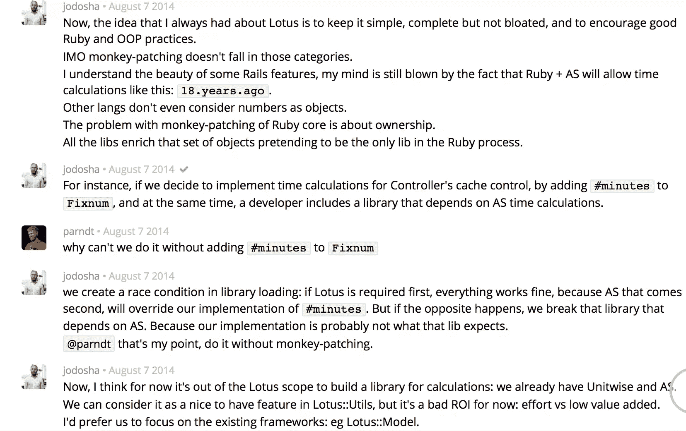

# 与 Lotus 解耦

> 原文：<https://www.sitepoint.com/decoupling-lotus/>


毫无疑问,“面向 DSL 的编程”这个术语可以适用于 Rails。

据 Lotus 网站*(不再提供)*介绍，Lotus 是一个 web 框架，旨在让 Ruby web 开发更加面向对象。Lotus 的特点是封装了 MVC 层，没有猴子补丁。

我们不会用 Lotus 开发应用程序，但我们会关注它的组成部分，看看它能提供什么。

Rails 的神奇是有原因的。当我们看到 Lotus 消除了许多这种魔力时，很容易产生怀疑。所以，试着保持开放的心态。

## 有什么不同

从表面上看，Lotus 最初看起来像另一个“模仿”框架，完成的事情就像 Rails 一样。但是正如我们将看到的，Lotus 还支持一种不那么固执己见、更面向对象的方法来构建应用程序。

Lotus 目前由几个 gem 组成，而不是一个框架:

*   `Lotus::Router`
*   `Lotus::Utils`
*   `Lotus::Validations`
*   `Lotus::Model`
*   `Lotus::View`
*   `Lotus::Controller`
*   `Lotus::Assets`(尚未正式成为框架的一部分)

宝石被设计成尽可能独立，所以如果你喜欢，你可以只使用`Lotus::Router`进行路由，使用[蒙哥](https://github.com/mongoid/mongoid)或[续作](https://github.com/jeremyevans/sequel)进行模型。

请记住，Lotus 还处于早期开发阶段，因此其中的一些内容可能会发生变化。

## Lotus::路由器

在 Rails 中，很容易忘记所有东西都要经过表面下的机架。另一方面，Lotus 就住在 Rack 附近的几栋房子里。

```
$ gem install lotus-router --version 0.2.0
$ gem install rack --version 1.6.0
```

Lotus 允许您在每条路线上放置不同的 Rack 应用程序。所以你可以让一个 sinatra 应用程序在“/dashboard”上持久化为 mongoid，让一个 camping 应用程序在“/posts”上持久化为 PostgreSQL。

这里有一个非常基础的 app，用的是`Lotus::Router`。

```
require 'lotus/router'
require 'rack'

@router = Lotus::Router.new
@router.get '/', to: ->(env) { [200, {}, ['Hello from Lotus']] }

def app(env)
@router.call(env)
end

Rack::Handler::WEBrick.run method(:app)
```

`env`是包含请求和服务器信息的散列。它是机架中间件系统的通用语言。

如果你愿意，`Lotus::Router`确实提供了一个非常**熟悉的** DSL。

```
Lotus::Router.new do
get '/', to: ->(env) { [200, {}, ['Hello World']] }
get '/some-rack-app', to: SomeRackApp.new
get '/posts', to: 'posts#index'
get '/posts/:id', to: 'posts#show'

mount Api::RackApp, at: '/api'

namespace 'admin' do
get '/users', to: AdminUsers::Index
end

resources 'users' do
member do
patch '/award'
end

collection do
get '/search'
end
end
end
```

## Lotus::模型

```
$ gem install lotus-model -- version 0.2.0
```

lotus 处理模型的方式可能是它最不神奇的地方。
目前，持久数据的情况分为:

*   `Lotus::Model::Entity`–定义属性(针对对象，而非表格)
*   `Lotus::Model::Repository`–在实体和持久层之间进行协调(这是您调用 CRUD 方法的地方)
*   `Lotus::Model::Mapper`–将实体与数据库细节分开
*   `Lotus::Model::Adapter`–实现持久性逻辑
*   `Lotus::Model::Adapters::SomeAdapter::Query`—
    适配器的查询实现
*   `Lotus::Model::Adapters::SomeAdapter::Command`–通过适配器
    中的查询
*   `Lotus::Model::Adapters::SomeAdapter::Collection`–适配器的插入/操作
    实施

大约 50 个小时的格雷格·波拉克指指点点。下面是系统
在实践中的样子:

```
require 'lotus/model'

class Post
include Lotus::Entity
attributes :title, :content
end

class PostRepository
include Lotus::Repository
end

Lotus::Model.configure do
adapter type: :sql, uri: 'postgres://localhost/database'

mapping do
collection :posts do
entity Post
respository PostRepository

attribute :id, Integer
attribute :title, String
attribute :content, String
end
end
end

Lotus::Model.load!

post = Post.new(title: 'First Post', content: 'This is my first post.')
post = PostRepository.create(post)

puts post.id # => 1

p = PostRepository.find(post.id)
p == post # => true
```

显而易见的问题:数据库模式怎么样？迁移，它们是如何工作的？

现在，你只能靠自己了。关于移民的最新信息是一张标记为“已计划”的特雷罗卡。在 gitter 中，提到了[续集](http://sequel.jeremyevans.net/rdoc/files/doc/migration_rdoc.html) gem 作为一种迁移方式，尽管你也可以将它用于整个模型。

## Lotus::验证

如果你没有，安装宝石。

```
$ gem install lotus-validations --version 0.2.2
```

Lotus 验证的工作方式类似于`ActiveRecord`,因为一个类指定了属性及其相关的验证。与`ActiveRecord`不同，Lotus 验证与持久性逻辑是分开的。这使得它很容易用于更广泛的事情。

```
require 'lotus/validations'

class User
include Lotus::Validations

attribute :name, format: /\A[a-zA-z]+\z/
end

robert = User.new(name: 'Robert')
puts robert.valid? # => true

invalid = User.new(name: '!Robert')
puts invalid.valid? # => false
```

注意，由于验证库不处理持久性，**唯一性验证没有被实现**。根据 Lotus 哲学，惟一性应该在数据库本身中强制执行( [MongoDB 示例](http://docs.mongodb.org/manual/tutorial/create-a-unique-index/))。

## Lotus::View

Lotus 视图层基于视图和模板分离的原则。Lotus 视图是对象，因此可以测试。

```
$ gem install lotus-view --version 0.3.0
```

您可能想知道视图对象会做什么。Lotus 视图承担了一些通常由 Rails 中的控制器处理的职责，比如呈现和数据共享。

下面是使用 Lotus 视图的样子:

```
require 'lotus/view'

module Posts
class Index
include Lotus::View
end

class XMLIndex < Index
format :xml
end
end

Lotus::View.configure do
root 'app/templates'
end

Lotus::View.load!

posts = PostRepository.all

# Uses Posts::Index and "posts/index.html.erb"
Posts::Index.render(format: :html, posts: posts)

# Uses Posts::XMLIndex and "posts/index.xml.erb"
Posts::Index.render(format: :xml, posts: posts)
```

## Lotus::控制器

在 Lotus 中，控制器只不过是包含一组动作的普通 Ruby 模块。

```
$ gem install lotus-controller --version 0.3.1
```

在 Rails 中，动作是控制器上的一个`method`。在 Lotus 中，一个`Action`是一个
对象。

```
require "lotus/controller"

class Show
include Lotus::Action

def call(params)
self.status = 210
self.body = 'Hello World'
self.headers.merge!({ 'X-Some-Custom-Header' => 'TRUDAT'})
end
end

show = Show.new
puts show.call({ some_param: 5}).inspect
# => [210, {"X-Some-Custom-Header"=>"TRUDAT", "Content-Type"=>"application/octet-stream; charset=utf-8"}, ["Hello World"]]
```

需要关注的主要动作方法是`#call`，它返回一个序列化的`Rack::Response`。

因为动作是对象，所以我们可以使用依赖注入来创建通用动作。结果是更容易创建**可测试的动作**。

```
require "lotus/controller"

class Show
include Lotus::Action

def initialize(repository = Post)
@repository = repository
end

def call(params)
@whatever = @repository.find params[:id]
end
end

show = Show.new(MemoryPostRepository)
show.call({ id: 5 })
```

Lotus 允许您提供类似 Rails 的`before_action`回调。只不过现在你是在动作中而不是在控制器中完成的。这似乎违背了初衷，但是您仍然希望在您的操作中使用可重用的方法，以防您希望将它们添加到其他操作中。例如，也许您有一个认证方法，您想通过包含一个 mixin 并在`before`中设置它来添加到一个动作中。

```
require "lotus/controller"
require "your_project/mixins/authentication

class Show
include Lotus::Action
include YourProject::Mixins::Authentication

before { authenticate! }

def call(params)
end
end
```

在 Rails 控制器中，操作通过设置实例变量和共享上下文来与视图共享数据。Lotus 通过`expose` DSL 命令实现了这一点。默认情况下，所有的 Lotus 动作都公开`#params`和`#errors`。

```
require "lotus/controller"

class Show
include Lotus::Action

expose :post

def call(params)
@post = Post.find params[:id]
end
end

action = Show.new
action.call({ id: 5 })

puts action.post.id # => 5
puts action.exposures # => { post: <a Post object> }
```

为了安全起见，Lotus actions 提供了允许参数的白名单。

```
require 'lotus/controller'

class Upload
include Lotus::Action

params do
param :title
param :content
end

def call(params)
puts params[:title] # => "The Foo in The Bar"
puts params[:l33texploit] # => nil
end
end
```

注意:您不需要在 Lotus actions 中进行任何呈现。渲染在视图中进行，如前一节所示。Lotus 控制器只是路由器的纯 HTTP 端点。

## Lotus::Utils

```
$ gem install lotus-utils --version 0.3.3
```

如果你用过 Ruby on Rails，那么你用过`ActiveSupport`。这个模块提供了这样的语法:

```
28.days.ago
```

目前，`Lotus::Utils`还不是 Rails 的`ActiveSupport`的 Lotus 等价物。它主要是各种数据类型增强的集合。需要注意的是**缺少猴子补丁**。

这是你此刻得到的:

*   `Lotus::Utils::String`–让你`#underscore`和`#demodulize`
*   `Lotus::Utils::PathPrefix`–子类`Lotus::Utils::String`
*   `Lotus::Utils::Class`–允许您从给定的
    名称空间按模式名加载类
*   `Lotus::Utils::Hash`——包装`Hash`并增加一些方法，如
    、`#stringify!`。
*   `Lotus::Utils::Attributes`–设置/获取一个 Lotus hash，其中所有的键都被
    强制转换为字符串(想想`ActiveSupport::HashWithIndifferentAccess`)，用`#to_h`执行深度复制
*   `Lotus::Utils::LoadPaths`–“加载路径的集合”(不确定
    这对我们到底有什么用，如果你知道，请留下评论)
*   `Lotus::Utils::Kernel`–包含类型强制方法
*   `Lotus::Utils::ClassAttributes`–“可继承的类级别变量
    访问器”
*   `Lotus::Utils::Callback`–存储和运行`procs`
*   `Lotus::Utils::Deprecation`–用于打印弃用信息

在`lotus-utils` gem 中，这些不同的组件将需要单独使用(除了一些相互依赖的情况)。

```
require 'lotus/utils/string'

puts Lotus::Utils::String.new('MyClass').underscore
# => 'my_class'
puts Lotus::Utils::String.new('Lotus::Utils::Hash').demodulize
# => 'Hash'
puts Lotus::Utils::String.new('my_class').classify
# => 'MyClass'
```

请注意，看起来目标并不是替换`ActiveSupport`。

下面是 gitter 上的一段对话，有人问维护者关于添加`ActiveSupport`风格的计算:



所以，如果你希望有一个`ActiveSupport`可以一点一点加载，而不是自动加载猴子补丁，看起来你必须等待。

## Lotus::资产

还没有正式发布，但是一个 0.0.0 版本的 gem 已经发布了。现在 [trello 路线图](https://trello.com/b/St5LwoII/lotus-for-ruby-roadmap)列出了
开发中的“资产助手”和“开发预编译器(CoffeeScript 和 SASS)”。

## 结论

Lotus 确实提出了一些有趣的观点。可能你们中的很多人都参加了“无猴子补丁”活动。另一方面，Rails 的魔力将男孩们带到了院子里。它真的需要被纯粹主义者修正吗？你决定吧。至少，如果 Rails 缺乏可测试性或可重用性让你感到沮丧，这就是你想要参与的项目。

路加·圭迪，Lotus 的创造者，在年初发布了这篇文章来讨论 Lotus 的路线图。绝对值得一读，去看看吧。

## 分享这篇文章