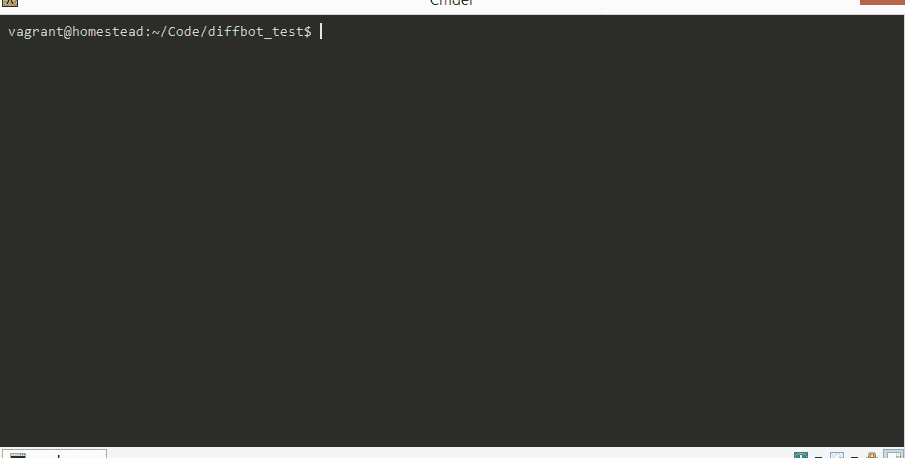
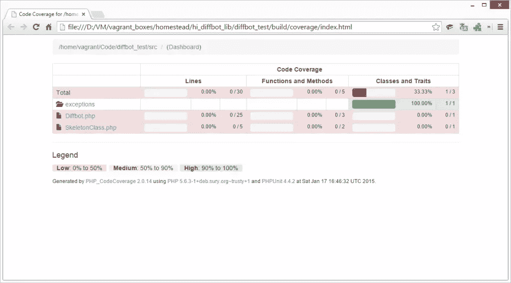
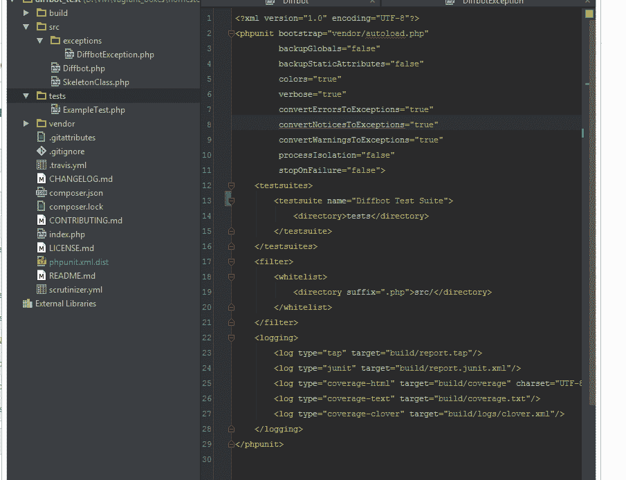
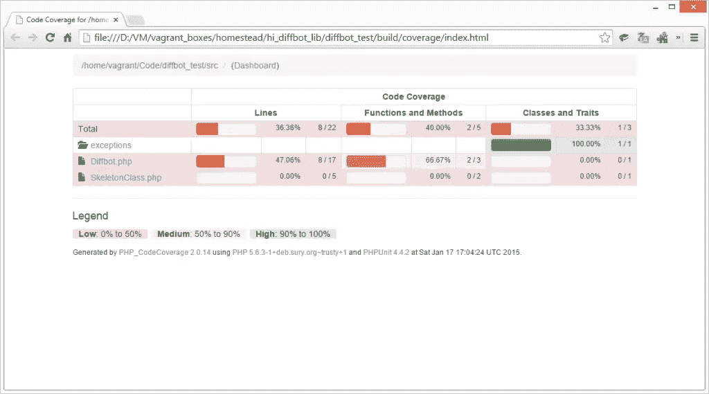
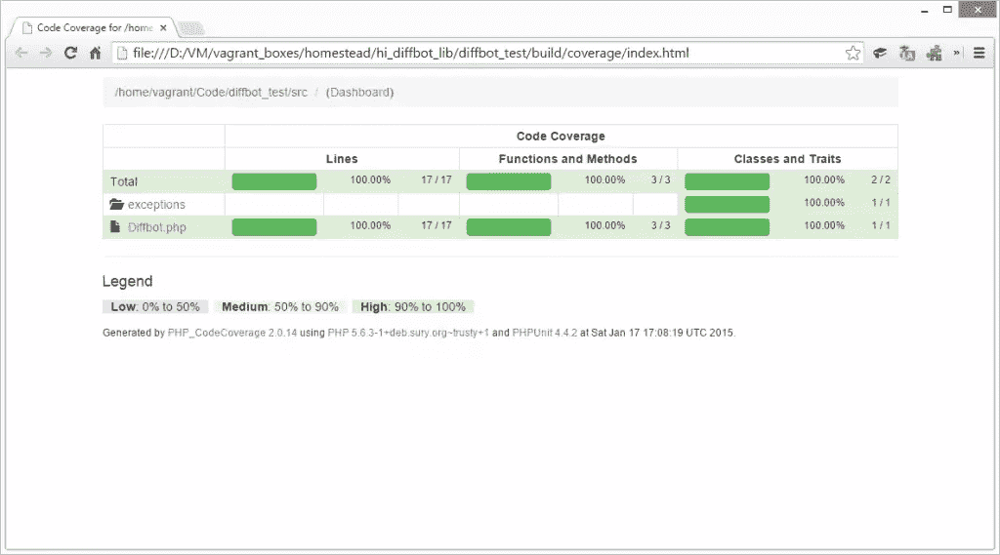
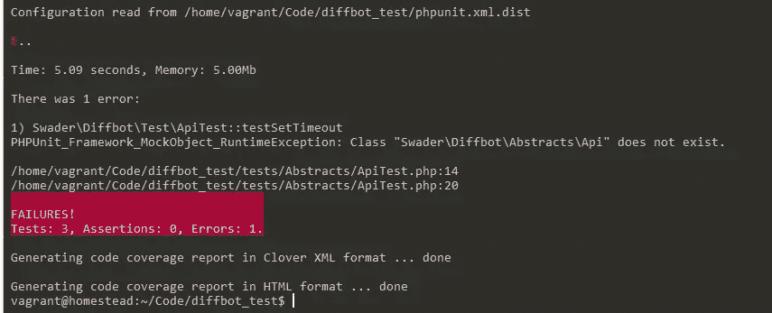
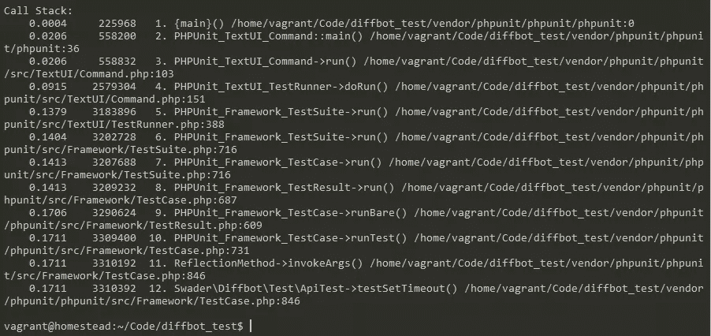
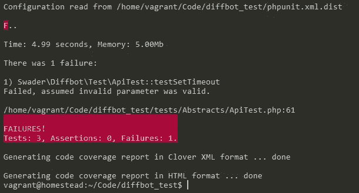

# 新 PHP 包中的基本 TDD

> 原文：<https://www.sitepoint.com/basic-tdd-new-php-package/>

在[第一部分](https://www.sitepoint.com/starting-new-php-package-right-way/)中，我们建立了自己的开发环境，加入了从[联盟](http://thephpleague.com/)继承的一些规则，并创建了两个简单但无用的类——`Diffbot`和`DiffbotException`。在这一部分，我们将从测试驱动开发开始。


如果你想继续学习，请阅读第 1 部分或者克隆本教程代码的第 1 部分分支。

## PHPUnit

我们之前已经在某种程度上介绍过 PHPUnit([1](https://www.sitepoint.com/getting-started-with-phpunit/)、 [2](https://www.sitepoint.com/tutorial-introduction-to-unit-testing-in-php-with-phpunit/) 、 [3](https://www.sitepoint.com/be-more-asssertive-getting-to-know-phpunits-assertions/) 、 [4](https://www.sitepoint.com/advanced-phpunit-testing-annotations-and-mocking/) 、 [5](https://www.sitepoint.com/unit-testing-guzzlephp/) 、 [6](https://www.sitepoint.com/blog/) )，但是现在是时候将它付诸实际了。首先，让我们检查它是否已安装。

```
php vendor/phpunit/phpunit/phpunit
```

运行这个命令应该会产生一个报告，表明一个测试通过了。这是默认包含在联盟框架中的测试，它断言`true`实际上是`true`。还将生成一个覆盖率报告，并放入构建文件夹中。



如果您在浏览器中打开这个覆盖率报告，您应该会看到我们的覆盖率得分很低。



既然我们已经确定 PHPUnit 可以工作，那么让我们测试一些东西。目前，我们的类中除了 getters 和 setters 之外，几乎没有其他类型的函数[通常不会被测试](http://stackoverflow.com/questions/6197370/should-unit-tests-be-written-for-getter-and-setters)。那么我们可以在当前的代码中测试什么呢？良好的..通过实例化提供的令牌的有效性如何？

首先，让我们看看 PHPUnit XML 配置文件，`phpunit.xml.dist`。把“联盟”这个词改成“Diffbot”之后，是这个样子的:

```
<?xml version="1.0" encoding="UTF-8"?>
<phpunit bootstrap="vendor/autoload.php"
         backupGlobals="false"
         backupStaticAttributes="false"
         colors="true"
         verbose="true"
         convertErrorsToExceptions="true"
         convertNoticesToExceptions="true"
         convertWarningsToExceptions="true"
         processIsolation="false"
         stopOnFailure="false">
    <testsuites>
        <testsuite name="Diffbot Test Suite">
            <directory>tests</directory>
        </testsuite>
    </testsuites>
    <filter>
        <whitelist>
            <directory suffix=".php">src/</directory>
        </whitelist>
    </filter>
    <logging>
        <log type="tap" target="build/report.tap"/>
        <log type="junit" target="build/report.junit.xml"/>
        <log type="coverage-html" target="build/coverage" charset="UTF-8" yui="true" highlight="true"/>
        <log type="coverage-text" target="build/coverage.txt"/>
        <log type="coverage-clover" target="build/logs/clover.xml"/>
    </logging>
</phpunit>
```

main 元素的属性告诉 PHPUnit 使其报告尽可能详细，并将所有类型的通知和错误转换为异常，以及其他一些典型的默认值，您可以在他们的网站上查看。然后，我们定义测试套件——适用于给定应用程序或场景的测试集。一个这样的套件是主应用程序套件(我们将使用的唯一套件)，我们称之为“Diffbot 测试套件”，将`tests`目录定义为测试的主机——您会注意到示例联盟测试已经在该目录中。我们还告诉 PHPunit 忽略`src/`目录中的所有 PHP 文件(我们只希望它运行测试，而不是我们的类)，最后，我们配置日志记录——它报告什么、如何报告以及报告到哪里。

让我们构建我们的第一个测试。在`tests`文件夹中，创建`DiffbotTest.php`。如果您使用 PhpStorm，这几乎是自动完成的:



记得检查`composer.json`中的名称空间是否与此匹配:

```
"autoload-dev": {
        "psr-4": {
            "Swader\\Diffbot\\Test\\": "tests/"
        }
    },
```

现在可以随意删除 ExampleTest(以及 SkeletonClass)，并用下面的代码替换 DiffbotTest 类的内容:

```
<?php

namespace Swader\Diffbot\Test;

use Swader\Diffbot\Diffbot;
use Swader\Diffbot\Exceptions\DiffbotException;

/**
 * @runTestsInSeparateProcesses
 */
class DiffbotTest extends \PHPUnit_Framework_TestCase
{

    public function invalidTokens()
    {
        return [
            'empty'        => [ '' ],
            'a'            => [ 'a' ],
            'ab'           => [ 'ab' ],
            'abc'          => [ 'abc' ],
            'digit'        => [ 1 ],
            'double-digit' => [ 12 ],
            'triple-digit' => [ 123 ],
            'bool'         => [ true ],
            'array'        => [ ['token'] ],
        ];
    }

    public function validTokens()
    {
        return [
            'token'      => [ 'token' ],
            'short-hash' => [ '123456789' ],
            'full-hash'  => [ 'akrwejhtn983z420qrzc8397r4' ],
        ];
    }

    /**
     * @dataProvider invalidTokens
     */
    public function testSetTokenRaisesExceptionOnInvalidToken($token)
    {
        $this->setExpectedException('InvalidArgumentException');
        Diffbot::setToken($token);
    }

    /**
     * @dataProvider validTokens
     */
    public function testSetTokenSucceedsOnValidToken($token)
    {
        Diffbot::setToken($token);
        $bot = new Diffbot();
        $this->assertInstanceOf('\Swader\Diffbot\Diffbot', $bot);
    }
}
```

在这个极其简单的例子中，我们测试了`Diffbot::setToken`静态方法。我们使用 PHPUnit 的 DataProvider 语法在一个循环中自动输入值(非常感谢[马修·威尔·奥芬尼](http://mwop.net)纠正了我的错误)。这也让我们知道测试时哪个键失败了，而不仅仅是期望或不期望出现异常。如果我们现在运行测试并查看覆盖率，我们应该会看到类似这样的内容:



我身上的成就瘾触发了，突然我想尽可能多地看到绿色。让我们测试实例化:

```
public function testInstantiationWithNoGlobalTokenAndNoArgumentRaisesAnException()
    {
        $this->setExpectedException('\Swader\Diffbot\Exceptions\DiffbotException');
        new Diffbot();
    }

    public function testInstantiationWithGlobalTokenAndNoArgumentSucceeds()
    {
        Diffbot::setToken('token');
        $bot = new Diffbot();
        $this->assertInstanceOf('Swader\Diffbot\Diffbot', $bot);
    }

    public function testInstantiationWithNoGlobalTokenButWithArgumentSucceeds()
    {
        $bot = new Diffbot('token');
        $this->assertInstanceOf('Swader\Diffbot\Diffbot', $bot);
    }
```

这些方法涵盖了构造函数的所有情况——没有标记和没有全局设置标记的实例化，有全局设置标记的实例化，以及只有标记参数的实例化。然而，运行测试，我们会看到它失败了。发生这种情况是因为 Diffbot 类仍然有来自前一个测试的静态属性集，因此在第二个测试中使用时不缺少默认的静态令牌。这是测试全局和静态的一个常见问题。为了解决这个问题，我们将确保我们在`DiffbotTest`类中的每个测试都在一个单独的进程中执行。这执行起来会慢很多，但是可以确保每个环境都是新鲜的，没有被污染。

在类声明上方添加以下注释，如下所示:

```
/**
 * @runTestsInSeparateProcesses
 */
class DiffbotTest extends \PHPUnit_Framework_TestCase
```

现在，如果您运行测试并查看覆盖率，您会发现我们是 100%绿色的！



这是一种反模式，如果需要单独的测试过程，通常表明类的设计有问题，但是我还没有找到更好的方法来测试这一点。Diffbot 类中的静态属性应该是可变的，以便于使用——如果你有改进的建议，我洗耳恭听。解决这个问题的另一种方法是构建一个`reset`方法或一些额外的 setters，您可以使用它们手动地将类返回到它的初始状态，但是我避免了这种方法，以免测试相关的逻辑污染我的类。据说，这也可以用[backupstationattributes](http://stackoverflow.com/questions/4264629/backup-and-restore-operations-for-static-class-attributes-in-php)来解决，但是到目前为止我还没有成功。

## TimeDivisionDuplex 时分双工

在 TDD 中，通常应该考虑功能，然后测试它(并失败)，然后实现它，使它工作。这就是测试*驱动*你的开发的地方，因此，*测试驱动开发*。这正是我们在这一部分要做的。

Diffbot 作为一项服务，提供了几个默认的 API:

*   *文章 API* 从新闻和博客文章等文章类型的内容中提取结构化数据
*   *产品 API* 提取关于产品的信息。将它发送到产品链接，它会拉价格，可用性，规格，等等。
*   Image API 获取一个图像的信息，或者一组图像的信息，如果你传递给它一个链接到一个有几个图像的页面
*   *分析 API* 自动确定使用上面三个 API 中的哪一个，自动应用。当给定一个 URL 时，它试图使用产生最多信息的方法。
*   *视频*和*讨论*API 仍在开发中。视频与*图像 API* 相同，但用于视频文件，而*讨论*可以从论坛、各种网站和社交网络帖子的评论部分等提取对话线索。

从文档中可以看出，每个 API 都返回类似的响应(都返回有效的 JSON)，但是返回的字段大多不同。这就是我如何将 Diffbot 类视为最终产品——它为每种 API 类型都提供了方法，而每种 API 类型都是我们尚未开发的独立类。这些 API 类都扩展了一个抽象 API 类，其中包含公共字段的设置器，但是每个 API 类本身也包含自己的可设置字段。简而言之，我想让以下方法成为可能:

```
$diffbot = new Diffbot('myToken');

$productAPI = $diffbot->createProductAPI('http://someurl.com');
$productAPI
    ->setTimeout(3000)
    ->setFields(['prefixCode', 'productOrigin']);
$response = $productAPI->call();

// OR, LIKE THIS

$response = $diffbot
    ->createProductAPI('http://someurl.com')
    ->setTimeout(0)
    ->setPrefixCode(true)
    ->setProductOrigin(true)
    ->setHeaderCookie(['key' => 'value', 'key2' => 'value2'])
    ->call();
```

### 测试抽象类

要创建 API 子类，我们需要一个通用的 API 抽象类来扩展。但是我们如何在不扩展抽象类的情况下测试它们呢？用[测试替身](https://phpunit.de/manual/current/en/test-doubles.html)。你可能知道，你不能单独实例化一个抽象类——它需要被扩展。因此，如果一个抽象类不能被实例化，就没有办法测试它的具体方法——那些被所有子类继承的方法。test double 可以用来制作一个扩展抽象类的假版本，然后只用来测试抽象类的具体方法。最好给你举个例子。让我们假设我们的 API 抽象将有一个方法`setTimeout`用于在 Diffbot 端设置 API 请求超时。我们还假设从 0 到 max int 的任何数都是有效的。按照真正的 TDD 方式，让我们用内容制作文件`tests/Abstracts/ApiTest.php`:

```
<?php

namespace Swader\Diffbot\Test;

use Swader\Diffbot\Abstracts\Api;

class ApiTest extends \PHPUnit_Framework_TestCase
{
    /**
     * @return \PHPUnit_Framework_MockObject_MockObject
     */
    private function buildMock()
    {
        return $this->getMockForAbstractClass('Swader\Diffbot\Abstracts\Api');
    }

    public function validTimeouts()
    {
        return [
            'zero' => [0],
            '1000' => [1000],
            '2000' => [2000],
            '3000' => [3000],
            '3 mil' => [3000000],
            '40 mil' => [40000000]
        ];
    }

    public function invalidTimeouts()
    {
        return [
            'negative_big' => [-298979879827],
            'negative_small' => [-4983],
            'string ' => ['abcef'],
            'empty string' => [''],
            'bool' => [false]
        ];
    }

    public function testSetEmptyTimeoutSuccess()
    {
        /** @var Api $mock */
        $mock = $this->buildMock();
        $mock->setTimeout();
    }

    /**
     * @dataProvider invalidTimeouts
     */
    public function testSetTimeoutInvalid($timeout)
    {
        /** @var Api $mock */
        $mock = $this->buildMock();
        $this->setExpectedException('InvalidArgumentException');
        $mock->setTimeout($timeout);
    }

    /**
     * @dataProvider validTimeouts
     */
    public function testSetTimeoutValid($timeout)
    {
        /** @var Api $mock */
        $mock = $this->buildMock();
        $mock->setTimeout($timeout);
    }
}
```

我们定义了一些数据提供者，就像在第一个测试类中一样。然后，我们有了一个创建模拟的方法，所以我们可以在需要的时候调用它。接下来，我们为每个场景制定一个测试方法——无超时参数、坏参数和好参数。只有坏人才会期待例外。

如果我们现在运行这个测试，我们将得到一个错误:



这一点也不奇怪——毕竟，我们还没有添加 API 类！用以下内容创建文件`src/Abstracts/Api.php`:

```
<?php

namespace Swader\Diffbot\Abstracts;

/**
 * Class Api
 * @package Swader\Diffbot\Abstracts
 */
abstract class Api
{

}
```

现在运行测试会产生一个新错误:



哇哦！我们打破了 PHPUnit！开玩笑的，我们很好。它抱怨没有一个`setTimeout()`方法，这是测试中所期望的 mock 应该有。还是换`Api.php`吧。

```
<?php

namespace Swader\Diffbot\Abstracts;

/**
 * Class Api
 * @package Swader\Diffbot\Abstracts
 */
abstract class Api
{
    /** @var int Timeout value in ms - defaults to 30s if empty */
    private $timeout = 30000;

    public function setTimeout($timeout = null)
    {
        $this->timeout = $timeout;
    }
}
```

重新运行测试，我们得到:



现在我们有进展了。让我们最后实现一下我们想要的功能。我们编辑`setTimeout`方法的主体，就像这样:

```
/**
     * Setting the timeout will define how long Diffbot will keep trying
     * to fetch the API results. A timeout can happen for various reasons, from
     * Diffbot's failure, to the site being crawled being exceptionally slow, and more.
     * 
     * @param int|null $timeout Defaults to 30000 even if not set
     *
     * @return $this
     */
    public function setTimeout($timeout = null)
    {
        if ($timeout === null) {
            $timeout = 30000;
        }
        if (!is_int($timeout)) {
            throw new \InvalidArgumentException('Parameter is not an integer');
        }
        if ($timeout < 0) {
            throw new \InvalidArgumentException('Parameter is negative. Only positive timeouts accepted.');
        }

        $this->timeout = $timeout;
        return $this;
    }
```

除了逻辑之外，我们还添加了一个 docblock，让函数返回我们正在使用的类的实例，这样我们就可以链接方法了。重新做测试，应该都能通过。事实上，如果我们看覆盖报告，我们应该是 100%绿色的。


## 结论

在第 2 部分中，我们通过介绍 PHPUnit 并使用它来开发我们包的一些功能，开始了我们的 TDD 之旅。你可以从这个分支的[下载第 2 部分的完整代码(包括第 1 部分的代码)。在下一部分中，我们将继续使用这里描述的方法构建包，并且我们将添加一个新的方面——数据模拟。敬请期待！](https://github.com/Swader/diffbot-php-client/tree/part2-end)

## 分享这篇文章