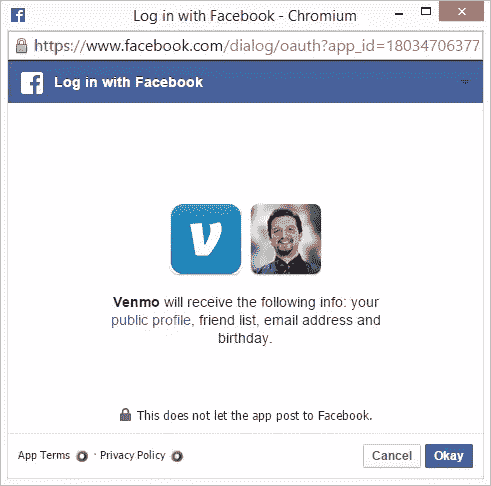
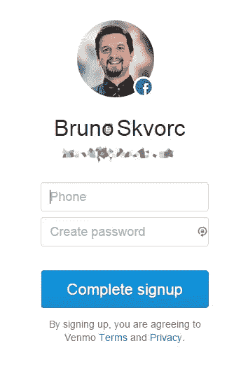
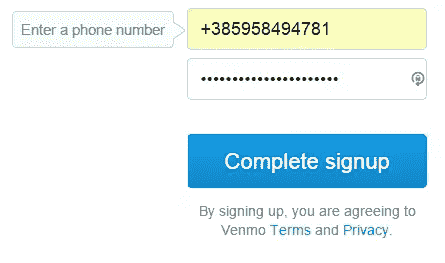
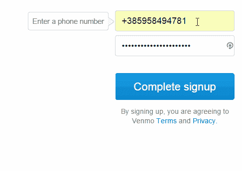
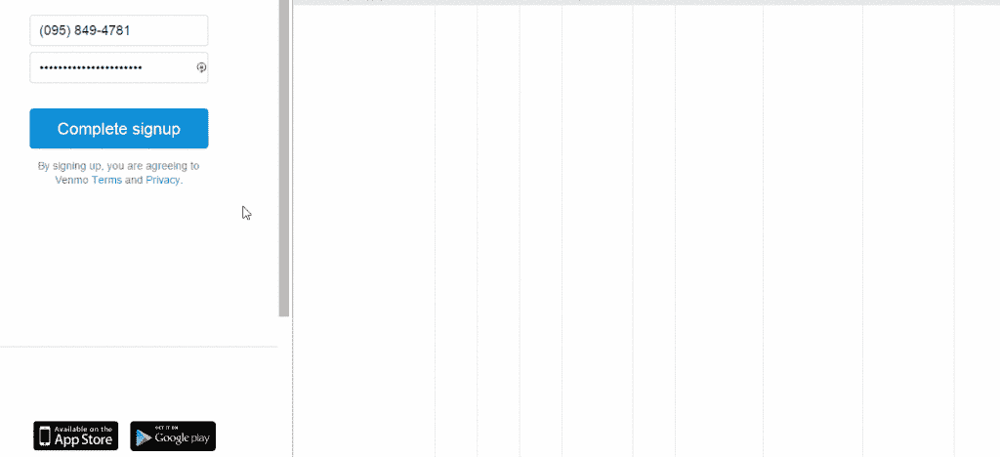

# 3 种常见的 UX 失态及其应对方式

> 原文：<https://www.sitepoint.com/3-common-ux-gaffes-ways-around/>

不久前，我试图注册 Venmo T1，这是一项承诺简化个人之间在线支付的服务。我说试过是因为文莫只对我们开放。然而，这个限制暴露了我以前在其他网站上看到的一些 UX 的严重缺陷。我将在这篇文章中讨论的所有三个缺陷都非常容易修复，因此我经常对一些公司花这么长时间来修复它们感到惊讶。让我们一个一个地看。

请注意，虽然我将在本文中使用 Venmo 作为案例研究，但他们并不是唯一犯这些错误的人——这些问题也适用于广泛的其他网站和服务。

## 需要密码的社交登录

登陆他们的主页后，我选择用脸书注册。我通常不这样做，但我没有心情为此创建一个新帐户，即使我使用密码管理器，只需点击几下。我点击了“注册脸书”按钮，


向社交网络认证…



还有…



什么？密码？

### 问题是

这里的问题是，我选择了“登录脸书”，而不是“在我们这里创建一个帐户，并将其链接到你的脸书帐户”——注意到区别了吗？脸书的“登录”是为了帮助用户*跳过*创建账户的过程，从而提高转化率和你网站的注册人数，因为用户跳过了这个障碍。考虑到应用程序现在将拥有关于他们的信息，大多数人在登录 FB 时都会担心隐私问题，但聪明的人通常不会在脸书上保留敏感信息，因此跳过注册过程的好处通常会超过潜在的隐私问题。

这种情况下的问题是，这是一种“两败俱伤”的情况。应用程序现在不仅可以访问你的 FB 数据，还需要你手动注册。它实际获取的唯一数据是你的姓名和电子邮件。

我们可以忽略应用程序要求电话号码的事实，因为该信息不能通过脸书 API 获得。

### 解决方案

解决方案很简单:你像往常一样认证，如果用户来自脸书，就跳过密码生成步骤。如果您的架构不允许空的密码字段，那么随机生成一个——无论如何都不会使用它，因为您将使用从 FB 获得的访问令牌。做这件事的[文档也非常简单。](https://developers.facebook.com/docs/facebook-login/login-flow-for-web/v2.2)

## 错误报告者

好了，注册流程已经完成，假设我们生成了一个密码，输入我们的电话号码，然后点击“完成注册”:



嗯，好吧，可能是被+号困扰了。让我们手动输入，而不是通过自动填充，尽管如果他们的应用程序被浏览器的自动填充所困扰，他们应该在表单上加上“自动填充=关闭”。



发生什么事了？没人知道。首先，它拒绝让我们输入完整的号码，所以我们跳过国家代码，只输入其余的号码，希望以后它能让我们选择国家。但之后它会旋转起来，回到初始状态。没有错误报告，没有成功报告，什么都没有。让我们检查一下开发工具。



哎哟！

### 问题是

错误被适当地返回，但是前端甚至不检查它。所有的都在那里——一个完全详细的错误消息等等——但是它从来没有被前端使用过。输入字段没有突然出现，没有弹出窗口，什么都没有。没有什么可以告诉最终用户的。

### 解决方案

解决方案还是很简单。在调用`/users/v5`端点的 JS 中，查找错误节点:

```
var returned_data =  // returned data  if  (returned_data.error.errors.length >  0)  {  // Errors exist - show them!  }
```

## 无声的乡村禁令

这给我们带来了最后的 UX 失误。我们上面发现的错误消息告诉我们，我们需要一个美国电话号码来使用 Venmo。

### 问题是

现在查看帮助中心，我们可以看到该服务不仅要求您有一个美国电话号码，还要求您位于美国——这一点在登录页面上没有提到——这是任何面向网络的公司最重要的网页。如果你的公司在网络上是公开的，如果它利用网络赚钱，但不是所有的网络用户都可以使用，你绝对**必须**让人们在第一次打开你的网站时知道它。

### 解决方案

解决方案是通过像 [GeoIP](http://dev.maxmind.com/geoip/geoip2/javascript/) 这样的工具，在页面打开时检查访问者的 IP，如果返回的国家不在批准的国家列表中(显然，除了我们之外的任何国家)，所有需要做的就是建立一个好看的标题栏，上面写着类似*“看起来你正在访问一个我们还不支持的国家，请稍后再与我们联系？”*用户友好、信息丰富、平易近人、有吸引力——与其让你的用户一头撞上砖墙，想知道发生了什么，不如让他们慢慢失望，或许开始为潜在的未来关系打下基础。

当然，这种方法没有涵盖那些使用代理和类似的边缘情况，但它确实涵盖了一个不可忽视的巨大的潜在用户群。记住——你还没有服务的顾客也是顾客。

*注意:在 Venmo 上，粘贴一个带加号的数字，比如`+95555555`会在表单上方弹出一个友好的国家禁令窗口，但是由于你只能将`+`符号粘贴到字段中而不能输入，所以我无法通过其他方式复制它。*

## 结论

在这篇文章中，我们研究了三种常见的 UX 错误以及简单修复它们的方法。这些解决方案中的每一个都可以在不到一天的时间内完全应用和部署，即使是在最严格的开发环境中，因此用它们来问候应用程序的用户是不可原谅的。作为网络开发者，我们应该，不，我们必须做得更好——这是我们对用户的责任！

你以前遇到过这些问题吗？你能列出任何其他的吗？让我们知道！

## 分享这篇文章