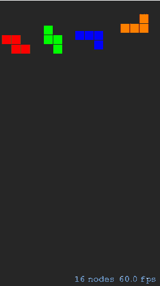
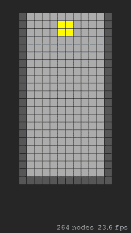

# 使用 Swift 创建一个俄罗斯方块益智游戏

> 原文：<https://www.sitepoint.com/create-tetromino-puzzle-game-using-swift-gameplay/>

仅用最简单的机制，我们的游戏将能够提供具有高重放价值的引人入胜的游戏性。再看一遍介绍中的游戏动画，我们可以很容易地识别出这些规则中的大部分。其中最明显的包括关于坠落、运动和碰撞的规则。我们也有关于解围、得分和拉平的规则。现在让我们从下落规则开始实现它们。

### 投掷多米诺骨牌

我们游戏的世界利用了自己独特的重力。它明显不同于其他游戏中典型的重力模拟，后者产生一种平滑、加速的下落效果。在我们的游戏中，俄罗斯方块以恒定的速度一次落下一行，该速度仅在关卡增加时增加。这意味着我们不能依靠 SpriteKit 的默认物理引擎来模拟重力，所以我们必须手动控制和计时每一次 tetromino 下降。

用下面代码中的新属性和方法更新`GameScene`类，以启用我们的自定义 gravity。保留标记有`---`的现有代码。

```
---
  let defaultSpeed = NSTimeInterval(1200)

  class GameScene: SKScene {
    var dropTime = defaultSpeed
    var lastUpdate:NSDate?

      override func didMoveToView(view: SKView) {
          /* Setup your scene here */
          self.anchorPoint = CGPoint(x: 0, y: 1.0)
          lastUpdate = NSDate()
      }

      override func touchesBegan(touches: NSSet, withEvent event: UIEvent) {---}

      override func update(currentTime: CFTimeInterval) {
          /* Called before each frame is rendered */
          if lastUpdate != nil {
              let elapsed = lastUpdate!.timeIntervalSinceNow * -1000.0
              if elapsed > dropTime {
                  moveTetrominoesDown()
              }
          }
      }

      func drawTetrominoAtPoint(location: CGPoint) {---}

      func moveTetrominoesDown() {
          let squares = self.children as [SKSpriteNode]
          for square in squares {
              square.position.y += CGFloat(-blockSize)
          }
          lastUpdate = NSDate()
      }
  }
```

我们将在下一节讨论这个代码。现在，运行( **⌘ + R** )我们的游戏，触摸模拟器屏幕上的任何地方，绘制一个随机的俄罗斯方块，它每 1200 毫秒立即开始下落一行。你有没有注意到当四张多米诺骨牌落在屏幕之外时，节点的数量在减少？与您看到的相反，这些节点实际上仍在内存中。仍然是场景节点树的一部分，在后台活跃并消耗宝贵的资源。节点计数器仅显示场景中可见节点的数量。



这不是我们想要的游戏行为。我们想要的是让四骨牌落在一个平台上，而不是掉到屏幕之外。处理碰撞将帮助我们实现这一目标。

### 冲突检出

我们现在进入了游戏逻辑中更具挑战性的部分，碰撞检测。SpriteKit 有很好的基于物理的碰撞处理，但我们现在不打算利用它。相反，我们将实现我们自己的简单的基于数组的碰撞检测。

按照以下步骤更新我们的**games scene . swift**文件。同样，保持现有代码标有`---`。

1.  添加一个新的位图值来表示游戏区域(或游戏板),游戏区域两边有墙，地板上有砖块。

```
import SpriteKit

let colors: [SKColor] = [---]

let gameBitmapDefault: [[Int]] = [
    [8, 0, 0, 0, 0, 0, 0, 0, 0, 0, 0, 8],
    [8, 0, 0, 0, 0, 0, 0, 0, 0, 0, 0, 8],
    [8, 0, 0, 0, 0, 0, 0, 0, 0, 0, 0, 8],
    [8, 0, 0, 0, 0, 0, 0, 0, 0, 0, 0, 8],
    [8, 0, 0, 0, 0, 0, 0, 0, 0, 0, 0, 8],
    [8, 0, 0, 0, 0, 0, 0, 0, 0, 0, 0, 8],
    [8, 0, 0, 0, 0, 0, 0, 0, 0, 0, 0, 8],
    [8, 0, 0, 0, 0, 0, 0, 0, 0, 0, 0, 8],
    [8, 0, 0, 0, 0, 0, 0, 0, 0, 0, 0, 8],
    [8, 0, 0, 0, 0, 0, 0, 0, 0, 0, 0, 8],
    [8, 0, 0, 0, 0, 0, 0, 0, 0, 0, 0, 8],
    [8, 0, 0, 0, 0, 0, 0, 0, 0, 0, 0, 8],
    [8, 0, 0, 0, 0, 0, 0, 0, 0, 0, 0, 8],
    [8, 0, 0, 0, 0, 0, 0, 0, 0, 0, 0, 8],
    [8, 0, 0, 0, 0, 0, 0, 0, 0, 0, 0, 8],
    [8, 0, 0, 0, 0, 0, 0, 0, 0, 0, 0, 8],
    [8, 0, 0, 0, 0, 0, 0, 0, 0, 0, 0, 8],
    [8, 0, 0, 0, 0, 0, 0, 0, 0, 0, 0, 8],
    [8, 0, 0, 0, 0, 0, 0, 0, 0, 0, 0, 8],
    [8, 0, 0, 0, 0, 0, 0, 0, 0, 0, 0, 8],
    [8, 0, 0, 0, 0, 0, 0, 0, 0, 0, 0, 8],
    [8, 8, 8, 8, 8, 8, 8, 8, 8, 8, 8, 8]
]
```

1.  添加自定义绘图和碰撞检测所需的新数据。

```
class GameScene: SKScene {
    var dropTime = defaultSpeed
    var lastUpdate:NSDate?

    let gameBoard = SKSpriteNode()
    var activeTetromino = Tetromino()

    var gameBitmapDynamic = gameBitmapDefault
    var gameBitmapStatic = gameBitmapDefault

    ---
}
```

`gameBoard`常量将包含由`gameBitmapDefault`定义的代表游戏面板的精灵。我们使用`activeTetromino`变量来代表当前落下的砖块。不像在前面的例子中，我们允许任何数量的砖块落下，我们现在限制它只有一个。

这意味着为了一致性和正确性，我们必须将`moveTetrominoesDown`方法重命名为`moveTetrominoDown`。*趁你还没忘记*，现在就做吧。

我们添加了两个数组值来表示游戏板的两种不同状态。两者都用默认的游戏位图初始化。一个状态将包含所有落地的砖块，包括掉落的砖块，而另一个状态将包含除掉落的砖块之外的同一组砖块。这项技术将有助于我们以后更新场景。

1.  我们开始布置场景吧。用以下代码更新`didMoveToView`方法:

```
class GameScene: SKScene {
    ---

    override func didMoveToView(view: SKView) {
        /* Setup your scene here */
        self.anchorPoint = CGPoint(x: 0, y: 1.0)

        gameBoard.anchorPoint = CGPoint(x: 0, y: 1.0)
        for col in 0..<gameBitmapDefault[0].count {
            for row in 0..<gameBitmapDefault.count {
                let bit = gameBitmapDefault[row][col]
                let square = SKSpriteNode(color: colors[bit], size: CGSize(width: blockSize, height: blockSize))
                square.anchorPoint = CGPoint(x: 0, y: 0)
                square.position = CGPoint(x: col * Int(blockSize) + col, y: -row * Int(blockSize) + -row)
                gameBoard.addChild(square)
            }
        }

        let gameBoardFrame = gameBoard.calculateAccumulatedFrame()
        gameBoard.position = CGPoint(x: CGRectGetMidX(self.frame) - gameBoardFrame.width / 2, y: -125)
        self.addChild(gameBoard)

        centerActiveTetromino()
        refresh()
        lastUpdate = NSDate()
    }

    ---
}
```

将场景的锚点设置到左上角后，我们通过解析`gameBitmapDefault`常量中存储的整数来绘制游戏板。为了方便起见，游戏板的定位点也被设置在左上角。我们以前在绘制四骨牌的章节中见过这个嵌套的`for in`循环代码。现在我们应用同样的技术来绘制整个游戏板。

在创建了代表游戏棋盘每个方块的精灵之后，我们通过调用它的`calculateAccumulatedFrame`方法来检索游戏棋盘的框架。我们不能依赖游戏板的`frame`属性，因为它只会返回一个维度为零的框架。我们想要的是获得游戏棋盘所有子节点的累积宽度和高度，实现这一点的唯一方法是使用`calculateAccumulatedFrame`方法进行计算。得到这个值后，我们现在可以在场景中水平居中游戏板。最后，为了显示游戏板，我们需要将其添加为当前场景的子节点。

我们现在通过调用一个名为`centerActiveTetromino`的自定义方法将活动的俄罗斯方块的位置设置为游戏板的中间。继续将此方法添加到`didMoveToView`方法之后:

```
class GameScene: SKScene {
    ---

    override func didMoveToView(view: SKView) {---}

    func centerActiveTetromino() {
        let cols = gameBitmapDefault[0].count
        let brickWidth = activeTetromino.bitmap[0].count
        activeTetromino.position = (cols / 2 -  brickWidth, 0)
    }
}
```

这里的 tetromino 的位置值不包含普通的`CGPoint`坐标。相反，它保存一个简单的元组值，该值引用游戏棋盘位图中将要放置 tetromino 的行和列的编号。

在设置了我们活动的 tetromino 的位置后，我们需要通过修改精灵和位图值来更新游戏板。我们创建了一个名为`refresh`的便利方法来处理这个问题。此方法调用另外两个执行实际繁重工作的自定义方法。现在将这三个新方法添加到`GameScene`类中:

```
class GameScene: SKScene {
    ---

    func refresh() {
        updateGameBitmap()
        updateGameBoard()
    }

    func updateGameBitmap() {
        gameBitmapDynamic.removeAll(keepCapacity: true)
        gameBitmapDynamic = gameBitmapStatic

        for row in 0..<activeTetromino.bitmap.count {
            for col in 0..<activeTetromino.bitmap[row].count {
                if activeTetromino.bitmap[row][col] > 0 {
                    gameBitmapDynamic[activeTetromino.position.y + row][activeTetromino.position.x + col + 1] = activeTetromino.bitmap[row][col]
                }
            }
        }
    }

    func updateGameBoard() {
        let squares = gameBoard.children as [SKSpriteNode]
        var currentSquare = 0

        for col in 0..<gameBitmapDynamic[0].count {
            for row in 0..<gameBitmapDynamic.count {
                let bit = gameBitmapDynamic[row][col]
                let square = squares[currentSquare]
                if square.color != colors[bit] {
                    square.color = colors[bit]
                }
                ++currentSquare
            }
        }
    }
}
```

在`updateGameBitmap`方法中，我们使用了之前声明的两个位图变量，`gameBitmapDynamic`和`gameBitmapStatic`。该方法的主要目的是用活动的 tetromino 的新位置更新场景。我们应用的技术是用静态位图替换动态位图，暂时删除活动的 tetromino。最后，我们再次应用嵌套的`for in`循环技术，将活动的四分图及其新位置插入到动态位图中。

另一方面,`updateGameBoard`方法处理更新实际的精灵。精灵是一个图形元素，代表游戏中的一个方块。我们已经在我们的`didMoveToView`方法中创建了这些精灵，所以我们只需要根据添加的 tetrominoes 更新它们的颜色。我们使用相同的`for in`循环技术来解析每个位图，并使用其值从`colors`数组中检索正确的颜色。

1.  暂时清除触摸事件处理程序。这意味着我们不会再使用`drawTetrominoAtPoint`方法，所以继续从你的代码中移除它。

    ```
    class GameScene: SKScene {
        ---

        override func touchesBegan(touches: NSSet, withEvent event: UIEvent) {
            /* Called when a touch begins */
        }
    }
    ```

2.  我们在每次帧更新期间处理砖块掉落，但是我们通过检查自上次掉落事件以来经过的时间来控制砖块掉落的速度。然后，我们调用新重命名的`moveTetrominoDown`方法将活动的 tetromino 下移一个块。

```
class GameScene: SKScene {
    ---

    override func update(currentTime: CFTimeInterval) {
        /* Called before each frame is rendered */
        if lastUpdate != nil {
            let elapsed = lastUpdate!.timeIntervalSinceNow * -1000.0
            if elapsed > dropTime {
                moveTetrominoDown()
            }
        }
    }
}
```

现在让我们更新`moveTetrominoDown`方法来处理着陆事件。

```
class GameScene: SKScene {
    ---

    override func update(currentTime: CFTimeInterval) {---}

    func moveTetrominoDown() {
        if landed() {
            gameBitmapStatic.removeAll(keepCapacity: true)
            gameBitmapStatic = gameBitmapDynamic

            activeTetromino = Tetromino()
            centerActiveTetromino()
        } else {
            activeTetromino.moveTo(.Down)
        }

        lastUpdate = NSDate()
        refresh()
    }
}
```

首先，我们通过调用`landed`来检查砖块是否落在了另一块砖块上或地板上。我们为检测冲突创建的这个定制方法返回一个`Bool`。我们来讨论一下什么是布尔值。

#### 布尔值

在 Swift 中，`Bool`是一个非常简单的值，由`true`或`false`表示，除此之外别无其他。在其他语言中，布尔值可以用整数表示，零为假，非零值为真。也可以用一个物体的存在与否来表示。

Swift 不是这样的，因为它的类型安全特性不允许布尔值保存任何其他值，比如整数。布尔值必须只计算两个值中的一个，所以使用简写符号`if someInt`检查某个整数是否为非零将不起作用。条件的计算结果必须是布尔值，因此应该写成:

```
if someInt == 0 {
    // Do something
}
```

现在让我们在`moveTetrominoDown`方法的旁边添加`landed`方法。

```
class GameScene: SKScene {
    ---

    func moveTetrominoDown() {---}

    func landed() -> Bool {
        let x = activeTetromino.position.x
        let y = activeTetromino.position.y + 1
        for row in 0..<activeTetromino.bitmap.count {
            for col in 0..<activeTetromino.bitmap[row].count {
                if activeTetromino.bitmap[row][col] > 0 &amp;&amp; gameBitmapStatic[y + row][x + col + 1] > 0 {
                    return true
                }
            }
        }
        return false
    }
}
```

我们使用*返回箭头- >* 后跟要返回的类型名称来指示返回类型，在本例中是`Bool`。

接下来，我们获得活动的 tetromino 的位置，但是具有一个低于一个块的`y`值。这表示活动方块图下的区域，可能不仅包括地板，还包括其他砖块。

我们遍历活动的俄罗斯方块，检查它是否与游戏中已经存在的方块重叠，如`gameBitmapStatic`所示。如果是，我们立即停止循环并返回`true`。循环继续，直到所有的块都被检查，如果没有检测到冲突，我们返回`false`。

回到`moveTetrominoDown`方法，如果`landed`返回 true，我们更新静态位图以包含活动的俄罗斯方块，它已经成为我们游戏中非移动(或静态)实体的一部分。我们通过用动态位图的值覆盖静态位图来实现这一点。然后，我们创建一个新的活动的 tetromino 来替换最近登陆的 tetromino。我们将这个时刻的时间戳保存在`lastUpdate`中，以备下次更新时查看。如果没有碰撞，我们将激活的方块向下移动一个街区。在所有这些都完成之后，我们执行一个`refresh`来用活动的 tetromino 的新位置更新位图值和精灵。

运行( **⌘ + R** )我们的游戏，看着落下的俄罗斯方块落在地板上，一个压一个:



这就是我们在积木游戏中实现碰撞检测的方法。让我们从垂直运动转向水平运动。

### 横向运动

没有人想要一个一堆积木互相叠在一起的游戏。我们想要的是能够决定和控制石块应该落在哪里。我们通过实现块的左右移动来实现这一点。

回头看看我们的`Tetromino`类，我们已经用`moveTo`方法预先准备了运动行为:

```
func moveTo(direction: Direction) {
   switch direction {
   case .Left:
       position = (position.x - 1,  position.y)
   case .Right:
       position = (position.x + 1,  position.y)
   case .Down:
       position = (position.x,  position.y + 1)
   case .None:
       break
   }
}
```

1.  这让我们的工作变得简单了一些。为了适应其他方向，让我们将`moveTetrominoDown`再次重命名为`moveTetrominoTo`。这一次，它将接受目标方向的参数。让我们也更新方法的主体来反映这些变化。将会有额外的碰撞检测来适应新的方向。

```
func moveTetrominoTo(direction: Direction) {
    if collidedWith(direction) == false {
        activeTetromino.moveTo(direction)

        if direction == .Down {
            lastUpdate = NSDate()
        }
    } else {
        if direction == .Down {
            gameBitmapStatic.removeAll(keepCapacity: true)
            gameBitmapStatic = gameBitmapDynamic

            activeTetromino = Tetromino()
            centerActiveTetromino()

            lastUpdate = NSDate()
        }
    }

    refresh()
}
```

这个方法的前一个版本只检查砖块是否落地。但是现在我们有两个额外的方向要考虑，我们也需要扩充我们的`landed`方法。让我们将其重命名为更合适的接受方向参数的`collidedWith`方法。也用下面的代码更新它的主体。

```
func collidedWith(direction: Direction) -> Bool {
   func collided(x: Int, y: Int) -> Bool {
       for row in 0..<activeTetromino.bitmap.count {
           for col in 0..<activeTetromino.bitmap[row].count {
               if activeTetromino.bitmap[row][col] > 0 &amp;&amp; gameBitmapStatic[y + row][x + col + 1] > 0 {
                   return true
               }
           }
       }

       return false
   }

   let x = activeTetromino.position.x
   let y = activeTetromino.position.y

   switch direction {
   case .Left:
       return collided(x - 1, y)
   case .Right:
       return collided(x + 1, y)
   case .Down:
       return collided(x, y + 1)
   case .None:
       return collided(x, y)
   }
}
```

我们重用旧的`landed`方法中现有的嵌套`for in`循环，将它包装在一个名为`collided`的方便函数中，该函数在`collidedWith`方法中声明。这项技术将有助于处理其他方向。

我们使用一个`switch`条件语句来检查所有可用的方向，包括保持静止的状态。这将检测新实例化的 tetromino 是否已经与现有的 tetromino 发生冲突。如果是，则触发一个*游戏结束*事件。我们也用这个静止状态来探测旋转碰撞。

回到`moveTetrominoTo`方法，我们在将激活的四分方体移动到请求的方向之前检查是否有碰撞。如果检测到碰撞，我们像以前一样处理着陆，不需要担心其他方向。

1.  为了让砖块移动，我们需要处理触摸事件。最简单直接的方法是检测触摸记录在游戏板的哪一面。触摸左侧会将砖块向左移动，而触摸右侧会向右移动。

让我们用一些代码填充空的`touchesBegan`事件处理程序:

```
override func touchesBegan(touches: NSSet, withEvent event: UIEvent) {
  /* Called when a touch begins */
  for touch: AnyObject in touches {
      let location = touch.locationInNode(self)
      let gameBoardFrame = gameBoard.calculateAccumulatedFrame()

      if location.x < gameBoardFrame.origin.x {
          moveTetrominoTo(.Left)
      } else if location.x > gameBoardFrame.origin.x + gameBoardFrame.width {
          moveTetrominoTo(.Right)
      }
  }
}
```

在循环内部，我们使用前面讨论过的`calculateAccumulatedFrame`方法获得触摸的位置以及游戏板的框架。我们检查触摸是在游戏板的左边还是右边。最后，我们将适当的方向值传递给`moveTetrominoTo`方法。

1.  让我们不要忘记在`update`方法中将对`moveTetrominoDown()`的调用重命名为:

```
moveTetrominoTo(.Down)
```

保存然后运行( **⌘ + R** )我们的游戏来体验更多的互动砖块。还有一个我们希望砖块支持的运动行为，那就是旋转。我们将在本系列的下一篇也是最后一篇文章中实现它。

## 分享这篇文章