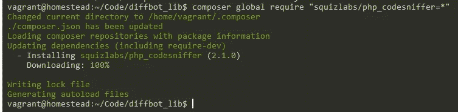
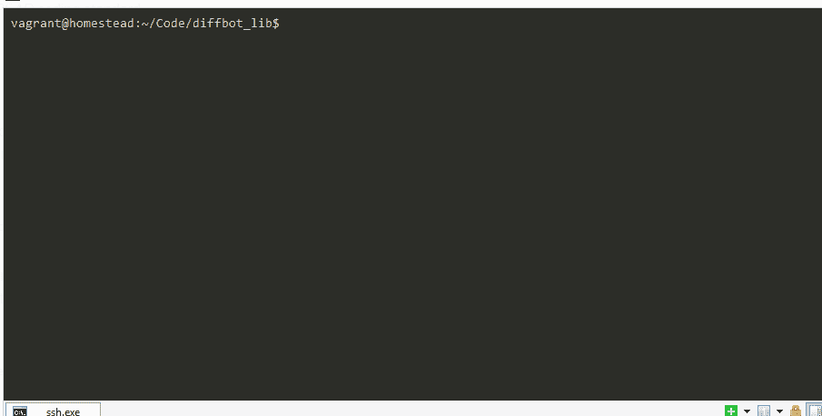

# 以正确的方式开始一个新的 PHP 包

> 原文：<https://www.sitepoint.com/starting-new-php-package-right-way/>

早在我们报道视觉人工智能增强的机器学习爬虫 [Diffbot](https://www.sitepoint.com/blog/) 时，我们也提到过他们有各种编程语言的库，但这些库通常都不是最前沿的——有这么多要关注，肯定会有一些坏苹果从裂缝中溜走。其中一个苹果就是他们的 PHP 库，为了做得更好，我们将在本系列中构建一个替代方案。


请注意，本教程将专注于编写一个好的包——我们编写的代码将是真实的和生产就绪的，但你不应该太关注 Diffbot 本身。Diffbot 的 API 足够简单，Guzzle 的界面足够流畅，可以直接使用它，而不需要 PHP 库。相反，请注意我们用来开发高质量 PHP 包的方法，这样您就可以在自己的项目中重用它们。Diffbot 被选为这个包的主题，因为我想用一个真实的例子来展示最佳实践，而不是另一个“Acme”包。

## 良好的包装设计

近年来，PHP 包设计的好标准已经出现，这在很大程度上归功于[作曲家](https://www.sitepoint.com/php-dependency-management-with-composer/)、[包装家](https://packagist.org/)、[联盟](http://thephpleague.com/)以及最近的[清单](http://phppackagechecklist.com/#1,2,3,4,5,6,7,8,9,10,11,12,13,14)。将所有这些放在一个我们可以在这里遵循的实用列表中，但避免与联盟的任何紧密耦合(因为我们的包不会提交到那里——它是专门为第三方 API 提供商制作的，因此在上下文中非常有限)，我们将遵循的规则是:

1.  包括许可证
2.  做开源(嗯，咄！)
3.  从 dist 中排除开发内容
4.  使用 PSR-4 自动加载
5.  托管在 Packagist 上以便安装 Composer
6.  与框架无关
7.  使用 PSR-2 编码标准
8.  有深入的代码注释
9.  使用语义版本控制
10.  使用 CI 和单元测试

关于这些和更多规则的更详细的阅读，见[这里](http://phppackagechecklist.com)。

## 入门指南

自然，我们将再次使用我们值得信赖的[Homestead 改进版](https://www.sitepoint.com/quick-tip-get-homestead-vagrant-vm-running)box，因为这是在统一环境下开始开发的最快方式。作为参考，我选择了以下 vhosts，并将在本教程的剩余部分使用它们:

```
sites:
    - map: test.app
      to: /home/vagrant/Code/diffbot_lib
    - map: test2.app
      to: /home/vagrant/Code/diffbot_test
```

好了，进入虚拟机后，让我们开始破解吧。

为了立即投入运行，我们将使用[联盟框架](https://github.com/thephpleague/skeleton)，这是一个嵌入了联盟规则的模板包，允许提前开始。我做了自己的[叉子](https://github.com/Swader/php_package_skeleton)，有了更好的`.gitignore`和一些小的调整，如果你想用的话——如果不用，就用他们的，差别真的很小。

```
git clone https://github.com/Swader/php_package_skeleton diffbot_lib
```

我们编辑`composer.json`文件，最终得到如下结果:

```
{
    "name": "swader/diffbot_client",
    "description": "A PHP wrapper for using Diffbot's API",
    "keywords": [
        "diffbot", "api", "wrapper", "client"
    ],
    "homepage": "https://github.com/swader/diffbot_client",
    "license": "MIT",
    "authors": [
        {
            "name": "Bruno Skvorc",
            "email": "bruno@skvorc.me",
            "homepage": "http://bitfalls.com",
            "role": "Developer"
        }
    ],
    "require": {
        "php" : ">=5.5.0"
    },
    "require-dev": {
        "phpunit/phpunit" : "4.*"
    },
    "autoload": {
        "psr-4": {
            "Swader\\Diffbot\\": "src"
        }
    },
    "autoload-dev": {
        "psr-4": {
            "Swader\\Diffbot\\Test\\": "tests"
        }
    },
    "extra": {
        "branch-alias": {
            "dev-master": "1.0-dev"
        }
    }
}
```

我们设置一些公共元数据，定义需求，并设置 PSR-4 自动加载。这一点，再加上我们使用联盟框架的事实，照顾到了我们上面的待办事项列表中的第 1-6 点。当我们在这里时，我们也可以将 Guzzle 添加到我们的需求中，因为它是我们将用来对 Diffbot API 点进行所有调用的 HTTP 客户端库。

```
"require": {
        "php" : ">=5.5.0",
        "guzzlehttp/guzzle": "~5.0"
    },
```

运行`composer install`之后，它将获取所有的依赖项，包括测试所需的 PHPUnit，我们可以通过将`src/SkeletonClass.php`的内容改为:

```
<?php

namespace Swader\Diffbot;

class SkeletonClass
{

    /**
     * Create a new Skeleton Instance
     */
    public function __construct()
    {
    }

    /**
     * Friendly welcome
     *
     * @param string $phrase Phrase to return
     *
     * @return string Returns the phrase passed in
     */
    public function echoPhrase($phrase)
    {
        return $phrase;
    }
}
```

并在项目的根目录下创建一个`index.php`文件:

```
<?php

require_once "vendor/autoload.php";

$class = new \Swader\Diffbot\SkeletonClass();

echo $class->echoPhrase("It's working");
```

在浏览器中访问`test.app:8000`现在应该会产生“它正在工作”的消息。

不要担心没有`public`目录或类似的东西——这在构建包时并不重要。当构建一个库时，所有的焦点都应该在包上，并且只在包上——不需要处理框架或 MVC。我们将不时地使用`index.php`文件来测试一些东西，但大多数情况下，我们将使用 PHPUnit 来开发我们的库。现在，让我们将`index.php`添加到`.gitignore`中，以确保我们不会意外地将它发送到上游。

## PSR-2

为了与现代标准保持同步，我们最好从一开始就实施新 PSR 协议。我使用 PhpStorm，所以这非常容易做到。你可以选择内置的 PSR1/PSR2 标准，[就像 so](http://blog.jetbrains.com/webide/2012/11/more-php-formatting-options-and-bundled-code-styles-for-ps/) 一样，或者你可以安装并激活 CodeSniffer 并将其用作 PhpStorm 检查，[就像 so](http://confluence.jetbrains.com/display/PhpStorm/PHP+Code+Sniffer+in+PhpStorm) 一样。我选择了前者，因为还不支持通过 PhpStorm 远程执行 PHPCS(实际上，一个流浪的 VM 是远程的)，但是如果你想帮助将这个特性添加到 PhpStorm，请在这里投票。

您仍然可以像往常一样通过 Composer 在项目中要求 CodeSniffer，并从 VM 的命令行运行它，尽管:





您也可以选择只在您的主机上安装 PHP(与标准的 XAMPP/WAMP 安装附带的额外废话相反)，在那里下载 CodeSniffer，并像这样使用它。当从 VM 开发和运行您的包逻辑时，您将只使用您的主机进行代码检查。这有点尴尬，但是在使用 PhpStorm 这样的 ide 时很有帮助，至少在前面提到的问题实现之前是如此。

如果你没有使用 PhpStorm，寻找如何实现这一点的替代方法，但一定要这样做——我们需要 PSR2。

## 规划

有了我们的引导，我们就可以开始开发了。让我们想想我们需要的一切。

### 入口点

无论 Diffbot 的 API 的用例是什么，用户都希望创建一个 API 客户端的实例——除了查询预先制作的 API，您对 Diffbot 无能为力。每个 API 使用还需要一个开发者令牌，该令牌将作为查询参数以`?token=xxxxxx`的形式在请求中传递。我的推理如下:单个开发人员通常会使用单个令牌，所以除了允许开发人员创建新的 API 客户端实例和传入令牌(比如，在构造函数中)，我们还应该有一种方法来定义一个全局令牌，以便在所有未来的实例化中使用。换句话说，我们希望这两种方法都有效:

```
$token = xxxx;

// approach 1
$api1 = new Diffbot($token);
$api2 = new Diffbot($token);

// approach 2
Diffbot::setToken($token);
$api1 = new Diffbot();
$api2 = new Diffbot();
```

前一种方法有助于创建单个 API 客户端实例，或者使用多个令牌(可能一个用于 Crawlbot，一个用于常规 API)。当您已经为您的应用程序定义了许多 API 端点，并且需要几个端点，但又不想每次都重新注入令牌时，后一种方法非常适用。

记住这一点，让我们继续让我们的包的第一类。创建文件`src/Diffbot.php`。

```
<?php

namespace Swader\Diffbot;

use Swader\Diffbot\Exceptions\DiffbotException;

/**
 * Class Diffbot
 *
 * The main class for API consumption
 *
 * @package Swader\Diffbot
 */
class Diffbot
{
    /** @var string The API access token */
    private static $token = null;

    /** @var string The instance token, settable once per new instance */
    private $instanceToken;

    /**
     * @param string|null $token The API access token, as obtained on diffbot.com/dev
     * @throws DiffbotException When no token is provided
     */
    public function __construct($token = null)
    {
        if ($token === null) {
            if (self::$token === null) {
                $msg = 'No token provided, and none is globally set. ';
                $msg .= 'Use Diffbot::setToken, or instantiate the Diffbot class with a $token parameter.';
                throw new DiffbotException($msg);
            }
        } else {
            self::validateToken($token);
            $this->instanceToken = $token;
        }
    }

    /**
     * Sets the token for all future new instances
     * @param $token string The API access token, as obtained on diffbot.com/dev
     * @return void
     */
    public static function setToken($token)
    {
        self::validateToken($token);
        self::$token = $token;
    }

    private static function validateToken($token)
    {
        if (!is_string($token)) {
            throw new \InvalidArgumentException('Token is not a string.');
        }
        if (strlen($token) < 4) {
            throw new \InvalidArgumentException('Token "' . $token . '" is too short, and thus invalid.');
        }
        return true;
    }
}
```

该方法还引用了一个`DiffbotException`，所以非常快，只需用以下内容创建文件`src/exceptions/DiffbotException.php`:

```
<?php

namespace Swader\Diffbot\Exceptions;

/**
 * Class DiffbotException
 * @package Swader\Diffbot\Exceptions
 */
class DiffbotException extends \Exception
{

}
```

让我们快速解释一下 Diffbot 类。

如果在构建新实例时没有在构造函数中提供标记，静态属性将作为 Diffbot 使用的默认属性。在这种情况下，它被复制到绑定到实例的`instanceToken`属性中。

构造函数检查是否传递了令牌。如果没有，它使用预定义的默认令牌，或者如果没有设置，则抛出 DiffbotException 这就是我们上面的异常代码的目的。如果令牌正常，它将被设置为实例的令牌。另一方面，如果令牌被传入，那么该令牌将被复制到`instanceToken`中。注意，在这两种情况下，令牌都必须用静态方法`validateToken`进行验证。这个私有方法现在只是检查令牌是否是长度超过三个字符的字符串——如果不是，它抛出一个无效参数异常。

最后，还有`setToken`静态方法，它让我们设置前面提到的全局令牌。自然，这个也需要得到验证。

由于 Diffbot 令牌被绑定到其 API 集，因此能够在已经存在的 Diffbot 实例上更改令牌将是疯狂的。因此，我选择在实例化时只允许设置一个令牌**,或者对 Diffbot 的所有未来实例进行全局设置。当然，如果令牌被全局设置，实例仍然可以覆盖这个设置。此外，全局标记是可变的，因为我们希望能够更改未来实例的生成条件，并且在实例已经存在时更改它不会对它们产生任何影响。**

还要注意文档块是如何记录所有内容的——不要记录过多，但足以让其他人容易理解。

## 结论

在这一部分中，我们通过建立一个具有一些基本功能的框架项目，并配置我们的环境，开始了 PHP 包的开发。你可以在这里下载第一部分的最终结果。在第 2 部分中，我们将开始编写一些测试和一些实际的功能，并且我们将开始适当的测试驱动开发。在我们继续之前，对当前流程是否有任何问题或意见？把它们留在下面！

## 分享这篇文章