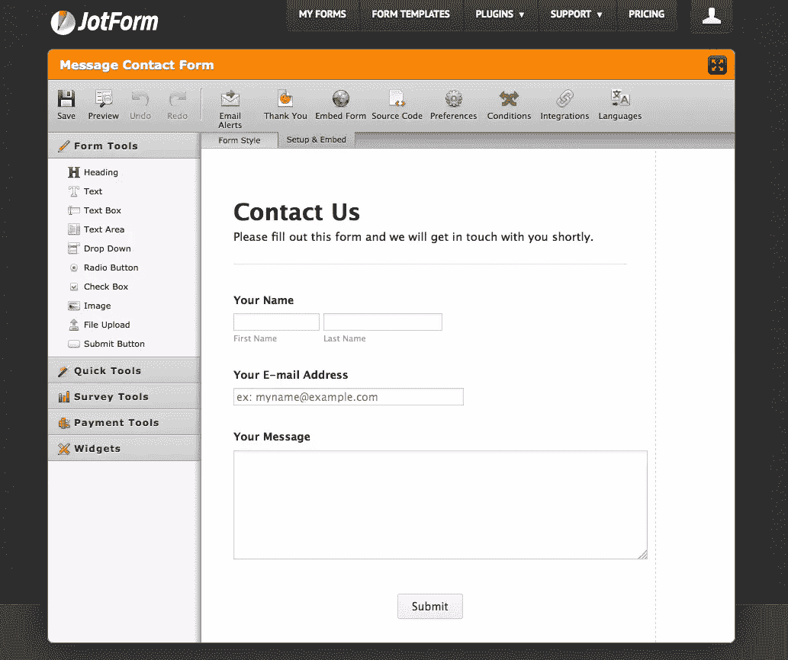
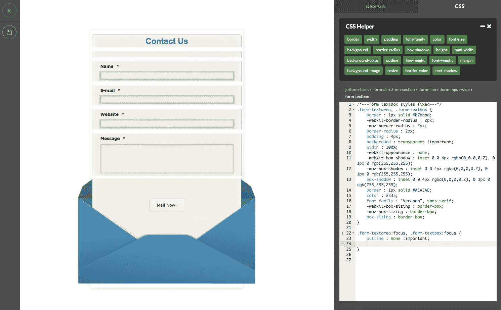
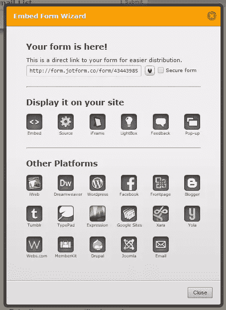
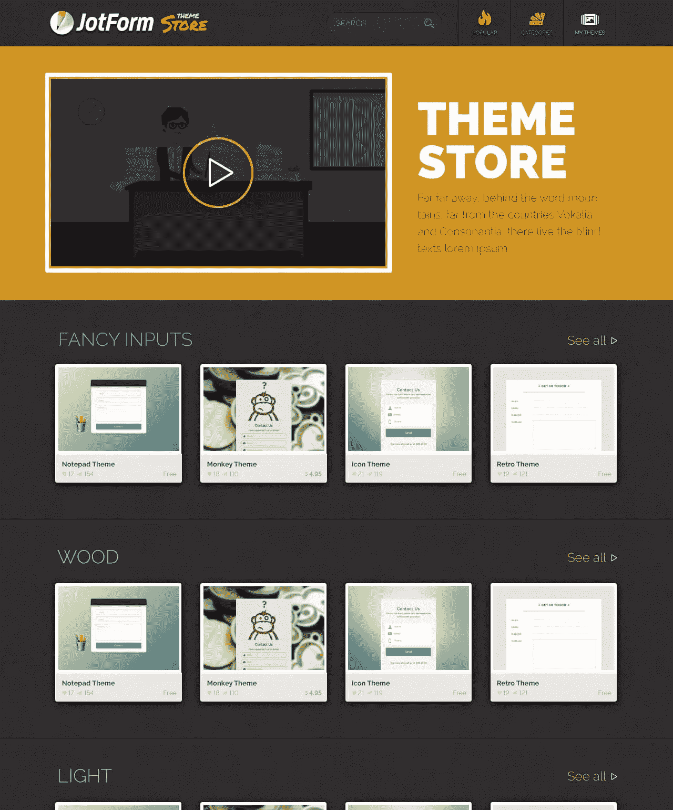

# 如何用 JotForm 简化表单构建

> 原文：<https://www.sitepoint.com/simplify-form-building-jotform/>

*本文由 [JotForm](http://www.jotform.com/) 赞助。感谢您对使 SitePoint 成为可能的赞助商的支持！*

这是我们的错。我们是打开潘多拉魔盒的人。像 WordPress 这样优秀的开源内容管理系统的普及意味着客户可以在没有我们帮助的情况下编辑他们的网站内容。直到他们试图修改表单。

表单是内容不可分割的一部分。你可以理解为什么一个客户会问，*“如果我可以添加一个标题，为什么我不能添加一个电子邮件请求框？”*现实比较困难。即使是最基本的形式也需要开发专业知识:

1.  使用 HTML5 域创建表单。
2.  为旧浏览器开发后备代码，例如 IE9 不支持新的 HTML5 字段类型或内置验证。
3.  开发客户端和服务器端的验证代码。
4.  也许创建或使用自定义字段，如地图选择器、日期处理器、文件上传器等。
5.  实施安全措施，确保垃圾邮件发送者无法侵入或使用系统。
6.  通过电子邮件发送查询数据，或将其提交给服务器。
7.  将查询记录在数据库等存储库中。
8.  在各种桌面、平板电脑和移动设备上测试表单。
9.  创建自定义报告以汇总查询数据。
10.  将系统与监控、分析和/或销售系统集成。

具有讽刺意味的是，用户体验越光滑越简单，就需要越多的开发工作。如果您愿意继续，客户端必然会在部署后 30 秒联系您…

*   “我们可以再添加一个字段吗？”
*   “你能每周给我们的 CEO 发一份 PDF 格式的回复统计摘要吗？”，或者
*   “我们能把这些数据输出到我们的客户关系管理系统进行市场分析吗？”

最简单的形态会迅速变异成关键的怪物。

即使你为你的 CMS 找到了一个合理的表单生成器插件，它们也很少适合非技术终端用户。处理数据流和日志记录总是需要一些定制代码。

幸运的是，有一个更简单的选择…

## Enter JotForm

JotForm 允许您或非开发人员使用一个简单的所见即所得界面来构建和编辑表单。你可以为你的客户定义表单，或者把整个系统交给他们。基本工作流程:

**1。创建你的表单结构**
初始屏幕允许你添加表单字段、标签和标题。有近 400 个预建的定制小工具可用，包括验证码、推荐追踪器、标签、照片捕捉甚至录音机。

您还可以定义回复电子邮件地址、提交操作，并设置与 Dropbox、SalesForce 和 PayPal 等支付系统的集成。有 100 多个应用程序可用。

**2。使用表单设计器**
JotForm 的新[表单设计器](http://www.jotform.com/form-designer/)允许你设计表单的颜色和布局。除了标准的图形和响应设计工具，它还包括一个点击式 CSS 助手。这一备受推崇的特性使得构建 CSS 比以往任何时候都更容易。选择屏幕上的字段会构建 CSS 选择器，并显示可供选择的属性列表。留给用户的只是输入值。

**3。发布你的表单**
最后，你的表单可以在一个独立的页面、一个 iframe 中使用，或者使用一个脚本嵌入——所有的代码都提供了。它可以很容易地与 WordPress、Drupal、Joomla 甚至脸书页面集成:

## JotForm 主题商店

JotForm 最近发布的[主题商店](http://www.jotform.com/theme-store)使得表单构建更加容易。事实上，主题商店消除了表单构建的需要，因此您可以立即开始定制现成的主题。提供了一系列[获奖的](http://www.jotform.com/awards/)免费和商业主题，它们可以即时设计你的表单，而无需你定义配色方案、图像和 CSS。

就主题而言，如果你的客户希望为一年中的各种日历事件设计表单，可以选择[季节性雪和圣诞老人主题](http://www.jotform.com/theme-store/collection/holidays)。

作为奖励，当你创建你的基于表单的杰作时，它可以被提交到 [JotForm 主题商店](http://www.jotform.com/theme-store)。一旦提交，你可以选择在每次有人选择时赚取佣金，或者免费分享。

JotForm 增强了客户的能力，将您从表单构建的日常开发工作中解放出来。有一个免费的初学者帐户，所以你可以不用注册就可以尝试 JotForm，然后随着你的提交和存储空间需求的增长而升级。

## 分享这篇文章