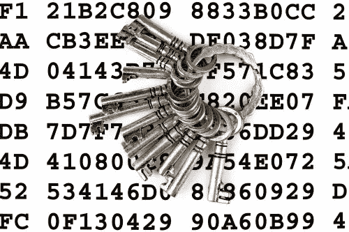

# 如何用非对称密钥和 phpseclib 加密大型消息

> 原文：<https://www.sitepoint.com/encrypt-large-messages-asymmetric-keys-phpseclib/>

本教程将向您展示如何使用非对称密钥和一个名为 [phpseclib](https://packagist.org/packages/phpseclib/phpseclib) 的 PHP 库来加密任意大的消息。

* * *



## 介绍

我们大多数人都知道在传输敏感数据之前需要对其进行加密。加密是将*明文*(即正常数据)翻译成*密文*(即秘密数据)的过程。在加密过程中，使用*密钥*和*算法*将明文信息转换成密文。为了读取数据，必须使用*密钥*和*算法*对密文进行解密(即翻译回明文)。

加密算法是应用于密钥数值和明文字符串中字符数值的一系列数学运算。结果就是密文。密钥越大，密文越安全。

任何加密算法都要解决的一个核心问题是密钥分配。*为了建立安全通信，你如何将密钥传递给需要它们的人？*

问题的解决方案取决于密钥和算法的性质。

## 加密算法和密钥

加密算法有两种基本类型:
1。*对称算法*，加密和解密使用同一个密钥。
2。*使用不同密钥进行加密和解密的非对称算法*。

如果选择对称算法，发送方和接收方必须拥有相同的密钥。如果发送方和接收方位于不同的位置，密钥的传输本身就会成为一个漏洞。

如果选择非对称算法，则有两个密钥:一个公钥和一个私钥。用公钥加密的数据只能用相应的私钥解密。接收者首先将他们的公钥传输给发送者。发送方使用该公钥加密消息，然后将消息发送给接收方。接收者用他们的私钥解密消息。

使用非对称算法，接收方可以将公钥发送给他们希望发送的任何人，而不用担心泄密，因为只有私钥的持有者才能解密消息。

*非对称算法解决密钥分发问题。*

## 加密算法的选择

强大的加密算法基于高等数学和数论。一般来说，如果对于给定的密钥大小，没有密钥的人要花很长时间来解密消息，那么加密算法就是“强”的。 [1](http://en.wikipedia.org/wiki/Key_size)

由于加密算法的复杂性，选择一种算法可能会让那些没有很强数学背景的人感到困惑。因此，许多商业和政府实体依赖美国国家标准与技术研究所(NIST)——一个非监管的美国机构——提供关于强加密的建议。

NIST 规定了三种非对称算法:RSA、DSA 和 ECDSA。ECDSA 是一个相对较新的领域，所以两种常见的非对称算法是 RSA 和 DSA。RSA 通常是首选的商业算法，因为该标准很容易允许更大的密钥大小。 [2](http://security.stackexchange.com/questions/5096/rsa-vs-dsa-for-ssh-authentication-keys) 。

2001 年，NIST 选择 Rijndael 算法作为其首选对称算法，以取代其老化的 DES(数据加密标准)。 [3](http://www.nist.gov/public_affairs/releases/g01-111.cfm)

## RSA 密钥的问题是

虽然非对称算法解决了密钥分发问题，但还有另一个问题。RSA 算法的本质是它只能加密有限数量的明文。例如，如果您的密钥大小是 2048 位，那么您只能加密 256 字节(最多)的明文数据。 [4](http://forums.devshed.com/security-cryptography-17/plaintext-max-size-calculation-rsa-610111.html)

这里总结一下我们的问题:
1。非对称密钥易于安全交换，但消息大小有限。
2。对称密钥具有无限的消息大小，但是很难安全地交换。

## 解决方案

问题的解决方案是用对称密钥加密消息，然后非对称地加密密钥并将其附加到消息中。

当消息到达接收方时，他们将同时拥有对称密钥和消息。接收方提取加密的对称密钥，对其进行非对称解密，然后用它来解密消息的其余部分。

下一节将逐步解释加密和解密过程。

### 加密

1.  接收方生成一个密钥对，并将它们的公钥发送给发送方。
2.  发送方生成一个随机对称密钥，并用它来加密大消息。
3.  发送方用对称密钥加密消息。
4.  发送方用接收方的公钥加密对称密钥。
5.  发送方连接加密的对称密钥和加密的消息。
6.  发送者将加密的消息发送给接收者。

### [通信]解密

接收方得到消息后，会反向处理:
1。接收方从消息中提取加密的对称密钥。
2。接收者使用他们的私钥解密对称密钥。
3。接收者用对称密钥解密消息。

### 用 PHP 编程解决方案

为了演示这种技术，我们将使用 *PHP 安全通信库*。这个库(phpseclib)包含任意精度整数、RSA、DES、3DES、RC4、Rijndael、AES、SSH-1、SSH-2 和 SFTP 的免费开源纯 PHP 实现。

该库的设计方式是利用更快的加密函数(如 open_ssl 和 mcrypt ),如果它们可用的话，以提高性能。然而，有时候，这些库和函数对 PHP 程序员来说是不可用的(例如，在共享主机环境中)。因此，phpseclib 被设计为可靠地工作，尽管速度较慢，如果只有 PHP 可用的话。

可以通过 Composer 安装[。](https://packagist.org/packages/phpseclib/phpseclib)

phpseclib 的文档可以在 http://phpseclib.sourceforge.net/documentation/index.html 找到

## 示例代码

让我们一步一步地编写我们的演示代码。

### 生成公钥和私钥

RSA 类包含一个密钥生成方法。在下面的例子中，您可以看到我们如何生成和保存密钥对。在实际的生产环境中，私钥将被存储在一个安全的位置，直到解密消息的时候。公钥将被传送给消息的发送者。

```
$rsa = new Crypt_RSA();
	$keys = $rsa->createKey(2048);

	file_put_contents('key.pri',$keys['privatekey']);
	file_put_contents('key.pub',$keys['publickey']);
```

### 加密功能

encrypt_message 函数带三个参数:
1。`$plaintext`–要加密的明文消息。
2。`$asym_key`–这是接收方提供给发送方的公钥
3。`$key_length`–这是一个任意长度的密钥，但应该小于 240。数字越大，暴力攻击成功的可能性就越小。这是一个可选参数。

```
function encrypt_message($plaintext,$asym_key,$key_length=150)
	{

	     $rsa = new Crypt_RSA();
	     $rij = new Crypt_Rijndael();

	    // Generate Random Symmetric Key
	    $sym_key = crypt_random_string($key_length); 

	    // Encrypt Message with new Symmetric Key 
	    $rij->setKey($sym_key);
	    $ciphertext = $rij->encrypt($plaintext);
	    $ciphertext = base64_encode($ciphertext); 

	    // Encrypted the Symmetric Key with the Asymmetric Key 
	    $rsa->loadKey($asym_key);
	    $sym_key = $rsa->encrypt($sym_key);

	    // Base 64 encode the symmetric key for transport
	    $sym_key = base64_encode($sym_key);
	    $len = strlen($sym_key); // Get the length

	    $len = dechex($len); // The first 3 bytes of the message are the key length
	    $len = str_pad($len,3,'0',STR_PAD_LEFT); // Zero pad to be sure.

	    // Concatenate the length, the encrypted symmetric key, and the message
	    $message = $len.$sym_key.$ciphertext;

	     return $message;
	}
```

### 解密函数

解密函数需要两个参数:
1。`$message`–待解密的报文
2。`$asym_key`–接收方的私钥。

```
function decrypt_message($message,$asym_key)
	{

	    $rsa = new Crypt_RSA();
	    $rij = new Crypt_Rijndael();

	    // Extract the Symmetric Key 
	    $len = substr($message,0,3); 
	    $len = hexdec($len);                        
	    $sym_key = substr($message,0,$len);

	    //Extract the encrypted message
	    $message = substr($message,3);
	    $ciphertext = substr($message,$len);
	    $ciphertext = base64_decode($ciphertext);

	    // Decrypt the encrypted symmetric key 
	    $rsa->loadKey($asym_key);
	    $sym_key = base64_decode($sym_key);
	    $sym_key = $rsa->decrypt($sym_key);

	    // Decrypt the message
	    $rij->setKey($sym_key);                       
	    $plaintext = $rij->decrypt($ciphertext);

		return $plaintext;
	}
```

## 结论

随着程序和 web 服务的联系越来越紧密，远程进程之间的安全数据通信应该成为一种惯例。由于非对称密钥可以安全地传输，因此它们更受欢迎。但是，它们的消息大小有限。使用对称和非对称算法的混合方法可以解决这些限制。

PHP 安全通信库提供了对称和非对称行业标准算法的方便、纯粹的 PHP 实现。这为我们提供了用 PHP 创建混合解决方案的方法。

本文的源代码在 github 上:[https://github.com/sitepoint-editors/sitepointcrypto](https://github.com/sitepoint-editors/sitepointcrypto)

## 分享这篇文章