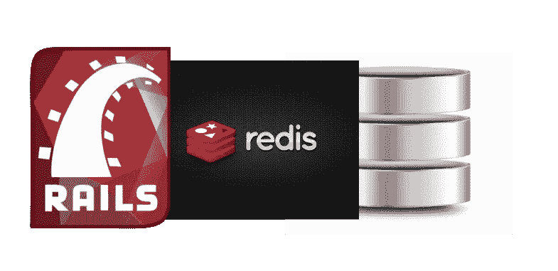
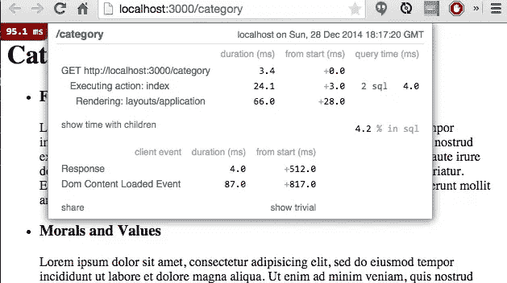
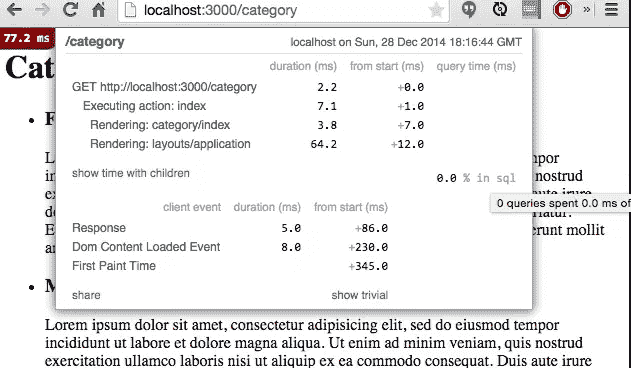
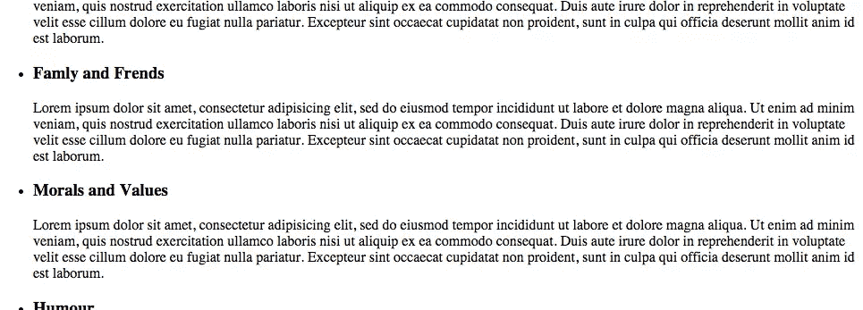

# 使用 Redis 的 Rails 模型缓存

> 原文：<https://www.sitepoint.com/rails-model-caching-redis/>



模型级缓存经常被忽略，即使是经验丰富的开发人员也是如此。这很大程度上是由于一种误解，即当您缓存视图时，您不需要在较低的级别进行缓存。虽然 Rails 领域的大部分瓶颈确实存在于视图层，但情况并非总是如此。

低级别的缓存非常灵活，可以在应用程序的任何地方工作。在本教程中，我将演示如何用 Redis 缓存您的模型。

## 缓存是如何工作的？

传统上，访问磁盘的成本很高。频繁尝试从磁盘访问数据会对性能产生负面影响。为了解决这个问题，我们可以在您的应用程序和数据库服务器之间实现一个缓存层。

缓存层一开始并不保存任何数据。当收到数据请求时，它调用数据库并将结果存储在内存(缓存)中。所有后续请求都将由缓存层提供服务，因此避免了与数据库服务器之间不必要的往返，从而提高了性能。

## 干嘛再说一遍？

Redis 是一个内存中的键值存储。它的速度惊人，数据检索几乎是瞬间完成的。Redis 支持列表、散列、集合等高级数据结构，并且可以保存到磁盘上。

虽然大多数开发人员出于缓存需要更喜欢使用 Dalli 的 Memcache，但我发现 Redis 非常容易设置和管理。另外，如果您使用 resque 或 Sidekiq 来管理后台作业，您可能已经安装了 Redis。对于那些有兴趣知道何时使用 Redis 的人来说，这个[讨论](http://stackoverflow.com/questions/5400163/when-to-redis-when-to-mongodb)是一个很好的起点。

## 先决条件

我假设你已经有了 Rails 并开始运行。这里的示例使用 Rails 4.2.rc1、haml 来呈现视图，使用 MongoDB 作为数据库，但是本教程中的代码片段应该与任何版本的 Rails 兼容。

在我们开始之前，您还需要安装并运行 Redis。进入您的应用程序目录，并执行以下命令:

```
$ wget http://download.redis.io/releases/redis-2.8.18.tar.gz
$ tar xzf redis-2.8.18.tar.gz
$ cd redis-2.8.18
$ make
```

该命令需要一段时间才能完成。完成后，只需启动 Redis 服务器:

```
$ cd redis-2.8.18/src
$ ./redis-server
```

为了测量性能改进，我们将使用 gem“rack-mini-profiler”。这个 gem 将帮助我们直接从视图中度量性能改进。

## 入门指南

对于这个例子，让我们建立一个虚构的在线故事阅读商店。这家商店有各种类别和语言的书籍。让我们首先创建模型:

```
# app/models/category.rb

class Category
  include Mongoid::Document
  include Mongoid::Timestamps
  include Mongoid::Paranoia

  include CommonMeta
end

# app/models/language.rb

class Language
  include Mongoid: :Document
  include Mongoid::Timestamps
  include Mongoid::Paranoia

  include CommonMeta
end

# app/models/concerns/common_meta.rb

module CommonMeta
  extend ActiveSupport::Concern
  included do
    field :name, :type => String
    field :desc, :type => String
    field :page_title, :type => String
  end
end
```

我在这里包含了一个种子文件[。只需将它复制粘贴到 seeds.rb 中，然后运行 rake seed 任务将数据转储到我们的数据库中。](https://github.com/skmvasu/redis_cache_sitepoint/blob/master/db/seeds.rb)

```
rake db:seed
```

现在，让我们创建一个简单的类别列表页面，显示所有可用的类别以及描述和标签。

```
# app/controllers/category_controller.rb

class CategoryController < ApplicationController
  include CategoryHelper
  def index
    @categories = Category.all
  end
end

# app/helpers/category_helper.rb

module CategoryHelper
  def fetch_categories
    @categories = Category.all
  end
end

# app/views/category/index.html.haml

%h1
  Category Listing
%ul#categories
  - @categories.each do |cat|
      %li
        %h3
          = cat.name
        %p
          = cat.desc

# config.routes.rb

Rails.application.routes.draw do
  resources :languages
  resources :category
end
```

当你打开浏览器并指向`/category`时，你会发现 mini-profiler 在测试后端执行的每个动作的执行时间。这应该让您清楚地知道应用程序的哪些部分速度慢，以及如何优化它们。该页面已经执行了两个 SQL 命令，查询大约需要 5 毫秒才能完成。

虽然 5 毫秒起初可能看起来微不足道，尤其是视图需要更多的时间来呈现，但在生产级应用程序中，通常会有几个数据库查询，因此它们会大大降低应用程序的速度。



因为元数据模型不太可能经常改变，所以避免不必要的数据库往返是有意义的。这就是低级缓存的用武之地。

## 初始化 Redis

有一个 Ruby client for Redis 可以帮助我们轻松地连接到 Redis 实例:

```
gem 'redis'
gem 'redis-namespace'
gem 'redis-rails'
gem 'redis-rack-cache'
```

一旦安装了这些 gem，指示 Rails 使用 Redis 作为缓存存储:

```
# config/application.rb

#...........
config.cache_store = :redis_store, 'redis://localhost:6379/0/cache', { expires_in: 90.minutes }
#.........
```

redis-namespace gem 允许我们围绕 redis 创建一个漂亮的包装器:

```
# config/initializers/redis.rb 

$redis = Redis::Namespace.new("site_point", :redis => Redis.new)
```

所有的 Redis 功能现在都可以通过“$ Redis”global 在整个应用程序中使用。下面是一个如何访问 redis 服务器中的值的示例(启动一个 Rails 控制台):

```
$redis.set("test_key", "Hello World!")
```

该命令将在 Redis 中创建一个名为“test_key”的新键，其值为“Hello World”。要获取该值，只需:

```
$redis.get("test_key")
```

现在我们已经有了基础，让我们从重写我们的助手方法开始:

```
# app/helpers/category_helper.rb

module CategoryHelper
  def fetch_categories
    categories =  $redis.get("categories")
    if categories.nil?
      categories = Category.all.to_json
      $redis.set("categories", categories)
    end
    @categories = JSON.load categories
  end
end
```

这段代码第一次执行时，内存/缓存中没有任何东西。因此，我们要求 Rails 从数据库中获取它，然后将其推送到 redis。注意到`to_json`呼叫了吗？当向 Redis 写入对象时，我们有两种选择。一种选择是迭代对象中的每个属性，然后将它们保存为一个哈希，但这很慢。最简单的方法是将它们保存为 JSON 编码的字符串。要解码，只需使用`JSON.load`。

然而，这带来了意想不到的副作用。当我们检索值时，简单的对象符号不起作用。我们需要更新视图，以使用哈希语法来显示类别:

```
# app/views/category/index.html.haml

%h1
  Category Listing
%ul#categories
  - @categories.each do |cat|
    %li
      %h3
        = cat["name"]
      %p
        = cat["desc"]
```

再次启动浏览器，看看是否有性能差异。第一次，我们仍然命中数据库，但是在随后的重新加载中，数据库根本不被使用。所有将来的请求都将从缓存中加载。一个简单的改变就能节省很多钱:)。



## 管理缓存

我刚刚注意到其中一个类别中的一个错别字。让我们先解决这个问题:

```
$ rails c

c = Category.find_by :name => "Famly and Frends"
c.name = "Family and Friends"
c.save
```

重新加载并查看此更新是否显示在视图中:



不，这一变化没有反映在我们的观点中。这是因为我们绕过了访问数据库，所有值都是从缓存中提供的。唉，缓存现在过时了，更新的数据要等到 Redis 重启后才可用。这对于任何应用来说都是一个障碍。我们可以通过定期使缓存过期来解决这个问题:

```
# app/helpers/category_helper.rb

module CategoryHelper
  def fetch_categories
    categories =  $redis.get("categories")
    if categories.nil?
      categories = Category.all.to_json
      $redis.set("categories", categories)
      # Expire the cache, every 3 hours
      $redis.expire("categories",3.hour.to_i)
    end
    @categories = JSON.load categories
  end
end
```

这将使缓存每 3 小时过期一次。虽然这适用于大多数场景，但缓存中的数据现在会滞后于数据库。这可能对你不起作用。如果您喜欢保持缓存新鲜，我们可以使用一个`after_save`回调:

```
# app/models/category.rb

class Category
  #...........
  after_save :clear_cache

  def clear_cache
    $redis.del "categories"
  end
  #...........
end
```

每次模型更新时，我们都会指示 Rails 清空缓存。这将确保缓存始终是最新的。耶！

> 您可能应该在生产中使用类似于`cache_observers`的东西，但是为了简洁起见，我们在这里将坚持使用`after_save`。如果你不确定哪种方法最适合你，这个[讨论](http://stackoverflow.com/questions/15165260/rails-observer-alternatives-for-4-0)可能会给你一些启发。

## 结论

较低级别的缓存非常简单，如果使用得当，是非常有益的。它可以毫不费力地瞬间提升您系统的性能。本文中所有的[代码片段](https://github.com/skmvasu/redis_cache_sitepoint)都可以在 Github 上获得。

霍普喜欢读这本书。请在评论中分享你的想法。

## 分享这篇文章